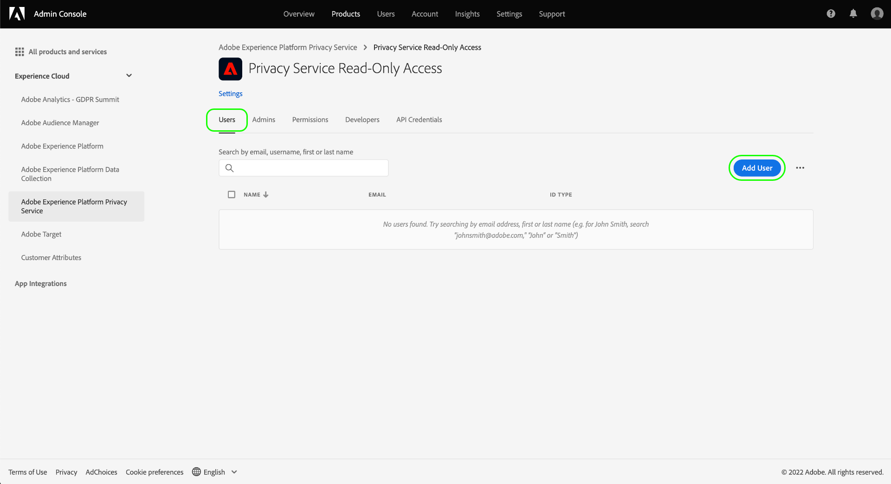

# 管理Privacy Service權限

>[!IMPORTANT]
>
>Adobe Experience Platform Privacy Service的權限已經過改良，以提升其精細度。 這些變更可讓組織管理員授予更多使用者所需角色和權限層級的存取權。 技術帳戶使用者必須更新其Privacy Service權限，因為此即將進行的更新對他們而言構成重大變更。 此權限變更的實施將在 **2023年4月13日**. 請參閱 [移轉舊版API憑證](#migrate-tech-accounts) 以取得解決此問題的指引。
>
>技術帳戶可供企業客戶使用，並透過Adobe開發人員控制台建立。 技術帳戶持有人的Adobe ID終止於 `@techacct.adobe.com`. 如果您不確定自己是否是技術帳戶持有者，請聯絡您的組織管理員。

存取 [Adobe Experience Platform Privacy Service](./home.md) 是透過Adobe Admin Console中精細的角色型權限控制。 透過建立將權限指派給使用者群組的產品設定檔，您可以決定誰有權存取Privacy Service中的哪些功能 [UI](./ui/overview.md) 和 [API](./api/overview.md).

>[!NOTE]
>
>為Privacy ServiceAPI建立整合時，您必須選取現有的產品設定檔，才能判斷該整合具有權限的功能或動作。 請參閱 [開始使用Privacy ServiceAPI](./api/getting-started.md) 以取得更多資訊。

本指南會說明如何管理Privacy Service的權限。

## 快速入門

若要設定Privacy Service的存取控制，您必須擁有與Adobe Experience Platform Privacy Service產品整合之組織的管理員權限。 可授予或撤回權限的最低角色為 **產品設定檔管理員**. 可管理權限的其他管理員角色包括 **產品管理員** （可管理產品中的所有設定檔）和 **系統管理員** （無限制）。 請參閱 [管理角色](https://helpx.adobe.com/enterprise/using/admin-roles.html) (位於「Adobe企業管理指南」中)以取得詳細資訊。

本指南假設您熟悉產品設定檔等基本Admin Console概念，以及這些概念如何將產品權限授予個別使用者和群組。 如需詳細資訊，請參閱 [Admin Console使用手冊](https://helpx.adobe.com/tw/enterprise/using/admin-console.html).

## 可用權限

下表概述Privacy Service的可用權限，並說明其所授予存取權的特定功能：

>[!NOTE]
>
>所有Privacy Service和 [!UICONTROL 選擇退出銷售] 權限是相異且彼此區隔，沒有功能重疊。 這是可能的情況，因為Privacy ServiceAPI被視為等冪。

| 類別 | 權限 | 說明 |
| --- | --- | --- |
| [!UICONTROL Privacy Service權限] | [!UICONTROL 隱私權讀取權限] | 判斷使用者是否可檢視現有的存取和刪除請求，以及其詳細資訊。 |
| [!UICONTROL Privacy Service權限] | [!UICONTROL 隱私權寫入權限] | 判斷使用者是否可以建立新的存取和刪除請求。 |
| [!UICONTROL Privacy Service權限] | [!UICONTROL 讀取（存取）內容傳送權限] | 當Privacy Service處理存取請求時，會傳送包含客戶資料的ZIP檔案給該客戶。 查詢存取請求的詳細資訊時，此權限會決定使用者是否可存取請求ZIP檔案的下載連結。 |
| [!UICONTROL 選擇退出銷售權限] | [!UICONTROL 閱讀權限 — 選擇退出銷售] | 判斷使用者是否可檢視現有的選擇退出銷售請求及其詳細資訊。 |
| [!UICONTROL 選擇退出銷售權限] | [!UICONTROL 寫入權限 — 選擇退出銷售] | 判斷使用者是否可以建立新的選擇退出銷售請求。 |

{style="table-layout:auto"}

## 管理權限 {#manage}

若要管理Privacy Service權限，請登入 [Admin Console](https://adminconsole.adobe.com/) 選取 **[!UICONTROL 產品]** ，即可取得Advertising Cloud的說明。 從此處，選擇 **[!UICONTROL Adobe Experience Platform Privacy Service]**.

### 選取或建立產品設定檔

下一個畫面會顯示貴組織下可供Privacy Service的可用產品設定檔清單。 如果沒有產品設定檔，請選取 **[!UICONTROL 新設定檔]** 來建立。 如果貴組織中有多個角色或使用者群組，需要不同的存取層級，您應分別為每個角色或使用者群組建立產品設定檔。

選取產品設定檔後，您可以使用 **[!UICONTROL 權限]** 標籤開始 [編輯權限](#edit-permissions) ，或選取 **[!UICONTROL 使用者]** 標籤開始 [指派使用者](#assign-users) 至設定檔。

### 編輯設定檔的權限 {#edit-permissions}

在 **[!UICONTROL 權限]** 頁簽，選擇任何顯示的權限類別以訪問權限編輯視圖。

編輯設定檔的權限時，可用權限會列在左欄中，而包含在設定檔中的權限則會列在右欄中。 選取列出的權限，以在任一欄之間移動。

權限可分為幾類。 若要在類別之間切換，請從左側導覽中選取所需的類別。

![顯示 [!UICONTROL 選擇退出銷售] 「權限」一節](./images/permissions/switch-category.png)

選擇 **[!UICONTROL 儲存]** 權限設定完成後。

產品設定檔檢視會重新顯示，並反映新增的權限。

### 將使用者指派至設定檔 {#assign-users}

若要將使用者指派至產品設定檔（並授與設定檔的設定權限），請選取 **[!UICONTROL 使用者]** 標籤，後面 **[!UICONTROL 新增使用者]**.

如需管理產品設定檔使用者的詳細資訊，請參閱 [Admin Console檔案](https://helpx.adobe.com/tw/enterprise/using/manage-product-profiles.html).

### 將舊版API憑證移轉至設定檔 {#migrate-tech-accounts}

>[!NOTE]
>
>本節內容僅適用於在將Privacy Service權限整合至Adobe Admin Console之前建立的現有API憑證。 若為新憑證，會透過指派產品設定檔（及其權限） [Adobe Developer Console專案](https://developer.adobe.com/developer-console/docs/guides/projects/) 。  請參閱 [將產品設定檔指派給專案](./api/getting-started.md#product-profiles) (位於「Privacy ServiceAPI快速入門手冊」中)，以取得詳細資訊。

以前，技術帳戶不需要產品設定檔才能進行整合和權限。 不過，由於最近Privacy Service權限有所改善，現在必須將舊版API憑證移轉至產品設定檔。 此更新可授予技術帳戶擁有者詳細權限。 請依照下列步驟操作，更新Privacy Service的技術帳戶權限。

#### 更新技術帳戶權限 {#update-tech-account-permissions}

為您的技術帳戶指派權限集的第一步，是導覽至 [Adobe Admin Console](https://adminconsole.adobe.com/) 並建立新的產品設定檔以供Privacy Service。

從Admin ConsoleUI中，選取 **產品** 從導覽列，然後 **[!UICONTROL Experience Cloud]** 和 **[!UICONTROL Adobe Experience Platform Privacy Service]** 在左側邊欄。 此 [!UICONTROL 產品設定檔] 頁簽。 選擇 **新設定檔** 建立新的產品設定檔以供Privacy Service。

此 [!UICONTROL 建立新的產品設定檔] 對話框。 如需如何建立產品設定檔的完整指示，請參閱 [建立設定檔的UI指南](../access-control/ui/create-profile.md).

儲存新產品設定檔後，請導覽至 [Adobe Developer Console](https://developer.adobe.com/console/home) 登入該產品或專案。 選擇 **[!UICONTROL 專案]** 從頂端導覽列，接著是您專案的卡片。

>[!NOTE]
>
>您可能必須清除快取和/或等候一段時間，才能讓新專案出現在開發人員控制台專案清單中。

登入專案後，請選取 **[!UICONTROL Privacy ServiceAPI]** 從左側邊欄整合。

Privacy ServiceAPI整合控制面板隨即顯示。 在此控制面板中，您可以編輯與該專案相關聯的產品設定檔。 選擇 **[!UICONTROL 編輯產品設定檔]** 來開始處理。 此 [!UICONTROL 設定API] 對話框。

此 [!UICONTROL 設定API] 對話方塊顯示服務中目前可用的產品設定檔。 它們會與Admin Console中建立的產品設定檔產生關聯。 從可用產品設定檔清單中，選取您在admin console中為技術帳戶建立之新產品設定檔的核取方塊。 這會自動將此技術帳戶與所選產品設定檔中的權限建立關聯。 選擇 **[!UICONTROL 儲存已設定的API]** 確認設定。

>[!NOTE]
>
>如果技術帳戶已與產品設定檔相關聯，則將已選取可用產品設定檔清單中的一個核取方塊。

#### 確認已套用您的設定 {#confirm-applied-settings}

確認您的設定已套用至帳戶。 返回 [Admin Console](https://adminconsole.adobe.com/) 並導覽至新建立的產品設定檔。 選取 **[!UICONTROL API憑證]** 頁簽，查看關聯項目的清單。 在開發人員控制台中，您將產品設定檔指派給技術帳戶的專案，會顯示在憑證清單中。 每個API憑證的名稱都是由專案名稱所組成，且尾碼為隨機產生的數字。 選擇要開啟的憑據 [!UICONTROL 詳細資料] 中。

此 [!UICONTROL 詳細資料] 面板包含有關API憑證的資訊，包括相關的技術ID、API金鑰、建立和上次修改的日期，以及相關的Adobe產品。

## 後續步驟

本指南說明Privacy Service的可用權限，以及如何透過Admin Console管理這些權限。

如需設定產品設定檔後如何建立新API整合的步驟，請參閱 [Privacy ServiceAPI快速入門手冊](./api/getting-started.md). 如需管理其他Adobe Experience Platform功能權限的詳細資訊，請參閱 [存取控制檔案](../access-control/home.md).
