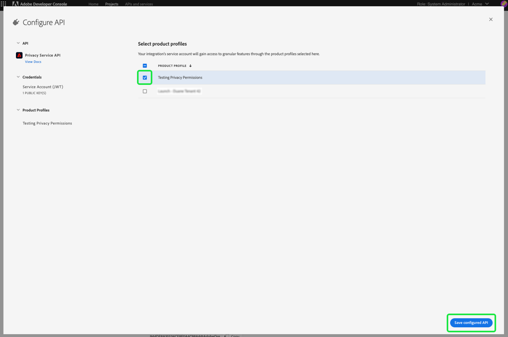

# 管理Privacy Service的許可權

>[!IMPORTANT]
>
>Adobe Experience Platform Privacy Service的許可權已得到改善，以提高其精細度等級。 這些變更可讓組織管理員以所需的角色和許可權層級，授予更多使用者存取權。 技術帳戶使用者必須更新其Privacy Service許可權，因為此即將進行的更新對他們而言是重大變更。 此許可權變更的強制實施將發生在 **2023年4月13日**. 請參閱以下說明檔案： [移轉舊版API認證](#migrate-tech-accounts) 以取得解決此問題的指引。
>
>企業客戶可使用技術帳戶，這些帳戶是透過Adobe開發人員控制檯建立的。 技術帳戶持有人的Adobe ID結尾為 `@techacct.adobe.com`. 如果您不確定您是否為技術帳戶擁有者，請聯絡您的組織管理員。

存取 [Adobe Experience Platform Privacy Service](./home.md) 是透過Adobe Admin Console中精細的角色型許可權所控制。 透過建立將許可權指派給使用者群組的產品設定檔，您可以決定誰可以存取Privacy Service中的哪些功能 [UI](./ui/overview.md) 和 [API](./api/overview.md).

>[!NOTE]
>
>為Privacy ServiceAPI建立整合時，您必須選取現有的產品設定檔，才能決定整合有哪些功能或動作許可權。 請參閱指南： [Privacy Service API快速入門](./api/getting-started.md) 以取得詳細資訊。

本指南說明如何管理Privacy Service的許可權。

## 快速入門

若要設定Privacy Service的存取控制，您必須擁有與Adobe Experience Platform Privacy Service產品整合之組織的管理員許可權。 可授予或撤銷許可權的最小角色為 **產品設定檔管理員**. 可以管理許可權的其他管理員角色包括 **產品管理員** （可以管理產品內的所有設定檔）和 **系統管理員** （無限制）。 請參閱以下文章： [管理角色](https://helpx.adobe.com/enterprise/using/admin-roles.html) 如需詳細資訊，請參閱Adobe企業管理指南。

本指南假設您熟悉基本的Admin Console概念，例如產品設定檔，以及產品設定檔如何授予個別使用者和群組的產品許可權。 如需詳細資訊，請參閱 [Admin Console使用手冊](https://helpx.adobe.com/tw/enterprise/using/admin-console.html).

## 可用許可權

下表概述Privacy Service可用的許可權，以及使用者授予存取許可權的特定功能說明：

>[!NOTE]
>
>所有Privacy Service和 [!UICONTROL 選擇退出銷售] 許可權是不同的，且彼此分開，沒有功能重疊。 這是可行的，因為Privacy Service API被視為等冪。

| 類別 | 權限 | 說明 |
| --- | --- | --- |
| [!UICONTROL Privacy Service許可權] | [!UICONTROL 隱私權讀取許可權] | 決定使用者是否可以檢視現有的存取和刪除要求及其詳細資料。 |
| [!UICONTROL Privacy Service許可權] | [!UICONTROL 隱私權寫入許可權] | 決定使用者是否可以建立新的存取和刪除要求。 |
| [!UICONTROL Privacy Service許可權] | [!UICONTROL 讀取（存取）內容傳遞許可權] | 當Privacy Service處理存取請求時，包含客戶資料的ZIP檔案會傳送給該客戶。 查詢存取請求的詳細資訊時，此許可權會決定使用者是否可存取請求ZIP檔案的下載連結。 |
| [!UICONTROL 選擇退出銷售許可權] | [!UICONTROL 讀取許可權 — 選擇退出銷售] | 決定使用者是否可以檢視現有的選擇退出銷售請求及其詳細資料。 |
| [!UICONTROL 選擇退出銷售許可權] | [!UICONTROL 寫入許可權 — 選擇退出銷售] | 決定使用者是否可建立新的選擇退出銷售請求。 |

{style="table-layout:auto"}

## 管理權限 {#manage}

若要管理Privacy Service許可權，請登入 [Admin Console](https://adminconsole.adobe.com/) 並選取 **[!UICONTROL 產品]** 從頂端導覽列中。 從此處選取 **[!UICONTROL Adobe Experience Platform Privacy Service]**.

### 選取或建立產品設定檔

下一個畫面會顯示可在您的組織下Privacy Service的可用產品設定檔清單。 如果沒有任何產品設定檔存在，請選取「 」 **[!UICONTROL 新設定檔]** 以建立一個。 如果您的組織中有多個角色或使用者群組需要不同的存取層級，您應該為每個角色或使用者群組建立個別的產品設定檔。

選取產品設定檔後，您可以使用 **[!UICONTROL 許可權]** 索引標籤以開始 [編輯許可權](#edit-permissions) ，或選取 **[!UICONTROL 使用者]** 索引標籤以開始 [指派使用者](#assign-users) 至設定檔。

### 編輯設定檔的許可權 {#edit-permissions}

於 **[!UICONTROL 許可權]** 索引標籤中，選取任何顯示的許可權類別以存取許可權編輯檢視。

編輯設定檔的許可權時，可用許可權會列在左欄，而包含在設定檔中的許可權則會列在右欄。 選取列出的許可權，以便在任一欄之間移動。

許可權會整理到不同類別中。 若要在類別之間切換，請從左側導覽中選取所需的類別。

![影像顯示 [!UICONTROL 選擇退出銷售] 許可權下的區段](./images/permissions/switch-category.png)

選取 **[!UICONTROL 儲存]** 完成許可權設定後。

產品設定檔檢視會重新出現，並反映新增的許可權。

### 將使用者指派給設定檔 {#assign-users}

若要將使用者指派給產品設定檔（並授予他們設定檔設定的許可權），請選取 **[!UICONTROL 使用者]** 索引標籤，後面接著 **[!UICONTROL 新增使用者]**.

如需管理產品設定檔使用者的詳細資訊，請參閱 [Admin Console檔案](https://helpx.adobe.com/tw/enterprise/using/manage-product-profiles.html).

### 將舊版API認證移轉至設定檔 {#migrate-tech-accounts}

>[!NOTE]
>
>本節僅適用於將Privacy Service許可權整合至Adobe Admin Console之前建立的現有API認證。 對於新憑證，產品設定檔（及其許可權）會透過以下方式指派 [Adobe Developer主控台專案](https://developer.adobe.com/developer-console/docs/guides/projects/) 而非。  請參閱以下小節： [將產品設定檔指派至專案](./api/getting-started.md#product-profiles) 如需詳細資訊，請參閱Privacy ServiceAPI快速入門手冊。

以前，技術帳戶不需要產品設定檔來整合和許可權。 不過，由於Privacy Service許可權最近有所改善，現在必須將舊版API憑證移轉至產品設定檔。 此更新允許將精細許可權授予技術帳戶持有者。 請依照下列提供的步驟更新Privacy Service的技術帳戶許可權。

#### 更新技術帳戶許可權 {#update-tech-account-permissions}

指派技術帳戶許可權集的第一步，是導覽至 [Adobe Admin Console](https://adminconsole.adobe.com/) 和建立新的產品設定檔以供Privacy Service。

從Admin ConsoleUI中選取 **產品** 導覽列中的「 」，後面接著「 」 **[!UICONTROL Experience Cloud]** 和 **[!UICONTROL Adobe Experience Platform Privacy Service]** 在左側邊欄中。 此 [!UICONTROL 產品設定檔] 標籤隨即顯示。 選取 **新設定檔** 建立新的產品設定檔以進行Privacy Service。

此 [!UICONTROL 建立新的產品設定檔] 對話方塊隨即顯示。 有關如何建立產品設定檔的完整說明，請參閱 [建立設定檔的UI指南](../access-control/ui/create-profile.md).

儲存新產品設定檔後，請導覽至 [Adobe Developer主控台](https://developer.adobe.com/console/home) 並登入該產品或該專案。 選取 **[!UICONTROL 專案]** 從頂端導覽，然後是專案的卡片。

>[!NOTE]
>
>您可能需要清除快取和/或等待一段時間，新專案才會出現在開發人員控制檯專案清單中。

登入專案後，選取 **[!UICONTROL PRIVACY SERVICEAPI]** 從左側邊欄進行整合。

「Privacy ServiceAPI整合」控制面板隨即顯示。 您可以從此儀表板編輯與該專案相關聯的產品設定檔。 選取 **[!UICONTROL 編輯產品設定檔]** 以開始此程式。 此 [!UICONTROL 設定API] 對話方塊隨即顯示。

此 [!UICONTROL 設定API] 對話方塊顯示服務中目前存在的可用產品設定檔。 這些設定檔與Admin Console中建立的產品設定檔相關聯。 從可用產品設定檔清單中，選取您在Admin Console中為技術帳戶建立的新產品設定檔的核取方塊。 這會自動將此技術帳戶與所選產品設定檔中的許可權建立關聯。 選取 **[!UICONTROL 儲存已設定的API]** 以確認您的設定。

>[!NOTE]
>
>如果技術帳戶已與產品設定檔相關聯，則會已選取可用產品設定檔清單中的其中一個核取方塊。

#### 確認已套用您的設定 {#confirm-applied-settings}

確認您的設定已套用至帳戶。 返回 [Admin Console](https://adminconsole.adobe.com/) 並導覽至您新建立的產品設定檔。 選取 **[!UICONTROL API認證]** 索引標籤以檢視關聯專案的清單。 在開發人員控制檯中使用的專案（您將產品設定檔指派給技術帳戶）會顯示在認證清單中。 每個API認證的名稱由專案名稱組成，專案名稱的尾碼為隨機產生的數字。 選取認證以開啟 [!UICONTROL 詳細資料] 面板。

此 [!UICONTROL 詳細資料] 面板包含API認證的相關資訊，包括關聯的技術ID、API金鑰、建立和上次修改日期，以及關聯的Adobe產品。

## 後續步驟

本指南涵蓋Privacy Service可用的許可權，以及如何透過Admin Console管理這些許可權。

如需在設定產品設定檔後如何建立新API整合的步驟，請參閱 [Privacy Service API快速入門手冊](./api/getting-started.md). 如需管理其他Adobe Experience Platform功能許可權的詳細資訊，請參閱 [存取控制檔案](../access-control/home.md).
