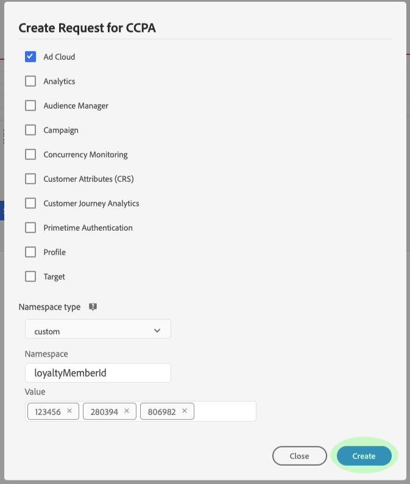

# 管理 Privacy Service UI 中的隱私權作業 {#user-guide}

>[!CONTEXTUALHELP]
>id="platform_privacyConsole_requests_description"
>title="執行資料主體隱私權要求"
>abstract="<h2>說明</h2>
Adobe Experience Platform Privacy Service 可讓您代表想要存取或刪除其個人資料的客戶，根據隱私權法規建立和管理隱私權要求。
"

本檔案提供使用[!DNL Privacy Service]使用者介面建立及管理隱私權要求的步驟。

>[!IMPORTANT]
>
>Privacy Service僅適用於資料主體和消費者權利要求。 不支援或允許將Privacy Service用於資料清理或維護的任何其他用途。 Adobe有法定義務須及時履行。 因此，不允許在Privacy Service上進行載入測試，因為這是僅限生產的環境，且會為有效隱私權請求建立不必要的待處理專案。
>
>現已設定每日硬性上傳限制，以協助防止濫用服務。 發現濫用系統的使用者將會停用其服務的存取權。 隨後將與他們舉行會議，討論他們的動作，並討論Privacy Service的可接受用途。

## 瀏覽[!DNL Privacy Service] UI儀表板

[!DNL Privacy Service] UI的儀表板提供兩個可讓您檢視隱私權工作狀態的Widget： &quot;[!UICONTROL 狀態報告]&quot;和&quot;[!UICONTROL 工作請求]&quot;。 控制面板也會針對顯示的作業顯示目前選取的規則。

### 法規類型

[!DNL Privacy Service]支援數項隱私權法規的工作要求。 下表列出支援的法規及其在UI中顯示的對應標籤：

| UI標籤 | 法規 |
|-------------------------------------|------------------------|
| [!UICONTROL APA_AUS （澳洲）] | [!DNL Australia Privacy Act] |
| [!UICONTROL CCPA （加州）] | [!DNL California Consumer Privacy Act] |
| [!UICONTROL CPA_USA （科羅拉多州）] | [!DNL Colorado Privacy Act] |
| [!UICONTROL CPRA_USA （加州）] | [!DNL California Consumer Privacy Rights Act (CPRA)] |
| [!UICONTROL CTDPA_USA （康乃狄克州）] | [!DNL Connecticut Data Privacy Act] |
| [!UICONTROL DPDPA_USA （德拉瓦州）] | [!DNL Delaware Personal Data Privacy Act] |
| [!UICONTROL FDBR_USA （佛羅里達州）] | [!DNL Florida Digital Bill of Rights] |
| [!UICONTROL GDPR （歐盟）] | 歐盟的[!DNL General Data Protection Regulation] |
| [!UICONTROL HIPPA_USA （美國）] | [!DNL Health Insurance Portability and Accountability Act] |
| [!UICONTROL ICDPA_USA] （愛荷華州） | [!DNL Iowa Consumer Data Protection Act] |
| [!UICONTROL LGPD_BRA （巴西）] | 巴西的&quot;[!DNL General Data Protection Law]&quot; [!DNL Lei Geral de Proteção de Dados] |
| [!UICONTROL 美國MHMDA_USA （華盛頓）] | [!DNL Washington My Health My Data Act] |
| [!UICONTROL MCDPA_USA （蒙大拿州）] | [!DNL Montana Consumer Data Privacy Act] |
| [!UICONTROL NDPA_USA （內布拉斯加州）] | [!DNL Nebraska Data Protection Act] |
| [!UICONTROL NZPA_NZL （紐西蘭）] | 紐西蘭的[!DNL Privacy Act] |
| [!UICONTROL NHPA_USA （新罕布希爾州）] | [!DNL New Hampshire Privacy Act] |
| [!UICONTROL NJDPA_USA （新澤西）] | [!DNL New Jersey Data Protection Act] |
| [!UICONTROL OCPA USA （俄勒岡）] | [!DNL Oregon Consumer Privacy Act] |
| [!UICONTROL PDPA_THA （泰國）] | 泰國的[!DNL Personal Data Protection Act] |
| [!UICONTROL QL25_CAN （魁北克）] | [!DNL Quebec Law 25] |
| [!UICONTROL 美國TDPSA （德州）] | [!DNL Texas Data Privacy and Security Act] |
| [!UICONTROL UCPA_USA （猶他州）] | [!DNL Utah Consumer Privacy Act] |
| [!UICONTROL VCDPA_USA （維吉尼亞州）] | [!DNL Virginia Consumer Data Protection Act] |

{style="table-layout:auto"}

<!-- 
Waiting:
| **[!UICONTROL PIPA_KOR]**  ?        | South Korea [!DNL Personal Information Privacy Act] |
 -->

>[!NOTE]
>
>如需各法規法律內容的詳細資訊，請參閱[支援的隱私權法規](../regulations/overview.md)的概觀。

系統會分別追蹤每種規則型別的工作。 若要在法規型別之間切換，請選取&#x200B;**[!UICONTROL 法規型別]**&#x200B;下拉式功能表，然後從清單中選取想要的法規。

![Privacy Service主控台具有[規則型別]下拉式清單。](../images/user-guide/regulation.png)

在變更法規型別後，儀表板會更新以顯示適用於所選法規的所有操作、篩選器、Widget和工作建立對話方塊。

### 狀態報告

「狀態報表」Widget左側的圖形，會針對報表回傳時可能含有錯誤的任何工作，追蹤已提交的工作。 右側的圖表會追蹤接近30天規定期間結束的工作。

選取圖表上方的兩個切換按鈕之一，以顯示或隱藏其各自的量度。

您可以將滑鼠停留在有問題的資料點上，以檢視與圖表上任何資料點相關聯的確切工作數目。

若要檢視指定資料點的進一步詳細資訊，請選取相關資料點，以在「工作請求」Widget中顯示相關工作。 記下套用至工作清單正上方的篩選器。

的篩選器

>[!NOTE]
>
>當篩選器套用至工作請求Widget時，您可以選取篩選器範圍上的&#x200B;**X**&#x200B;來移除篩選器。 接著，工作請求會傳回預設追蹤清單。

### 工作請求 {#job-requests}

[!UICONTROL 工作要求]工作區會列出貴組織中最近工作要求的詳細資料。 詳細資訊包括請求型別、目前狀態、到期日、請求者電子郵件等。 一次載入100筆記錄的集合。 依預設，當您向下捲動以瀏覽時，最近建立的工作會顯示於頂端，並載入更多記錄集。

>[!NOTE]
>
>先前建立之工作的資料僅可在完成日期後30天記憶體取。

您可以在[!UICONTROL 工作請求]標題下方的搜尋列中鍵入關鍵字，以篩選清單。 清單會在您輸入時自動篩選，顯示包含符合搜尋詞之值的請求。 搜尋欄位會執行「快速」搜尋，比對隱私權工作ID與UI中目前轉譯/載入的工作。 它不是您所有提交工作的完整搜尋。 而是套用至載入結果的篩選器。 使用Privacy Service API可根據特定規則、日期範圍或單一工作[傳回工作](../api/privacy-jobs.md#list)。

>[!TIP]
>
>若要將過去30天的記錄載入UI，您必須向下捲動表格並載入更多記錄批次。

或者，使用搜尋按鈕來執行跨越特定日期範圍的隱私權工作查詢。 此動作會傳回貴組織在指定時間段內提交的所有隱私權工作。 選取&#x200B;**[!UICONTROL 要求日期]**&#x200B;的下拉式功能表，以選擇查詢的開始和完成日期。 可用的選項包括[!UICONTROL 今天]、[!UICONTROL 最近7天]、[!UICONTROL 最近2週]、[!UICONTROL 最近30天]或[!UICONTROL 自訂]。 與[!UICONTROL 要求日期]選項搭配使用時，搜尋功能只會顯示您所選日期範圍之間提交的工作要求。

若要檢視特定工作要求的詳細資料，請從清單中選取要求的工作ID以開啟&#x200B;**[!UICONTROL 工作詳細資料]**&#x200B;頁面。

此對話方塊包含每個[!DNL Experience Cloud]方案的狀態資訊，以及其與整體工作相關的目前狀態。 由於每個隱私權工作非同步，頁面會顯示每個解決方案的最新通訊日期和時間(GMT)，因為有些解決方案需要的時間比其他解決方案長。

如果解決方案已提供任何其他資料，便可以在此對話方塊中檢視。 您可以選取個別產品列來檢視此資料。

若要將完整的工作資料下載為CSV檔案，請選取對話方塊右上角的&#x200B;**[!UICONTROL 匯出至CSV]**。

## 建立新的隱私權作業要求 {#create-a-new-privacy-job-request}

>[!CONTEXTUALHELP]
>id="platform_privacyConsole_requests_instructions"
>title="說明"
>abstract="<ul><li>在左側導覽中選取<a href="https://experienceleague.adobe.com/docs/experience-platform/privacy/ui/overview.html#logging-in-from-experience-platform">要求</a>以開啟隱私權 UI，然後選取<b>建立要求</b>。</li><li>從這裡您可以使用要求產生器或上傳資料主體的 JSON 檔案。</li><li>如果使用要求產生器，請選取工作類型 (存取和/或刪除)，然後選擇您提供的身分識別類型 (電子郵件、ECID 或 AAID) 或輸入自訂身分識別命名空間。為客戶輸入適當的身分識別值，完成後選取<b>建立</b>。</li><li>如果上傳 JSON 檔案，請選取「建立要求」旁邊的箭頭。從選項清單中，選取<b>上傳 JSON</b> 並上傳您的檔案。如果您沒有要上傳的 JSON 檔案，請選取<b>下載 Adobe-GDPR-Request.json</b> 以下載您可以填入的範本。完成後，上傳 JSON 並選取<b>建立</b>。</li><li>如需有關此功能的更多說明，請參閱 Experience League 上的 <a href="https://experienceleague.adobe.com/docs/experience-platform/privacy/ui/user-guide.html?lang=zh-Hant">Privacy Service 使用手冊</a>。</li></ul>"

>[!NOTE]
>
>為了建立隱私權工作請求，您必須針對要存取或刪除其資料的特定客戶提供身分資訊。 請先檢閱隱私權要求](../identity-data.md)的[身分資料檔案，再繼續此章節。

[!DNL Privacy Service] UI提供兩種建立新工作請求的方法：

* [使用請求產生器](#request-builder)
* [上傳JSON檔案](#json)

以下各節提供使用其中每種方法的步驟。

### 使用請求產生器 {#request-builder}

使用「請求產生器」，您可以在使用者介面中手動建立新的隱私權工作請求。 請求產生器最適合用於較簡單且規模較小的請求集，因為請求產生器限制每個使用者的請求只能有ID型別。 若是更複雜的請求，最好改為[上傳JSON檔案](#json)。

若要開始使用「請求產生器」，請選取畫面右側「狀態報告」Widget下方的&#x200B;**[!UICONTROL 建立請求]**。

「**[!UICONTROL 建立請求]**」對話方塊開啟，顯示可用於針對目前選取的法規型別提交隱私權工作請求的選項。

{width=500}

從清單中選取請求的&#x200B;**[!UICONTROL 工作型別]** （「刪除」或「存取」）以及一個或多個可用產品。

Privacy Service支援兩種針對個人資料的工作要求： [!UICONTROL 存取] （讀取）及/或[!UICONTROL 刪除]。 您可以提交請求，以接收產品中與查詢主題相關的所有資訊，或請求刪除與查詢主題相關的所有資訊。

{width=500}

在&#x200B;**[!UICONTROL 名稱空間型別]**&#x200B;底下，為傳送至[!DNL Privacy Service]的客戶ID選取適當的名稱空間型別。

{width=500}

使用標準名稱空間型別時，請從下拉式選單中選取名稱空間（電子郵件、ECID或AAID），然後在右側的文字方塊中輸入ID值，對每個ID按&#x200B;**\&lt;enter>**&#x200B;即可將其新增至清單。

{width=500}

使用自訂名稱空間型別時，您必須手動輸入名稱空間，才能在下方提供ID值。

{width=500}

完成後，選取&#x200B;**[!UICONTROL 建立]**。

{width=500}

對話方塊會消失，而新工作（或多個工作）及其目前處理狀態會列在工作請求Widget中。

### 上傳JSON檔案 {#json}

建立更複雜的請求時（例如針對每個處理中的資料主體使用多個ID型別的請求），您可以透過上傳JSON檔案來建立請求。

選取畫面右側狀態報告Widget下方的&#x200B;**[!UICONTROL 建立請求]**&#x200B;旁的箭頭。 從出現的選項清單中，選取&#x200B;**[!UICONTROL 上傳JSON]**。

**[!UICONTROL 上傳JSON]**&#x200B;對話方塊隨即顯示，為您提供可將JSON檔案拖放到的視窗。

{width=500}

如果您沒有要上傳的JSON檔案，請選取&#x200B;**[!UICONTROL 下載Adobe-GDPR-Request.json]**&#x200B;以下載範本，您可以根據從資料主體收集的值填入範本。

{width=500}

在電腦上找到JSON檔案，並將其拖曳至對話方塊視窗。 如果上傳成功，檔案名稱會顯示在對話方塊中。 您可以視需要繼續新增更多JSON檔案，方法是將其拖放至對話方塊中。

完成後，選取&#x200B;**[!UICONTROL 建立]**。 對話方塊會消失，而新工作（或多個工作）及其目前處理狀態會列在工作請求Widget中。

### 後續步驟

閱讀本檔案後，您已瞭解如何使用[!DNL Privacy Service] UI來建立隱私權工作、檢視工作的詳細資訊和監控其處理狀態，以及在完成工作後下載結果。

如需有關如何使用[!DNL Privacy Service] API以程式設計方式執行這些作業的步驟，請參閱[API指南](../api/overview.md)。
