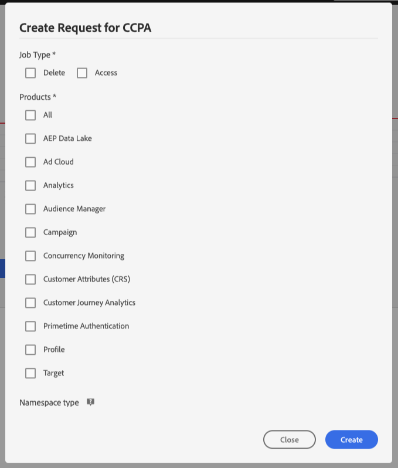

# 隱私權服務使用指南

本檔案提供使用隱私權服務使用者介面建立和管理隱私權要求的步驟。

## 瀏覽Privacy Service UI儀表板

「隱私服務」UI的控制面板提供兩個Widget，可讓您檢視隱私權工作的狀態： **狀態報表** 和 **工作請求**。 控制面板還顯示所顯示作業的當前選定規則。

### 規則類型

隱私權服務支援三種法規類型的工作要求：

* 歐盟通用資料保護規則(GDPR)
* 加州消費者隱私法(California Consumer Privacy Act,CCPA)
* 泰國的個人資料保護法(PDPA_THA)

每個規則類型的工作會個別追蹤。 要在規則類型之間切換，請按一下「規 **則類型** 」下拉菜單並從清單中選擇所需的規則。

變更規則類型時，控制面板會更新為顯示所有適用於所選規則的作業、篩選器、Widget和工作建立對話方塊。

### 狀態報表

「狀態報表」介面工具集左側的圖表會追蹤任何已回報有錯誤的工作的已提交工作。 右側的圖表會追蹤接近30天相容性視窗結束的工作。

按一下圖形上方的兩個切換按鈕之一，以顯示或隱藏其各自的量度。

您可將滑鼠暫留在相關資料點上，即可檢視與圖形上任何資料點相關的確切作業數。

要查看有關給定資料點的詳細資訊，請按一下有關的資料點以顯示「作業請求」構件中的相關作業。 請注意在工作清單上方套用的篩選。

>[!NOTE] 當篩選器已套用至「工作請求」介面工具集時，您可以按一下篩選藥丸上的 **X** ，以移除篩選。 然後，工作請求會返回預設追蹤清單。

### 工作請求

「工作請求」介面工具集會列出您組織中所有可用的工作請求，包括請求類型、目前狀態、到期日和申請人電子郵件等詳細資訊。

>[!NOTE] 先前建立的工作資料僅能在完成日期後30天記憶體取。

您可以在「工作請求」標題下方的搜尋列中輸入關鍵字，以篩選清單。 清單會在您輸入時自動篩選，顯示包含符合您搜尋詞之值的請求。 您也可以使用「請 **求於」下拉式選單** ，為列出的工作選取時間範圍。

要查看特定作業請求的詳細資訊，請從清單中按一下該請求的作業ID以開啟「作業詳細 *資訊* 」頁。

此對話方塊包含每個Experience Cloud解決方案的狀態資訊，以及其與整體工作相關的目前狀態。 由於每個隱私權工作都是非同步的，因此頁面會顯示每個解決方案的最新通訊日期和時間(GMT)，因為有些解決方案需要比其他解決方案更多的時間來處理請求。

如果解決方案已提供任何其他資料，則可在此對話方塊中檢視。 您可以按一下個別產品列來檢視此資料。

若要將完整的工作資料下載為CSV檔案，請按一下對 **話方塊右上角的** 「匯出至CSV」。

## 建立新的隱私權工作要求

>[!NOTE] 為了建立隱私權工作要求，您必須為要存取或刪除其資料的特定客戶提供識別資訊。 請先閱讀有關身分資 [料的檔案，以取得隱私權要求](../identity-data.md) ，然後再繼續本節內容。

Privacy Service UI提供兩種建立新工作要求的方法：

* [使用請求產生器](#request-builder)
* [上傳JSON檔案](#json)

以下各節提供使用這些方法的步驟。

### 使用請求產生器 {#request-builder}

使用「請求產生器」，您可以在使用者介面中手動建立新的隱私權工作請求。 「請求產生器」最適合用於較簡單和較小的請求集，因為「請求產生器」會限制每個使用者的請求只有ID類型。 若是更複雜的請求，請改 [為上傳JSON檔案](#json) 。

若要開始使用「請求產生器」，請按一 **** 下畫面右側「狀態報表」介面工具集下方的「建立請求」。

隨即 *開啟「建立請求* 」對話方塊，顯示針對目前選取的規則類型提交隱私權工作請求的可用選項。

 

選擇請 **求的作業類型** （「刪除」或「存取」），並從清單中選取一或多個可 **用產品** 。

 

在「 *命名空間類型*」下，為要傳送至隱私權服務的客戶ID選取適當的命名空間類型。

 

使用標準 _命名空間類型_ ，從下拉式選單（電子郵件、ECID或AAID）中選取命名空間，然後在文字方塊中的右側鍵入ID值，針對每個ID按 **\&lt;enter>** ，將它新增至清單。

 

使用自訂命 _名空間類型_ 時，您必須先手動輸入命名空間，才能提供下面的ID值。

 

完成後，按一下「 **建立**」。

 

對話方塊消失，新工作（或工作）會列在「工作請求」介面工具集中，以及其目前的處理狀態。

### 上傳JSON檔案 {#json}

當建立更複雜的請求時（例如對每個正在處理的資料主體使用多個ID類型的請求），您可以上傳JSON檔案來建立請求。

按一下畫面右 ****&#x200B;側「狀態報表」介面工具集下方「建立請求」旁的箭頭。 從顯示的選項清單中，選取「上 **傳JSON」**。

此時 *會出現「上傳JSON* 」對話方塊，提供您將JSON檔案拖放至其中的視窗。

 

如果您沒有要上傳的JSON檔案，請按一下「下載 **Adobe-GDPR-Request.json** 」以下載範本，您可以根據從資料主體收集到的值來填入範本。

 

在您的電腦上找到JSON檔案，並將它拖曳至對話方塊視窗。 如果上載成功，則檔案名將出現在對話框中。 您可以視需要將更多JSON檔案拖放至對話方塊中，以繼續新增。

完成後，按一下「 **建立**」。 對話方塊消失，新工作（或工作）會列在「工作請求」介面工具集中， _以及其目前的處理狀態_ 。

### 後續步驟

閱讀本檔案後，您就學會了如何使用隱私權服務UI來建立隱私權工作、檢視工作的詳細資訊並監控其處理狀態，並在工作完成後下載結果。

如需如何使用隱私權服務API以程式設計方式執行這些作業的步驟，請參閱開發人 [員指南](../api/getting-started.md)。