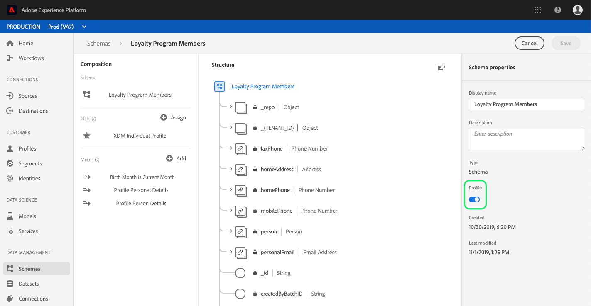

# (Alpha)計算屬性端點

>[!IMPORTANT]
>本文中概述的計算屬性功能目前為alpha格式，並非所有使用者都能使用。 文件和功能可能會有所變更。

計算屬性可讓您根據其他值、計算和運算式自動計算欄位的值。 計算屬性在描述檔層級上運作，這表示您可以匯總所有記錄和事件的值。

每個計算屬性都包含一個運算式（或「規則」），可評估傳入的資料，並將產生的值儲存在描述檔屬性或事件中。 這些計算可協助您輕鬆回答與期限購買值、購買間隔時間或應用程式開啟次數等相關的問題，而不需在每次需要資訊時手動執行複雜的計算。

本指南將協助您進一步瞭解Adobe Experience Platform中的計算屬性，並包含使用端點執行基本CRUD作業的範例API `/config/computedAttributes` 呼叫。

## 快速入門

本指南中使用的API端點是即時客戶 [設定檔API的一部分](https://www.adobe.io/apis/experienceplatform/home/api-reference.html#!acpdr/swagger-specs/real-time-customer-profile.yaml)。 在繼續之前，請先閱讀快速入門 [指南](getting-started.md) ，以取得相關檔案的連結、閱讀本檔案中範例API呼叫的指南，以及成功呼叫任何 [!DNL Experience Platform] API所需之必要標題的重要資訊。

## 瞭解計算屬性

Adobe Experience Platform可讓您輕鬆匯入和合併多個來源的資料，以便產生內容 [!DNL Real-time Customer Profiles]。 每個描述檔都包含與個人相關的重要資訊，例如其聯絡資訊、偏好設定和購買記錄，提供360度全方位的客戶檢視。

直接讀取資料欄位時（例如「名字」），容易瞭解描述檔中收集的部分資訊，而其他資料則需要執行多項計算，或依賴其他欄位和值，以產生資訊（例如「期限購買總計」）。 為了讓資料一目瞭然，您可 [!DNL Platform] 以建立計算 **[!UICONTROL 屬性]** ，自動執行這些參照和計算，並在適當欄位中傳回值。

計算屬性包括建立對傳入資料進行操作的表達式（即「規則」），並將結果值儲存在配置檔案屬性或事件中。 運算式可以以多種不同方式定義，可讓您指定規則僅評估傳入事件、傳入事件和描述檔資料，或傳入事件、描述檔資料和歷史事件。

### 使用個案

計算屬性的使用案例範圍從簡單計算到非常複雜的參照。 以下是計算屬性的幾個示例使用案例：

1. **[!UICONTROL 百分比]:**簡單的計算屬性可能包括在記錄上取兩個數值欄位，並將它們分割以建立百分比。 例如，您可以將傳送給個人的電子郵件總數除以該個人開啟的電子郵件數。 查看產生的計算屬性欄位，可快速顯示個人開啟的電子郵件總數百分比。
1. **[!UICONTROL 應用程式使用]:**另一個範例包括匯總使用者開啟您應用程式的次數。 透過追蹤應用程式開啟總數（根據個別開啟事件），您可以在使用者第100次開啟時提供特殊優惠或訊息給使用者，以鼓勵更深入地參與您的品牌。
1. **[!UICONTROL 期限值]:**收集即期總計（例如客戶的期限購買值）可能非常困難。 這要求每次發生新購買事件時更新歷史總計。 計算屬性可讓您更輕鬆地在單一欄位中保留期限值，此欄位會在與客戶相關的每個成功購買事件後自動更新。

## 配置計算屬性

為了配置計算屬性，首先需要標識將保存計算屬性值的欄位。 可以使用混音建立此欄位，以將欄位添加到現有方案，或者選擇已在方案中定義的欄位。

>[!NOTE]
>計算屬性無法新增至Adobe定義混音中的欄位。 欄位必須位於命名空 `tenant` 間內，這表示欄位必須是您定義並新增至架構的欄位。

為了成功定義計算屬性欄位，必須為模式啟用，並 [!DNL Profile] 作為模式所基於類的聯合模式的一部分顯示。 有關啟用的 [!DNL Profile]架構和聯合的詳細資訊，請查看開發人員指南中有關為「配置檔案」啟用 [!DNL Schema Registry] 架構和查 [看聯合架構的章節](../../xdm/api/getting-started.md)。 還建議在方案構成基 [礎文檔中](../../xdm/schema/composition.md) ，查看關於聯合的部分。

本教程中的工作流程使用 [!DNL Profile]啟用的架構，並遵循定義包含計算屬性欄位的新混音並確保其為正確命名空間的步驟。 如果已在啟用概要檔案的架構中有一個欄位處於正確的命名空間中，則可以直接執行建立計算 [屬性的步驟](#create-a-computed-attribute)。

### 檢視結構

後續步驟會使用Adobe Experience Platform使用者介面來尋找結構、新增混音和定義欄位。 如果您偏好使用 [!DNL Schema Registry] API，請參閱 [Schema Registry Developer Guide](../../xdm/api/getting-started.md) ，以取得如何建立混合、將混合新增至架構，以及啟用搭配使用的架構的步驟 [!DNL Real-time Customer Profile]。

在使用者介面中，按一 **[!UICONTROL 下左側導軌中的]**** 「結構描述」，然後使用「瀏覽」標籤上的搜尋列，快速找到您要更新的結構描述。


找到架構後，按一下其名稱以開啟可 [!DNL Schema Editor] 以在其中編輯架構的位置。


### 建立混音

若要建立新混音，請按一 **[!UICONTROL 下編輯器左側]** 「構圖 *」區段中，「Mixins*** 」旁的「新增」。 這會開啟「新 **[!UICONTROL 增混音]** 」對話方塊，您可在其中看到現有的混音。 按一下「建立新混音 **[!UICONTROL 」的選項按鈕]** ，以定義您的新混音。

為混音指定名稱和說明，然後在完成時按 **[!UICONTROL 一下「新增混音]** 」。


### 將計算屬性欄位添加到方案

您的新混音現在應會出現在「合成」 *[!UICONTROL 下的]* 「混音 *[!UICONTROL 」區段]*。 按一下mixin的名稱，多個「新增」欄 **[!UICONTROL 位按鈕]** ，就會出現在編輯器的「 *[!UICONTROL 結構]* 」區段中。

選擇 **[!UICONTROL 方案名稱旁邊的添加欄位]** ，以添加頂層欄位，或者可以選擇將該欄位添加到方案內任意位置。

按一下「 **[!UICONTROL 新增欄位]** 」後，會開啟新物件，以您的租用戶ID命名，顯示欄位在正確的命名空間中。 在該對象中，將顯示 *[!UICONTROL 「新建]* 」欄位。 如果要定義計算屬性的欄位為此欄位，則為此欄位。


### 設定欄位

使用編 *[!UICONTROL 輯器右側的]* 「欄位屬性」區段，提供新欄位的必要資訊，包括欄位名稱、顯示名稱和類型。

>[!NOTE]
>欄位的類型必須與計算的屬性值相同。 例如，如果計算的屬性值是字串，則方案中定義的欄位必須是字串。

完成後，按一下「應 **[!UICONTROL 用]** 」(Apply *[!UICONTROL )，欄位的名稱及其類型將出現在編輯器的「結構]* 」(Structure)部分中。


### 為 [!DNL Profile]

繼續之前，請確定已為啟用模式 [!DNL Profile]。 按一下編輯器的「結構 ** 」部分中的架構名稱，以顯示 *[!UICONTROL 「架構屬性]* 」頁籤。 如果「描 **[!UICONTROL 述檔]** 」滑桿為藍色，表示已啟用架構 [!DNL Profile]。

>[!NOTE]
>為其啟用 [!DNL Profile] 模式無法撤消，因此，如果在啟用滑塊後按一下該滑塊，則無需冒險禁用它。



您現在可以按一 **[!UICONTROL 下「儲存]** 」以儲存更新的架構，並繼續使用API進行教學課程的其餘部分。

### 建立計算屬性 {#create-a-computed-attribute}

通過標識計算屬性欄位並確認方案已為啟用， [!DNL Profile]您現在可以配置計算屬性。

首先，對端點發出POST請 `/config/computedAttributes` 求，請求主體包含要建立的計算屬性的詳細資訊。

**API格式**

```http
POST /config/computedAttributes
```

**請求**

```shell
curl -X POST \
  https://platform.adobe.io/data/core/ups/config/computedAttributes \
  -H 'Authorization: Bearer {ACCESS_TOKEN}' \
  -H 'Content-Type: application/json' \
  -H 'x-api-key: {API_KEY}'\
  -H 'x-gw-ims-org-id: {IMS_ORG}' \
  -H 'x-sandbox-name: {SANDBOX_NAME}' \
  -d '{
        "name" : "birthdayCurrentMonth",
        "path" : "_{TENANT_ID}",
        "description" : "Computed attribute to capture if the customer birthday is in the current month.",
        "expression" : {
            "type" : "PQL", 
            "format" : "pql/text", 
            "value":  "person.birthDate.getMonth() = currentMonth()"
        },
        "schema": 
          {
            "name":"_xdm.context.profile"
          }
          
      }'
```

| 屬性 | 說明 |
|---|---|
| `name` | 計算屬性欄位的名稱，作為字串。 |
| `path` | 包含計算屬性的欄位的路徑。 此路徑位於模式的屬 `properties` 性中，不應在路徑中包含欄位名稱。 寫入路徑時，請忽略多個屬性 `properties` 層級。 |
| `{TENANT_ID}` | 如果您不熟悉您的租用戶ID，請參閱「架構註冊開發人員指南」中尋找租用戶ID [的步驟](../../xdm/api/getting-started.md#know-your-tenant_id)。 |
| `description` | 計算屬性的說明。 當定義了多個計算屬性後，這特別有用，因為它將幫助IMS組織中的其他人決定要使用的正確計算屬性。 |
| `expression.value` | 有效( [!DNL Profile Query Language] PQL)表達式。 有關PQL和支援查詢的連結的詳細資訊，請閱讀 [PQL概述](../../segmentation/pql/overview.md)。 |
| `schema.name` | 包含計算屬性欄位的方案所基於的類。 範例： `_xdm.context.experienceevent` 用於基於XDM ExperienceEvent類的架構。 |

**回應**

成功建立的計算屬性返回HTTP狀態200(OK)，並返回包含新建計算屬性詳細資訊的響應主體。 這些詳細資訊包括唯一、唯讀、系統產生的 `id` 資訊，可用於在其他API作業期間參考計算的屬性。

```json
{
    "id": "2afcf410-450e-4a39-984d-2de99ab58877",
    "imsOrgId": "{IMS_ORG}",
    "sandbox": {
        "sandboxId": "ff0f6870-c46d-11e9-8ca3-036939a64204",
        "sandboxName": "prod",
        "type": "production",
        "default": true
    },
    "name": "birthdayCurrentMonth",
    "path": "_{TENANT_ID}",
    "positionPath": [
        "_{TENANT_ID}"
    ],
    "description": "Computed attribute to capture if the customer birthday is in the current month.",
    "expression": {
        "type": "PQL",
        "format": "pql/text",
        "value": "person.birthDate.getMonth() = currentMonth()"
    },
    "schema": {
        "name": "_xdm.context.profile"
    },
    "returnSchema": {
        "meta:xdmType": "string"
    },
    "definedOn": [
        {
            "meta:resourceType": "unions",
            "meta:containerId": "tenant",
            "$ref": "https://ns.adobe.com/xdm/context/profile__union"
        }
    ],
    "encodedDefinedOn":"?\b?VR)JMS?R?())(????+?KL?OJ?K???H??O??+I?(?/(?O??I??/????S?8{?E:",
    "dependencies": [],
    "dependents": [],
    "active": true,
    "type": "ComputedAttribute",
    "createEpoch": 1572555223,
    "updateEpoch": 1572555225
}
```

| 屬性 | 說明 |
|---|---|
| `id` | 唯一、唯讀、系統產生的ID，可用於在其他API操作期間引用計算的屬性。 |
| `imsOrgId` | 與計算屬性相關的IMS組織應符合在請求中傳送的值。 |
| `sandbox` | 沙盒物件包含沙盒的詳細資訊，此沙盒已設定計算屬性。 這項資訊是從請求中傳送的沙盒標題中擷取。 如需詳細資訊，請參閱 [沙盒總覽](../../sandboxes/home.md)。 |
| `positionPath` | 包含解構至請求 `path` 中所傳送欄位的陣列。 |
| `returnSchema.meta:xdmType` | 儲存計算屬性的欄位的類型。 |
| `definedOn` | 顯示已定義計算屬性的聯合方案的陣列。 每個聯合方案包含一個對象，這表示如果計算的屬性已根據不同的類添加到多個方案，則陣列中可能有多個對象。 |
| `active` | 顯示計算屬性當前是否處於活動狀態的布爾值。 預設值為 `true`。 |
| `type` | 建立的資源類型（在本例中為「ComputedAttribute」）是預設值。 |
| `createEpoch` 和 `updateEpoch` | 計算屬性的建立時間和上次更新時間。 |


## 訪問計算屬性

使用API處理計算屬性時，有兩個選項用於訪問您的組織已定義的計算屬性。 第一種是列出所有計算屬性，第二種是按其唯一性查看特定計算屬性 `id`。

列出所有計算屬性和查看特定計算屬性的步驟如下所述。

### 列出計算屬性 {#list-computed-attributes}

您的IMS組織可以建立多個計算屬性，並對端點執行GET請求， `/config/computedAttributes` 可讓您列出組織的所有現有計算屬性。

**API格式**

```http
GET /config/computedAttributes
```

**請求**

```shell
curl -X GET \
  https://platform.adobe.io/data/core/ups/config/computedAttributes/ \
  -H 'Authorization: Bearer {ACCESS_TOKEN}' \
  -H 'x-api-key: {API_KEY}' \
  -H 'x-gw-ims-org-id: {IMS_ORG}' \ 
  -H 'x-sandbox-name: {SANDBOX_NAME}' \
```

**回應**

成功響應包括 `_page` 提供計算屬性(`totalCount`)總數和頁(`pageSize`)上計算屬性數的屬性。

該響應還包括由一 `children` 個或多個對象組成的陣列，每個對象包含一個計算屬性的詳細資訊。 如果組織沒有任何計算屬性，則 `totalCount` 和 `pageSize` 將為0（零），且 `children` 陣列為空。

```json
{
    "_page": {
        "totalCount": 2,
        "pageSize": 2
    },
    "children": [
        {
            "id": "2afcf410-450e-4a39-984d-2de99ab58877",
            "imsOrgId": "{IMS_ORG}",
            "sandbox": {
                "sandboxId": "ff0f6870-c46d-11e9-8ca3-036939a64204",
                "sandboxName": "prod",
                "type": "production",
                "default": true
            },
            "name": "birthdayCurrentMonth",
            "path": "person._{TENANT_ID}",
            "positionPath": [
                "person",
                "_{TENANT_ID}"
            ],
            "description": "Computed attribute to capture if the customer birthday is in the current month.",
            "expression": {
                "type": "PQL",
                "format": "pql/text",
                "value": "person.birthDate.getMonth() = currentMonth()"
            },
            "schema": {
                "name": "_xdm.context.profile"
            },
            "returnSchema": {
                "meta:xdmType": "string"
            },
            "definedOn": [
                {
                    "meta:resourceType": "unions",
                    "meta:containerId": "tenant",
                    "$ref": "https://ns.adobe.com/xdm/context/profile__union"
                }
            ],
            "encodedDefinedOn":"?\b?VR)JMS?R?())(????+?KL?OJ?K???H??O??+I?(?/(?O??I??/????S?8{?E:",
            "dependencies": [],
            "dependents": [],
            "active": true,
            "type": "ComputedAttribute",
            "createEpoch": 1572555223,
            "updateEpoch": 1572555225
        },
        {
            "id": "ae0c6552-cf49-4725-8979-116366e8e8d3",
            "imsOrgId": "{IMS_ORG}",
            "sandbox": {
                "sandboxId": "",
                "sandboxName": "",
                "type": "production",
                "default": true
            },
            "name": "productDownloads",
            "path": "_{TENANT_ID}",
            "positionPath": [
                "_{TENANT_ID}"
            ],
            "description": "Calculate total product downloads.",
            "expression": {
                "type" : "PQL", 
                "format" : "pql/text", 
                "value":  "let Y = xEvent[_coresvc.event.subType = \"DOWNLOAD\"].groupBy(_coresvc.attributes[name = \"product\"].value).map({
                  \"downloaded\": this.head()._coresvc.attributes[name = \"product\"].head().value,
                  \"downloadsSum\": this.count(),
                  \"downloadsToday\": this[timestamp occurs today].count(),
                  \"downloadsPast30Days\": this[timestamp occurs < 30 days before now].count(),
                  \"downloadsPast60Days\": this[timestamp occurs < 60 days before now].count(),
                  \"downloadsPast90Days\": this[timestamp occurs < 90 days before now].count() }) in { \"uniqueProductDownloadSum\": Y.count(), \"products\": Y }"
            },
            "returnSchema": {
                "meta:xdmType": "string"
            },
            "definedOn": [
                {
                    "meta:resourceType": "unions",
                    "meta:containerId": "tenant",
                    "$ref": "https://ns.adobe.com/xdm/context/profile__union"
                }
            ],
            "schema": {
                "name": "_xdm.context.profile"
            },
            "encodedDefinedOn": "\u001f?\b\u0000\u0000\u0000\u0000\u0000\u0000\u0000?VR)JMS?R?())(????+?KL?OJ?K???H??O??+I?(?/(?O??I??/????S?\u0005\u00008{?E:\u0000\u0000\u0000",
            "dependencies": [],
            "dependents": [],
            "active": true,
            "type": "ComputedAttribute",
            "createEpoch": 1571945277,
            "updateEpoch": 1571945280
        }
    ],
    "_links": {
        "next": {}
    }
}
```

| 屬性 | 說明 |
|---|---|
| `_page.totalCount` | 由IMS組織定義的計算屬性總數。 |
| `_page.pageSize` | 在此結果頁返回的計算屬性數。 如 `pageSize` 果等於 `totalCount`，表示只有一頁結果，且所有計算屬性都已傳回。 如果結果不相等，則可存取其他頁面的結果。 See `_links.next` for details. |
| `children` | 由一個或多個對象組成的陣列，每個對象包含單個計算屬性的詳細資訊。 如果未定義任何計算屬性，則 `children` 陣列為空。 |
| `id` | 建立計算屬性時自動分配給其的唯一隻讀系統生成值。 有關計算屬性對象的元件的詳細資訊，請參閱本教程前面 [有關建立計算屬性的部分](#create-a-computed-attribute) 。 |
| `_links.next` | 如果返回計算屬性的單頁，則 `_links.next` 為空對象，如上面的示例響應所示。 如果您的組織有許多計算屬性，則會在多個頁面上傳回這些屬性，您可以透過對值進行GET請求來存 `_links.next` 取。 |

### 查看計算屬性 {#view-a-computed-attribute}

您也可以通過向端點發出GET請求並在請求路徑中包 `/config/computedAttributes` 含計算屬性ID來查看特定計算屬性。

**API格式**

```http
GET /config/computedAttributes/{ATTRIBUTE_ID}
```

| 參數 | 說明 |
|---|---|
| `{ATTRIBUTE_ID}` | 要查看的計算屬性的ID。 |

**請求**

```shell
curl -X GET \
  https://platform.adobe.io/data/core/ups/config/computedAttributes/2afcf410-450e-4a39-984d-2de99ab58877 \
  -H 'Authorization: Bearer {ACCESS_TOKEN}' \
  -H 'x-api-key: {API_KEY}' \
  -H 'x-gw-ims-org-id: {IMS_ORG}' \ 
  -H 'x-sandbox-name: {SANDBOX_NAME}' \
```

**回應**

```json
{
    "id": "2afcf410-450e-4a39-984d-2de99ab58877",
    "imsOrgId": "{IMS_ORG}",
    "sandbox": {
        "sandboxId": "ff0f6870-c46d-11e9-8ca3-036939a64204",
        "sandboxName": "prod",
        "type": "production",
        "default": true
    },
    "name": "birthdayCurrentMonth",
    "path": "_{TENANT_ID}",
    "positionPath": [
        "_{TENANT_ID}"
    ],
    "description": "Computed attribute to capture if the customer birthday is in the current month.",
    "expression": {
        "type": "PQL",
        "format": "pql/text",
        "value": "person.birthDate.getMonth() = currentMonth()"
    },
    "schema": {
        "name": "_xdm.context.profile"
    },
    "returnSchema": {
        "meta:xdmType": "string"
    },
    "definedOn": [
        {
            "meta:resourceType": "unions",
            "meta:containerId": "tenant",
            "$ref": "https://ns.adobe.com/xdm/context/profile__union"
        }
    ],
    "encodedDefinedOn":"?\b?VR)JMS?R?())(????+?KL?OJ?K???H??O??+I?(?/(?O??I??/????S?8{?E:",
    "dependencies": [],
    "dependents": [],
    "active": true,
    "type": "ComputedAttribute",
    "createEpoch": 1572555223,
    "updateEpoch": 1572555225
}
```

## 更新計算屬性

如果您發現需要更新現有的計算屬性，可通過向端點發出PATCH請求並在請求路徑中包括要更新的計算屬性的ID來完成此操作。 `/config/computedAttributes`

**API格式**

```http
PATCH /config/computedAttributes/{ATTRIBUTE_ID}
```

| 參數 | 說明 |
|---|---|
| `{ATTRIBUTE_ID}` | 您要更新的計算屬性的ID。 |

**請求**

此請求使 [用JSON修補程式格式](http://jsonpatch.com/) ，以更新「運算式」欄位的「值」。

```shell
curl -X PATCH \
  https://platform.adobe.io/data/core/ups/config/computedAttributes/ae0c6552-cf49-4725-8979-116366e8e8d3 \
  -H 'Authorization: Bearer {ACCESS_TOKEN}'\
  -H 'Content-Type: application/json' \
  -H 'x-api-key: {API_KEY}' \
  -H 'x-gw-ims-org-id: {IMS_ORG}' \
  -H 'x-sandbox-name: {SANDBOX_NAME}' \  
  -d '[
        {
          "op": "add",
          "path": "/expression",
          "value": 
          {
            "type" : "PQL", 
            "format" : "pql/text", 
            "value":  "{NEW_EXPRESSION_VALUE}"
          }
        }
      ]'
```

| 屬性 | 說明 |
|---|---|
| `{NEW_EXPRESSION_VALUE}` | 有效( [!DNL Profile Query Language] PQL)表達式。 有關PQL和支援查詢的連結的詳細資訊，請閱讀 [PQL概述](../../segmentation/pql/overview.md)。 |

**回應**

成功的更新會傳回HTTP狀態204（無內容）和空回應主體。 如果您想確認更新成功，可以執行GET請求，以依據其ID查看計算屬性。

## 刪除計算屬性

您也可以使用API刪除計算屬性。 這是通過向端點發出DELETE請求並 `/config/computedAttributes` 在請求路徑中包括要刪除的計算屬性的ID來完成的。

>[!Note]
>
>
>刪除計算屬性時請小心，因為該屬性可能在多個方案中使用，且DELETE操作無法撤消。

**API格式**

```http
DELETE /config/computedAttributes/{ATTRIBUTE_ID}
```

| 參數 | 說明 |
|---|---|
| `{ATTRIBUTE_ID}` | 要刪除的計算屬性的ID。 |

**請求**

```shell
curl -X DELETE \
  https://platform.adobe.io/data/core/ups/config/computedAttributes/ae0c6552-cf49-4725-8979-116366e8e8d3 \
  -H 'Authorization: Bearer {ACCESS_TOKEN}' \
  -H 'x-api-key: {API_KEY}' \
  -H 'x-gw-ims-org-id: {IMS_ORG}'
  -H 'x-sandbox-name: {SANDBOX_NAME}' \ 
```

**回應**

成功的刪除請求會傳回HTTP狀態200（確定）和空回應主體。 若要確認刪除成功，您可以執行GET請求，以依其ID查閱計算的屬性。 如果刪除了屬性，您會收到HTTP狀態404（找不到）錯誤。

## 後續步驟

現在您已瞭解計算屬性的基本知識，您可以開始為組織定義這些屬性。