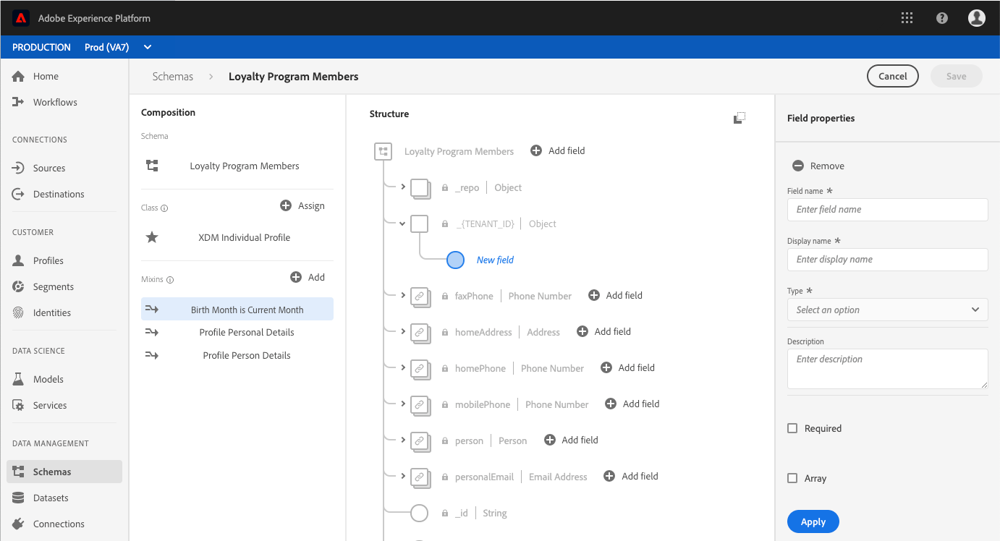

# (Alpha)在UI中設定計算屬性欄位

>[!IMPORTANT]
>
>計算屬性功能目前位於alpha值中，並非所有使用者都能使用。 文件和功能可能會有所變更。

為了配置計算屬性，首先需要標識將保存計算屬性值的欄位。 可以使用混音建立此欄位，以將欄位添加到現有方案，或者選擇已在方案中定義的欄位。

>[!NOTE]
>
>計算屬性無法新增至Adobe定義混音中的欄位。 欄位必須位於`tenant`命名空間中，這表示欄位必須是您定義並新增至架構的欄位。

要成功定義計算屬性欄位，必須為[!DNL Profile]啟用模式，並作為模式所基於類的聯合模式的一部分出現。 有關[!DNL Profile]啟用架構和聯合的詳細資訊，請查看[!DNL Schema Registry]開發人員指南中有關[啟用描述檔和查看聯合架構的章節](../../xdm/api/getting-started.md)。 還建議在架構構成基礎文檔中查看關於union](../../xdm/schema/composition.md)的[部分。

本教程中的工作流使用[!DNL Profile]啟用的模式，並遵循定義包含計算屬性欄位的新混音並確保其為正確命名空間的步驟。 如果已在啟用概要檔案的架構中有一個欄位處於正確的命名空間中，則可以直接執行[建立計算屬性](#create-a-computed-attribute)的步驟。

## 檢視結構

後續步驟會使用Adobe Experience Platform使用者介面來尋找結構、新增混音和定義欄位。 如果您偏好使用[!DNL Schema Registry] API，請參閱[架構註冊表開發人員指南](../../xdm/api/getting-started.md)以取得如何建立混合、新增混合至架構以及啟用與[!DNL Real-time Customer Profile]搭配使用的架構的步驟。

在用戶介面中，按一下左側導軌中的&#x200B;**[!UICONTROL 方案]**，然後使用&#x200B;**[!UICONTROL 瀏覽]**&#x200B;頁籤上的搜索欄快速找到您希望更新的方案。

找到架構後，按一下其名稱以開啟[!DNL Schema Editor] ，您可以在其中編輯架構。

## 建立混音

若要建立新混音，請按一下編輯器左側「組合」區段中「**[!UICONTROL Composition]**」**[!UICONTROL Mixins]**&#x200B;旁的「新增&#x200B;**[!UICONTROL a1/>」。]**&#x200B;這會開啟&#x200B;**[!UICONTROL 新增mixin]**&#x200B;對話方塊，您可在其中看到現有的mix。 按一下&#x200B;**[!UICONTROL 「建立新混音」的選項按鈕，以定義新混音。]**

為mixin指定名稱和說明，完成後按一下&#x200B;**[!UICONTROL 添加mixin]**。

## 將計算屬性欄位添加到方案

您的新混音現在應會出現在「[!UICONTROL Composition]」下方的「[!UICONTROL Mixins]」區段中。 按一下mixin的名稱，編輯器的&#x200B;**[!UICONTROL 結構]**&#x200B;區段中會出現多個「新增欄位&#x200B;]**」按鈕。**[!UICONTROL 

選擇方案名稱旁邊的&#x200B;**[!UICONTROL 添加欄位]**&#x200B;以添加頂層欄位，或者可以選擇將欄位添加到方案內任意位置。

按一下「新增欄位&#x200B;****」後，會開啟新物件，以您的租用戶ID命名，顯示欄位在正確的命名空間中。 在該對象中，將顯示&#x200B;**[!UICONTROL New欄位]**。 如果要定義計算屬性的欄位為此欄位，則為此欄位。

## 設定欄位

使用編輯器右側的&#x200B;**[!UICONTROL 欄位屬性]**&#x200B;區段，提供新欄位的必要資訊，包括其名稱、顯示名稱和類型。

>[!NOTE]
>
>欄位的類型必須與計算的屬性值相同。 例如，如果計算的屬性值是字串，則方案中定義的欄位必須是字串。

完成後，按一下&#x200B;**[!UICONTROL Apply]** ，欄位的名稱及其類型將出現在編輯器的&#x200B;**[!UICONTROL Structure]**&#x200B;部分。

## 為[!DNL Profile]啟用模式

繼續之前，請確定[!DNL Profile]的架構已啟用。 按一下編輯器的&#x200B;**[!UICONTROL Structure]**&#x200B;部分中的架構名稱，以便顯示「架構屬性」頁籤。 ****&#x200B;如果&#x200B;**[!UICONTROL Profile]**&#x200B;滑塊為藍色，則[!DNL Profile]已啟用模式。

>[!NOTE]
>
>為[!DNL Profile]啟用架構無法撤消，因此，如果在啟用滑塊後按一下該滑塊，則不必冒險禁用它。

您現在可以按一下&#x200B;**[!UICONTROL Save]**&#x200B;來儲存更新的架構，並繼續使用API進行教學課程的其餘部分。

## 後續步驟

現在，您已經建立了一個欄位，計算屬性值將儲存到該欄位中，您可以使用`/computedattributes` API端點建立計算屬性。 有關在API中建立計算屬性的詳細步驟，請遵循[計算屬性API端點指南](ca-api.md)中提供的步驟。