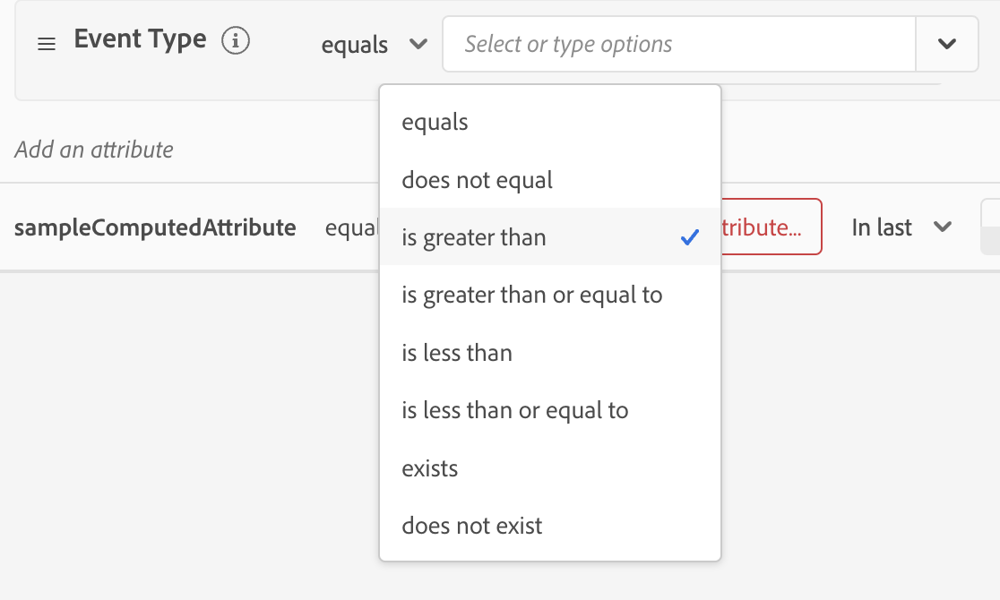

# 計算屬性UI指南

>[!IMPORTANT]
>
>計算屬性目前位於 **beta** 和 **not** 可供所有使用者使用。

在Adobe Experience Platform中，計算屬性是用於彙總事件層級資料至設定檔層級屬性的函式。 這些函式會自動計算，以便用於區段、啟用和個人化。

本檔案提供如何使用Adobe Experience Platform UI建立和更新計算屬性的指南。

## 快速入門

本UI指南需要瞭解各種 [!DNL Experience Platform] 與管理相關的服務 [!DNL Real-Time Customer Profiles]. 在閱讀本指南或使用UI之前，請檢視以下服務的檔案：

- [[!DNL Real-Time Customer Profile]](../home.md)：根據來自多個來源的彙總資料，提供統一的即時消費者設定檔。
- [[!DNL Experience Data Model (XDM) System]](../../xdm/home.md)：作為依據的標準化架構 [!DNL Experience Platform] 組織客戶體驗資料。

## 檢視計算屬性 {#view}

在Experience PlatformUI中，選取 **[!UICONTROL 設定檔]** 在左側導覽列中，後面接著 **[!UICONTROL 計算屬性]** 檢視您的組織可用的計算屬性清單。 這包括計算屬性的名稱、說明、上次評估日期和上次評估狀態的資訊。

![此 [!UICONTROL 設定檔] 區段和 [!UICONTROL 計算屬性] 標籤會反白顯示，向使用者顯示如何存取計算屬性瀏覽頁面。](./images/ui/browse.png)

若要選取可見的欄位，您可以選取  以新增或移除您要顯示的欄位。

| 欄位 | 說明 |
| ----- | ----------- |
| [!UICONTROL 名稱] | 計算屬性的顯示名稱。 |
| [!UICONTROL 說明] | 計算屬性的說明。 |
| [!UICONTROL 評估方式] | 計算屬性的評估方法。 目前，僅 **批次** 支援。 |
| [!UICONTROL 上次評估時間] | 此時間戳記代表上次成功的評估回合。 僅限發生的事件 **早於** 此時間戳記會納入上次成功評估中。 |
| [!UICONTROL 上次評估狀態] | 此狀態會說明在上次評估執行中是否成功計算運算屬性。 可能的值包括 **[!UICONTROL 成功]** 或 **[!UICONTROL 已失敗]**. |
| [!UICONTROL 重新整理頻率] | 表示計算屬性預期重新整理的頻率。 可能的值包括每小時、每日、每週或每月。 |
| [!UICONTROL 快速重新整理] | 顯示是否為此運算屬性啟用快速重新整理的值。 如果已啟用快速重新整理，這可讓計算屬性每天重新整理，而不是每週、每兩週或每月重新整理。 此值僅適用於回顧期間大於每週基數的計算屬性。 |
| [!UICONTROL 生命週期狀態] | 計算屬性的目前狀態。 可能的狀態有三種： <ul><li>**[!UICONTROL 草稿]：** 計算屬性會 **not** 已在結構描述上建立欄位。 在此狀態下，可以編輯計算屬性。 </li><li>**[!UICONTROL 已發佈]：** 運算屬性已在結構描述上建立欄位，且已可供使用。 在此狀態下，計算屬性 **無法** 進行編輯。</li><li>**[!UICONTROL 非使用中]：** 運算屬性已停用。 如需非使用中狀態的詳細資訊，請閱讀 [常見問題頁面](./faq.md#inactive-status). </li> |

此外，您可以選取計算屬性來檢視更多相關詳細資訊。 如需計算屬性詳細資訊頁面的詳細資訊，請參閱 [檢視計算屬性的詳細資訊區段](#view-details).

## 建立計算屬性 {#create}

若要建立新的計算屬性，請選取 **[!UICONTROL 建立計算屬性]** 以輸入新的計算屬性工作流程。

![此 [!UICONTROL 建立計算屬性] 按鈕會醒目顯示，向使用者展示如何到達「建立計算屬性」頁面。](./images/ui/create.png)

此 **[!UICONTROL 建立計算屬性]** 頁面便會顯示。 您可以在此頁面新增要建立之計算屬性的基本資訊。

| 欄位 | 說明 |
| ----- | ----------- |
| [!UICONTROL 顯示名稱] | 計算屬性的名稱。 您應將此顯示名稱保留為每個計算屬性的唯一名稱。 最佳實務是，此顯示名稱應包含與計算屬性相關的識別碼。 舉例來說，「過去7天買鞋的總和」。 |
| [!UICONTROL 欄位名稱] | 用來參照其他下游服務中計算屬性的名稱。 此名稱會自動衍生自顯示名稱，並以camelCase寫入。 |
| [!UICONTROL 說明] | 您嘗試建立的計算屬性說明。 |

![此 [!UICONTROL 基本資訊] 部分 [!UICONTROL 建立計算屬性] 頁面會醒目提示。](./images/ui/basic-information.png)

新增計算屬性詳細資料後，您就可以開始定義規則。

### 指定事件篩選條件

若要建立規則，請先從 **[!UICONTROL 事件]** 區段來篩選您要彙總的事件。 目前僅支援非陣列型別的事件屬性。

![此 [!UICONTROL 事件] 區段會反白顯示。](./images/ui/events.png)

選取要在計算屬性定義中使用的屬性後，您可以選擇要與這個值比較的內容。

### 套用彙總函式

現在，您可以將函式套用至條件式輸出的欄位。 首先，選取彙總函式型別。 可用選項包括 [!UICONTROL 總和]， [!UICONTROL 最小值]， [!UICONTROL 最大]， [!UICONTROL 計數]、和 [!UICONTROL 最近]. 如需這些函式的詳細資訊，請參閱 [函式區段](./overview.md#functions) 運算屬性概觀的。

選擇函式後，您可以選擇要彙總的欄位。 可選擇的合格欄位取決於所選功能。

### 回顧期間

套用彙總函式後，您需要定義計算屬性的回顧期間。 此回顧期間會指定您要彙總事件的時間長度。 此回顧期間可按小時、天、周或月指定。

完成這些步驟後，您現在可以選擇將此計算屬性儲存為草稿或立即發佈。

![此 [!UICONTROL 另存為草稿] 和 [!UICONTROL 發佈] 按鈕會反白顯示。](./images/ui/draft-or-publish.png)

## 檢視計算屬性的詳細資料 {#view-details}

若要檢視計算屬性的詳細資訊，請選取您要檢視有關以下專案的詳細資訊的計算屬性： [!UICONTROL **瀏覽**] 頁面。

頁面的內容會有所不同，視運算屬性是否為 **[!UICONTROL 已發佈]** 或 **[!UICONTROL 草稿]**.

### 已發佈的計算屬性 {#published}

選取已發佈的計算屬性時，計算屬性詳細資訊頁面就會顯示。

此頁面顯示計算屬性的詳細資訊摘要，以及顯示值分佈的圖形，以及符合計算屬性資格的範例設定檔。

>[!NOTE]
>
>值分佈會反映取樣工作時設定檔的屬性值分佈。 範例設定檔中的計算屬性值會反映一些範例設定檔的最新合併設定檔值。

### 草稿計算屬性 {#draft}

選取草稿計算屬性時， **[!UICONTROL 編輯計算屬性]** 頁面便會顯示。 此頁面與 [!UICONTROL 建立計算屬性] 頁面，可讓您先編輯計算屬性的基本資訊及其定義，然後再更新草稿或發佈。

![此 [!UICONTROL 編輯計算屬性] 頁面隨即顯示。](./images/ui/edit.png)

## 使用計算屬性 {#usage}

建立計算屬性後，您可以使用 **已發佈** 計算其他下游服務中的屬性。 由於計算屬性是在您的設定檔聯合結構描述中建立的設定檔屬性欄位，因此您可以查詢即時客戶設定檔的計算屬性值、在對象中使用它們、在目的地啟用它們，或在Adobe Journey Optimizer中的歷程中使用它們進行個人化。

## 後續步驟

若要進一步瞭解運算屬性，請閱讀 [計算屬性概觀](./overview.md). 如需使用API建立及設定計算屬性的詳細資訊，請參閱 [計算屬性開發人員指南](./api.md).
