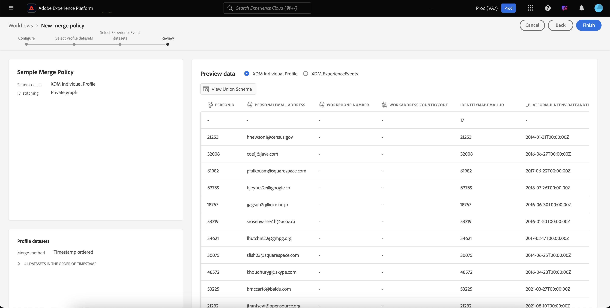

# 合併原則UI指南

Adobe Experience Platform可讓您將多個來源的資料片段彙整在一起，並將它們合併，以便檢視每個個別客戶的完整檢視。 彙總此資料時，合併原則即為 [!DNL Platform] 會使用來決定資料的優先順序，以及將合併哪些資料以建立統一檢視。

使用RESTful API或使用者介面，您可以建立新的合併原則、管理現有原則，並為您的組織設定預設合併原則。 本指南提供使用Adobe Experience Platform使用者介面(UI)處理合併原則的逐步指示。

若要進一步瞭解合併原則及其在Experience Platform中所扮演的角色，請先閱讀 [合併原則概觀](overview.md).

## 快速入門

本指南需要深入瞭解幾項重要事項 [!DNL Experience Platform] 功能。 在遵循本指南之前，請檢視以下服務的檔案：

* [即時客戶個人檔案](../home.md)：根據來自多個來源的彙總資料，提供統一的即時消費者個人檔案。
* [Adobe Experience Platform Identity服務](../../identity-service/home.md)：透過橋接正在被擷取到的不同資料來源的身分，來啟用即時客戶個人檔案 [!DNL Platform].
* [體驗資料模型(XDM)](../../xdm/home.md)：作為依據的標準化架構 [!DNL Platform] 組織客戶體驗資料。

## 檢視合併原則 {#view-merge-policies}

在 [!DNL Experience Platform] UI中，您可以透過選取 **[!UICONTROL 設定檔]** 在左側導覽中，然後選取 **[!UICONTROL 合併原則]** 標籤。 此索引標籤包含貴組織的所有現有合併原則清單，以及每個合併原則的詳細資訊，包括原則名稱、合併原則是否為預設合併原則，以及合併原則相關的結構描述類別。

若要選取顯示哪些詳細資訊，或新增其他欄至顯示，請選取 **[!UICONTROL 設定欄]** 並按一下欄名稱，將其從檢視中新增或移除。

## 建立合併原則 {#create-a-merge-policy}

若要建立新的合併原則，請選取 **[!UICONTROL 建立合併原則]** 在合併原則標籤上，輸入新的合併原則工作流程。

此 **[!UICONTROL 新合併原則]** 工作流程，需要您透過一系列引導式步驟，為您的新合併原則提供重要資訊。 以下各節將概述這些步驟。

## [!UICONTROL 設定] {#configure}

工作流程的第一步可讓您提供基本資訊，以設定合併原則。 此資訊包括：

* **[!UICONTROL 名稱]**：合併原則的名稱應提供敘述性但簡潔明瞭。
* **[!UICONTROL 結構描述類別]**：與合併原則關聯的XDM結構描述類別。 這會指定建立此合併原則的結構描述類別。 組織可以針對每個結構描述類別建立多個合併原則。 目前僅限 [!UICONTROL XDM個別設定檔] 類別可在UI中使用。 您可以選取「 」，預覽架構類別的聯合架構 **[!UICONTROL 檢視聯合結構描述]**. 如需詳細資訊，請參閱以下章節： [檢視聯合結構描述](#view-union-schema) 後續步驟。
* **[!UICONTROL ID拼接]**：此欄位會定義如何判斷客戶的相關身分。 身分拼接有兩個可能的值，瞭解您選取的身分拼接型別將如何影響您的資料非常重要。 若要進一步瞭解，請參閱 [合併原則概觀](overview.md).
   * **[!UICONTROL 無]**：不執行身分拼接。
   * **[!UICONTROL 私人圖表]**：根據您的私人身分圖表執行身分拼接。
* **[!UICONTROL 預設合併原則]**：可讓您選取此合併原則是否為貴組織預設的切換按鈕。 如果選取器已開啟，系統會顯示警告以要求您確認要變更組織的預設合併原則。 請參閱 [合併原則概觀](overview.md) 以進一步瞭解預設合併原則。
  
* **[!UICONTROL Active-On-Edge合併原則]**：可讓您選取此合併原則在邊緣上是否有效的切換按鈕。 為確保所有設定檔消費者在邊緣上使用相同的檢視，可將邊緣上的合併原則標籤為使用中。 為了在Edge上啟用對象（標示為Edge對象），該對象必須繫結至Edge上標示為「作用中」的合併原則。 如果對象為 **非** 繫結至在edge上標示為「作用中」的合併原則，對象不會在edge上標示為「作用中」，而會標示為串流對象。 此外，組織中的每個沙箱只能具有 **一** 在edge上作用中的合併原則。

必填欄位完成後，您可以選擇 **[!UICONTROL 下一個]** 以繼續執行工作流程。

## [!UICONTROL 檢視聯合結構描述] {#view-union-schema}

建立或編輯合併原則時，您可以選取以檢視所選結構描述類別的聯合結構描述 **[!UICONTROL 檢視聯合結構描述]**.

如此將可開啟 [!UICONTROL 檢視聯合結構描述] 對話方塊，顯示與聯合結構描述關聯的所有貢獻結構描述、身分和關係。 您可以使用對話方塊來探索聯合結構描述，其方式與存取以下連結的方式相同： [!UICONTROL 聯合結構描述] 索引標籤中的 [!UICONTROL 設定檔] Platform UI的區段。

如需聯合綱要的詳細資訊，包括如何在 [!UICONTROL 聯合結構描述] 標籤或 [!UICONTROL 檢視聯合結構描述] 合併原則工作流程中所顯示的對話方塊，請造訪 [聯合結構描述UI指南](../ui/union-schema.md).

## [!UICONTROL 選取設定檔資料集] {#select-profile-datasets}

在 **[!UICONTROL 選取設定檔資料集]** 熒幕，您必須選取 **[!UICONTROL 合併方法]** 要用於合併原則的資訊。 同時顯示在畫面上的是 [!UICONTROL 設定檔資料集] 與先前熒幕選取之結構描述類別相關的組織中。

根據您選擇的合併方法，所有設定檔資料集都將按其上次更新的順序（時間戳記排序）合併，否則您需要選取要納入合併原則的設定檔資料集，以及合併它們的順序（資料集優先順序）。

如需合併方法的詳細資訊，請參閱 [合併原則概觀](overview.md).

### 時間戳記已排序 {#timestamp-ordered-profile}

選取 **[!UICONTROL 時間戳記已排序]** 因為合併方法表示最近更新的資料集中的屬性將取得優先權。 這適用於所有設定檔資料集。

>[!NOTE]
>
>括弧內的數字，在 **[!UICONTROL 設定檔資料集]** (例如， `(37)` 中)顯示將包含的設定檔資料集總數。

### 資料集優先順序 {#dataset-precedence-profile}

選取 **[!UICONTROL 資料集優先順序]** 因為合併方法需要您選取設定檔資料集，並手動排列其優先順序。 列出的每個資料集也會包含上次擷取批次的狀態，或顯示未擷取任何批次至該資料集的通知。

您可以從資料集清單中選取最多50個要納入合併原則的資料集。

>[!NOTE]
>
>括弧內的數字，在 **[!UICONTROL 設定檔資料集]** (例如， `(37)` （在顯示的影像中）顯示可供選取的設定檔資料集總數。

資料集一經選取，就會新增至 **[!UICONTROL 選取資料集]** 區段，可讓您拖放資料集，並根據所需的優先順序進行排序。 當在清單中調整資料集時，資料集旁的序數（1、2、3等）將會更新，顯示優先順序（1會獲得最高優先順序，然後2接著再）。

選取資料集也會更新 **[!UICONTROL 聯合結構描述]** 區段，顯示每個資料集貢獻資料的聯合結構描述中的欄位。 如需聯合結構的詳細資訊，包括如何與UI中的視覺效果互動，請參考 [聯合結構描述UI指南](../ui/union-schema.md)

## [!UICONTROL 選取ExperienceEvent資料集] {#select-experienceevent-datasets}

工作流程的下一步需要您選取ExperienceEvent資料集。 此熒幕受到您在「 」上選取的合併方法影響 [[!UICONTROL 選取設定檔資料集]](#select-profile-datasets) 畫面。

### 時間戳記已排序 {#timestamp-ordered-experienceevent}

如果您已選取 **[!UICONTROL 時間戳記已排序]** 作為設定檔資料集的合併方法，最近更新的ExperienceEvent資料集的屬性也會優先於此處。

>[!NOTE]
>
>括弧內的數字，在 **[!UICONTROL ExperienceEvent資料集]** (例如， `(20)` （在顯示的影像中）顯示貴組織所建立，與您在合併原則設定畫面中選取的結構描述類別相關的ExperienceEvent資料集總數。

### 資料集優先順序 {#dataset-precedence-experienceevent}

如果您已選取 **[!UICONTROL 資料集優先順序]** 作為設定檔資料集的合併方法，您需要選取要包含的ExperienceEvent資料集。 您可以從資料集清單中選取最多50個ExperienceEvent資料集。

>[!NOTE]
>
>括弧內的數字，在 **[!UICONTROL ExperienceEvent資料集]** (例如， `(20)` （在顯示的影像中）顯示貴組織所建立，與您在合併原則設定畫面中選取的結構描述類別相關的ExperienceEvent資料集總數。

選取資料集後，這些資料集會顯示在 [!UICONTROL 選取資料集] 區段。

ExperienceEvent資料集無法手動排序，如果ExperienceEvent資料集中的屬性屬於相同的設定檔片段，則會將其附加到設定檔資料集。

與選取設定檔資料集類似，選取ExperienceEvent資料集也會更新 **[!UICONTROL 聯合結構描述]** 區段，顯示每個資料集貢獻資料的聯合結構描述中的欄位。 如需聯合結構的詳細資訊，包括如何與UI中的視覺效果互動，請參考 [聯合結構描述UI指南](../ui/union-schema.md)

## [!UICONTROL 請檢閱] {#review}

工作流程的最後一步是檢閱合併原則。 此 **[!UICONTROL 檢閱]** 畫面會顯示合併原則的相關資訊，包括選取的ID拼接方法、選取的合併方法，以及包含的資料集。 （若要檢視包含的所有設定檔或ExperienceEvent資料集，請選取資料集數量以展開下拉式清單。）

檢閱畫面中還包含 **[!UICONTROL 預覽資料]** 此表格顯示使用合併原則的範例設定檔記錄。 這可讓您在儲存合併原則之前，先預覽客戶設定檔的外觀。

在選取之前，請務必仔細檢閱合併原則設定並預覽資料 **[!UICONTROL 完成]** 以完成建立工作流程。

### 時間戳記已排序 {#timestamp-ordered-review}

如果您已選取 **[!UICONTROL 時間戳記已排序]** 作為合併原則的合併方法，設定檔資料集清單包含貴組織建立的所有與結構描述類別相關的資料集，且依時間戳記順序排列。 ExperienceEvent資料集清單包含貴組織針對所選結構描述類別建立的所有資料集，並將附加至設定檔資料集。

此 **[!UICONTROL 預覽資料]** 表格會根據資料集的時間戳記順序顯示範例設定檔記錄。 這可讓您在儲存合併原則之前，先預覽客戶設定檔的外觀。

### 資料集優先順序 {#dataset-precedence-review}

如果您已選取 **[!UICONTROL 資料集優先順序]** 作為合併原則的合併方法，「設定檔」和「ExperienceEvent」資料集清單分別只包含在建立工作流程期間選取的「設定檔」和「ExperienceEvent」資料集。 設定檔資料集的順序應與您在建立期間指定的優先順序相符。 如果不適用，請使用 [!UICONTROL 返回] 按鈕以返回上一個工作流程步驟並調整優先順序。

此 **[!UICONTROL 預覽資料]** 此表格顯示使用所選資料集的範例設定檔記錄。 這可讓您在儲存合併原則之前，先預覽客戶設定檔的外觀。

### 已更新合併原則清單 {#updated-list}

完成建立新合併原則的工作流程後，您會返回 **[!UICONTROL 合併原則]** 標籤。 貴組織的合併原則清單現在應包含您剛才建立的合併原則。

## 編輯合併原則

從 [!UICONTROL 合併原則] 索引標籤上，您可以修改為建立的現有合併原則 [!DNL XDM Individual Profile] 類別，方法是選取 **[!UICONTROL 原則名稱]** 要編輯的合併原則。

當 **[!UICONTROL 編輯合併原則]** 熒幕顯示，您可以變更名稱和 [!UICONTROL ID拼接] 方法，以及變更此原則是否為貴組織的預設合併原則。

選取 **[!UICONTROL 下一個]** 以繼續透過合併原則工作流程，更新合併原則中包含的合併方法與資料集。

進行必要的變更後，請檢閱合併原則並選取「 」 **[!UICONTROL 完成]** 以儲存變更並返回 [!UICONTROL 合併原則] 標籤。

>[!WARNING]
>
>變更合併原則可能會影響細分和設定檔結果，因為它將改變解決資料衝突的方式。 儲存合併原則之前，請務必仔細檢閱變更。

## 資料治理原則違規

建立或更新合併原則時，會執行檢查以判斷合併原則是否違反貴組織定義的任何資料使用原則。 資料使用原則是Adobe Experience Platform資料控管的一部分，也是描述您允許或限制在特定上執行的行銷動作型別的規則 [!DNL Platform] 資料。 例如，如果使用合併原則來建立啟用至第三方目的地的對象，而您的組織具有資料使用原則，以防止將特定資料匯出至第三方，您將會收到 **[!UICONTROL 偵測到資料治理原則違規]** 嘗試儲存合併原則時通知。

此通知包含已違反的資料使用原則清單，可讓您從清單中選取原則，檢視違規的詳細資訊。 選取違反的原則時， **[!UICONTROL 資料譜系]** 頁簽提供違規的原因以及受影響的啟用，每個頁簽都提供資料使用原則違規的詳細資訊。

若要進一步瞭解如何在Adobe Experience Platform中執行資料控管，請先閱讀 [資料控管概觀](../../data-governance/home.md).

## 後續步驟

現在您已為組織建立並設定合併原則，您可以使用這些原則來調整Platform中客戶設定檔的檢視，以及從您的設定檔資料建立對象。 請參閱 [分段總覽](../../segmentation/home.md) 有關如何使用「 」建立和使用對象的詳細資訊 [!DNL Experience Platform] UI和API。
