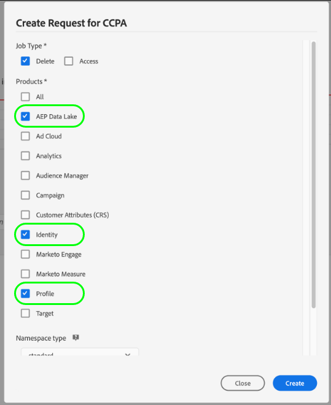

# 中的隱私權要求處理 [!DNL Real-Time Customer Profile]

Adobe Experience Platform [!DNL Privacy Service] 處理客戶要求存取、選擇退出銷售或刪除其隱私權法規(例如一般資料保護規範(GDPR))所規定之個人資料的請求，並 [!DNL California Consumer Privacy Act] (CCPA)。

本檔案涵蓋處理隱私權要求的相關基本概念 [!DNL Real-Time Customer Profile] 在Adobe Experience Platform。

>[!NOTE]
>
>本指南僅說明如何針對Experience Platform中的設定檔資料存放區提出隱私權要求。 如果您也打算提出Platform資料湖的隱私權要求，請參閱上的指南 [資料湖中的隱私權要求處理](../catalog/privacy.md) 除了本教學課程之外。
>
>如需如何為其他Adobe Experience Cloud應用程式提出隱私權要求的步驟，請參閱 [Privacy Service檔案](../privacy-service/experience-cloud-apps.md).

## 快速入門

本指南需要妥善了解下列項目 [!DNL Platform] 元件：

* [[!DNL Privacy Service]](../privacy-service/home.md):管理客戶在Adobe Experience Cloud應用程式中存取、選擇退出銷售或刪除其個人資料的請求。
* [[!DNL Identity Service]](../identity-service/home.md):通過跨裝置和系統橋接身分，解決客戶體驗資料分散帶來的根本難題。
* [[!DNL Real-Time Customer Profile]](home.md):根據來自多個來源的匯總資料，提供統一的即時消費者設定檔。

## 了解身分識別命名空間 {#namespaces}

Adobe Experience Platform [!DNL Identity Service] 橋接跨系統和裝置的客戶身分資料。 [!DNL Identity Service] uses **身分識別命名空間** 將身份值與其來源系統關聯，以提供其內容。 命名空間可代表一般概念，例如電子郵件地址（「電子郵件」），或將身分識別與特定應用程式建立關聯，例如Adobe Advertising Cloud ID(「AdCloud」)或Adobe Target ID(「TNTID」)。

Identity Service會維護全域定義（標準）和使用者定義（自訂）身分識別命名空間的存放區。 所有組織皆可使用標準命名空間（例如「電子郵件」和「ECID」），而您的組織也可以建立自訂命名空間，以符合其特定需求。

如需中身分識別命名空間的詳細資訊，請參閱 [!DNL Experience Platform]，請參閱 [身分命名空間概述](../identity-service/namespaces.md).

## 提交請求 {#submit}

以下各節將說明如何向 [!DNL Real-Time Customer Profile] 使用 [!DNL Privacy Service] API或UI。 閱讀這些章節之前，強烈建議您檢閱 [Privacy ServiceAPI](../privacy-service/api/getting-started.md) 或 [Privacy ServiceUI](../privacy-service/ui/overview.md) 說明檔案，以取得如何提交隱私權工作的完整步驟，包括如何在要求負載中正確格式化已提交的使用者身分資料。

>[!IMPORTANT]
>
>Privacy Service只能處理 [!DNL Profile] 使用不執行身分連結的合併原則的資料。 請參閱 [合併策略限制](#merge-policy-limitations) 以取得更多資訊。
>
>請注意，隱私權要求完成所花費的時間 **不能** 得到保證。 若您的 [!DNL Profile] 資料，而請求仍在處理中，則無法保證是否會處理這些記錄。

### 使用 API

在API中建立工作請求時， `userIDs` 必須使用特定 `namespace` 和 `type`. 有效 [身分命名空間](#namespaces) 確認 [!DNL Identity Service] 必須為 `namespace` 值，而 `type` 必須為 `standard` 或 `unregistered` （適用於標準和自訂命名空間）。

>[!NOTE]
>
>視身分圖表以及Platform資料集中設定檔片段的分送方式而定，您可能需要為每個客戶提供多個ID。 請參閱下一節 [設定檔片段](#fragments) 以取得更多資訊。

此外， `include` 要求裝載的陣列必須包含要提出要求之不同資料存放區的產品值。 若要刪除與身分相關聯的設定檔資料，陣列必須包含值 `ProfileService`. 若要刪除客戶的身分圖表關聯，陣列必須包含值 `identity`.

>[!NOTE]
>
>請參閱 [設定檔請求與身分請求](#profile-v-identity) 本檔案稍後會提供使用的效果的詳細資訊 `ProfileService` 和 `identity` 在 `include` 陣列。

下列要求會針對 [!DNL Profile] 儲存。 中為客戶提供兩個身分值，位於 `userIDs` 陣列；使用標準 `Email` 身分命名空間，以及使用自訂 `Customer_ID` 命名空間。 也包含 [!DNL Profile] (`ProfileService`) `include` 陣列：

**要求**

```shell
curl -X POST \
  https://platform.adobe.io/data/core/privacy/jobs \
  -H 'Authorization: Bearer {ACCESS_TOKEN}' \
  -H 'x-api-key: {API_KEY}' \
  -H 'x-gw-ims-org-id: {ORG_ID}' \
  -H 'Content-Type: application/json' \
  -d '{
    "companyContexts": [
      {
        "namespace": "imsOrgID",
        "value": "{ORG_ID}"
      }
    ],
    "users": [
      {
        "key": "user12345",
        "action": ["access","delete"],
        "userIDs": [
          {
            "namespace": "Email",
            "value": "ajones@acme.com",
            "type": "standard"
          },
          {
            "namespace": "Customer_ID",
            "value": "12345678",
            "type": "unregistered"
          }
        ]
      }
    ],
    "include": ["ProfileService","identity"],
    "expandIds": false,
    "priority": "normal",
    "regulation": "ccpa"
}'
```

>[!IMPORTANT]
>
>Platform可處理所有 [沙箱](../sandboxes/home.md) 屬於您的組織。 因此，任何 `x-sandbox-name` 系統會忽略請求中包含的標題。

**產品回應**

若為設定檔服務，一旦隱私權工作完成，會以JSON格式傳回回應，並附上所要求使用者ID的相關資訊。

```json
{
    "privacyResponse": {
        "jobId": "7467850f-9698-11ed-8635-355435552164",
        "response": [
            {
                "sandbox": "prod",
                "mergePolicyId": "none",
                "result": {
                    "person": {
                        "gender": "female"           
                    },
                    "personalEmail": {
                        "address": "ajones@acme.com",
                    },
                    "identityMap": {
                        "crmid": [
                            {
                                "id": "5b7db37a-bc7a-46a2-a63e-2cfe7e1cc068"
                            }
                        ]
                    }
                }
            },
            {
                "sandbox": "prod",
                "mergePolicyId": "none",
                "result": {
                    "person": {
                        "gender": "male"
                    },
                    "id": 12345678,
                    "identityMap": {
                        "crmid": [
                            {
                                "id": "e9d439f2-f5e4-4790-ad67-b13dbd89d52e"
                            }
                        ]
                    }
                }
            }
        ]
    }
}
```

### 使用UI

在UI中建立工作請求時，請務必選取 **[!UICONTROL AEP Data Lake]** 和/或 **[!UICONTROL 設定檔]** 在 **[!UICONTROL 產品]** 以處理資料湖或 [!DNL Real-Time Customer Profile]，分別為。



## 隱私權要求中的設定檔片段 {#fragments}

在 [!DNL Profile] 資料儲存，個別客戶的個人資料通常會由多個設定檔片段組成，這些片段會透過身分圖表與人員關聯。 向 [!DNL Profile] 儲存時，請務必注意，請求只會在設定檔片段層級處理，而非整個設定檔。

例如，假設您將客戶屬性資料儲存在三個不同的資料集中，這些資料集使用不同的識別碼將該資料與個別客戶建立關聯：

| 資料集名稱 | 主要身分欄位 | 儲存的屬性 |
| --- | --- | --- |
| 資料集1 | `customer_id` | `address` |
| 資料集2 | `email_id` | `firstName`、`lastName` |
| 資料集3 | `email_id` | `mlScore` |

其中一個資料集使用 `customer_id` 作為主要識別碼，而其他兩個則使用 `email_id`. 如果您只要使用 `email_id` 作為使用者ID值，僅 `firstName`, `lastName`，和 `mlScore` 屬性會處理，而 `address` 不會受到影響。

為確保您的隱私權要求可處理所有相關客戶屬性，您必須為所有可儲存屬性的適用資料集提供主要身分值（每位客戶最多9個ID）。 請參閱 [綱要構成基本知識](../xdm/schema/composition.md#identity) 以取得通常標示為身分之欄位的詳細資訊。

## 刪除請求處理 {#delete}

當 [!DNL Experience Platform] 從接收刪除請求 [!DNL Privacy Service], [!DNL Platform] 發送確認 [!DNL Privacy Service] 已收到請求，且受影響的資料已標示為刪除。 一旦隱私權工作完成，記錄便會移除。

視您是否也包含Identity Service(`identity`)和資料湖(`aepDataLake`)作為設定檔的隱私權要求中的產品(`ProfileService`)，則會在可能不同的時間從系統中移除與設定檔相關的不同資料集：

| 包含的產品 | 效果 |
| --- | --- |
| `ProfileService` 僅限 | 當Platform傳送確認已收到刪除請求時，設定檔會立即刪除。 不過，設定檔的身分圖仍會維持，且當擷取具有相同身分的新資料時，可能會重建設定檔。 與設定檔相關聯的資料也會保留在資料湖中。 |
| `ProfileService` 和 `identity` | 當Platform傳送確認已收到刪除請求時，會立即刪除設定檔及其相關身分圖表。 與設定檔相關聯的資料會保留在資料湖中。 |
| `ProfileService` 和 `aepDataLake` | 當Platform傳送確認已收到刪除請求時，設定檔會立即刪除。 不過，設定檔的身分圖仍會維持，且當擷取具有相同身分的新資料時，可能會重建設定檔。<br><br>當資料湖產品回應已接收請求且目前正在處理時，與設定檔相關聯的資料會遭軟刪除，因此任何設定檔都無法存取 [!DNL Platform] 服務。 完成工作後，資料會完全從資料湖中移除。 |
| `ProfileService`, `identity`, 和 `aepDataLake` | 當Platform傳送確認已收到刪除請求時，會立即刪除設定檔及其相關身分圖表。<br><br>當資料湖產品回應已接收請求且目前正在處理時，與設定檔相關聯的資料會遭軟刪除，因此任何設定檔都無法存取 [!DNL Platform] 服務。 完成工作後，資料會完全從資料湖中移除。 |

請參閱 [[!DNL Privacy Service] 檔案](../privacy-service/home.md#monitor) 以取得追蹤工作狀態的詳細資訊。

### 設定檔請求與身分請求 {#profile-v-identity}

如果對設定檔提出刪除請求(`ProfileService`)，但不包括Identity Service(`identity`)，則產生的工作會移除客戶（或一組客戶）所收集的屬性資料，但不會移除在身分圖中建立的關聯。

例如，使用客戶 `email_id` 和 `customer_id` 移除儲存在這些ID下的所有屬性資料。 不過，之後擷取的任何資料會依 `customer_id` 仍會與適當 `email_id`，因為關聯仍然存在。

若要移除指定客戶的設定檔和所有身分關聯，請務必在刪除請求中同時納入設定檔和身分識別服務作為目標產品。

### 合併策略限制 {#merge-policy-limitations}

Privacy Service只能處理 [!DNL Profile] 使用不執行身分連結的合併原則的資料。 如果您使用UI來確認是否正在處理您的隱私權要求，請確定您使用的原則包含 **[!DNL None]** as [!UICONTROL ID匯整] 類型。 換句話說，您無法使用合併原則， [!UICONTROL ID匯整] 設為 [!UICONTROL 專用圖表].
>
>
## 後續步驟

閱讀本檔案後，您便了解處理隱私權要求的重要概念，如 [!DNL Experience Platform]. 若要加深您對如何管理身分資料和建立隱私權工作的了解，請繼續閱讀本指南中提供的檔案。

如需處理的隱私權要求的相關資訊，請參閱 [!DNL Platform] 未使用的資源 [!DNL Profile]，請參閱 [資料湖中的隱私權要求處理](../catalog/privacy.md).
