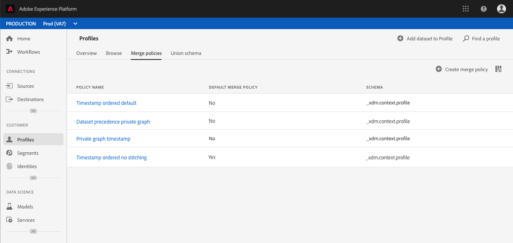

# 合併策略使用手冊

Adobe Experience Platform可讓您從多個來源匯整資料並加以匯整，以全面瞭解每個客戶。 將這些資料整合在一起時，合併原則是用來決定 [!DNL Platform] 資料的優先順序以及將哪些資料合併以建立該統一檢視的規則。

使用REST風格的API或用戶介面，您可以建立新的合併策略、管理現有策略，並為組織設定預設的合併策略。 本指南提供使用Adobe Experience Platform使用者介面處理合併原則的逐步指示。

如果您希望使用 [!DNL Real-time Customer Profile] API處理合併策略，請遵循合併策略API教 [程中的說明](../api/merge-policies.md)。

## 快速入門

本指南要求對合併策略所涉及的各 [!DNL Experience Platform] 種服務有充分的瞭解。 在開始本教學課程之前，請先閱讀下列服務的檔案：

* [[!DNL即時客戶基本資料]](../home.md):根據來自多個來源的匯整資料，提供統一、即時的消費者個人檔案。
* [[!DNL Identity Service]](../../identity-service/home.md):可借 [!DNL Real-time Customer Profile] 由橋接來自不同資料來源的身分識別，並將之收錄在 [!DNL Platform]中。
* [[!DNL體驗資料模型(XDM)]](../../xdm/home.md):組織客戶體驗資料 [!DNL Platform] 的標準化架構。

## 查看合併策略

在用戶 [!DNL Experience Platform] 介面中，您可以開始使用合併策略，然後通過在左側導軌中選擇「配置檔案」( **[!UICONTROL Profiles]** )，然後選擇「合併策略」( **[!UICONTROL Merge policies]** )頁籤，查看組織現有合併策略的清單。

在登陸頁面上會顯示組織可用之每個合併原則的詳細資訊，包括「原則名稱 [!UICONTROL 」、「]預設合併原則 [!UICONTROL 」和「]架構 」。

要選擇顯示哪些詳細資訊，或向顯示添加其他列，請選擇列選擇器表徵圖，然後按一下列名以添加或從視圖中刪除列。

## 建立合併策略

要建立新的合併策略，請選擇「創 **[!UICONTROL 建合併策略」]**。

此時 **[!UICONTROL 會出現「建立合併原則]** 」畫面，可讓您提供新合併原則的重要資訊。

* **[!UICONTROL 名稱]**:合併策略的名稱應具有描述性，但應簡明扼要。
* **[!UICONTROL 架構]**:與合併策略關聯的架構。 這指定為其建立此合併策略的XDM模式。 組織可以為每個方案建立多個合併策略。
* **[!UICONTROL ID拼接]**:此欄位定義如何確定客戶的相關身份。 有兩個可能的值：
   * **[!UICONTROL 無]**:不執行身份聯繫。
   * **[!UICONTROL 專用圖]**:根據您的個人身分圖表執行身分識別接合。
* **[!UICONTROL 屬性合併]**:描述檔片段包含個別客戶現有身分清單中只有一個身分的資訊。 當使用身份圖形類型導致多個身份時，可能會出現衝突的配置檔案屬性，必須指定優先順序。 使用 [!UICONTROL 屬性合併] ，可以指定在鍵值（記錄資料）類型資料集之間發生合併衝突時要優先排序的資料集配置檔案值。 有兩個可能的值：
   * **[!UICONTROL 排序時間戳]**:發生衝突時，會優先處理最近更新的描述檔。 [!UICONTROL 排序的時間戳] ，也支援自訂時間戳記，當合併相同資料集（多重身分）或跨資料集的資料時，這些時間戳記優先於系統時間戳記。 如需詳細資訊，請參 [閱後續的時間戳](#timestamp-ordered) 「順序」一節。
   * **[!UICONTROL 資料集優先順序]** :在發生衝突時，請根據個人資料片段的來源資料集，優先處理其片段。 選擇此選項時，必須選擇相關資料集及其優先順序順序。 如需詳細資訊，請參 [閱以下資料集](#dataset-precedence) 優先順序的詳細資訊。
* **[!UICONTROL 預設合併策略]**:切換按鈕，可讓您選擇此合併原則是否為您組織的預設原則。 如果選擇器已開啟且新原則已儲存，您先前的預設原則會自動更新為不再為預設原則。

### 排序時間戳記 {#timestamp-ordered}

當描述檔記錄被收錄到Experience Platform中時，系統會在擷取時取得系統時間戳記並新增至記錄。 當選 [!UICONTROL 擇Timestamp ordered] (有序時間戳 [!UICONTROL )作為合併策略的Attribute merge] type（屬性合併類型）時，將根據系統時間戳合併配置檔案。 換言之，合併是根據記錄被收錄到平台的時間戳記進行。

有時，有時需要提供自訂時間戳記，並讓合併原則遵循自訂時間戳記，而非系統時間戳記的使用情形。 例如，回填資料或在記錄未依順序收錄時，確保事件順序正確。

>[!NOTE]
>
>此功能僅可用於跨資料集的提取。 如果記錄是使用相同的資料集擷取，則會發生預設取代行為。

### 使用自訂時間戳記 {#custom-timestamps}

為了使用自定義時間戳記，必須將 [!UICONTROL External Source System Audit Details Mixin] 添加到您的Profile架構中。 新增後，可使用欄位填入自訂時間 `lastUpdatedDate` 戳記。

當記錄已填入欄位時， `lastUpdatedDate` Experience Platform會使用該欄位來合併資料集上的記錄。 如果 `lastUpdatedDate` 未顯示或未填入，平台將繼續使用系統時間戳記。

>[!NOTE]
>
>您必須確保在同 `lastUpdatedDate` 一記錄上接收更新時填入時間戳記。

以下螢幕抓圖顯示「外部源系統 [!UICONTROL 審計詳細資訊混合」中的欄位]。 有關使用UI使用架構（包括如何將混合新增至架構）的逐步指示，請造訪使用UI [建立架構的教學課程](../../xdm/tutorials/create-schema-ui.md)。

若要使用API使用自訂時間戳記，請參閱合併原則端點指南的「附 [錄」](../api/merge-policies.md) ，以及使用自訂時 [間戳記的章節](../api/merge-policies.md#custom-timestamps)。

### 資料集優先順序 {#dataset-precedence}

在選擇屬 [!UICONTROL 性合併值時] ，可以選擇 [!UICONTROL Dataset優先順序] ，該優先順序允許您根據配置檔案片段的來源資料集為它們指定優先順序。

例如，如果貴組織在一個資料集中顯示的資訊比另一個資料集中的資料更偏好或受信任，則使用案例會是範例。

選擇數 [!UICONTROL 據集優先順序]，將開啟一個單獨的面板，要求您從可用資料集中選擇將包含哪些資料集  （或使用複選框選擇所有資料集）。 然後，您可以將這些資料集拖放到「選定的 [!UICONTROL 資料集] 」面板中，並將它們拖放到正確的優先順序順序中。 優先順序最高的資料集、次優的資料集等。

建立完合併策略後，選擇「 **[!UICONTROL Save]** 」（保存）返回「 [!UICONTROL Merge policies] 」（合併策略）頁籤，新合併策略現在出現在策略清單中。

## 編輯合併原則

通過選擇要編輯的合併策略的「策略名 [!UICONTROL 稱」] ，可以通過「合併策略 **** 」頁籤修改現有的合併策略。

當出現「 **[!UICONTROL Edit merge policy]** 」(編輯合併策略 [!UICONTROL )螢幕時，您可以對]Name [!UICONTROL 、]Name [!UICONTROL 、] Intring、ID Attribute MergeType以及選擇此策略是否將Oracle Contring Plicy Merge策略合併到您組織的Adobic。

>[!NOTE]
>
>您無法編輯合併策略ID，如編輯螢幕頂部所示。 這是唯讀、系統產生的ID，無法變更。

完成必要的更改後，選擇「保 **[!UICONTROL 存]** 」返回「合併策略  」頁籤，此時將顯示更新的合併策略資訊。

## 違反資料治理政策

建立或更新合併策略時，會執行檢查以確定合併策略是否違反您組織定義的任何資料使用策略。 資料使用政策是Adobe Experience Platform的一部分， [!DNL Data Governance] 是描述您可對特定資料執行或受限制之行銷動作類型的規 [!DNL Platform] 則。 例如，如果合併策略用於建立激活到第三方目標的段，而您的組織有阻止將特定資料導出到第三方的資料使用策略，則在嘗試保存合併策略時，您會收到「檢測到[!UICONTROL Data governance policy violation]」通知。

此通知包括已違反的資料使用策略清單，允許您通過從清單中選擇策略來查看違規的詳細資訊。 在選擇違反的策略時，「資料世系 [!UICONTROL 」頁籤提供違規原因和「受影響」激活]，每個頁籤都提供了違反資料使用策略的詳細資訊。

若要進一步瞭解如何在Adobe Experience Platform中執行資料治理，請先閱讀資料治 [理概觀](../../data-governance/home.md)。

## 後續步驟

現在，您已為IMS組織建立並設定合併原則，您可以使用這些原則從個人檔案資料建立觀眾區段。 如需如何 [建立和使用區段的詳細資訊](../../segmentation/home.md) ，請參閱區段概述 [!DNL Experience Platform]。