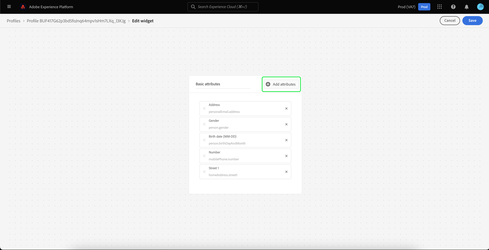
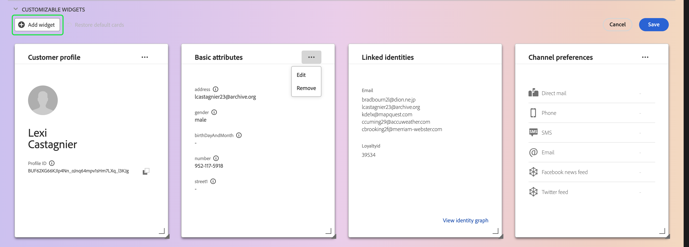

# [!DNL Real-time Customer Profile] 詳細自訂 {#profile-detail-customization}

在Adobe Experience Platform使用者介面中，您可以檢視並與 [!DNL Real-time Customer Profile] 以客戶設定檔形式呈現資料。 UI中顯示的設定檔資訊已從多個設定檔片段合併在一起，以形成每個個別客戶的單一檢視。 這包括基本屬性、連結身分和通道偏好設定等詳細資訊。 設定檔中顯示的預設欄位也可在組織層級變更，以顯示偏好的欄位 [!DNL Profile] 屬性。 本指南提供逐步指示，自訂 [!DNL Profile] 資料會顯示在Platform UI中。

如需設定檔UI的完整指南，請造訪 [設定檔UI指南](user-guide.md).

## 重新排序卡片並調整卡片大小 {#reorder-and-resize-cards}

從 **[!UICONTROL 詳細資料]** 頁簽，您可以選取 **[!UICONTROL 自訂設定檔詳細資訊]** 以調整現有卡片的大小並重新排序。

選擇修改控制面板後，您可以選取卡片標題，然後將卡片拖曳至所需順序，重新排序卡片。 您也可以選取資訊卡右下角的角度符號(`⌟`)，並將卡片拖曳至所需大小。 在此範例中， **[!UICONTROL 基本屬性]** 卡正在調整大小。

所選卡片調整到所需大小，並動態地重新定位周圍的卡片。 這可能會導致某些卡片移至其他列，需要您向下捲動才能查看所有卡片。 例如，當[!UICONTROL 基本屬性]「 」卡的大小已調整為「[!UICONTROL 連結的身分]「卡片不再顯示在頂端列，現在會顯示在設定檔內的新第二列（未顯示）。 若要傳回「[!UICONTROL 連結的身分]「 」卡片至頂端列，您可將其拖放至「 」的目前位置[!UICONTROL 管道偏好設定]」卡。

## 編輯和移除資訊卡

除了調整卡片大小和重新排序外，您還可以編輯特定卡片的內容，並從控制面板中完全移除某些卡片。 選取點(`...`)，以編輯或移除資訊卡。 這會開啟下拉式清單，其中包含根據所選卡片的屬性，可編輯或移除卡片的選項。

>[!NOTE]
>
>並非所有卡片都可以編輯或移除。 這是因為某些卡片包含唯讀或必要的資訊。 如果卡片右上角沒有點，則會包含唯讀的AND必要資訊，且無法編輯，也無法移除。 如果卡片的角落有點，選取時只會顯示移除卡片的選項，卡片資訊為唯讀狀態，無法編輯。

選擇 **[!UICONTROL 編輯]** 在下拉式清單中，開啟 **[!UICONTROL 編輯介面工具集]** 工作區，您可以在此更新卡片標題、重新排序或移除可見屬性，或使用 **[!UICONTROL 新增屬性]** 按鈕。

## 新增屬性 {#add-attributes}

從 **[!UICONTROL 編輯介面工具集]** 螢幕，選擇 **[!UICONTROL 新增屬性]** 在卡片的右上角，以開始將屬性新增至該卡片。

當 **[!UICONTROL 選擇聯合架構欄位]** 對話框開啟，對話框的左側顯示完整 [!UICONTROL XDM個別設定檔] 聯合架構，下面嵌套了欄位。 如需聯合結構的詳細資訊，請參閱 [聯合結構區段 [!DNL Profile] 使用手冊](user-guide.md#union-schema).

此 **[!UICONTROL 所選屬性]** 對話框右側的部分顯示當前包含在您正在編輯的卡中的屬性。 您也可以在此處移除和重新排序屬性。 顯示所選屬性的總數，以及可新增至單一卡片的屬性數上限(20)。

您可以選取任何可用的聯合結構欄位，以自訂您正在編輯之卡片上的屬性。 選定欄位旁會顯示複選標籤，並自動新增至選定屬性清單。 新增您要在資訊卡上顯示的所有屬性後，請選擇 **[!UICONTROL 選擇]** 返回 **[!UICONTROL 編輯介面工具集]** 螢幕。

當您返回 **[!UICONTROL 編輯介面工具集]** 畫面中，卡片上的屬性清單現在應更新以反映您的選擇。 您仍可以移除或重新排序卡片屬性，或視需要編輯卡片標題。 完成編輯後，選取 **[!UICONTROL 儲存]** 來儲存變更。

儲存後，您會傳回至 **[!UICONTROL 詳細資料]** 標籤中顯示更新的卡片和屬性。

## 新增資訊卡 {#add-a-new-card}

若要進一步自訂Experience Platform內設定檔的外觀，您可以選取將新卡片新增至控制面板，並選取您要在這些卡片上顯示的屬性。 若要開始，請選取 **[!UICONTROL 修改控制面板]** 在 **[!UICONTROL 詳細資料]** 標籤。

下一步，選擇 **[!UICONTROL 新增介面工具集]** 在控制面板的左上角。

選擇新增資訊卡會開啟 **[!UICONTROL 編輯介面工具集]** 畫面，您可以提供新卡片的標題，並選擇您希望卡片顯示的屬性。 若要開始將屬性新增至卡片，請選取 **[!UICONTROL 新增屬性]**.

當 **[!UICONTROL 選擇聯合架構欄位]** 對話框開啟，對話框的左側顯示完整 [!UICONTROL XDM個別設定檔] 聯合架構和 **[!UICONTROL 所選屬性]** 對話框右側的部分顯示您為卡片選擇的屬性。 如需新增屬性的詳細資訊，請參閱 [新增屬性一節](#add-attributes) 顯示在本文檔前面。

顯示所選屬性的總數，以及可新增至單一卡片的屬性數上限(20)。 您也可以從此畫面移除和重新排序您選取的屬性。 新增您要在資訊卡上顯示的所有屬性後，請選擇 **[!UICONTROL 選擇]** 返回 **[!UICONTROL 編輯介面工具集]** 螢幕。

當您返回 **[!UICONTROL 編輯介面工具集]** 畫面中，卡片上的屬性清單應會反映您在上一個畫面中的選擇。 您也可以視需要重新排序及移除卡片屬性。

若要儲存新資訊卡，您必須先提供 **[!UICONTROL 卡片標題]**，則您可以選取 **[!UICONTROL 儲存]** 並完成卡片建立程式。

儲存後，您會傳回至 **[!UICONTROL 詳細資料]** 索引標籤中顯示新卡片和屬性。

## 還原預設卡

如果您隨時決定要還原已移除的預設卡片，便能快速輕鬆地還原。 首先，選取 **[!UICONTROL 修改控制面板]**，然後選取 **[!UICONTROL 還原預設卡]**. 顯示預設卡片後，您可以選取 **[!UICONTROL 儲存]** 保存更改或選擇 **[!UICONTROL 取消]** 如果您不想還原預設卡片。

## 後續步驟

依照本檔案操作，您現在應該可以更新組織的設定檔檢視，包括新增和移除卡片、編輯卡片詳細資訊和屬性，以及重新排序和調整卡片大小。 若要進一步了解如何使用 [!DNL Profile] Experience PlatformUI中的資料，請參閱 [[!DNL Profile] 使用手冊](user-guide.md).
