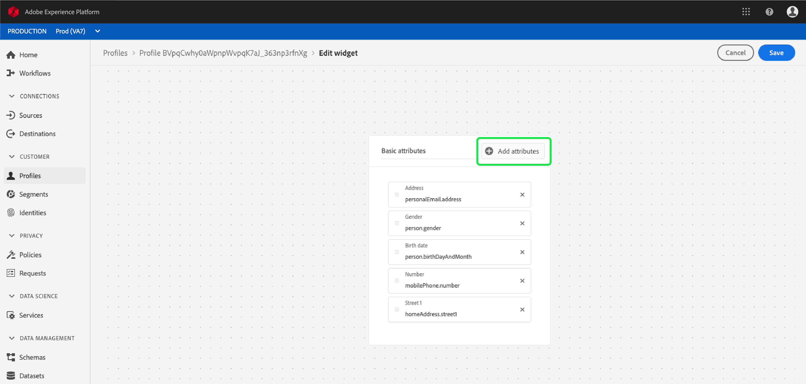
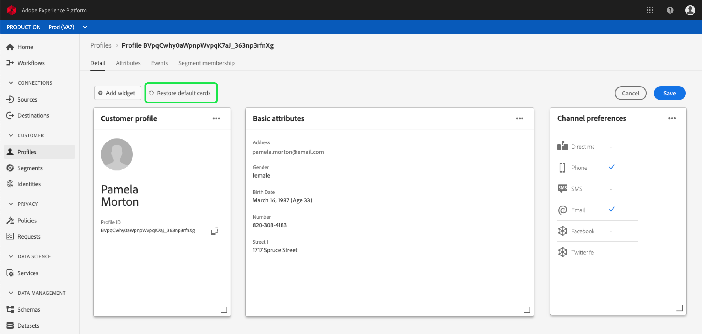

# [!DNL Real-time Customer Profile] 詳細定制  {#profile-detail-customization}

在Adobe Experience Platform用戶介面中，您可以以客戶個人檔案的形式查看並與[!DNL Real-time Customer Profile]資料交互。 UI中顯示的描述檔資訊已從多個描述檔片段合併在一起，以形成每個客戶的單一檢視。 這包括基本屬性、連結身分和頻道偏好設定等詳細資訊。 配置檔案中顯示的預設欄位也可以在組織級別更改，以顯示首選的[!DNL Profile]屬性。 本指南提供逐步說明，以自訂在平台UI中顯示[!DNL Profile]資料的方式。

如需描述檔UI的完整指南，請造訪[描述檔UI指南](user-guide.md)。

## 重新排序卡片並調整卡片大小{#reorder-and-resize-cards}

從客戶設定檔的&#x200B;**[!UICONTROL Detail]**&#x200B;標籤中，您可以選取&#x200B;**[!UICONTROL Modify dashboard]**，以調整現有卡片的大小並重新排序。

在選擇修改控制面板後，您可以選取卡片標題並將卡片拖放至所需順序，以重新排序卡片。 您也可以選取卡片右下角的角度符號(`⌟`)，並將卡片拖曳至所需的大小，以調整卡片的大小。 在此範例中，**[!UICONTROL Basic attributes]**&#x200B;卡會重新調整大小。

所選卡片調整為所需大小，並動態地重新定位周圍的卡片。 這可能會導致某些卡片移至其他列，因此您必須向下捲動才能查看所有卡片。 例如，當&quot;[!UICONTROL Basic attributes]&quot;卡片重新調整大小時，&quot;[!UICONTROL Linked identities]&quot;卡片不再顯示在頂端列上，現在會顯示在描述檔中的新第二列上（未顯示）。 若要將&quot;[!UICONTROL Linked identities]&quot;卡傳回至最上方列，您可將它拖放至&quot;[!UICONTROL Channel preferences]&quot;卡的目前位置。

## 編輯和移除卡片

除了調整卡片大小和重新排序外，您還可以編輯特定卡片的內容，並完全從控制面板移除某些卡片。 選取卡片右上角的省略號(`...`)以進行編輯或移除。 這會開啟下拉式清單，其中包含編輯或移除卡片的選項，視所選卡片的屬性而定。

>[!NOTE]
>
>並非所有卡片都可以編輯或移除。 這是因為有些卡片包含唯讀或必要的資訊。 如果卡片的右上角沒有橢圓形，它會包含唯讀AND必要資訊，而且無法編輯，也無法移除。 如果卡片的角落有橢圓形，並選取它時，只會顯示移除卡片的選項，卡片資訊是唯讀的，無法編輯。

在下拉式清單中選取&#x200B;**[!UICONTROL Edit]**&#x200B;以開啟&#x200B;**[!UICONTROL Edit widget]**&#x200B;工作區，您可在此處更新卡片標題、重新排序或移除可見屬性，或使用&#x200B;**[!UICONTROL Add attributes]**&#x200B;按鈕新增其他屬性。

## 添加屬性{#add-attributes}

從卡片右上角的&#x200B;**[!UICONTROL Edit widget]**&#x200B;畫面中，選擇&#x200B;**[!UICONTROL Add attributes]**&#x200B;以開始新增屬性至該卡片。

當&#x200B;**[!UICONTROL Select union schema field]**&#x200B;對話方塊開啟時，對話方塊的左側會顯示完整的[!UICONTROL XDM Individual Profile]結合架構，其下方會嵌入欄位。 有關聯合架構的詳細資訊，請參閱 [!DNL Profile] 使用手冊](user-guide.md#union-schema)的[聯合架構部分。

對話框右側的&#x200B;**[!UICONTROL Selected Attributes]**&#x200B;部分顯示當前包含在您正在編輯的卡片中的屬性。 您也可以在這裡移除和重新排序屬性。 顯示所選屬性的總數，以及可添加到單張卡的最大屬性數(20)。

您可以選擇任何可用的聯合架構欄位，以自定義正在編輯的卡上的屬性。 選定欄位旁帶有複選標籤，並自動添加到選定屬性的清單中。 新增您要在資訊卡上顯示的所有屬性後，選擇&#x200B;**[!UICONTROL Select]**&#x200B;以返回至&#x200B;**[!UICONTROL Edit widget]**&#x200B;畫面。

當您返回&#x200B;**[!UICONTROL Edit widget]**&#x200B;畫面時，現在應更新卡片上的屬性清單，以反映您的選擇。 您仍可以移除或重新排序卡片屬性，或視需要編輯卡片標題。 編輯完成後，選擇&#x200B;**[!UICONTROL Save]**&#x200B;以儲存變更。

儲存後，您會返回至&#x200B;**[!UICONTROL Detail]**&#x200B;標籤，其中會顯示更新的卡片和屬性。

## 新增卡片{#add-a-new-card}

若要進一步自訂Experience Platform中描述檔的外觀，您可以選擇將新卡片新增至控制面板，並選取您要在這些卡片上顯示的屬性。 首先，在&#x200B;**[!UICONTROL Detail]**&#x200B;頁籤上選擇&#x200B;**[!UICONTROL Modify dashboard]**。

接著，選取控制面板左上角的&#x200B;**[!UICONTROL Add widget]**。

選擇新增卡片會開啟&#x200B;**[!UICONTROL Edit widget]**&#x200B;畫面，您可在其中提供新卡片的標題，並選擇您要顯示卡片的屬性。 要開始向卡中添加屬性，請選擇&#x200B;**[!UICONTROL Add attributes]**。

當&#x200B;**[!UICONTROL Select union schema field]**&#x200B;對話方塊開啟時，對話方塊的左側會顯示完整的[!UICONTROL XDM Individual Profile]結合架構，而對話方塊右側的&#x200B;**[!UICONTROL Selected Attributes]**&#x200B;區段會顯示您為卡片選取的屬性。 有關添加屬性的詳細資訊，請參閱本文檔前面顯示的有關添加屬性](#add-attributes)的[部分。

顯示所選屬性的總數，以及可添加到單張卡的最大屬性數(20)。 您也可以從此畫面移除和重新排序選取的屬性。 新增您想要顯示在資訊卡上的所有屬性後，選擇&#x200B;**[!UICONTROL Select]**&#x200B;以返回至&#x200B;**[!UICONTROL Edit widget]**&#x200B;畫面。

當您返回&#x200B;**[!UICONTROL Edit widget]**&#x200B;畫面時，卡片上的屬性清單應會反映您在上一畫面中的選擇。 您也可以視需要重新排序及移除卡片屬性。

若要儲存新卡片，您必須先提供&#x200B;**[!UICONTROL Card title]**，然後您就可以選取&#x200B;**[!UICONTROL Save]**&#x200B;並完成卡片建立程式。

儲存後，您會返回至&#x200B;**[!UICONTROL Detail]**&#x200B;標籤，其中會顯示新卡片和屬性。

## 還原預設卡片

如果您決定要復原已移除的預設卡片，則可快速輕鬆地完成。 首先，選擇&#x200B;**[!UICONTROL Modify dashboard]**，然後選擇&#x200B;**[!UICONTROL Restore default cards]**。 顯示預設卡片後，您可以選擇&#x200B;**[!UICONTROL Save]**&#x200B;保存更改，或者選擇&#x200B;**[!UICONTROL Cancel]**（如果不希望恢復預設卡片）。

## 後續步驟

遵循本檔案，您現在應該可以更新組織的描述檔檢視，包括新增和移除卡片、編輯卡片詳細資料和屬性，以及重新排序和調整卡片大小。 若要進一步瞭解如何在Experience PlatformUI中使用[!DNL Profile]資料，請參閱[[!DNL Profile] 使用指南](user-guide.md)。
