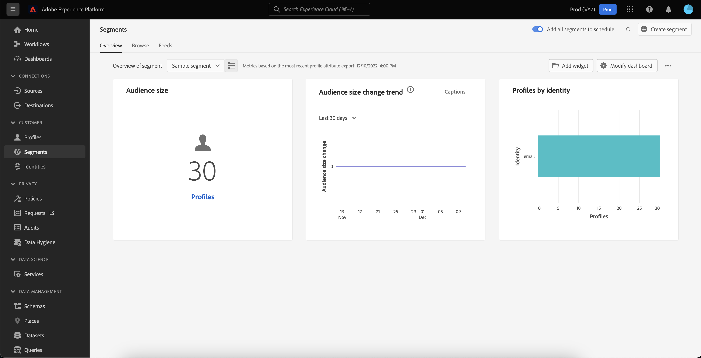

# (Alpha)[!DNL Real-time Customer Profile]控制面板{#profile-dashboard}

>[!IMPORTANT]
>
>本檔案中概述的控制面板功能目前為alpha版，並非所有使用者都能使用。 文件和功能可能會有所變更。

Adobe Experience Platform使用者介面(UI)提供控制面板，您可透過此控制面板檢視有關[!DNL Real-time Customer Profile]資料的重要資訊，如每日快照中所擷取。 本指南概述如何存取和使用UI中的[!DNL Profile]控制面板，並提供有關控制面板中顯示的度量的詳細資訊。

如需Experience Platform使用者介面中所有描述檔功能的概述，請造訪[即時客戶描述檔UI指南](user-guide.md)。

## 描述檔控制面板資料

「描述檔」控制面板會顯示您組織在Experience Platform的「描述檔儲存區」中擁有的屬性（記錄）資料快照。 快照不包含任何事件（時間系列）資料。

快照中的屬性資料與拍攝快照時在特定時間點顯示的資料完全相同。 換言之，快照不是資料的近似值或範例，而「描述檔」控制面板不會即時更新。

>[!NOTE]
>
>自快照建立以來對資料所做的任何變更或更新，在下一個快照建立之前，不會反映在控制面板中。

「描述檔」控制面板中顯示的量度是根據您組織的預設合併原則。 有關合併策略以及如何選擇或更改預設合併策略的詳細資訊，請訪問[合併策略UI指南](merge-policies.md)。

## 探索描述檔控制面板

若要導覽至平台UI中的「描述檔」控制面板，請在左側導軌中選取&#x200B;**[!UICONTROL Profiles]**，然後選取&#x200B;**[!UICONTROL Overview]**&#x200B;標籤以顯示控制面板。

### Widget和量度

控制面板由widget組成，widget是唯讀量度，提供您描述檔資料的重要資訊。 介面工具集上的「上次更新」日期和時間會顯示資料的最後快照拍攝時間。

## 可用的Widget

Experience Platform提供多個Widget，您可使用這些Widget來視覺化與您的描述檔資料相關的不同量度。 選取下方介面工具集的名稱，以瞭解更多：

* [[!UICONTROL 受眾規模]](#audience-size)
* [[!UICONTROL 依命名空間劃分的描述檔]](#profiles-by-namespace)

### [!UICONTROL 受眾規模] {#audience-size}

**[!UICONTROL 觀眾大小]**&#x200B;介面工具集顯示拍攝快照時，描述檔資料儲存區內合併的描述檔總數。 此數字是貴組織預設的合併原則套用至您的描述檔資料的結果，以便將描述檔片段合併為每個個人組成單一描述檔。

有關片段和合併配置檔案的詳細資訊，請首先閱讀[配置檔案概述](../home.md)的&#x200B;*配置檔案片段與合併配置檔案*&#x200B;部分。

>[!NOTE]
>
>用於計算此度量的合併原則與用於計算[!UICONTROL 授權使用]控制面板中[!UICONTROL 可定址對象]的系統產生的合併原則不同，因此[!DNL Profile]和[!UICONTROL 授權使用]控制面板中的對象計數不太可能完全相同。

### [!UICONTROL 依命名空間劃分的描述檔] {#profiles-by-namespace}

**[!UICONTROL Profiles by namespace]**&#x200B;介面工具集顯示Profile儲存中所有合併配置檔案的命名空間劃分。 按[!UICONTROL ID namespace]（換言之，將每個名稱空間顯示的值相加）列出的配置檔案總數將始終高於合併配置檔案總數，因為一個配置檔案可能有多個與其關聯的命名空間。 例如，如果客戶在多個通道上與您的品牌互動，則多個名稱空間將與該個別客戶關聯。

若要進一步瞭解身分名稱空間，請造訪[Adobe Experience Platform Identity Service檔案](../../identity-service/home.md)。

## 其他控制面板

Platform UI提供其他控制面板，以在Experience Platform中檢視資料的快照。 這些儀表板包括區段和授權使用。 如需這些額外控制面板的詳細資訊，請從下列連結中選取：

* [區段控制面板](../../segmentation/ui/segment-dashboard.md)
* [授權使用儀表板](../../landing/license-usage-dashboard.md)

## 後續步驟

遵循本檔案，您現在應該可以找到描述檔控制面板，並瞭解可用Widget中顯示的量度。 若要進一步瞭解如何在Experience Platform UI中使用[!DNL Profile]資料，請參閱[[!DNL Profile] UI指南](user-guide.md)。