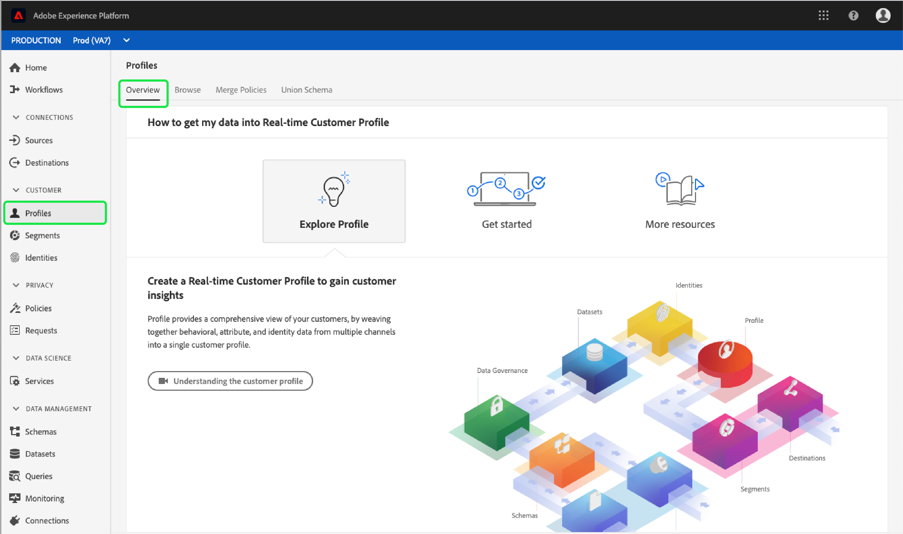

# [!DNL Real-time Customer Profile] UI指南

[!DNL Real-time Customer Profile] 建立個別客戶的全方位檢視，結合來自多個通道的資料，包括線上、離線、CRM和協力廠商資料。本檔案可做為在Adobe Experience Platform使用者介面(UI)中與[!DNL Real-time Customer Profile]資料互動的指南。

## 快速入門

本UI指南需要瞭解與管理[!DNL Real-time Customer Profiles]相關的各種[!DNL Experience Platform]服務。 在閱讀本指南或在UI中工作之前，請先閱讀下列服務的檔案：

* [[!DNL Real-time Customer Profile]](../home.md):根據來自多個來源的匯整資料，提供統一、即時的消費者個人檔案。
* [[!DNL Identity Service]](../../identity-service/home.md):可在 [!DNL Real-time Customer Profile] 不同資料來源的身分被吸收時，橋接其身分 [!DNL Platform]。
* [[!DNL Experience Data Model (XDM)]](../../xdm/home.md):組織客戶體驗資 [!DNL Platform] 料的標準化架構。

## 概述

在Experience PlatformUI中，選擇左側導覽中的&#x200B;**[!UICONTROL Profiles]**&#x200B;以開啟&#x200B;**[!UICONTROL Overview]**&#x200B;標籤。 此標籤提供檔案和影片的連結，以協助您瞭解並開始使用描述檔。

### (Alpha)描述檔控制面板

>[!IMPORTANT]
>
>控制面板功能目前為alpha版，並非所有使用者都能使用。 文件和功能可能會有所變更。

對於某些使用者，在左側導覽中選取&#x200B;**[!UICONTROL Profiles]**&#x200B;並開啟&#x200B;**[!UICONTROL Overview]**&#x200B;標籤時，會提供儀表板，其中概述與您的描述檔資料相關的關鍵量度。

若要進一步瞭解，請造訪[描述檔儀表板指南](profile-dashboard.md)。

## 瀏覽

選擇&#x200B;**[!UICONTROL Browse]**&#x200B;頁籤，以按身份瀏覽配置檔案。

### 描述檔度量{#profile-metrics}

在&#x200B;**[!UICONTROL Browse]**&#x200B;標籤的右側是幾個與您的描述檔資料相關的重要度量，包括您的描述檔總數，以及依namespace](#profiles-by-namespace)列出的[描述檔。

這些描述檔度量會使用您組織的預設合併原則來評估。 有關使用合併策略的詳細資訊，包括如何定義預設合併策略，請參閱[合併策略使用手冊](merge-policies.md)。

除了這些量度外，描述檔量度區段還提供上次更新的日期和時間，顯示上次評估量度的時間。

### 配置檔案計數{#profile-count}

配置檔案計數顯示組織在[!DNL Experience Platform]內擁有的配置檔案總數，此前您組織的預設合併策略已將配置檔案片段合併在一起，以便為每個客戶形成單個配置檔案。 換言之，您的組織可能有多個與跨不同通道與品牌互動的單一客戶相關的描述檔片段，但這些片段會合併在一起（根據預設合併政策），並會傳回「1」個描述檔計數，因為這些片段都與同一個人相關。

描述檔計數還包括具有屬性（記錄資料）的描述檔，以及僅包含時間系列（事件）資料的描述檔，例如Adobe Analytics描述檔。 設定檔計數會定期重新整理，以提供平台內設定檔的最新總數。

當將記錄提取到[!DNL Profile]儲存中時，將計數增加或減少5%以上，將觸發作業以更新計數。 對於串流資料工作流程，會每小時檢查一次，以判斷是否符合5%增加或減少臨界值。 如果已觸發，則會自動觸發作業以更新描述檔計數。 對於批處理，在成功將批處理到配置檔案儲存的15分鐘內，如果達到5%增加或減少閾值，則運行作業以更新配置檔案計數。

### 按名稱空間{#profiles-by-namespace}的配置式

**[!UICONTROL Profiles by namespace]**&#x200B;量度會顯示描述檔商店中所有合併描述檔的名稱空間總數和劃分。 依名稱空間劃分的描述檔總數（換言之，將每個名稱空間顯示的值加在一起）將永遠高於描述檔計數量度，因為一個描述檔可能有多個與其關聯的名稱空間。 例如，如果客戶在多個通道上與您的品牌互動，則多個名稱空間將與該個別客戶關聯。

與[描述檔計數](#profile-count)量度類似，當將記錄擷取至[!DNL Profile]儲存區時，將計數增加或減少超過5%時，觸發工作以更新命名空間量度。 對於串流資料工作流程，會每小時檢查一次，以判斷是否符合5%增加或減少臨界值。 如果已觸發，則會自動觸發作業以更新描述檔計數。 對於批處理，在成功將批處理裝入[!DNL Profile]儲存的15分鐘內，如果達到5%增加或減少閾值，則運行作業以更新度量。

### 合併原則

**[!UICONTROL Merge policy]**&#x200B;選擇器會自動為您的組織選擇預設的合併策略。 如果您不想使用該合併策略，可以選擇預設合併策略旁的`X`以開啟&#x200B;**[!UICONTROL Select merge policy]**&#x200B;對話框，您可以在其中選擇其他合併策略。

要瞭解有關合併策略及其在平台中的角色的更多資訊，請參閱[合併策略UI指南](merge-policies.md)。

### 身分命名空間

**[!UICONTROL Identity namespace]**&#x200B;選擇器將開啟一個對話框，您可以在其中選擇要搜索的標識名稱空間，也可以通過選擇篩選器表徵圖並選擇要添加或刪除的屬性來自定義搜索中顯示的屬性。

從&#x200B;**[!UICONTROL Select identity namespace]**&#x200B;對話方塊中，選擇您要搜尋的命名空間，或使用對話方塊中的搜尋列開始輸入命名空間的名稱。 您可以選擇一個命名空間來查看其他詳細資訊，一旦找到要使用的命名空間後，可以選擇單選按鈕並按&#x200B;**[!UICONTROL Select]**&#x200B;繼續。

### 身分值

在選擇身份名稱空間後，您將返回&#x200B;**[!UICONTROL Browse]**&#x200B;頁籤，在該頁籤中可以輸入&#x200B;**[!UICONTROL Identity value]**。 此值是個別客戶個人檔案專屬的值，必須是提供之命名空間的有效項目。 例如，選取「電子郵件」的身分名稱空間時，將需要有效電子郵件地址形式的身分值。

輸入值後，選擇&#x200B;**[!UICONTROL Show profile]**&#x200B;並返回與值匹配的單個配置檔案。 選擇&#x200B;**[!UICONTROL Profile ID]**&#x200B;以查看配置式詳細資訊。

### 配置式詳細資訊{#profile-detail}

選擇&#x200B;**[!UICONTROL Profile ID]**&#x200B;後，將開啟&#x200B;**[!UICONTROL Detail]**&#x200B;頁籤。 顯示在&#x200B;**[!UICONTROL Detail]**&#x200B;標籤上的描述檔資訊已從多個描述檔片段合併在一起，以形成個別客戶的單一檢視。 這包括客戶詳細資訊，例如基本屬性、連結的身分和通路偏好設定。 您也可以在組織層級變更顯示的預設欄位，以顯示偏好的描述檔屬性。 若要進一步瞭解自訂這些欄位，包括新增和移除屬性以及調整控制面板面板大小的逐步指示，請閱讀[描述檔詳細自訂指南](profile-customization.md)。

您可以選取其他可用標籤，以檢視與個別描述檔相關的其他資訊。 這些標籤包括屬性、事件和區段成員資格，這些屬性、事件和區段成員資格顯示配置檔案當前限定的區段。

## 合併原則

從&#x200B;**[!UICONTROL Profiles]**&#x200B;主菜單中，選擇&#x200B;**[!UICONTROL Merge Policies]**&#x200B;頁籤以查看屬於您組織的合併策略清單。 每個列出的策略都顯示其名稱，無論它是否是預設合併策略，以及它所應用的方案類。

有關合併策略的詳細資訊，請參閱[合併策略UI指南](merge-policies.md)。

要瞭解有關使用即時客戶配置檔案API使用合併策略的詳細資訊，請參閱[合併策略端點指南](../api/merge-policies.md)。

## 聯合模式{#union-schema}

從&#x200B;**[!UICONTROL Profiles]**&#x200B;主菜單中，選擇&#x200B;**[!UICONTROL Union Schema]**&#x200B;頁籤以查看所接收資料的可用聯合方案。 聯合模式是同一類下所有[!DNL Experience Data Model](XDM)欄位的合併，該類中的模式已被啟用用於[!DNL Real-time Customer Profile]。

有關聯合架構的詳細資訊，請訪問[聯合架構UI指南](union-schema.md)。

## 後續步驟

閱讀本指南後，您現在知道如何使用[!DNL Experience Platform] UI檢視和管理[!DNL Profile]資料。 有關如何使用即時客戶個人檔案API處理個人檔案資料的資訊，請參閱[個人檔案開發人員指南](../api/overview.md)。
