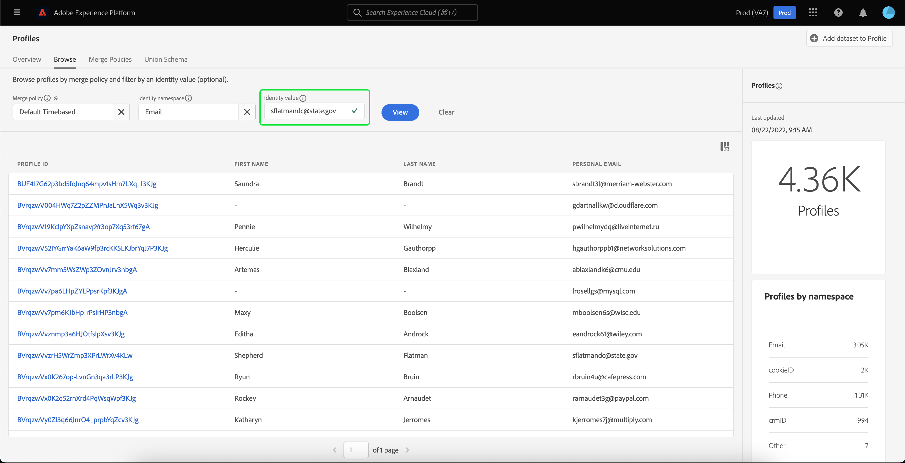

# [!DNL Real-Time Customer Profile] UI指南

[!DNL Real-Time Customer Profile] 結合來自多個管道的資料，包括線上、離線、CRM和協力廠商資料，建立個別客戶的全方位檢視。 本檔案可做為與 [!DNL Real-Time Customer Profile] Adobe Experience Platform使用者介面(UI)中的資料。

## 快速入門

本UI指南需要了解 [!DNL Experience Platform] 與管理有關的服務 [!DNL Real-Time Customer Profiles]. 閱讀本指南或使用UI之前，請先檢閱本檔案以了解下列服務：

* [[!DNL Real-Time Customer Profile] 概述](../home.md):根據來自多個來源的匯總資料，提供統一的即時消費者設定檔。
* [[!DNL Identity Service]](../../identity-service/home.md):啟用 [!DNL Real-Time Customer Profile] 將不同資料來源的身分擷取至 [!DNL Platform].
* [[!DNL Experience Data Model (XDM)]](../../xdm/home.md):標準化框架 [!DNL Platform] 組織客戶體驗資料。

## [!UICONTROL 概觀]

在Experience PlatformUI中，選取 **[!UICONTROL 設定檔]** 在左側導覽中，開啟 **[!UICONTROL 概述]** 頁簽顯示配置檔案控制面板。

>[!NOTE]
>
>如果您的組織剛接觸Platform，且尚未建立作用中的設定檔資料集或合併原則，請 [!UICONTROL 設定檔] 控制面板未顯示。 反之， [!UICONTROL 概述] 索引標籤會顯示連結和檔案，協助您開始使用即時客戶設定檔。

### 設定檔控制面板 {#profile-dashboard}

設定檔控制面板會概述與貴組織設定檔資料相關的關鍵量度。

若要進一步了解，請造訪 [設定檔控制面板指南](../../dashboards/guides/profiles.md).

## [!UICONTROL 瀏覽] 標籤量度

選取 **[!UICONTROL 瀏覽]** 標籤來顯示與貴組織的設定檔資料相關的數個量度。 您也可以使用此索引標籤，使用合併原則或身分來瀏覽設定檔存放區，如本指南下一節所述。

在 **[!UICONTROL 瀏覽]** 標籤 [設定檔計數](#profile-count) 以及 [依命名空間的設定檔](#profiles-by-namespace).

>[!NOTE]
>
>這些設定檔量度可能與 [設定檔控制面板](#profile-dashboard) 因為系統會使用貴組織的預設合併原則來評估這些量度。 有關使用合併策略的詳細資訊，包括如何定義預設合併策略，請參見 [合併策略概述](../merge-policies/overview.md).

除了這些量度外，本區段還提供上次更新的日期和時間，顯示上次評估量度的時間。

### 設定檔計數 {#profile-count}

設定檔計數會顯示貴組織在Experience Platform內擁有的設定檔總數，當貴組織的預設合併原則已合併設定檔片段，以便為每個個別客戶建立單一設定檔時。 換句話說，您的組織可能有多個與跨不同管道與您的品牌互動的單一客戶相關的描述檔片段，但這些片段會合併在一起（根據預設合併原則），並傳回「1」個描述檔的計數，因為這些片段都與同一個個人相關。

設定檔計數也包含具有屬性（記錄資料）的設定檔，以及僅包含時間序列（事件）資料的設定檔，例如Adobe Analytics設定檔。 設定檔計數會定期重新整理，以提供Platform內最新的設定檔總數。

#### 更新設定檔計數量度

將記錄擷取至 [!DNL Profile] 儲存會增加或減少計數超過5%，則會觸發工作以更新計數。 對於串流資料工作流程，會每小時進行檢查，以判斷是否符合5%的增加或減少臨界值。 若已觸發，則會自動觸發工作以更新設定檔計數。 對於批次內嵌，在成功將批次內嵌至設定檔存放區後15分鐘內，如果符合5%的增加或減少臨界值，則會執行工作以更新設定檔計數。

### [!UICONTROL 依命名空間的設定檔] {#profiles-by-namespace}

此 **[!UICONTROL 依命名空間的設定檔]** 量度會顯示設定檔存放區中所有合併設定檔的命名空間總數與劃分。 依命名空間的設定檔總數（換句話說，將每個命名空間顯示的值加總）一律會高於設定檔計數量度，因為一個設定檔可以有多個相關聯的命名空間。 例如，如果客戶在多個管道上與您的品牌互動，則多個命名空間將會與該個別客戶相關聯。

#### 更新 [!UICONTROL 依命名空間的設定檔] 量度

類似於 [設定檔計數](#profile-count) 量度，將記錄擷取至 [!DNL Profile] 儲存會增加或減少計數超過5%，則會觸發工作以更新命名空間量度。 對於串流資料工作流程，會每小時進行檢查，以判斷是否符合5%的增加或減少臨界值。 若已觸發，則會自動觸發工作以更新設定檔計數。 若要批次內嵌，請在成功將批次內嵌至 [!DNL Profile] 儲存時，若符合5%的增加或減少臨界值，則會執行工作以更新量度。

## 使用 [!UICONTROL 瀏覽] 標籤來檢視設定檔

在 **[!UICONTROL 瀏覽]** 索引標籤，您可以使用合併原則檢視範例設定檔，或使用身分命名空間和值來尋找特定設定檔。

### 瀏覽依據 [!UICONTROL 合併策略]

此 **[!UICONTROL 瀏覽]** 索引標籤預設會設為貴組織的預設合併原則。 要選擇不同的合併策略，請選擇 `X` 在合併策略名稱旁邊，然後使用選擇器開啟 **[!UICONTROL 選擇合併策略]** 對話框。

>[!NOTE]
>
>如果未選擇合併策略，請使用 **[!UICONTROL 合併策略]** 欄位以開啟選取對話方塊。

要從 **[!UICONTROL 選擇合併策略]** 對話框，選擇策略名稱旁的單選按鈕，然後使用 **[!UICONTROL 選擇]** 返回 [!UICONTROL 瀏覽] 標籤。 然後，您可以選取 **[!UICONTROL 檢視]** 要刷新示例配置檔案，並查看應用了新合併策略的配置檔案的抽樣。

顯示的設定檔代表在套用選取的合併原則後，您組織的設定檔存放區中最多20個設定檔的範例。 將新資料新增至組織的設定檔存放區時，會重新整理所選合併原則的範例設定檔。

若要檢視其中一個範例設定檔的詳細資訊，請選取 **[!UICONTROL 設定檔ID]**. 如需詳細資訊，請參閱本指南稍後的章節，位於 [查看配置檔案詳細資訊](#profile-detail).

若要進一步了解合併原則及其在Platform中的角色，請參閱 [合併策略概述](../merge-policies/overview.md).

### 瀏覽依據 [!UICONTROL 身分] {#browse-identity}

在 **[!UICONTROL 瀏覽]** 索引標籤中，您可以使用身分命名空間，以依身分值來尋找特定設定檔。 依身分瀏覽需要您提供合併原則、身分命名空間和身分值。

如有必要，請使用 **[!UICONTROL 合併策略]** 選取器以開啟 **[!UICONTROL 選擇合併策略]** 對話框，然後選擇要使用的合併策略。

然後使用 **[!UICONTROL 身分命名空間]** 選取器以開啟 **[!UICONTROL 選取身分命名空間]** 對話框，並選擇要搜索的命名空間。 如果您的組織有許多命名空間，您可以使用對話方塊中的搜尋列，開始輸入命名空間的名稱。

您可以選取命名空間以檢視其他詳細資訊，或選取選項按鈕以選擇命名空間。 然後，您就可以使用 **[!UICONTROL 選擇]** 繼續。

選取 [!UICONTROL 身分命名空間] 回到 [!UICONTROL 瀏覽] 索引標籤，您可以輸入 **[!UICONTROL 身分值]** 與您選取的命名空間相關。

>[!NOTE]
>
>此值是個別客戶設定檔專屬的值，且必須為所提供命名空間的有效項目。 例如，選取身分命名空間「Email」需要以有效電子郵件地址的形式提供身分值。

輸入值後，請選取 **[!UICONTROL 檢視]** 會傳回與值相符的單一設定檔。 選取 **[!UICONTROL 設定檔ID]** 來查看配置檔案詳細資訊。

## 檢視設定檔詳細資訊 {#profile-detail}

選取 **[!UICONTROL 設定檔ID]**, **[!UICONTROL 詳細資料]** 標籤。 顯示在 **[!UICONTROL 詳細資料]** 標籤已從多個設定檔片段合併在一起，以形成個別客戶的單一檢視。 這包括客戶詳細資訊，例如基本屬性、連結身分和管道偏好設定。

您也可以在組織層級變更顯示的預設欄位，以顯示偏好的設定檔屬性。 若要進一步了解如何自訂這些欄位，包括新增和移除屬性以及調整控制面板大小的逐步指示，請參閱 [設定檔詳細自訂指南](profile-customization.md).

您可以選取其他可用標籤，以檢視與個別客戶設定檔相關的其他資訊。 這些標籤包含屬性、事件，以及顯示設定檔目前合格之區段的區段成員資格標籤。

### 「屬性」索引標籤

此 **[!UICONTROL 屬性]** 索引標籤提供一個清單視圖，匯總在應用指定的合併策略後與單個配置檔案相關的所有屬性。

選取 **[!UICONTROL 檢視JSON]**. 如有使用者希望進一步了解設定檔屬性擷取至Platform的方式，此功能將有所幫助。

### 事件索引標籤

此 **[!UICONTROL 事件]** 索引標籤包含與客戶相關聯的100個最新ExperienceEvents資料。 此資料可能包括電子郵件開啟、購物車活動和頁面檢視。 選取 **[!UICONTROL 查看全部]** 對於任何個別事件，都會提供其他欄位和值作為事件一部分擷取。

選取「 」，也可將事件視為JSON物件 **[!UICONTROL 檢視JSON]**. 這有助於了解Platform中擷取事件的方式。

### 區段成員資格標籤

此 **[!UICONTROL 區段成員資格]** 索引標籤會顯示清單，其中包含個別客戶設定檔目前所屬的區段名稱和說明。 當設定檔符合區段的資格或過期時，此清單會自動更新。 目前符合設定檔資格的區段總數會顯示在索引標籤的右側。

如需Experience Platform中區段的詳細資訊，請參閱 [AdobeExperience Platform細分服務檔案](../../segmentation/home.md).

## 合併策略

從主 **[!UICONTROL 設定檔]** ，選擇 **[!UICONTROL 合併策略]** 頁簽，查看屬於您的組織的合併策略清單。 每個列出的策略都顯示其名稱，無論它是否為預設合併策略，以及它所應用的架構類。

有關合併策略的詳細資訊，請參閱 [合併策略概述](../merge-policies/overview.md).

## 聯合架構 {#union-schema}

從主 **[!UICONTROL 設定檔]** ，選擇 **[!UICONTROL 聯合架構]** 索引標籤，檢視所擷取資料的可用聯合結構。 聯合模式是所有 [!DNL Experience Data Model] (XDM)相同類別下的欄位，其結構已啟用於 [!DNL Real-Time Customer Profile].

如需聯合結構的詳細資訊，請造訪 [union schema UI指南](union-schema.md).

## 後續步驟

閱讀本指南後，您就能了解如何使用Experience PlatformUI檢視及管理組織的設定檔資料。 如需如何使用Experience PlatformAPI處理設定檔資料的資訊，請參閱 [即時客戶個人檔案API指南](../api/overview.md).
