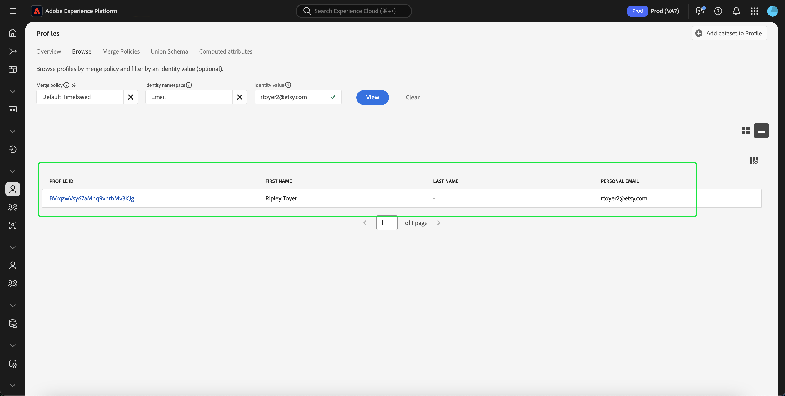

# [!DNL Real-Time Customer Profile] UI指南

[!DNL Real-Time Customer Profile]會針對個別客戶建立整體檢視，並結合來自多個管道的資料，包括線上、離線、CRM和第三方資料。 本檔案可做為在Adobe Experience Platform使用者介面(UI)中與[!DNL Real-Time Customer Profile]資料互動的指南。

## 快速入門

此UI指南需要瞭解與管理[!DNL Real-Time Customer Profiles]有關的各種[!DNL Experience Platform]服務。 在閱讀本指南或使用UI之前，請檢視以下服務的檔案：

* [[!DNL Real-Time Customer Profile] 概述](../home.md)：根據來自多個來源的彙總資料，提供統一的即時消費者設定檔。
* [[!DNL Identity Service]](../../identity-service/home.md)：啟用[!DNL Real-Time Customer Profile]，方法是在不同資料來源中的身分擷取到[!DNL Platform]時將其橋接起來。
* [[!DNL Experience Data Model (XDM)]](../../xdm/home.md)： [!DNL Platform]用來組織客戶體驗資料的標準化架構。

## [!UICONTROL 概觀]

在Experience PlatformUI中，選取左側導覽中的&#x200B;**[!UICONTROL 設定檔]**&#x200B;以開啟顯示設定檔儀表板的&#x200B;**[!UICONTROL 概觀]**&#x200B;標籤。

>[!NOTE]
>
>如果您的組織剛開始使用Platform，但尚未建立作用中的設定檔資料集或合併原則，則不會顯示[!UICONTROL 設定檔]儀表板。 [!UICONTROL 總覽]標籤會顯示連結和檔案，協助您開始使用即時客戶個人檔案。

### 設定檔儀表板 {#profile-dashboard}

設定檔控制面板會概述與組織設定檔資料相關的關鍵量度。

若要進一步瞭解，請造訪[設定檔儀表板指南](../../dashboards/guides/profiles.md)。

## [!UICONTROL 瀏覽]索引標籤量度

選取「**[!UICONTROL 瀏覽]**」標籤，以顯示與您組織設定檔資料相關的數個量度。 您也可以使用此標籤來瀏覽使用合併原則或身分的設定檔存放區，如本指南下一節所述。

**[!UICONTROL 瀏覽]**&#x200B;索引標籤的右側是[設定檔計數](#profile-count)，以及依名稱空間](#profiles-by-namespace)列出的[設定檔。

>[!NOTE]
>
>這些設定檔量度可能與[設定檔儀表板](#profile-dashboard)上顯示的量度不同，因為它們是使用您組織的預設合併原則來評估。 如需有關使用合併原則的詳細資訊，包括如何定義預設的合併原則，請參閱[合併原則概觀](../merge-policies/overview.md)。

除了這些量度之外，本節還提供上次更新日期和時間，以顯示上次評估量度的時間。

### 設定檔計數 {#profile-count}

在您組織的預設合併原則已與設定檔片段合併在一起，以針對每個個別客戶形成單一設定檔後，設定檔計數會顯示貴組織在Experience Platform內的設定檔總數。 換言之，您的組織可能擁有與單一客戶相關的多個設定檔片段，該客戶會跨不同管道與您的品牌互動，但這些片段會合併在一起（根據預設合併原則），且會傳回「1」設定檔計數，因為這些片段都與同一個人相關。

設定檔計數也包含具有屬性的設定檔（記錄資料），以及僅包含時間序列（事件）資料(例如Adobe Analytics設定檔)的設定檔。 設定檔計數會定期更新，以提供Platform內最新的設定檔總數。

#### 更新設定檔計數量度

當將記錄擷取至[!DNL Profile]存放區增加或減少計數超過5%時，就會觸發工作以更新計數。 對於串流資料工作流程，會每小時進行一次檢查，以判斷是否符合增加或減少5%的臨界值。 如果有，則會自動觸發工作以更新設定檔計數。 對於批次擷取，在成功將批次擷取到設定檔存放區後15分鐘內，如果符合5%增加或減少臨界值，則會執行工作以更新設定檔計數。

### [!UICONTROL 依名稱空間區分的設定檔] {#profiles-by-namespace}

依名稱空間&#x200B;]**的**[!UICONTROL &#x200B;設定檔量度會顯示您的設定檔存放區中所有合併設定檔的名稱空間總數和劃分。 依名稱空間區分的設定檔總數（也就是將每個名稱空間顯示的值加在一起），一律會高於設定檔計數量度，因為一個設定檔可能會有多個相關聯的名稱空間。 例如，如果客戶在多個頻道上與您的品牌互動，則多個名稱空間會與該個別客戶相關聯。

#### 正在依名稱空間]量度更新[!UICONTROL 設定檔

與[設定檔計數](#profile-count)量度類似，當記錄擷取至[!DNL Profile]存放區增加或減少計數超過5%時，就會觸發工作以更新名稱空間量度。 對於串流資料工作流程，會每小時進行一次檢查，以判斷是否符合增加或減少5%的臨界值。 如果有，則會自動觸發工作以更新設定檔計數。 對於批次擷取，在成功將批次擷取到[!DNL Profile]存放區後15分鐘內，如果符合5%的增加或減少臨界值，則會執行工作以更新量度。

## 使用[!UICONTROL 瀏覽]索引標籤檢視設定檔

在&#x200B;**[!UICONTROL 瀏覽]**&#x200B;標籤上，您可以使用合併原則來檢視範例設定檔，或使用身分名稱空間和值來查詢特定設定檔。

### 依[!UICONTROL 合併原則]瀏覽

根據預設，**[!UICONTROL 瀏覽]**&#x200B;索引標籤已設定為您的組織的預設合併原則。 若要選擇不同的合併原則，請選取合併原則名稱旁的`X`，然後使用選取器開啟&#x200B;**[!UICONTROL 選取合併原則]**&#x200B;對話方塊。

>[!NOTE]
>
>如果未選取合併原則，請使用&#x200B;**[!UICONTROL 合併原則]**&#x200B;欄位旁的選擇器按鈕，開啟選取對話方塊。

若要從&#x200B;**[!UICONTROL 選取合併原則]**&#x200B;對話方塊中選擇合併原則，請選取原則名稱旁的單選按鈕，然後使用&#x200B;**[!UICONTROL 選取]**&#x200B;返回[!UICONTROL 瀏覽]索引標籤。 然後，您可以選取&#x200B;**[!UICONTROL 檢視]**&#x200B;以重新整理範例設定檔，並檢視套用新合併原則的設定檔樣本。

顯示的設定檔代表在套用所選合併原則後，貴組織設定檔存放區中最多20個設定檔的範例。 將新資料新增到貴組織的設定檔存放區時，會重新整理所選合併原則的範例設定檔。

若要檢視其中一個範例設定檔的詳細資料，請選取&#x200B;**[!UICONTROL 設定檔識別碼]**。 如需詳細資訊，請參閱本指南稍後關於[檢視設定檔詳細資料](#profile-detail)的章節。

若要進一步瞭解合併原則及其在Platform中的角色，請參閱[合併原則概觀](../merge-policies/overview.md)。

### 依[!UICONTROL 身分]瀏覽 {#browse-identity}

在&#x200B;**[!UICONTROL 瀏覽]**&#x200B;索引標籤上，您可以使用身分名稱空間，依身分值查詢特定設定檔。 依身分瀏覽需要您提供合併原則、身分名稱空間和身分值。

必要時，請使用&#x200B;**[!UICONTROL 合併原則]**&#x200B;選擇器開啟&#x200B;**[!UICONTROL 選取合併原則]**&#x200B;對話方塊，並選擇要使用的合併原則。

然後使用&#x200B;**[!UICONTROL 身分識別名稱空間]**&#x200B;選取器開啟&#x200B;**[!UICONTROL 選取身分識別名稱空間]**&#x200B;對話方塊，並選擇您要搜尋的名稱空間。 如果您的組織有許多名稱空間，您可以使用對話方塊中的搜尋列，開始輸入名稱空間的名稱。

您可以選取名稱空間以檢視其他詳細資訊，或選取選項按鈕以選擇名稱空間。 然後，您可以使用&#x200B;**[!UICONTROL 選取]**&#x200B;以繼續。

選取[!UICONTROL 身分識別名稱空間]並返回[!UICONTROL 瀏覽]索引標籤後，您可以輸入與所選名稱空間相關的&#x200B;**[!UICONTROL 身分識別值]**。

>[!NOTE]
>
>此值專屬於個別客戶設定檔，且必須是所提供名稱空間的有效專案。 例如，選取身分名稱空間「電子郵件」需要有效電子郵件地址形式的身分值。

輸入值之後，選取&#x200B;**[!UICONTROL 檢視]**&#x200B;並傳回符合值的單一設定檔。 選取&#x200B;**[!UICONTROL 設定檔識別碼]**&#x200B;以檢視設定檔詳細資料。

## 檢視設定檔詳細資料 {#profile-detail}

選取&#x200B;**[!UICONTROL 設定檔識別碼]**&#x200B;後，**[!UICONTROL 詳細資料]**&#x200B;索引標籤會開啟。 **[!UICONTROL 詳細資料]**&#x200B;標籤上顯示的設定檔資訊已從多個設定檔片段合併在一起，以形成個別客戶的單一檢視。 這包括基本屬性、連結的身分和管道偏好設定等客戶細節。

顯示的預設欄位也可以在組織層級變更以顯示偏好的設定檔屬性。 若要深入瞭解如何自訂這些欄位，包括新增和移除屬性以及調整儀表板面板大小的逐步指示，請閱讀[設定檔詳細資料自訂指南](profile-customization.md)。

![[詳細資料]索引標籤會反白顯示。 顯示設定檔詳細資料。](../images/user-guide/profile-detail-row-name.png)

您也可以選擇在檢視屬性名稱作為其顯示名稱與其欄位路徑名稱之間切換。 若要在這兩個顯示之間切換，請選取&#x200B;**[!UICONTROL 顯示顯示名稱]**&#x200B;切換按鈕。

若要檢視與個別客戶設定檔相關的額外資訊，請選取其他任一可用頁標。 這些標籤包含屬性、事件和對象成員資格標籤，會顯示設定檔目前符合資格的對象。

### 屬性標籤

**[!UICONTROL 屬性]**&#x200B;索引標籤提供清單檢視，在套用指定的合併原則之後，彙總與單一設定檔相關的所有屬性。

也可以選取&#x200B;**[!UICONTROL 檢視JSON]**，將這些屬性視為JSON物件。 對於想更瞭解如何將設定檔屬性擷取到Platform的使用者，此功能會很有幫助。

![[屬性]索引標籤會反白顯示。 顯示設定檔屬性。](../images/user-guide/attributes.png)

若要檢視Edge上可用的屬性，請在資料位置選擇器上選取&#x200B;**[!UICONTROL Edge]**。

如需邊緣設定檔的詳細資訊，請閱讀[邊緣設定檔檔案](../edge-profiles.md)。

### 事件標籤

**[!UICONTROL Events]**&#x200B;索引標籤包含來自與客戶相關聯的100個最新ExperienceEvents的資料。 此資料可能包括電子郵件開啟、購物車活動和頁面檢視。 為任何個別事件選取「**[!UICONTROL 檢視全部]**」，可提供額外的欄位和值做為事件的一部分擷取。

也可以選取&#x200B;**[!UICONTROL 檢視JSON]**，將事件檢視為JSON物件。 這有助於瞭解如何在Platform中擷取事件。

![[事件]索引標籤會反白顯示。 顯示設定檔事件。](../images/user-guide/events.png)

### 對象成員資格標籤

**[!UICONTROL 對象成員資格]**&#x200B;標籤會顯示清單，其中包含個別客戶設定檔目前所屬對象的名稱和說明。 當設定檔符合對象資格或過期時，此清單會自動更新。 設定檔目前符合資格的受眾總數會顯示在索引標籤的右側。

如需Experience Platform中區段的詳細資訊，請參閱[AdobeExperience Platform區段服務檔案](../../segmentation/home.md)。

若要檢視Edge上可用設定檔的對象成員資格，請在資料位置選取器中選取&#x200B;**[!UICONTROL Edge]**。 您可以在[邊緣分段指南](../../segmentation/ui/edge-segmentation.md)中找到邊緣分段的詳細資訊。

## 合併政策

從主要&#x200B;**[!UICONTROL 設定檔]**&#x200B;功能表中，選取&#x200B;**[!UICONTROL 合併原則]**&#x200B;索引標籤，以檢視屬於您組織的合併原則清單。 每個列出的原則都會顯示其名稱（無論是否為預設的合併原則）及其套用的結構描述類別。

如需合併原則的詳細資訊，請參閱[合併原則概觀](../merge-policies/overview.md)。

![[合併原則]索引標籤會反白顯示。 顯示屬於組織的合併原則。](../images/user-guide/merge-policies.png)

## 聯合結構描述 {#union-schema}

從主要&#x200B;**[!UICONTROL 設定檔]**&#x200B;功能表中，選取&#x200B;**[!UICONTROL 聯合結構描述]**&#x200B;索引標籤，以檢視您擷取資料的可用聯合結構描述。 聯合結構描述是相同類別下所有[!DNL Experience Data Model] (XDM)欄位的合併，其結構描述已在[!DNL Real-Time Customer Profile]中啟用。

如需聯合結構描述的詳細資訊，請造訪[聯合結構描述UI指南](union-schema.md)。

## 計算屬性 {#computed-attributes}

從主要&#x200B;**[!UICONTROL 設定檔]**&#x200B;功能表中，選取&#x200B;**[!UICONTROL 計算屬性]**&#x200B;索引標籤，以檢視屬於您組織的計算屬性清單。

![已反白顯示[計算屬性]索引標籤。](../images/user-guide/computed-attributes.png)

如需計算屬性的詳細資訊，請閱讀[計算屬性總覽](../computed-attributes/overview.md)。 如需有關如何在Platform UI中使用計算屬性的詳細資訊，請參閱[計算屬性UI指南](../computed-attributes/ui.md)。

## 後續步驟

閱讀本指南後，您就會知道如何使用Experience PlatformUI檢視及管理組織的設定檔資料。 有關如何使用Experience PlatformAPI處理設定檔資料的資訊，請參閱[即時客戶設定檔API指南](../api/overview.md)。
