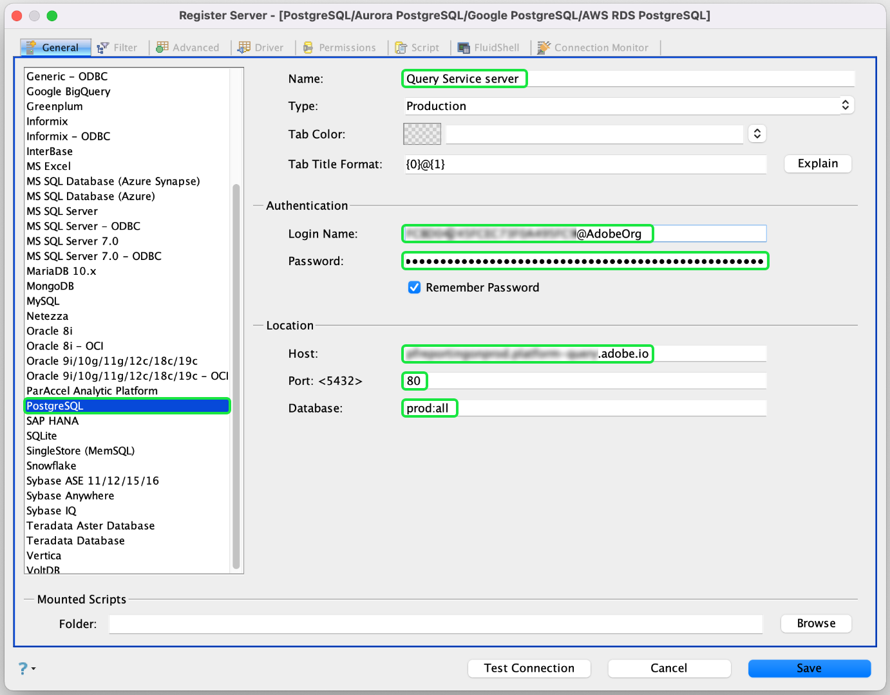

# 將[!DNL Aqua Data Studio]連接到查詢服務

本檔案說明將[!DNL Aqua Data Studio]與Adobe Experience Platform [!DNL Query Service]連接的步驟。

>[!NOTE]
>
> 本指南假設您已擁有[!DNL Aqua Data Studio]的存取權，且熟悉如何導覽其介面。 有關[!DNL Aqua Data Studio]的更多資訊，請參閱[official [!DNL Aqua Data Studio] documentation](https://www.aquaclusters.com/app/home/project/public/aquadatastudio/wikibook/Documentation21.1/page/0/Aqua-Data-Studio-21-1)。

安裝[!DNL Aqua Data Studio]後，必須先註冊伺服器。 從主菜單中，選擇&#x200B;**[!DNL Server]**，後跟&#x200B;**[!DNL Register Server]**。

將顯示&#x200B;**[!DNL Register Server]**&#x200B;對話框。 在&#x200B;**[!DNL General]**&#x200B;標籤下，從左側的清單中選擇&#x200B;**[!DNL PostgreSQL]**。 在顯示的對話方塊中，提供伺服器設定的下列詳細資訊。

- **[!DNL Name]**:連線的名稱。
- **[!DNL Login Name and Password]**:將使用的登入憑證。用戶名採用`ORG_ID@AdobeOrg`形式。
- **[!DNL Host and Port]**:的主機端點及其埠 [!DNL Query Service]。必須使用埠80連接[!DNL Query Service]。
- **[!DNL Database]:** 將使用的資料庫。

>[!NOTE]
>
>有關查找登錄憑據、主機、埠和資料庫名稱的詳細資訊，請參閱[憑據指南](../ui/credentials.md)。 要查找憑據，請登錄[!DNL Platform]，然後選擇&#x200B;**[!UICONTROL 查詢]**，後跟&#x200B;**[!UICONTROL 憑據]**。

選取 **[!DNL Driver]** 索引標籤。在&#x200B;**[!DNL Parameters]**&#x200B;下，將值設定為`?sslmode=require`

輸入連接詳細資訊後，選擇&#x200B;**[!DNL Test Connection]**&#x200B;以確保憑據正常工作。 如果連接成功，請選擇&#x200B;**[!DNL Save]**&#x200B;註冊伺服器。 成功註冊後，連線會顯示在控制面板上，確認您現在可以連線至伺服器並檢視其架構物件。

## 後續步驟

現在您已連接到[!DNL Query Service]，可以使用[!DNL Aqua Data Studio]中的&#x200B;**[!DNL Query Analyzer]**&#x200B;來執行和編輯SQL陳述式。 有關如何編寫和運行查詢的詳細資訊，請閱讀[運行查詢指南](../best-practices/writing-queries.md)。
