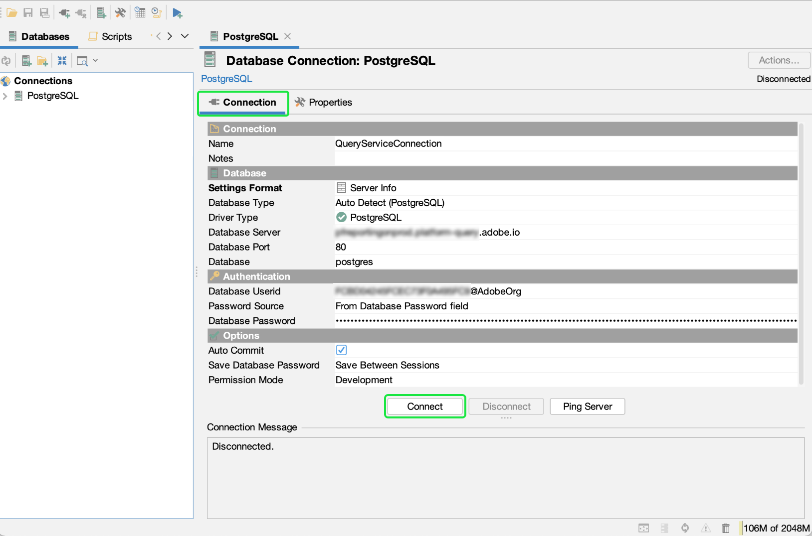

# 連接 [!DNL DbVisualizer] 至 [!DNL Query Service] {#connect-dbvisualizer}

本文檔介紹連接 [!DNL DbVisualizer] 資料庫工具與Adobe Experience Platform [!DNL Query Service]。

## 快速入門

本指南要求您已具有訪問 [!DNL DbVisualizer] 案頭應用，並熟悉如何瀏覽其介面。 下載 [!DNL DbVisualizer] 案頭應用程式或有關詳細資訊，請參閱 [官 [!DNL DbVisualizer] 文檔](https://www.dbvis.com/download/)。

>[!NOTE]
>
>有 [!DNL Windows]。 [!DNL macOS], [!DNL Linux] 版本 [!DNL DbVisualizer]。 本指南中的截屏使用 [!DNL macOS] 案頭應用。 版本之間的UI中可能存在細微差異。

獲取連接所需的憑據 [!DNL  DbVisualizer] 要Experience Platform，您必須有權訪問平台UI中的「查詢」工作區。 如果您當前沒有訪問查詢工作區的權限，請與IMS組織管理員聯繫。

## 建立資料庫連接 {#connect-database}

在本地電腦上安裝案頭應用後，啟動該應用並選擇 **[!DNL Create a Database Connection]** 從最初 [!DNL DbVisualizer] 的子菜單。 然後選擇 **[!DNL Create a Connection]** 右邊的小組。

![的 [!DNL DbVisualizer] 主菜單，其中突出顯示「建立資料庫連接」。](../images/clients/dbvisualizer/create-db-connection.png)

使用搜索欄或選擇 [!DNL PostgreSQL] 從驅動程式名稱下拉清單中。 出現「Database Connection（資料庫連接）」工作區。

![驅動程式名稱下拉菜單 [!DNL PostgreSQL] 。](../images/clients/dbvisualizer/driver-name.png)

在「資料庫連接」工作區中，選擇 **[!DNL Properties]** 頁籤，後跟 **[!DNL Driver Properties]** 的子菜單。

建議使用下表中顯示的驅動程式屬性來啟用SSL與DBVisualizer的配合使用。

| 屬性 | 說明 |
| ------ | ------ |
| `PGHOST` | 的主機名 [!DNL PostgreSQL] 伺服器。 此值是您的Experience Platform [!UICONTROL 主機] 憑據。 |
| `ssl` | 定義SSL值 `1` 啟用SSL。 |
| `sslmode` | 這控制SSL要求的使用。 你 **必須** 使用值 `require` 以啟用此要求。 |
| `user` | 連接到資料庫的用戶名是您的組織ID。 它是以下結尾的字母數字字串 `@adobe.org` |

>[!IMPORTANT]
>
>查看 [[!DNL Query Service] SSL文檔](./ssl-modes.md) 瞭解對與Adobe Experience Platform查詢服務的第三方連接的SSL支援，以及如何使用 `verify-full` SSL模式。

### [!DNL Query Service] 憑據

的 `PGHOST` 和 `user` 值取自您的Adobe Experience Platform憑據。 要查找憑據，請登錄到平台UI並選擇 **[!UICONTROL 查詢]** 從左導航，然後 **[!UICONTROL 憑據]**。 有關查找資料庫名稱、主機、埠和登錄憑據的詳細資訊，請閱讀 [憑據指南](../ui/credentials.md)。

[!DNL Query Service] 還提供非過期憑據，以允許與第三方客戶端進行一次性設定。 請參閱文檔 [有關如何生成和使用非過期憑據的完整說明](../ui/credentials.md#non-expiring-credentials)。

使用搜索欄查找每個屬性，然後為參數值選擇相應的單元格。 單元格將以藍色突出顯示。 在值欄位中輸入您的平台憑據並選擇 **[!DNL Apply]** 添加驅動程式屬性。

>[!NOTE]
>
>添加秒 `user` 配置檔案，選擇 `user` 從參數列中，選擇藍色+（加號）表徵圖以添加每個用戶的憑據。 選擇 **[!DNL Apply]** 添加驅動程式屬性。

的 [!DNL Edited] 列顯示複選標籤，以表示參數值已更新。

## 驗證

要在每次建立連接時要求用戶ID和基於密碼的身份驗證，請選擇 **[!DNL Authentication]** 從導航邊欄下 [!DNL PostgreSQL]。

在「連接驗證」面板中，檢查 **[!DNL Require Userid]** 和 **[!DNL Require Password]** 複選框 **[!DNL Apply]**。

## 連接到平台

要建立連接，請選擇 **[!DNL Connection]** 頁籤，然後輸入以下設定的Experience Platform憑據。

- **名稱**:建議您提供友好名稱以識別連接。
- **資料庫伺服器**:這是你的Experience Platform [!UICONTROL 主機] 憑據。
- **資料庫埠**:埠 [!DNL Query Service]。 必須使用埠80連接 [!DNL Query Service]。
- **資料庫**:使用憑據 `dbname` 值 `prod:all`。
- **資料庫用戶ID**:這是您的平台組織ID。 用戶ID的格式為 `ORG_ID@AdobeOrg`。
- **資料庫密碼**:這是在 [!DNL Query Service] 憑據儀表板。

輸入所有相關憑據後，選擇 **[!DNL Connect]**。

的 [!DNL Connect] 對話在第一次會議上出現。

輸入用戶ID和密碼並選擇 **[!DNL Connect]**。 日誌中顯示一條消息，確認連接成功。

## 後續步驟

既然你已連接 [!DNL DbVisualizer] 與 [!DNL Query Service]，您可以使用 [!DNL DbVisualizer] 來編寫查詢。 有關如何編寫和運行查詢的詳細資訊，請閱讀 [查詢執行指南](../best-practices/writing-queries.md)。
