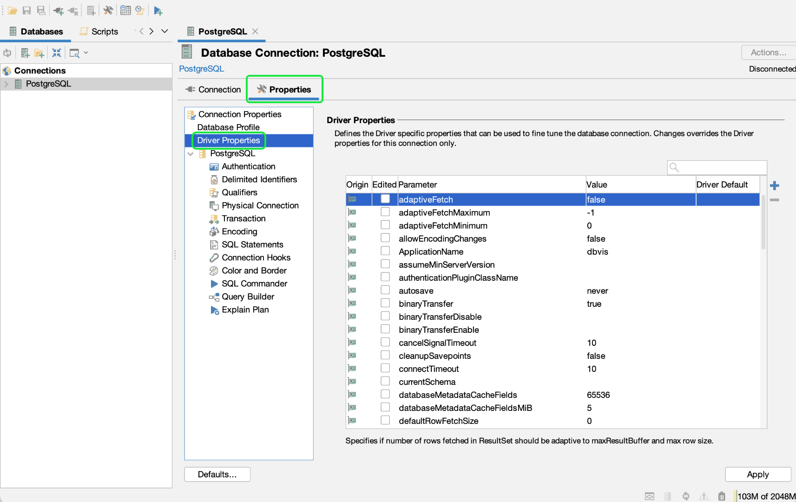

# Connect [!DNL DbVisualizer] to [!DNL Query Service] {#connect-dbvisualizer}

This document covers the steps for connecting the [!DNL DbVisualizer] database tool with Adobe Experience Platform [!DNL Query Service].

## 快速入門

本指南要求您已具有訪問 [!DNL DbVisualizer] 案頭應用，並熟悉如何瀏覽其介面。 To download the [!DNL DbVisualizer] desktop app or for more information, see the [official [!DNL DbVisualizer] documentation](https://www.dbvis.com/download/).

>[!NOTE]
>
>There are [!DNL Windows], [!DNL macOS], and [!DNL Linux] versions of [!DNL DbVisualizer]. Screenshots in this guide were taken using the [!DNL macOS] desktop app. 版本之間的UI中可能存在細微差異。

獲取連接所需的憑據 [!DNL  DbVisualizer] 要Experience Platform，您必須有權訪問平台UI中的「查詢」工作區。 如果您當前沒有訪問查詢工作區的權限，請與IMS組織管理員聯繫。

## 建立資料庫連接 {#connect-database}

Once you have installed the desktop app on your local machine, start the app and select **[!DNL Create a Database Connection]** from the initial [!DNL DbVisualizer] menu. 然後選擇 **[!DNL Create a Connection]** 右邊的小組。

![的 [!DNL DbVisualizer] 主菜單，其中突出顯示「建立資料庫連接」。](../images/clients/dbvisualizer/create-db-connection.png)

Use the search bar or select [!DNL PostgreSQL] from the driver name dropdown list. The Database Connection workspace appears.

![The driver name dropdown menu with [!DNL PostgreSQL] highlighted.](../images/clients/dbvisualizer/driver-name.png)

From the Database Connection workspace, select the **[!DNL Properties]** tab, followed by the **[!DNL Driver Properties]** from the navigation sidebar.

The three required driver properties are seen in the table below.

| 屬性 | 說明 |
| ------ | ------ |
| `PGHOST` | The host name for the [!DNL PostgreSQL] server. 此值是您的Experience Platform [!UICONTROL 主機] 憑據。 |
| `SSL` | This controls the use of SSL requirements. 你 **必須** 使用值&quot;1&quot;啟用此要求。 |
| `user` | The username connected to the database is your Organization ID. It is an alphanumeric string ending in `@adobe.org` |

### [!DNL Query Service] 憑據

的 `PGHOST` 和 `user` 值取自您的Adobe Experience Platform憑據。 要查找憑據，請登錄到平台UI並選擇 **[!UICONTROL 查詢]** 從左導航，然後 **[!UICONTROL 憑據]**。 有關查找資料庫名稱、主機、埠和登錄憑據的詳細資訊，請閱讀 [憑據指南](../ui/credentials.md)。

[!DNL Query Service] also offers non-expiring credentials to allow for a one-time setup with third-party clients. 請參閱文檔 [有關如何生成和使用非過期憑據的完整說明](../ui/credentials.md#non-expiring-credentials)。

使用搜索欄查找每個屬性，然後為參數值選擇相應的單元格。 單元格將以藍色突出顯示。 在值欄位中輸入您的平台憑據並選擇 **[!DNL Apply]** 添加驅動程式屬性。

>[!NOTE]
>
>To add a second `user` profile, select `user` from the parameter column then select the blue + (plus) icon to add credentials for each user. 選擇 **[!DNL Apply]** 添加驅動程式屬性。

的 [!DNL Edited] 列顯示複選標籤，以表示參數值已更新。

## 驗證

要在每次建立連接時要求用戶ID和基於密碼的身份驗證，請選擇 **[!DNL Authentication]** 從導航邊欄下 [!DNL PostgreSQL]。

In the Connection Authentication panel, check both the **[!DNL Require Userid]** and **[!DNL Require Password]** checkboxes then select **[!DNL Apply]**.

## Connect to Platform

要建立連接，請選擇 **[!DNL Connection]** 頁籤，然後輸入以下設定的Experience Platform憑據。

- **Name**: You are recommended to provide a friendly name to recognize the connection.
- **資料庫伺服器**:這是你的Experience Platform [!UICONTROL 主機] 憑據。
- **資料庫埠**:埠 [!DNL Query Service]。 必須使用埠80連接 [!DNL Query Service]。
- **資料庫**:使用憑據 `dbname` 值 `prod:all`。
- **資料庫用戶ID**:這是您的平台組織ID。 The Userid will be in the format of `ORG_ID@AdobeOrg`.
- **資料庫密碼**:這是在 [!DNL Query Service] 憑據儀表板。

輸入所有相關憑據後，選擇 **[!DNL Connect]**。

的 [!DNL Connect] 對話在第一次會議上出現。

輸入用戶ID和密碼並選擇 **[!DNL Connect]**。 A message appears in the log to confirm a successful connection.

## 後續步驟

Now that you have connected [!DNL DbVisualizer] with [!DNL Query Service], you can use [!DNL DbVisualizer] to write queries. 有關如何編寫和運行查詢的詳細資訊，請閱讀 [查詢執行指南](../best-practices/writing-queries.md)。
