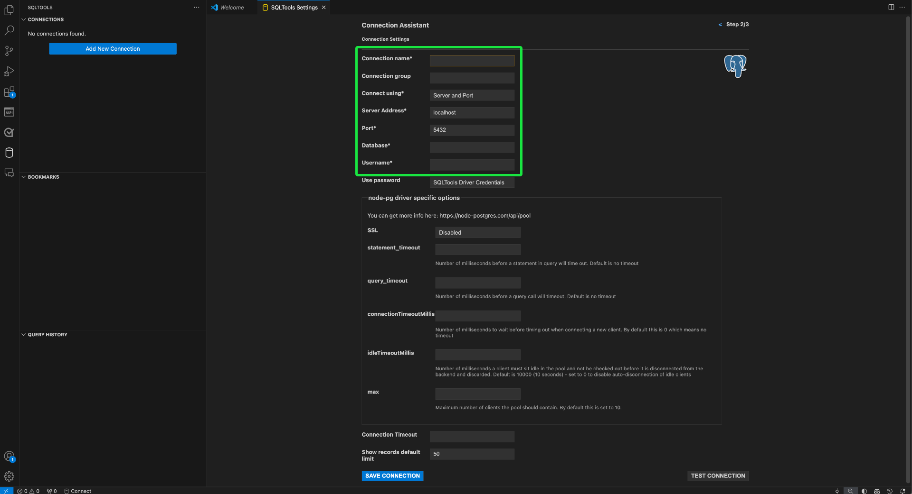

# 將[!DNL GitHub Copilot]和[!DNL Visual Studio Code]連線到查詢服務

>[!IMPORTANT]
>
>使用此整合工具之前，您必須瞭解哪些資料會與GitHub共用。 共用資料包含正在編輯的程式碼和檔案的相關資訊（「提示」）以及使用者動作的詳細資訊（「使用者參與資料」）。  請檢閱[[!DNL GitHub Copilot]的隱私權宣告](https://docs.github.com/en/site-policy/privacy-policies/github-general-privacy-statement#github-privacy-statement)，瞭解其收集的資料。 您也必須考慮涉及協力廠商服務的安全性影響，因為您有責任確保遵守組織的資料控管原則。 對於使用此工具而可能導致的任何資料相關疑慮或問題，Adobe概不負責。 如需詳細資訊，請參閱GitHub檔案。

[!DNL GitHub Copilot]由OpenAI Codex提供技術支援，是AI驅動的工具，可藉由直接在編輯器中建議程式碼片段和整個功能，來強化您的程式碼體驗。 與[!DNL Visual Studio Code] ([!DNL VS Code])整合，[!DNL Copilot]可大幅加快您的工作流程，尤其是在處理複雜查詢時。 請依照本指南瞭解如何將[!DNL GitHub Copilot]和[!DNL VS Code]連線至查詢服務，以更有效率的方式撰寫和管理您的查詢。 如需[!DNL Copilot]的詳細資訊，請造訪[GitHub的Copilot產品頁面](https://github.com/pricing)和[正式 [!DNL Copilot] 檔案](https://docs.github.com/en/copilot/about-github-copilot/what-is-github-copilot)。

本檔案說明使用Adobe Experience Platform查詢服務連線[!DNL GitHub Copilot]和[!DNL VS Code]所需的步驟。

## 快速入門 {#get-started}

本指南要求您已存取GitHub帳戶並註冊[!DNL GitHub Copilot]。 您可以[從GitHub網站](https://github.com/github-copilot/signup)註冊。 您也需要[!DNL VS Code]。 您可從其官方網站](https://code.visualstudio.com/download)下載[1}。 [!DNL VS Code] 

安裝[!DNL VS Code]並啟動您的[!DNL Copilot]訂閱後，請取得Experience Platform的連線認證。 這些認證位於Experience Platform UI中[!UICONTROL 查詢]工作區的[!UICONTROL 認證]索引標籤中。 閱讀[的認證指南，瞭解如何在Experience Platform UI](../ui/credentials.md)中找到這些值。 如果您目前無法存取[!UICONTROL 查詢]工作區，請連絡組織管理員。

### 必要的[!DNL Visual Studio Code]副檔名 {#required-extensions}

您必須使用下列[!DNL Visual Studio Code]擴充功能，才能直接在程式碼編輯器中有效管理和查詢您的Experience Platform SQL資料庫。 下載並安裝這些擴充功能。

- [SQLTools](https://marketplace.visualstudio.com/items?itemName=mtxr.sqltools)：使用SQLTools擴充功能來管理及查詢多個SQL資料庫。 它包含查詢執行器、SQL格式化程式和連線總管等功能，並支援其他驅動程式以提高開發人員的生產力。 如需詳細資訊，請閱讀Visual Studio Marketplace的概觀。
- [SQLTools PostgreSQL/Cockroach驅動程式](https://marketplace.visualstudio.com/items?itemName=mtxr.sqltools-driver-pg)：此擴充功能可讓您直接在程式碼編輯器中連線、查詢及管理PostgreSQL與CockroachDB資料庫。

下一個擴充功能會啟用[!DNL GitHub Copilot]及其聊天功能。

- [[!DNL GitHub Copilot]](https://marketplace.visualstudio.com/items?itemName=GitHub.copilot)：在您輸入時提供內嵌編碼建議。
- [[!DNL GitHub Copilot] 聊天](https://marketplace.visualstudio.com/items?itemName=GitHub.copilot-chat)：提供對話式AI協助的隨附擴充功能。

## 建立連線 {#create-connection}

選取圓柱圖示()，後面接著&#x200B;**[!DNL Add New Connection]**&#x200B;或圓柱加號圖示（）。[!DNL VS Code]

**[!DNL Connection Assistant]**&#x200B;出現。 選取&#x200B;**[!DNL PostgreSQL]**&#x200B;資料庫驅動程式。

![在[!DNL VS Code]中反白顯示PostgreSQl的SQLTools設定頁面。](../images/clients/github-copilot/postgres-database-driver.png)

### 輸入連線設定 {#input-connection-settings}

[!DNL Connection Settings]檢視出現。 在SQLTools [!DNL Connection Assistant]的適當欄位中輸入您的Experience Platform連線認證。 下表會說明必要的值。

| 屬性 | 說明 |
| --- |--- |
| [!DNL Connection name] | 提供`Prod_MySQL_Server`之類的&quot;[!DNL Connection name]&quot;，其內容應具描述性並清楚指出其用途（例如MySQL伺服器的生產環境）。 最佳實務包括： <ul><li>遵循您組織的命名慣例，以確保其在系統內是唯一的。</li><li>保持簡潔，以保持清晰度並避免與其他連線混淆。</li><li>在名稱中包含連線功能或環境的相關詳細資訊。</li></ul> |
| [!DNL Connect using] | 使用&#x200B;**[!DNL Server and Port]**&#x200B;選項來指定伺服器的位址（主機名稱）和連線埠號碼，以建立與Experience Platform的直接連線 |
| [!DNL Server address] | 輸入您的Experience Platform Postgres認證中提供的&#x200B;**[!UICONTROL 主機]**&#x200B;值，例如`acmeprod.platform-query.adobe.io`。 |
| [!DNL Port] | Experience Platform服務的此值通常為`80`。 |
| [!DNL Database] | 輸入您的Experience Platform Postgres認證中提供的&#x200B;**[!UICONTROL 資料庫]**&#x200B;值，例如`prod:all`。 |
| [!DNL Username] | 此屬性是指您的組織ID。 輸入您的Experience Platform Postgres認證中提供的&#x200B;**[!UICONTROL 使用者名稱]**&#x200B;值。 |
| [!DNL Password] | 此屬性是您的存取權杖。 輸入您的Experience Platform Postgres認證中提供的&#x200B;**[!UICONTROL 密碼]**&#x200B;值。 |

接著，選取&#x200B;**[!DNL Use Password]**，接著從出現的下拉式功能表中選取&#x200B;**[!DNL Save as plaintext in settings]**。 [!DNL Password]欄位隨即顯示。 使用此文字輸入欄位來輸入您的存取權杖。

![[使用密碼]、其下拉式功能表及[密碼]欄位已反白顯示。](../images/clients/github-copilot/access-token.png)

最後，若要啟用SSL，請選取[!DNL SSL]輸入欄位，然後從出現的下拉式功能表中選擇[!DNL Enabled]。

>[!TIP]
>
>輸入所有認證後，您可以在儲存連線之前先測試連線。 向下捲動至工作區底部並選取&#x200B;**[!DNL Test Connection]**。
>
>{width="100" zoomable="yes"}

正確輸入連線詳細資料後，請選取「**[!DNL Save Connection]**」以確認您的設定。

![已反白顯示[儲存連線]的連線助理工作區。](../images/clients/github-copilot/save-connection.png)

[!DNL Review connection details]檢視會出現，並顯示您的連線認證。 當您確定連線詳細資料正確時，請選取&#x200B;**[!DNL Connect Now]**。

![檢閱連線詳細資料檢視中，已反白顯示[立即連線]。](../images/clients/github-copilot/review-and-connect.png)

您的[!DNL VS Code]工作區出現，並附上[!DNL GitHub Copilot]的建議。

![ [!DNL VS Code].](../images/clients/github-copilot/connected.png)中的連線SQL工作階段

## [!DNL GitHub Copilot]快速指南

連線至您的Experience Platform執行個體後，您就可以使用[!DNL Copilot]做為AI編碼助理，協助您更快且更自信地撰寫程式碼。 本節說明其主要功能及使用方式。

## 快速入門：[!DNL GitHub Copilot] {#get-started-with-copilot}

首先，確定您已安裝最新版本的[!DNL VS Code]。 過時的[!DNL VS Code]版本可能會使索引鍵[!DNL Copilot]功能無法如預期運作。 接下來，確定已啟用[!DNL Enable Auto Completions]設定。 如果[!DNL Copilot]已正確執行，**[!DNL Copilot]圖示** （）會顯示在您的狀態列中（如果有問題，則會改為顯示[!DNL Copilot]錯誤圖示）。 選取&#x200B;**[!DNL Copilot]圖示**&#x200B;以開啟[！DNL [!DNL GitHub Copilot]功能表]。 從&#x200B;**[！DNL [!DNL GitHub Copilot]功能表]**，選取&#x200B;**[!DNL Edit Settings]**

![已顯示[!DNL GitHub Copilot Menu]並反白顯示[!DNL Copilot]圖示和[編輯設定]的[!DNL VS Code]編輯器。](../images/clients/github-copilot/github-copilot-menu.png)

向下捲動選項，並確認已針對[!DNL Enable Auto Completions]設定啟用核取方塊。

![已選取並反白顯示[啟用自動完成]核取方塊的[!DNL GitHub Copilot]設定面板。](../images/clients/github-copilot/enable-auto-completions.png)

## 程式碼完成 {#code-completions}

安裝[!DNL GitHub Copilot]擴充功能並登入後，它會自動啟用名為&#x200B;**Ghost Text**&#x200B;的功能，此功能會在您輸入時建議程式碼完成。 這些建議可協助您以更少的中斷更有效率地撰寫程式碼。 您也可以使用註解來指導AI程式碼建議。 這表示非技術使用者可以將純語音轉換為程式碼，以探索其資料。

![含有程式碼建議的VSCode UI和醒目提示的[!DNL GitHub Copilot]圖示。](../images/clients/github-copilot/ghost-text.png)

>[!TIP]
>
>如果您想要針對特定檔案或語言停用[!DNL Copilot]，請選取狀態列中的圖示並加以停用。

### 接受完整的或部分Ghost文字建議 {#accept-suggestions}

當[!DNL GitHub Copilot]建議程式碼完成時，您可以接受部分或完整的建議。 選取&#x200B;**Tab**&#x200B;以接受整個建議，或按住&#x200B;**Control (或Mac上的命令)**&#x200B;並按下&#x200B;**向右鍵**&#x200B;以接受部分文字。 若要關閉建議，請按&#x200B;**Escape**。

>[!TIP]
>  
>如果未取得建議，請確定已以您檔案的語言](#get-started-with-copilot)啟用[[!DNL Copilot] 。

![ [!DNL VS Code]編輯器在部分輸入的程式碼旁顯示[!DNL GitHub Copilot]模糊的灰色文字建議，作為Ghost文字。](../images/clients/github-copilot/accept-partial-suggestions.png)

### 替代建議 {#alternative-suggestions}

若要循環顯示替代程式碼建議，請在[!DNL Copilot]對話方塊中選取箭頭。

![顯示Copilot替代建議面板的[!DNL VS Code]編輯器。](../images/clients/github-copilot/code-suggestions.png)

## 使用內嵌聊天 {#inline-chat}

您也可以直接與[!DNL Copilot]聊天有關您的程式碼。 使用&#x200B;**Control （或Command） + I**&#x200B;觸發內嵌聊天對話方塊。 此功能用於疊代您的程式碼並修訂內容中的建議。 您可以反白標示程式碼區塊，並在接受前使用內嵌聊天室檢視AI提出的不同解決方案。

<!-- THis section is poss unnecessary:
There are inline features for chat including doc, expalin, fix and test

 -->

## 專屬聊天檢視 {#dedicated-chat}

您可以使用較傳統的聊天介面和專用的聊天側邊欄，來形成想法和策略、解決編碼問題並討論實作詳細資訊。 選取聊天圖示(![Copilot聊天圖示。[!DNL VS Code]側邊欄中的](../images/clients/github-copilot/chat-icon.png))以開啟專屬的聊天視窗。

![反白顯示聊天圖示的[!DNL GitHub Copilot]聊天側邊欄。](../images/clients/github-copilot/chat-sidebar.png)

您也可以選取歷程記錄圖示（)。

## 後續步驟

您現在已準備好直接從程式碼編輯器有效率地查詢Experience Platform資料庫，並使用[!DNL GitHub Copilot]的AI支援程式碼建議來簡化撰寫和最佳化SQL查詢。 如需如何撰寫和執行查詢的詳細資訊，請參閱查詢執行的[指南](../best-practices/writing-queries.md)。
