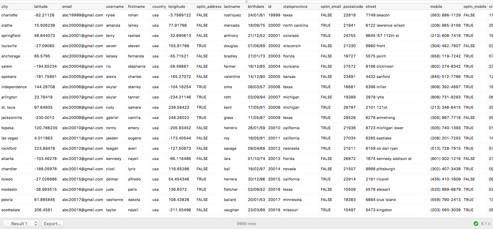

# Connect [!DNL Postico] 至查詢服務(Mac)

本檔案涵蓋連接 [!DNL Postico] 搭配Adobe Experience Platform [!DNL Query Service].

>[!NOTE]
>
> 本指南假設您已擁有 [!DNL Postico] 並熟悉如何導覽其介面。 有關 [!DNL Postico] 可在 [官方 [!DNL Postico] 檔案](https://eggerapps.at/postico/docs).
> 
> 此外， [!DNL Postico] is **僅限** 可在macOS裝置上使用。

連接 [!DNL Postico] 至查詢服務，開啟 [!DNL Postico] 選取 **[!DNL New Favorite]**.

![此 [!DNL Postico] 醒目顯示「新收藏」的UI。](../images/clients/postico/open-postico.png)

您現在可以輸入值以連線至Adobe Experience Platform。

有關查找資料庫名稱、主機、埠和登錄憑據的詳細資訊，請閱讀 [認證指南](../ui/credentials.md). 若要尋找憑證，請登入 [!DNL Platform]，然後選取 **[!UICONTROL 查詢]**，後跟 **[!UICONTROL 憑證]**.

插入憑證後，請選取 **[!DNL Connect]** 連線至查詢服務。

連線至Platform後，您將會看到先前與Query Service建立的所有關係清單。

![中的連線清單 [!DNL Postico] UI。](../images/clients/postico/show-queries.png)

## 建立SQL陳述式

要建立新的SQL查詢，請選擇並開啟「SQL查詢」。

![此 [!DNL Postico] 突出顯示了SQL查詢快捷方式的UI。](../images/clients/postico/create-query.png)

隨即出現方塊，您可以在此處輸入要執行的查詢。 完成後，請選取 **[!DNL Execute Statement]** 來運行查詢。

隨即出現表格，顯示已完成查詢運行的結果。

## 後續步驟

既然你已經和 [!DNL Query Service]，您可以使用 [!DNL Postico] 來寫入查詢。 有關如何編寫和運行查詢的詳細資訊，請閱讀 [運行查詢指南](../best-practices/writing-queries.md).
