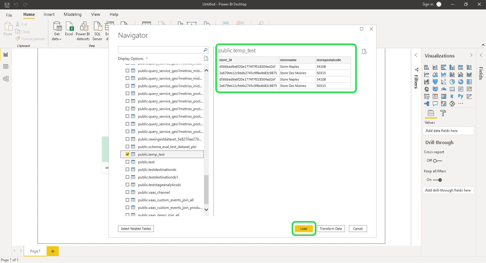

# 將[!DNL Power BI]連接到查詢服務(PC)

本檔案說明將Power BI與Adobe Experience Platform Query Service連線的步驟。

>[!NOTE]
>
> 本指南假設您已擁有[!DNL Power BI]的存取權，且熟悉如何導覽其介面。 有關[!DNL Power BI]的更多資訊，請參閱[official [!DNL Power BI] documentation](https://docs.microsoft.com/zh-tw/power-bi/)。
>
> 此外，Power BI **僅**&#x200B;可在Windows裝置上使用。

安裝Power BI後，您需要安裝`Npgsql` ，這是用於PostgreSQL的.NET驅動程式包。 有關Npgsql的更多資訊，請參見[Npgsql文檔](https://www.npgsql.org/doc/index.html)。

>[!IMPORTANT]
>
>您必須下載v4.0.10或更低版本，因為較新版本會導致錯誤。

在自訂設定畫面的「[!DNL Npgsql GAC Installation]」下，選取&#x200B;**[!DNL Will be installed on local hard drive]**。

要確保npgsql已正確安裝，請先重新啟動電腦，然後再繼續執行後續步驟。

## 將[!DNL Power BI]連接到[!DNL Query Service]

要將[!DNL Power BI]連接到[!DNL Query Service]，請開啟[!DNL Power BI]並在頂部菜單功能區中選擇&#x200B;**[!DNL Get Data]**。

選擇&#x200B;**[!DNL PostgreSQL database]**，後跟&#x200B;**[!DNL Connect]**。

您現在可以輸入伺服器和資料庫的值。 有關查找資料庫名稱、主機、埠和登錄憑據的詳細資訊，請參閱[憑據指南](../ui/credentials.md)。 要查找憑據，請登錄[!DNL Platform]，然後選擇&#x200B;**[!UICONTROL 查詢]**，後跟&#x200B;**[!UICONTROL 憑據]**。

**[!DNL Server]** 是在連接詳細資訊下找到的主機。對於生產環境，將埠`:80`添加到主機字串的末尾。 **[!DNL Database]** 可以是「all」或資料集表格名稱。

此外，您也可以選取&#x200B;**[!DNL Data Connectivity mode]**。 選擇&#x200B;**[!DNL Import]**&#x200B;以顯示所有可用表的清單，或選擇&#x200B;**[!DNL DirectQuery]**&#x200B;直接建立查詢。

要了解有關&#x200B;**[!DNL Import]**&#x200B;模式的詳細資訊，請閱讀有關[預覽和導入表](#preview)的部分。 要了解有關&#x200B;**[!DNL DirectQuery]**&#x200B;模式的詳細資訊，請閱讀有關[建立SQL陳述式](#create)的部分。 確認資料庫詳細資訊後，選擇&#x200B;**[!DNL OK]**。

系統會顯示詢問您的使用者名稱、密碼和應用程式設定的提示。 填寫這些詳細資訊，然後選擇&#x200B;**[!DNL Connect]**&#x200B;以繼續下一步。

## 預覽和匯入表格 {#preview}

如果已選擇&#x200B;**[!DNL Import]**&#x200B;模式，則會出現一個對話框，顯示所有可用表的清單。 選取您要預覽的表格，接著選取&#x200B;**[!DNL Load]**&#x200B;以將資料集帶入[!DNL Power BI]。

表格現在已匯入至Power BI。

## 建立SQL陳述式 {#create}

如果已選擇&#x200B;**[!DNL DirectQuery]**&#x200B;模式，則需要用要建立的SQL查詢填寫「高級選項」部分。

在&#x200B;**[!DNL SQL statement]**&#x200B;下，插入要建立的SQL查詢。 確保選中標籤為&#x200B;**[!DNL Include relationship columns]**&#x200B;的複選框。 寫入查詢後，請選擇&#x200B;**[!DNL OK]**&#x200B;以繼續。

查詢的預覽隨即顯示。 選擇&#x200B;**[!DNL Load]**&#x200B;以查看查詢結果。

## 後續步驟

現在您已連接[!DNL Query Service]，可以使用[!DNL Power BI]來編寫查詢。 有關如何編寫和運行查詢的詳細資訊，請閱讀[運行查詢](../best-practices/writing-queries.md)的指南。
