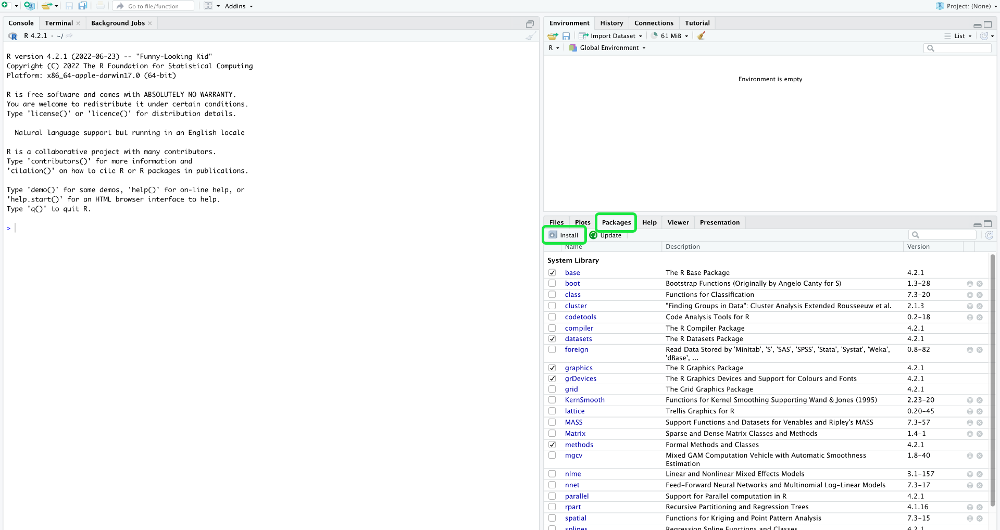

# 將[!DNL RStudio]連接到查詢服務

本檔案將逐步說明將[!DNL RStudio]與Adobe Experience Platform [!DNL Query Service]連接的步驟。

>[!NOTE]
>
> 本指南假設您已擁有[!DNL RStudio]的存取權，且熟悉如何使用。 有關[!DNL RStudio]的更多資訊，請參閱[official [!DNL RStudio] documentation](https://rstudio.com/products/rstudio/)。
> 
> 此外，要將RStudio與Query Service一起使用，需要安裝PostgreSQL JDBC 4.2驅動程式。 您可以從[PostgreSQL官方站點](https://jdbc.postgresql.org/download.html)下載JDBC驅動程式。

## 在[!DNL RStudio]介面中建立[!DNL Query Service]連接

安裝[!DNL RStudio]後，需要安裝RJDBC包。 轉至&#x200B;**[!DNL Packages]**&#x200B;窗格，然後選擇&#x200B;**[!DNL Install]**。



出現快顯視窗，顯示&#x200B;**[!DNL Install Packages]**&#x200B;畫面。 確保為&#x200B;**[!DNL Install from]**&#x200B;部分選擇&#x200B;**[!DNL Repository (CRAN)]**。 **[!DNL Packages]**&#x200B;的值應為`RJDBC`。 確保已選取&#x200B;**[!DNL Install dependencies]**。 確認所有值均正確後，選擇&#x200B;**[!DNL Install]**&#x200B;以安裝包。


現在RJDBC包已安裝，請重新啟動RStudio以完成安裝過程。

RStudio重新啟動後，您現在可以連線至查詢服務。 在&#x200B;**[!DNL Packages]**&#x200B;窗格中選擇&#x200B;**[!DNL RJDBC]**&#x200B;包，然後在控制台中輸入以下命令：

```console
pgsql <- JDBC("org.postgresql.Driver", "{PATH TO THE POSTGRESQL JDBC JAR}", "`")
```

其中{PATH TO POSTGRESQL JDBC JAR}表示安裝在電腦上的PostgreSQL JDBC JAR的路徑。

現在，您可以在主控台中輸入下列命令，以建立與Query Service的連線：

```console
qsconnection <- dbConnect(pgsql, "jdbc:postgresql://{HOSTNAME}:{PORT}/{DATABASE_NAME}?user={USERNAME}&password={PASSWORD}&sslmode=require")
```

>[!NOTE]
>
>有關查找資料庫名稱、主機、埠和登錄憑據的詳細資訊，請參閱[憑據指南](../ui/credentials.md)。 要查找憑據，請登錄[!DNL Platform]，然後選擇&#x200B;**[!UICONTROL 查詢]**，後跟&#x200B;**[!UICONTROL 憑據]**。


## 寫入查詢

現在您已連接到[!DNL Query Service]，可以編寫查詢以執行和編輯SQL陳述式。 例如，您可以使用`dbGetQuery(con, sql)`執行查詢，其中`sql`是您要執行的SQL查詢。

下列查詢使用包含[體驗事件](../best-practices/experience-event-queries.md)的資料集，並根據裝置的螢幕高度建立網站頁面檢視的色階分佈圖。

```sql
df_pageviews <- dbGetQuery(con,
"SELECT t.range AS buckets, 
 Count(*) AS pageviews 
FROM (SELECT CASE 
 WHEN device.screenheight BETWEEN 0 AND 99 THEN '0 - 99' 
 WHEN device.screenheight BETWEEN 100 AND 199 THEN '100-199' 
 WHEN device.screenheight BETWEEN 200 AND 299 THEN '200-299' 
 WHEN device.screenheight BETWEEN 300 AND 399 THEN '300-399' 
 WHEN device.screenheight BETWEEN 400 AND 499 THEN '400-499' 
 WHEN device.screenheight BETWEEN 500 AND 599 THEN '500-599' 
 ELSE '600-699' 
 end AS range 
 FROM aa_post_vals_3) t 
GROUP BY t.range 
ORDER BY buckets 
LIMIT 1000000")
```

成功的回應會傳回查詢的結果：

```r
df_pageviews
 buckets pageviews
1 0 - 99 198985
2 500-599 67138
3 300-399 2147
4 200-299 354
5 400-499 6947
6 100-199 4415
7 600-699 3097040
```

## 後續步驟

有關如何編寫和運行查詢的詳細資訊，請閱讀[運行查詢](../best-practices/writing-queries.md)的指南。
