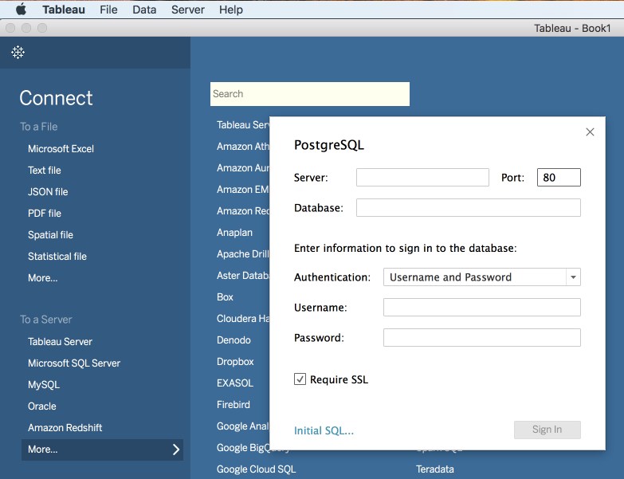

# 與Tableau連結

安裝Tableau（如果尚未安裝）。

>[!NOTE] 您可在這裡取得「Tableau Desktop」的14天試用 [版](https://www.tableau.com/products/desktop/download)。
>    
> 此版本 `2018.1.2 (20181.18.0615.1128 64 bit)` 已成功連接到查詢服務。

執行Tableau，然後在開啟畫面上按一下以開啟Postgres連線。

個別從 `Host, Port, Database, Username, Password` Platform UI的「 **Connect BI工具** 」頁面複製至對應的Tableau欄位。

確認您已勾選「 **SSL必要** 」方塊，然後再嘗試連線。

