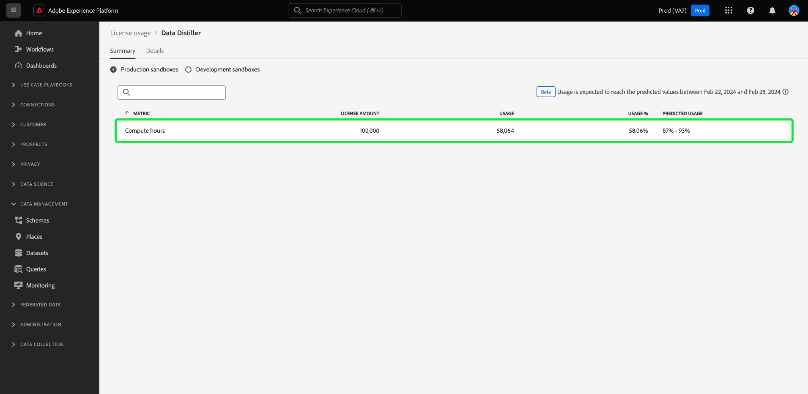

# (Alpha)監視批查詢許可證使用情況 {#monitor-license-usage}

>[!IMPORTANT]
>
>尚不能通過UI監視批查詢許可證使用情況。 此功能在Alpha中，仍在測試中。 此文檔可能會更改。

Adobe Experience Platform用戶介面(UI)提供了一個儀表板，您可以通過該儀表板查看有關組織的查詢服務許可證使用情況的重要資訊。

有關如何訪問和與UI中的許可證使用儀表板進行交互的詳細說明，以及有關儀表板中顯示的可用度量的詳細資訊，請訪問 [許可證使用儀表板指南](../../dashboards/guides/license-usage.md)。

請閱讀 [儀表板概述](../../dashboards/home.md) 的子菜單。

## 小部件 {#widgets}

許可證使用儀表板由小部件組成，這些部件顯示只讀度量，提供有關您組織的許可證使用情況的重要資訊。 可見的指標取決於您組織的特定許可。

選擇一個單選按鈕以選擇用於分析的沙盒，然後使用下拉菜單選擇分析的時段。 可用選項包括30天、90天、12個月期間、最後一年、完整合同期間或自定義日期。

## 計算小時數 {#compute-hours}

的 [!UICONTROL 計算小時數] 小部件使用線形圖來直觀顯示組織每天的批處理查詢處理時間。 小部件在小部件的左上角顯示數字指示的三個度量。 分別為

- [!UICONTROL 實際]:在概述下拉清單中選擇的時段的計算小時數。 此度量也通過實線在圖形上表示。
- [!UICONTROL 許可]:您組織的許可協定允許的計算小時數。 此度量也用虛線在圖形上表示。
- [!UICONTROL 用法]:這是您使用的百分比，相對於您的許可證同意的最大計算時數。

>[!IMPORTANT]
>
>的 [!UICONTROL 計算小時數] 小部件僅適用於具有批查詢資料Distiller許可證的客戶。

