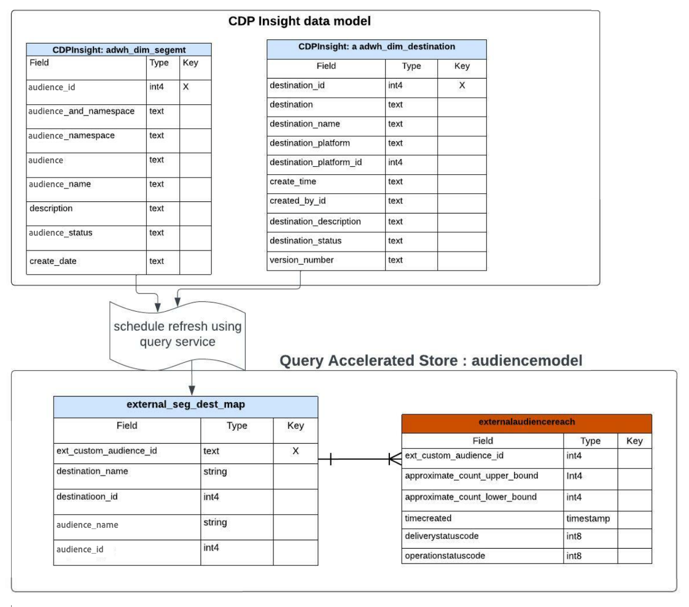

# 查詢加速商店報告見解指南

查詢加速存放區可讓您減少從資料獲得重要深入分析所需的時間和處理能力。 一般會定期（例如，每小時或每天）處理資料，並在此期間建立和報告彙總檢視。 分析這些從彙總資料產生的報表會得出旨在改善業務績效的見解。 query accelerated store提供快取服務、並行、互動式體驗和無狀態API。 不過，它假設資料已針對彙總查詢進行預處理和最佳化，而不是針對原始資料查詢。

查詢加速存放區可讓您建立自訂資料模型及/或擴充現有的Adobe Real-time Customer Data Platform資料模型。 然後，您就可以與互動，或將您的報表深入解析內嵌至您選擇的報表/視覺效果架構中。 請參閱Real-time Customer Data Platform前瞻分析資料模型檔案，瞭解如何[自訂您的SQL查詢範本，為您的行銷和關鍵績效指標(KPI)使用案例建立Real-Time CDP報告](../../../dashboards/data-models/cdp-insights-data-model-b2c.md)。

Adobe Experience Platform的Real-Time CDP資料模型提供設定檔、對象和目標的深入分析，並啟用Real-Time CDP深入分析控制面板。 本檔案將引導您完成建立報表見解資料模型的程式，同時也會說明如何視需要擴充Real-Time CDP資料模型。

## 先決條件

本教學課程使用使用者定義儀表板，在Platform UI中以視覺效果呈現自訂資料模型中的資料。 若要深入瞭解此功能，請參閱[使用者定義儀表板檔案](../../../dashboards/user-defined-dashboards.md)。

## 快速入門

您必須使用Data Distiller SKU來建立自訂資料模型，以利您的報表深入分析，並擴充內含豐富Platform資料的Real-Time CDP資料模型。 請參閱與資料Distiller SKU相關的[封裝](../../packaging.md)、[護欄](../../guardrails.md#query-accelerated-store)和[授權](../../data-distiller/license-usage.md)檔案。 如果您沒有Data Distiller SKU，請聯絡您的Adobe客戶服務代表以取得更多資訊。

## 建立報表見解資料模型

本教學課程以建立對象分析資料模型為例。 如果您使用一或多個廣告商平台觸及您的對象，您可以使用廣告商的API來取得對象的大致相符計數。

首先，您會擁有來自您的來源的初始資料模型（可能來自您的廣告商平台API）。 若要以彙總方式檢視您的原始資料，請建立報表深入分析模型（如下圖所述）。 這可讓一個資料集取得相符對象的上下限。


在此範例中，`externalaudiencereach`資料表/資料集是以ID為基礎，並追蹤相符計數的上下限。 `externalaudiencemapping`維度表格/資料集將外部ID對應至Platform上的目的地和對象。

## 使用Data Distiller建立報告深入分析的模型

接下來，建立報告分析模型（在此範例中為`audienceinsight`），並使用SQL命令`ACCOUNT=acp_query_batch and TYPE=QSACCEL`來確保在加速存放區上建立它。 然後使用查詢服務為`audienceinsight`資料庫建立`audienceinsight.audiencemodel`結構描述。

>[!NOTE]
>
>`ACCOUNT=acp_query_batch`命令需要Data Distiller SKU。 若不使用這項功能，資料湖上就會建立一般資料模型。

```sql
CREATE database audienceinsight WITH (TYPE=QSACCEL, ACCOUNT=acp_query_batch);
 
CREATE schema audienceinsight.audiencemodel;
```

## 建立表格、關係和填入資料

現在您已建立`audienceinsight`報告深入分析模型，請建立`externalaudiencereach`和`externalaudiencemapping`資料表並建立它們之間的關係。 接下來，使用`ALTER TABLE`命令在資料表之間新增外部索引鍵條件約束並定義關聯性。 下列SQL範例示範如何執行此動作。

```sql
CREATE TABLE IF NOT exists audienceinsight.audiencemodel.externalaudiencereach
WITH ( DISTRIBUTION = REPLICATE ) AS
  SELECT cast(null as int) approximate_count_upper_bound,
         cast(null as string) deliverystatusdescription,
         cast(null as timestamp)  timeupdated ,
         cast(null as int) operationstatuscode ,
         cast(null as string) operationstatusdescription,
         cast(null as int) approximate_count_lower_bound,
         cast(null as timestamp)timecreated ,
         cast(null as timestamp)timecontentupdated ,
         cast(null as int) deliverystatuscode ,
         cast(null as int)  ext_custom_audience_id
   WHERE false;
 
CREATE TABLE IF NOT exists audienceinsight.audiencemodel.externalaudiencemapping
WITH ( DISTRIBUTION = REPLICATE ) AS
SELECT cast(null as int) audience_id,
       cast(null as int) destination_id,
       cast(null as int) ext_custom_audience_id
 WHERE false;
 
ALTER TABLE externalaudiencereach ADD  CONSTRAINT FOREIGN KEY (ext_custom_audience_id) REFERENCES externalaudiencemapping (ext_custom_audience_id) NOT enforced;
```

成功執行兩個`ALTER TABLE`命令後，事實與維度資料表之間的關係就會形成。

執行陳述式後，請使用`SHOW datagroups;`命令從`audienceinsight.audiencemodel`傳回加速存放區上可用資料集的清單。 您的清單化結果應類似於以下提供的範例。

>[!IMPORTANT]
>
>只有加速存放區中的資料可從查詢服務無狀態API端點`POST /data/foundation/query/accelerated-queries`存取。

```console
    Database     |    Schema     | GroupType |      ChildType       |        ChildName        | PhysicalParent |               ChildId               
-----------------+---------------+-----------+----------------------+-------------------------+----------------+--------------------------------------
 audienceinsight | audiencemodel | QSACCEL   | Data Warehouse Table | externalaudiencemapping | true           | 9155d3b4-889d-41da-9014-5b174f6fa572
 audienceinsight | audiencemodel | QSACCEL   | Data Warehouse Table | externalaudiencereach   | true           | 1b941a6d-6214-4810-815c-81c497a0b636
```

## 查詢報表分析資料模型

使用查詢服務來查詢`audiencemodel.externalaudiencereach`維度資料表。 以下是範例查詢。

```sql
SELECT a.ext_custom_audience_id,
       a.approximate_count_upper_bound
FROM   audiencemodel.externalaudiencereach AS a
       LEFT OUTER JOIN audiencemodel.externalaudiencemapping AS b
                    ON ( ( a.ext_custom_audience_id ) =
                         ( b.ext_custom_audience_id ) )
GROUP  BY a.ext_custom_audience_id,
          a.approximate_count_upper_bound
LIMIT  5000 ;
```

清單化結果包含計數和ID。

```console
ext_custom_audience_id | approximate_count_upper_bound
------------------------+-------------------------------
 23850912218170554      |                          1000
 23850808585120554      |                       1012000
 23850808585220554      |                        100000
 23850814978560554      |                          1000
 23850808585180554      |                        421000
 23850814978510554      |                       3001000
 23850814978530554      |                        300000
 23850912218160554      |                        105000
 23850808584990554      |                          1000
 23850809520110554      |                          1000
(10 rows)
```

## 使用Real-Time CDP見解資料模型擴充您的資料模型

您可以使用其他詳細資料擴充您的對象模型，以建立更豐富的維度表格。 例如，您可以將對象名稱和目的地名稱對應到外部對象識別碼。 若要這麼做，請使用查詢服務建立或重新整理新資料集，並將其新增至對象模型，此模型會將對象和目的地與外部身分相結合。 下圖說明此資料模型擴充功能的概念。



## 建立維度表格以擴充您的報表見解模型

使用查詢服務將關鍵描述性屬性從擴充的Real-Time CDP維度資料集新增到`audienceinsight`資料模型，並建立事實表格與新維度表格之間的關係。 下列SQL示範如何將現有的維度表格整合至您的報表見解資料模型。

```sql
CREATE TABLE audienceinsight.audiencemodel.external_seg_dest_map AS
  SELECT ext_custom_audience_id,
         destination_name,
         audience_name,
         destination_status,
         a.destination_id,
         a.audience_id
  FROM   externalaudiencemapping AS a
         LEFT OUTER JOIN adwh_dim_audiences AS b
                      ON ( ( a.audience_id ) = ( b.audience_id ) )
         LEFT OUTER JOIN adwh_dim_destination AS c
                      ON ( ( a.destination_id ) = ( c.destination_id ) );
 
ALTER TABLE externalaudiencereach  ADD  CONSTRAINT FOREIGN KEY (ext_custom_audience_id) REFERENCES external_seg_dest_map (ext_custom_audience_id) NOT enforced;
```

使用`SHOW datagroups;`命令確認建立其他`external_seg_dest_map`維度表格。

```console
    Database     |     Schema     | GroupType |      ChildType       |                ChildName  | PhysicalParent |               ChildId               
-----------------+----------------+-----------+----------------------+----------------------------------------------------+----------------+--------------------------------------
 audienceinsight | audiencemodel | QSACCEL   | Data Warehouse Table | external_seg_dest_map      | true           | 4b4b86b7-2db7-48ee-a67e-4b28cb900810
 audienceinsight | audiencemodel | QSACCEL   | Data Warehouse Table | externalaudiencemapping    | true           | b0302c05-28c3-488b-a048-1c635d88dca9
 audienceinsight | audiencemodel | QSACCEL   | Data Warehouse Table | externalaudiencereach      | true           | 4485c610-7424-4ed6-8317-eed0991b9727
```

## 查詢您的擴充式加速存放區報告見解資料模型

現在`audienceinsight`資料模型已擴增，可以開始查詢了。 以下SQL顯示對應的目的地和對象清單。

```sql
SELECT a.ext_custom_audience_id,
       b.destination_name,
       b.audience_name,
       b.destination_status,
       b.destination_id,
       b.audience_id
FROM   audiencemodel.externalaudiencereach1 AS a
       LEFT OUTER JOIN audiencemodel.external_seg_dest_map AS b
                    ON ( ( a.ext_custom_audience_id ) = (
                         b.ext_custom_audience_id ) )
LIMIT  25; 
```

查詢會傳回查詢加速存放區上的所有資料集：

```console
ext_custom_audience_id | destination_name |       audience_name        | destination_status | destination_id | audience_id 
------------------------+------------------+---------------------------+--------------------+----------------+-------------
 23850808595110554      | FCA_Test2        | United States             | enabled            |     -605911558 | -1357046572
 23850799115800554      | FCA_Test2        | Born in 1980s             | enabled            |     -605911558 | -1224554872
 23850799115790554      | FCA_Test2        | Born in 1970s             | enabled            |     -605911558 |  1899603869
 23850798177620554      | FCA_Test1        | Billionaires              | enabled            |      321720439 |  1401872665
 23850814978560554      | FCA_Test3        | Canada - Saskatchewan     | enabled            |     1182494936 | -1917996562
 23850808585180554      | FCA_Test3        | United States             | enabled            |     1182494936 | -1357046572
 23850814978530554      | FCA_Test3        | Canada - British Columbia | enabled            |     1182494936 |  -652840507
 23850808585120554      | FCA_Test3        | Canada - Quebec           | enabled            |     1182494936 |  -519557860
 23850809520110554      | FCA_Test3        | Born in 1960s             | enabled            |     1182494936 |   237824266
 23850808585220554      | FCA_Test3        | Western Canada            | enabled            |     1182494936 |  1075937528
 23850808584990554      | FCA_Test3        | Canada - Ontario          | enabled            |     1182494936 |  1593438041
 23850814978510554      | FCA_Test3        | Canada - Alberta          | enabled            |     1182494936 |  1862946783
 23850912218170554      | FCA_Test4        | Canada - Alberta          | enabled            |     1549248886 |  1862946783
 23850912218160554      | FCA_Test4        | Born in 1970s             | enabled            |     1549248886 |  1899603869
```

## 使用使用者定義的儀表板將您的資料視覺化

現在您已建立自訂資料模型，您已準備好使用自訂查詢和使用者定義儀表板將您的資料視覺化。

以下SQL提供目的地中依對象區分的相符計數劃分，以及依對象區分的每個目的地對象劃分。

```sql
SELECT b.destination_name,
       a.approximate_count_upper_bound,
       b.audience_name
FROM   audiencemodel.externalaudiencereach AS a
       LEFT OUTER JOIN audiencemodel.external_seg_dest_map AS b
                    ON ( ( a.ext_custom_audience_id ) = (
                         b.ext_custom_audience_id ) )
GROUP  BY b.destination_name,
          a.approximate_count_upper_bound,
          b.audience_name
ORDER BY b.destination_name
LIMIT  5000
```

下圖提供使用您的報表前瞻分析資料模型可能進行的自訂視覺效果範例。


您的自訂資料模型可在使用者定義控制面板工作區中的可用資料模型清單中找到。 請參閱[使用者定義儀表板指南](../../../dashboards/user-defined-dashboards.md)，以取得有關如何使用自訂資料模型的指引。
