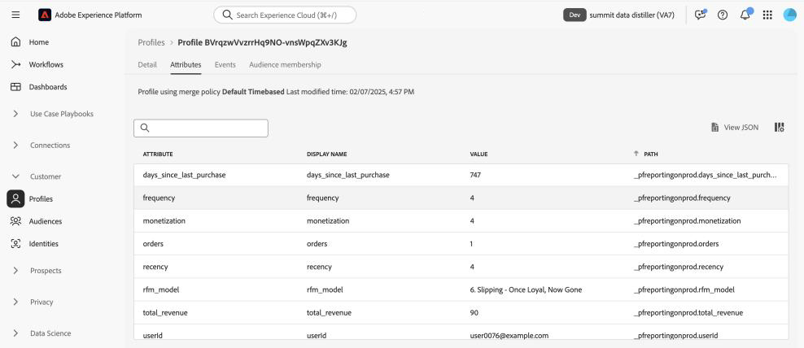

# Adobe Experience Platform Data Distiller - OS656提供最大化價值的重要秘訣

此頁面包含範例資料集，可套用您在Adobe Summit工作階段「OS656 — 使用Adobe Experience Platform Data Distiller最大化價值的重要提示」中學到的內容。 您將瞭解如何透過豐富即時客戶設定檔資料來加速Adobe Real-Time Customer Data Platform和Journey Optimizer的實施。 此擴充功能運用對客戶行為模式的深入分析，以建立體驗傳送和最佳化的對象。

透過Luma個案研究，您將分析使用者行為資料，並建立&#x200B;*造訪間隔、頻率、貨幣(RFM)*&#x200B;模型 — 一種根據購買模式進行客戶細分的行銷分析技術。

## 先決條件

若要執行此使用案例，您的Adobe Experience Platform執行個體必須獲得[Data Distiller](./overview.md)的授權。 如需詳細資訊，請聯絡您的Adobe代表。

## RFM模型概述 {#rfm-overview}

RFM (Recency (R)、Frequency (F)和Monetary (M)的縮寫)是資料導向的客戶細分和分析方法。 此方法會評估客戶行為的三個主要方面：客戶最近購買產品的時間、參與頻率以及花費金額。 透過量化這些因素，企業就能獲得對客戶區段的可操作性深入分析，並制定目標式行銷策略，以更佳地滿足個別客戶的需求。

## 瞭解RFM模型的客戶行為 {#understand-customer-behavior}

RFM模型使用三個關鍵引數，根據交易行為來細分客戶。

- **造訪間隔**&#x200B;會測量自客戶上次購買以來的時間，指出參與層級和未來的購買潛力。
- **頻率**&#x200B;追蹤客戶互動的頻率，以作為忠誠度和持續參與的明確指標。
- **貨幣價值**&#x200B;會評估客戶的總支出，強調其對業務的整體價值。

企業藉由結合這些因素，為每位客戶指派數值分數（通常範圍從`1`到`4`）。 分數越低，表示結果越好。 例如，所有類別中的客戶得分`1`都被視為最佳專案，顯示最近的活動、高參與度和大量支出。

## RFM模型的優點與限制 {#benefits-and-limitations}

每一種行銷模型技巧都包含折衷方案，兼具優點和限制。 RFM模型是瞭解客戶行為及調整行銷策略的寶貴工具。 其優勢包括細分客戶以個人化訊息、最佳化收入，以及提高回應率、保留率、滿意度及客戶期限值(CLTV)。

但是，RFM建模也有限制。 它根據造訪間隔、頻率和貨幣值來假設區段內的一致性，這可能會過度簡化客戶行為。 此模型也會將相等的權重指派給這些因素，可能會錯誤代表客戶價值。 此外，它並未說明相關情境（例如產品特有特徵或客戶偏好設定），而可能導致對購買行為的誤解。

## 建立動態RFM分數型SQL對象 {#build-a-dynamic-rfm-audience}

在開始Luma案例研究之前，您需要擷取範例資料集。 首先，[選取連結，在本機下載`luma_web_data.zip`資料集](../resources/luma_web_data.zip)。 範例資料集是壓縮的.zip格式的csv檔案，以符合使用案例。 使用Adobe Acrobat或信任的檔案擷取工具（例如作業系統的內建公用程式）解壓縮此ZIP檔案。 實際上，您通常會從Adobe Analytics、Adobe Commerce或Adobe Web/Mobile SDK取得資料。

在本教學課程中，您將使用Data Distiller將相關事件和欄位擷取為標準化CSV格式。 目標是僅包含基本欄位，同時維持扁平的資料結構，以提高效率和易用性。

### 步驟1：將CSV資料上傳至Experience Platform {#upload-csv-data}

請依照下列步驟，將CSV檔案上傳至Adobe Experience Platform。

#### 從CSV檔案建立資料集 {#create-a-dataset}

在Experience Platform UI中，選取左側導覽邊欄中的&#x200B;**[!UICONTROL 資料集]**，然後選取&#x200B;**[!UICONTROL 建立資料集]**。 然後從可用選項中選取&#x200B;**[!UICONTROL 從CSV檔案建立資料集]**。

[!UICONTROL 設定資料集]面板隨即顯示。 在&#x200B;**[!UICONTROL Name]**&#x200B;欄位中，將資料集名稱輸入為&quot;luma_web_data&quot;，然後選取&#x200B;**[!UICONTROL 下一步]**。

[!UICONTROL 新增資料]面板隨即顯示。 將CSV檔案拖放到&#x200B;**[!UICONTROL 新增資料]**&#x200B;方塊中，或選取&#x200B;**[!UICONTROL 選擇檔案]**&#x200B;以瀏覽並上傳檔案。

若要深入瞭解此程式，請參閱資料集UI指南中的[批次擷取教學課程](../../ingestion/tutorials/ingest-batch-data.md)和[資料集建立工作流程](../../catalog/datasets/user-guide.md#create)。

#### 檢閱並完成上傳 {#review-and-complete-upload}

上傳檔案後，資料預覽會顯示在UI底部。 選取&#x200B;**[!UICONTROL 完成]**&#x200B;以完成上傳。


隨即顯示「luma_web_data」資料集的資料集活動檢視。 手動上傳CSV檔案
已擷取為批次，並由[!UICONTROL 批次ID]識別。 右側的面板會將表格名稱顯示為`luma_web_data`。

>[!TIP]
>
>在Data Distiller中寫入查詢時，請使用表格名稱，而非資料集名稱。 資料集名稱僅用於在UI中瀏覽。


<!--  
My table name is; luma_web_data_20250312_235611_817 Should we explain the suffix? 
-->

資料處理完畢後，選取右上角的[!UICONTROL 預覽資料集]以預覽資料集。 這是資料集預覽的顯示方式：


#### 結構描述考量事項 {#schema-considerations}

不需要結構化XDM結構描述（例如記錄、事件或B2B結構描述），因為資料會匯入為原始CSV檔案。 該資料集改用臨時結構描述。

>[!TIP]
>
>臨時結構描述是XDM結構描述，其欄位僅供單一資料集使用，並具備名稱空間。 臨時結構描述用於Experience Platform的各種資料擷取工作流程，並用於建立特定型別的來源連線。

雖然Data Distiller支援所有結構描述型別，但擷取至Real-Time Customer Profile的最終資料集將使用記錄XDM結構描述。

### 步驟2：連線至資料湖並探索可用的資料集 {#connect-to-the-data-lake-and-explore-datasets}

下一步是探索Adobe Experience Platform Data Lake中的資料，以確保準確性和完整性。 資料必須準確且完整，才能產生有意義的深入分析，但在資料傳輸期間可能會發生錯誤、不一致或遺失值。 因此，資料驗證和探索至關重要。

>[!TIP]
>
>Data Lake會儲存未處理的原始資料（例如事件日誌、點按資料流資料和大量擷取的記錄），以供分析和處理。 設定檔存放區包含客戶可識別的資料，包括身分拼接事件和屬性資訊，以支援即時個人化和啟用。

使用Data Distiller，透過各種作業驗證資料集的品質和完整性。 若要確認資料在內嵌期間已正確轉譯，請執行`SELECT`個查詢以檢查、驗證及分析資料。 此程式有助於識別和解決不一致、不一致或遺失的資訊。

#### 執行基本探索查詢 {#basic-exploration-queries}

在Adobe Experience Platform UI中，選取左側導覽邊欄中的&#x200B;**[!UICONTROL 查詢]**，然後選取&#x200B;**[!UICONTROL 建立查詢]**。 「查詢編輯器」即會出現。

將下列查詢貼到編輯器中並執行：

```sql
SELECT * FROM luma_web_data; 
```

查詢結果顯示在&#x200B;**[!UICONTROL 結果]**&#x200B;索引標籤中的查詢編輯器下方。 若要展開新對話方塊中的結果，請選取&#x200B;**[!UICONTROL 檢視結果]**。 結果看起來類似下圖。

![基本查詢探索結果的[查詢結果]對話方塊。](../images/data-distiller/top-tips-to-maximize-value/basic-query-exploration-results.png)

如需詳細資訊，請參閱查詢執行的[一般指引](../best-practices/writing-queries.md)檔案。

#### 專注於訂單並排除已取消的交易 {#focus-orders-exclude-cancelled}

RFM模型會根據完成的購買來評估造訪間隔、頻率和貨幣值。 非交易式事件（例如頁面檢視和結帳互動）會從分析中排除。 此外，取消的訂單必須移除，因為它們不會有助於有效的RFM計算，而且需要不同的處理方式。

為確保準確性：

- 識別與取消關聯的購買ID，並使用`GROUP BY`加以分組。
- 從資料集中排除這些購買ID。
- 篩選資料以僅保留已完成的訂單。

下列查詢示範如何從資料集中識別及排除已取消的訂單。

第一個查詢會選取與取消關聯的所有非Null的購買ID，並使用`GROUP BY`加以彙總。 必須從資料集中排除產生的購買ID。

```sql
CREATE VIEW orders_cancelled
AS
  SELECT purchase_id
  FROM   luma_web_data
  WHERE  event_type IN ( 'order', 'cancellation' )
         AND purchase_id IS NOT NULL
  GROUP  BY purchase_id
  HAVING Count(DISTINCT event_type) = 2; 
```

第二個查詢只會擷取不屬於此排除集的購買ID。

```sql
SELECT *
FROM   luma_web_data
WHERE  purchase_id NOT IN (SELECT purchase_id
                           FROM   orders_cancelled)
        OR purchase_id IS NULL; 
```

第三個查詢會從資料集中移除所有無序事件。

```sql
SELECT *
FROM   luma_web_data
WHERE  event_type = 'order'
       AND purchase_id NOT IN (SELECT purchase_id
                               FROM   orders_cancelled); 
```

### 步驟3：使用資料Distiller函式豐富資料 {#enrich-the-data}

接下來，使用Data Distiller來擷取及轉換客戶資料、產生RFM分數、彙總交易，以及透過購買行為來細分客戶。 請依照下列步驟計算「造訪間隔」、「頻率」和「貨幣」(RFM)值，建立對象模型，並準備啟動見解。

#### 計算每個唯一使用者ID的RFM分數

若要計算RFM分數，請使用欄位篩選從原始資料中擷取關鍵欄位。

下一個查詢是建立在上一節的邏輯上，方法是選取電子郵件作為`userid`，因為每個訂單都需要電子郵件登入。 資料Distiller套用`TO_DATE`函式將時間戳記轉換為日期格式。 `total_revenue`欄位代表每個交易的價格，稍後會加總每個`userid`的價格。

```sql
SELECT email AS userid, 
       purchase_id AS purchaseid, 
       price_total AS total_revenue, -- reflects the price for each individual transaction
       TO_DATE(timestamp) AS purchase_date -- converts timestamp to date format
FROM luma_web_data 
WHERE event_type = 'order' 
      AND purchase_id NOT IN (SELECT purchase_id FROM orders_cancelled) 
      AND email IS NOT NULL;
```

結果看起來像下面的影像。


接下來，建立`TABLE`，將上一個查詢的結果儲存在衍生資料集中。 將下列命令複製並貼到查詢編輯器以建立`TABLE`。

```sql
CREATE TABLE IF NOT EXISTS order_data AS
  SELECT email              AS userid,
         purchase_id        AS purchaseid,
         price_total        AS total_revenue,
         To_date(timestamp) AS purchase_date
  FROM   luma_web_data
  WHERE  event_type = 'order'
         AND purchase_id NOT IN (SELECT purchase_id FROM orders_cancelled)
         AND email IS NOT NULL; 
```

結果看起來類似下列影像，但資料集ID不同。


最佳做法是執行簡單的探索查詢來檢查資料集中的資料。 使用以下陳述式來檢視您的資料。

```sql
SELECT * FROM order_data;
```

![檢查資料查詢的[查詢結果]對話方塊。](../images/data-distiller/top-tips-to-maximize-value/inspect-data.png)

#### 彙總交易以產生RFM值 {#aggregate-transactions}

若要計算RFM值，此查詢會彙總每個使用者的交易。

`DATEDIFF(CURRENT_DATE, MAX(purchase_date)) AS days_since_last_purchase`函式會計算每位使用者自最近一次購買以來的天數。

使用下列SQL查詢：

```sql
SELECT 
    userid, 
    DATEDIFF(CURRENT_DATE, MAX(purchase_date)) AS days_since_last_purchase, 
    COUNT(purchaseid) AS orders, 
    SUM(total_revenue) AS total_revenue 
FROM order_data 
GROUP BY userid;
```

結果看起來像下面的影像。


若要提高查詢效率和可重複使用性，請建立`VIEW`以儲存彙總的RFM值。

```sql
CREATE VIEW rfm_values
AS
  SELECT userid,
         DATEDIFF(current_date, MAX(purchase_date)) AS days_since_last_purchase,
         COUNT(purchaseid)                          AS orders,
         SUM(total_revenue)                         AS total_revenue
  FROM   order_data
  GROUP BY userid; 
```

結果類似下列影像，但具有不同的ID。


同樣作為最佳實務，請執行簡單的探索查詢以檢查檢視中的資料。 請使用下列陳述式。

```sql
SELECT * FROM rfm_values;
```

下列熒幕擷圖顯示查詢的範例結果，顯示每個使用者的計算RFM值。 結果對應至`CREATE VIEW`查詢的檢視識別碼。

![彙總RFM值的[查詢結果]對話方塊。](../images/data-distiller/top-tips-to-maximize-value/view-of-aggregated-rfm-values.png)

#### 產生RFM多維度立方體 {#generate-multi-dimensional-cube}

若要根據客戶的RFM分數來劃分客戶，請使用RFM多維度立方體。 `NTILE`視窗函式將值排序為排名值區，並將每個維度劃分為四個相等的群組（四分位數），以便進行結構化分段。

- 造訪間隔：客戶排名是根據他們最近購買(`days_since_last_purchase`)的情形。 最近購買者則位於群組1，而最近未購買者則位於群組4。
- 頻率：客戶排名是根據其購買頻率(`ORDER BY orders DESC`)。 最常購買的是在群組1，而最不常購買的是在群組4。
- 貨幣：客戶依總支出(`total_revenue`)排名。 最高支出者位於群組1，最低支出者位於群組4。

執行下列SQL查詢，以產生RFM多維度多維度資料集：

```sql
SELECT userid,
       days_since_last_purchase,
       orders,
       total_revenue,
       5 - NTILE(4)
             OVER (
               ORDER BY days_since_last_purchase DESC) AS recency,
       NTILE(4)
         OVER (
           ORDER BY orders DESC)                       AS frequency,
       NTILE(4)
         OVER (
           ORDER BY total_revenue DESC)                AS monetization
FROM rfm_values; 
```

結果如下所示。

![多維度資料集的[查詢結果]對話方塊，第1](../images/data-distiller/top-tips-to-maximize-value/multi-dimensional-cube-results-1.png)部分

部分

接下來，使用以下陳述式為此資料建立`VIEW`。

為RFM多維度Cube建立`VIEW`可儲存預先分段的資料，進而提高效率，避免在未來的查詢中重新計算RFM分數。 它簡化了SQL敘述句，確保資料的一致性，並增強可重複使用性，以供進一步分析。

```sql
CREATE OR replace VIEW rfm_scores
AS
  SELECT userid,
         days_since_last_purchase,
         orders,
         total_revenue,
         5 - NTILE(4)
               over (
                 ORDER BY days_since_last_purchase DESC) AS recency,
         NTILE(4)
           over (
             ORDER BY orders DESC)                       AS frequency,
         NTILE(4)
           over (
             ORDER BY total_revenue DESC)                AS monetization
  FROM   rfm_values;
```

結果看起來類似下列影像，但檢視ID不同。

![ &#39;rfm_scores&#39;檢視的[查詢結果]對話方塊。](../images/data-distiller/top-tips-to-maximize-value/rfm_score-view-result.png)

#### 模型RFM區段 {#model-rfm-segments}

在計算RFM分數後，客戶可以分為下列六個優先順序區段：

1. `Core`：擁有高造訪間隔、頻率和貨幣值（造訪間隔= 1，頻率= 1，貨幣= 1）的最佳客戶。
2. `Loyal`：一致但不是最高消費者的常見客戶（頻率= 1）。
3. `Whales`：最高花費者，無論造訪間隔和頻率為何（貨幣= 1）。
4. `Promising`：經常但消費較低者（頻率= 1， 2， 3；貨幣= 2， 3， 4）。
5. `Rookies`：新客戶具有低頻率（造訪間隔= 1，頻率= 4）。
6. `Slipping`：活動減少的原忠實客戶（造訪間隔= 2、3、4；頻率= 4）。

若要簡化存取和重複使用，請建立儲存RFM區段、分數和值的`VIEW`。

下列SQL中的`CASE`陳述式會根據其RFM分數將客戶分類為區段，並將結果指派給`RFM_Model`變數。

+++選取以檢視SQL

```sql
CREATE OR replace VIEW rfm_model_segment
AS
  SELECT userid,
         days_since_last_purchase,
         orders,
         total_revenue,
         recency,
         frequency,
         monetization,
         CASE
           WHEN recency = 1
                AND frequency = 1
                AND monetization = 1 THEN '1. Core - Your Best Customers'
           WHEN recency IN( 1, 2, 3, 4 )
                AND frequency = 1
                AND monetization IN ( 1, 2, 3, 4 ) THEN
           '2. Loyal - Your Most Loyal Customers'
           WHEN recency IN( 1, 2, 3, 4 )
                AND frequency IN ( 1, 2, 3, 4 )
                AND monetization = 1 THEN
           '3. Whales - Your Highest Paying Customers'
           WHEN recency IN( 1, 2, 3, 4 )
                AND frequency IN ( 1, 2, 3 )
                AND monetization IN( 2, 3, 4 ) THEN
           '4. Promising - Faithful customers'
           WHEN recency = 1
                AND frequency = 4
                AND monetization IN ( 1, 2, 3, 4 ) THEN
           '5. Rookies - Your Newest Customers'
           WHEN recency IN ( 2, 3, 4 )
                AND frequency = 4
                AND monetization IN ( 1, 2, 3, 4 ) THEN
           '6. Slipping - Once Loyal, Now Gone'
         END RFM_Model
  FROM   rfm_scores; 
```

+++

產生的`VIEW`遵循與先前建立相同的結構，但具有不同的ID。

最佳做法是執行簡單的探索查詢來檢查檢視中的資料。 請使用下列陳述式。

<!-- Double check this SQL. I wrote it.- it was absent fom the KT doc. -->

```sql
SELECT * FROM rfm_model_segment;
```

<!-- Perhaps these VIEW results could be chopped? -->

下列熒幕擷取畫面顯示`SELECT * FROM rfm_model_segment;`查詢的範例結果，顯示分段RFM模型資料。 輸出反映產生的`VIEW`的結構，包括根據RFM分數指派的客戶區段。

![探索&#39;rfm_model_segment&#39;查詢的[查詢結果]對話方塊。](../images/data-distiller/top-tips-to-maximize-value/rfm_model_segment-query-results-1.png)

![探索&#39;rfm_model_segment&#39;查詢的第二個[查詢結果]對話方塊。](../images/data-distiller/top-tips-to-maximize-value/rfm_model_segment-query-results-2.png)

### 步驟4：使用SQL將RFM資料批次擷取至Real-Time Customer Profile {#sql-batch-ingest-rfm-data}

接著，將擴充RFM的客戶資料批次擷取到即時客戶設定檔。 首先，建立已啟用設定檔的資料集，並使用SQL插入轉換後的資料。

#### 建立衍生資料集以儲存RFM屬性 {#create-a-derived-dataset}

由於此資料集將內嵌至設定檔存放區，因此需要分割區索引鍵。

>[!TIP]
>
>主要身分欄位作為分割區索引鍵，確保有效的資料發佈、擷取和查詢效能。 使用身分名稱空間指派主要身分，會將相關的設定檔記錄分組在一起，以最佳化設定檔存放區中的查閱和更新。

建立空白資料集以儲存RFM屬性並指派主要身分。

在此SQL敘述句中：

- `userId TEXT PRIMARY IDENTITY NAMESPACE 'Email'`：使用&#39;Email&#39;名稱空間將userId資料行定義為主要身分&#x200B;。
- `days_since_last_purchase INTEGER`：儲存自使用者上次購買以來的天數&#x200B;。
- `orders INTEGER`：代表使用者下單的訂單總數&#x200B;。
- `total_revenue DECIMAL(18, 2)`：擷取使用者產生的總收入，精確度最高為18位數和2位小數&#x200B;。
- `recency INTEGER, frequency INTEGER, monetization INTEGER`：儲存使用者的個別RFM分數&#x200B;。
- `rfm_model TEXT`：保留指派給使用者的RFM區段分類&#x200B;。
- `WITH (LABEL = 'PROFILE')`：在Experience Platform中將表格標籤為已啟用設定檔，確保擷取的資料有助於建立即時客戶設定檔&#x200B;。

>[!NOTE]
>
>「電子郵件」名稱空間是Adobe Experience Platform中的[標準身分名稱空間](../../identity-service/features/namespaces.md#standard)。 定義身分欄位時，請確定已指定適當的名稱空間，以促進正確的身分解析。&#x200B;URL
>
>如需定義身分識別欄位和使用身分識別名稱空間的詳細資訊，請參閱[身分識別服務檔案](../../identity-service/home.md)或[在Adobe Experience Platform UI中定義身分識別欄位的指南](../../xdm/ui/fields/identity.md)。

由於「查詢編輯器」支援循序執行，因此您可以在單一工作階段中包含表格建立和資料插入查詢。 下列SQL會先建立啟用設定檔的表格來儲存RFM屬性。 然後，它會從`rfm_model_segment`將擴充RFM的客戶資料插入`adls_rfm_profile`表格，在您的租使用者特定名稱空間（即時客戶設定檔擷取所需）下建構每個記錄。

由於「查詢編輯器」支援循序執行，因此您可以在單一工作階段中執行表格建立和資料插入查詢。 下列SQL會先建立啟用設定檔的表格來儲存RFM屬性。 然後，它會從`rfm_model_segment`將擴充RFM的客戶資料插入`adls_rfm_profile`表格，確保每個記錄都在您的租使用者特定名稱空間(`_{TENANT_ID}`)下正確建構。 此名稱空間是即時客戶個人檔案擷取和準確身分解析的必要條件。

>[!IMPORTANT]
>
>將`_{TENANT_ID}`取代為您組織的租使用者名稱空間。 此名稱空間是貴組織所獨有的，可確保在Adobe Experience Platform中正確指派所有擷取的資料。

```sql
CREATE TABLE IF NOT EXISTS adls_rfm_profile (
    userId TEXT PRIMARY IDENTITY NAMESPACE 'Email', -- Primary identity field using the 'Email' namespace
    days_since_last_purchase INTEGER, -- Days since the last purchase
    orders INTEGER, -- Total number of orders
    total_revenue DECIMAL(18, 2), -- Total revenue with two decimal precision
    recency INTEGER, -- Recency score
    frequency INTEGER, -- Frequency score
    monetization INTEGER, -- Monetary score
    rfm_model TEXT -- RFM segment classification
) WITH (LABEL = 'PROFILE'); -- Enable the table for Real-Time Customer Profile

INSERT INTO adls_rfm_profile
SELECT STRUCT(userId, days_since_last_purchase, orders, total_revenue, recency,
              frequency, monetization, rfm_model) _{TENANT_ID}
FROM rfm_model_segment;
```

此查詢的結果類似於此Playbook中之前的資料集建立，但ID不同。

建立資料集後，請導覽至&#x200B;**[!UICONTROL 資料集]** > **[!UICONTROL 瀏覽]** > `adls_rfm_profile`以驗證資料集是空的。


您也可以導覽至「**[!UICONTROL 結構描述]** > **[!UICONTROL 瀏覽]** > `adls_rfm_profile`」，以檢視您新建立之資料集的XDM個別設定檔結構描述圖表及其自訂欄位群組。


#### 將資料插入新建立的衍生資料集中 {#insert-data-into-derived-dataset}

接下來，將資料從`rfm_model_segment VIEW`插入為即時客戶設定檔啟用的`adls_rfm_profile`。

請確定`INSERT`陳述式的`SELECT`查詢中的欄位順序完全符合`rfm_model_segment`的結構。 此對齊方式可確保將來自`rfm_model_segment`的值正確插入目標資料表中對應的欄位中。 來源和目標欄位之間的未對齊可能導致資料不相符。

>[!NOTE]
>
>此查詢以批次模式執行，這需要啟動叢集以執行流程。 該操作會從資料湖讀取資料、在叢集中處理該資料，並將結果寫入回資料湖。

```sql
INSERT INTO adls_rfm_profile
SELECT Struct(userid, days_since_last_purchase, orders, total_revenue, recency,
              frequency, monetization, rfm_model) _{TENANT_ID}
FROM   rfm_model_segment; 
```

完成後，查詢輸出在主控台中顯示「查詢完成」。

### 步驟5：排程查詢以進行批次處理 {#schedule-the-query}

現在您的SQL程式碼會產生衍生的資料集，並啟用它以用於即時客戶設定檔，下一步就是將查詢排程在特定間隔執行，以自動化更新。 透過自動資料集更新，您不再需要手動執行。

#### 排程查詢執行

儲存SQL之後，請瀏覽至&#x200B;**[!UICONTROL 範本]**&#x200B;索引標籤，以檢視儲存的查詢並啟動排程程式。 排程查詢的方式有兩種：

從右側邊欄選取&#x200B;**[!UICONTROL 新增排程]**。

![已反白顯示[查詢]工作區的[編輯]索引標籤。](../images/data-distiller/top-tips-to-maximize-value/add-schedule-1.png)

或者，選取範本名稱下方的&#x200B;**[!UICONTROL 排程]**&#x200B;索引標籤，然後選取&#x200B;**[!UICONTROL 新增排程]**。

![反白顯示[新增排程]的[查詢]工作區排程。](../images/data-distiller/top-tips-to-maximize-value/add-schedule-2.png)

如需排程查詢的詳細資訊，請參閱[查詢排程檔案](../ui/query-schedules.md)。

[!UICONTROL 排程詳細資料]檢視就會顯示。 從此處，輸入以下詳細資料以設定排程：

- **[!UICONTROL 執行頻率]**： **每週**
- **[!UICONTROL 執行日]**： **星期一與星期二**
- **[!UICONTROL 排程執行時間]**： **上午10:10 UTC**
- **[!UICONTROL 排程期間]**： **2025年3月17日至4月30日**

選取&#x200B;**[!UICONTROL 儲存]**&#x200B;以確認排程。

![排程詳細資料，已設定設定並醒目提示[儲存]。](../images/data-distiller/top-tips-to-maximize-value/set-schedule.png)

儲存排程後，您可以隨時導覽至&#x200B;**[!UICONTROL 排程查詢]**&#x200B;索引標籤，以監視排程的資料Distiller工作。 有關[檢視查詢執行狀態、錯誤訊息和警示](../ui/monitor-queries.md)的詳細資訊，請參閱監視排程查詢檔案。

設定之後，SQL查詢會在定義的間隔自動執行，確保資料保持最新狀態，而不需要手動干預。

### 步驟6：建立並啟用RFM型對象

<!-- double check this intro paragraph ... -->

在本教學課程中，有兩個方法可以建立和啟用RFM型對象。

- 解決方案1：使用Data Distiller和SQL查詢直接建立及啟用對象。
- 解決方案2：使用預先計算的RFM屬性（不使用SQL）在Experience Platform UI中定義和管理對象。

選擇最適合您工作流程的方法。

#### 解決方案1：透過Data Distiller的SQL對象 {#data-distiller-sql-audience}

使用`CREATE AUDIENCE AS SELECT`命令來定義新對象。 建立的對象儲存在資料集中，並在&#x200B;**[!UICONTROL 資料Distiller]**&#x200B;下的&#x200B;**[!UICONTROL 對象]**&#x200B;工作區中註冊。

使用SQL擴充功能建立的對象會自動在[!UICONTROL 對象]工作區的[!UICONTROL 資料Distiller]來源下註冊。 您可以從[對象入口網站](../../segmentation/ui/audience-portal.md)視需要檢視、管理及啟用對象。


如需SQL對象的詳細資訊，請參閱[資料Distiller對象檔案](../data-distiller-audiences/overview.md)。 若要瞭解如何在UI中管理對象，請參閱[對象入口網站概觀](../../segmentation/ui/audience-portal.md#audience-list)。

#### 建立客群 {#create-an-audience}

若要建立對象，請使用下列SQL命令：

```sql
-- Define an audience for best customers based on RFM scores
CREATE AUDIENCE rfm_best_customer 
WITH (
    primary_identity = _{TENANT_ID}.userId, 
    identity_namespace = queryService
) AS ( 
    SELECT * FROM adls_rfm_profile 
    WHERE _{TENANT_ID}.recency = 1 
        AND _{TENANT_ID}.frequency = 1 
        AND _{TENANT_ID}.monetization = 1 
);

-- Define an audience that includes all customers
CREATE AUDIENCE rfm_all_customer 
WITH (
    primary_identity = _{TENANT_ID}.userId, 
    identity_namespace = queryService
) AS ( 
    SELECT * FROM adls_rfm_profile 
);

-- Define an audience for core customers based on email identity
CREATE AUDIENCE rfm_core_customer 
WITH (
    primary_identity = _{TENANT_ID}.userId, 
    identity_namespace = Email
) AS ( 
    SELECT * FROM adls_rfm_profile 
    WHERE _{TENANT_ID}.recency = 1 
        AND _{TENANT_ID}.frequency = 1 
        AND _{TENANT_ID}.monetization = 1 
);
```

#### 插入對象 {#insert-an-audience}

若要將設定檔新增至現有對象，請使用`INSERT INTO`命令。 這可讓您將個別設定檔或整個對象新增到現有的對象資料集。

```sql
-- Insert profiles into the audience dataset
INSERT INTO AUDIENCE adls_rfm_audience 
SELECT 
    _{TENANT_ID}.userId, 
    _{TENANT_ID}.days_since_last_purchase, 
    _{TENANT_ID}.orders, 
    _{TENANT_ID}.total_revenue, 
    _{TENANT_ID}.recency, 
    _{TENANT_ID}.frequency, 
    _{TENANT_ID}.monetization 
FROM adls_rfm_profile 
WHERE _{TENANT_ID}.rfm_model = '6. Slipping - Once Loyal, Now Gone';
```

#### 新增設定檔至對象 {#add-profiles-to-audience}

使用下列SQL命令來建立和填入對象：

```sql
-- Create an empty audience dataset
CREATE AUDIENCE adls_rfm_audience 
WITH (
    primary_identity = userId, 
    identity_namespace = Email
) AS 
SELECT 
    CAST(NULL AS STRING) userId, 
    CAST(NULL AS INTEGER) days_since_last_purchase, 
    CAST(NULL AS INTEGER) orders, 
    CAST(NULL AS DECIMAL(18,2)) total_revenue, 
    CAST(NULL AS INTEGER) recency, 
    CAST(NULL AS INTEGER) frequency, 
    CAST(NULL AS INTEGER) monetization, 
    CAST(NULL AS STRING) rfm_model 
WHERE FALSE;
```

#### 刪除對象 {#delete-an-audience}

若要刪除現有對象，請使用`DROP AUDIENCE`命令。 如果對象不存在，除非指定`IF EXISTS`，否則會發生例外狀況。

使用下列SQL命令刪除對象：

```sql
DROP AUDIENCE IF EXISTS adls_rfm_audience;
```

#### 解決方案2：建立具有RFM屬性的對象 {#create-audience-with-rfm-attributes}

使用RFM屬性，根據使用者的行為和特性來劃分使用者。 本節將引導您透過Adobe Experience Platform UI，使用RFM分數來定義對象。

若要驗證資料是否已載入即時客戶設定檔，請瀏覽至&#x200B;**[!UICONTROL 客戶] > [!UICONTROL 設定檔] > [!UICONTROL 瀏覽]**。 選取&#x200B;**[!UICONTROL 識別名稱空間]**&#x200B;做為`Email`並輸入`user0076@example.com`。 檢查設定檔詳細資訊，確認其中包含預期的RFM屬性。




若要瀏覽現有的對象，請從左側導覽面板中選取&#x200B;**[!UICONTROL 對象]**，並確定已選取&#x200B;**[!UICONTROL 瀏覽]**&#x200B;索引標籤。 沙箱中的可用對象清單隨即顯示。 選取對象會顯示其說明、合格規則，以及包含的設定檔數目。

若要建立新對象，請選取右上角的&#x200B;**[!UICONTROL 建立對象]**。 會顯示一個對話方塊，其中包含兩個選項。 選取&#x200B;**[!UICONTROL 建置規則]**，然後選取&#x200B;**[!UICONTROL 建立]**。


對象構成UI提供設定檔屬性的存取權。 導覽至&#x200B;**[!UICONTROL 屬性] > [!UICONTROL XDM個別設定檔]**&#x200B;以檢視可用的屬性。

如需使用對象構成的詳細資訊，請參閱[對象構成UI指南](../../segmentation/ui/audience-composition.md)。 如需使用區段產生器的詳細資訊，請參閱[區段產生器UI指南](../../segmentation/ui/segment-builder.md)。


在Data Distiller中建立的自訂屬性儲存在符合租使用者名稱空間名稱的資料夾中，這會顯示在沙箱名稱旁。 這些屬性可用來定義對象細分條件。


若要使用RFM屬性建立對象，請將`Rfm_Model`屬性拖放至Audience Composer中。 這些屬性可用於「Edge」、「串流」和「批次對象」。


若要完成對象，請選取右上角的&#x200B;**[!UICONTROL 儲存並發佈]**。 儲存後，新建立的對象會出現在[!UICONTROL 對象]工作區中，您可在此檢閱其摘要和合格條件。

使用「區段產生器」來存取衍生的RFM屬性，並設計其他對象。 根據RFM分數啟用新建立的SQL對象，並將其傳送到任何偏好的目的地，包括Adobe Journey Optimizer。
