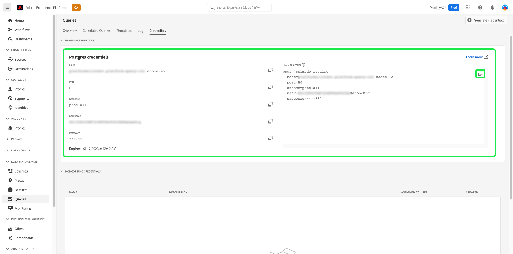

# 查詢服務中的資料控管

Adobe Experience Platform將來自多個企業系統的資料匯整在一起，允許您根據需求透過Query Service來清理、塑造、操控及豐富資料。 這可讓行銷人員以更佳方式識別、了解客戶，並與其互動。 確保適當的資料治理是處理個人資訊的一個關鍵方面，因為某些資料可能會受到基於組織政策和法律法規的使用限制。 確保所攝取的資料及其相關操作符合定義的資料使用策略至關重要。

Query Service中的資料控管可讓您管理客戶資料，並確保符合適用於資料使用的法規、限制和政策。 在確保已根據您的企業定義的法規應用使用策略時，此功能起著關鍵作用。

建議定期執行資料處理的組織概述、實務和執行這些准則，為所有使用者建立注重隱私的環境。

使用查詢服務時，以下類別有助於遵守資料法規遵循：

1. 安全性
1. 稽核
1. 資料使用量
1. 隱私權
<!-- 1. Data hygiene -->

本檔案會檢查各個不同的治理領域，並示範如何在使用Query Service時促進資料合規性。 請參閱 [控管、隱私權及安全性概觀](../../landing/governance-privacy-security/overview.md) 有關Experience Platform如何讓您管理客戶資料和確保法規遵從性的更多資訊。

## 安全性

資料安全是保護資料不受未經授權的訪問，並確保資料在其整個生命週期中安全訪問的過程。 通過角色和權限的應用，如基於角色的訪問控制和基於屬性的訪問控制，在Experience Platform中保持安全訪問。 憑證、SSL和資料加密也用於確保跨平台的資料保護。

查詢服務的安全性分為下列類別：

* [存取控制](#access-control):存取權是由角色和權限（包括資料集和欄層級權限）所控制。
* 通過 [連通性](#connectivity):資料會透過Platform和外部用戶端，透過具有即將到期憑證或非即將到期憑證的有限連線獲得保護。
* 通過 [加密和系統級密鑰](#encryption):在資料處於靜止狀態時，通過加密確保資料安全。

<!-- * Securing data through [encryption and customer-managed keys (CMK)](#encryption-and-customer-managed-keys): Access controlled through encryption when data is at rest. -->

### 存取控制 {#access-control}

Adobe Experience Platform中的存取控制可讓您使用 [Adobe Admin Console](https://adminconsole.adobe.com/) 使用角色型權限管理對查詢服務功能的存取。 同樣地，您也可以透過結構和資料欄位的標籤管理，控制對特定資料屬性的存取。

本節概述使用者必須具備的必要存取控制權限，才能充分運用Query Service功能。 請參閱 [管理權限](../../access-control/ui/permissions.md) 和 [管理使用者](../../access-control/ui/users.md) 以取得指派存取權至產品設定檔的詳細說明。

#### 相關權限

相關的訪問控制權限根據其範圍級別在下表中定義。

**查詢執行權限**

要在查詢服務中運行查詢，必須為用戶分配具有以下權限的角色：

| 權限 | 說明 |
|---|---|
| [!UICONTROL 管理查詢] | 此權限可讓使用者執行資料探索和批次查詢，以讀取現有資料集或在資料集上寫入資料。 這包括兩者 `CREATE TABLE AS SELECT` (`CTAS`)和 `INSERT INTO AS SELECT` (`ITAS`)查詢。 |

**資料集權限**

本節可指南您透過Query Service查詢資料時，存取資料集所需的資源型存取權。

透過「權限」介面，您可以使用下列權限，為資料集和結構定義資源型存取控制：

| 權限 | 說明 |
|---|---|
| [!UICONTROL 管理資料集] | 此權限提供結構的唯讀存取權，並可存取讀取、建立、編輯和刪除資料集，以便與Query Service搭配使用。 |
| [!UICONTROL 檢視資料集] | 此權限可讓資料集和結構的唯讀存取權與Query Service搭配使用。 |

#### 欄/欄位的存取控制

基於屬性的訪問控制功能使查詢服務用戶能夠限制對關鍵用戶資料的訪問。 可根據指派給角色的權限來授予或限制存取權。 使用者對個別欄的存取是由相關資料使用量標籤和套用至指派給使用者角色的權限集所控制。

將結構欄位組和類標籤為資料使用標籤，將資料使用限制應用於具有相同欄位組和類的所有結構。 請參閱 [基於屬性的訪問控制](../../access-control/abac/overview.md) 以取得此功能的完整資訊。

此功能可讓您將機密欄的存取權限授予您選擇的使用者群組。 對列的訪問控制可以限制特定類型用戶的讀寫能力。

欄的存取控制可在標準和隨選結構的結構層級套用。 將資料使用量標籤套用至XDM結構，以限制對一或多欄的存取。 即使是透過Query Service建立的資料集（使用預先定義的結構或在CTAS作業中產生的Ad Hoc結構），資料標籤的套用方式也一致。

使用標籤和角色應用了適當的訪問級別後，當用戶嘗試訪問不可訪問的資料時，將發生以下系統行為：

1. 如果用戶被拒絕訪問架構內的列之一，則用戶也被拒絕對受限列進行讀寫的權限。 這適用於下列常見案例：

   * **案例1**:當使用者嘗試執行僅影響限制欄的查詢時，系統會擲回該欄不存在的錯誤。
   * **案例2**:當用戶嘗試執行包含多個列（包括受限列）的查詢時，系統僅返回所有非受限列的輸出。

1. 如果用戶嘗試訪問計算欄位，則用戶必須有權訪問合成中使用的所有欄位，或者系統也拒絕訪問計算欄位。

#### 檢視的存取控制

查詢服務提供了使用標準ANSI SQL的功能 [`CREATE VIEW`](../sql/syntax.md#create-view) 報表。 對於高度敏感的資料工作流程，您在建立檢視時必須強制執行適當的控制。

此 `CREATE VIEW` 關鍵字定義查詢的視圖，但該視圖未實際實現。 反之，查詢會在每次查詢中參考檢視時執行。 使用者從資料集建立檢視時，父資料集的角色和屬性型存取控制規則為 **not** 分層應用。 因此，在建立檢視時，您必須明確設定每個欄的權限。

#### 在加速的資料集上建立依欄位的存取限制 {#create-field-based-access-restrictions-on-accelerated-datasets}

使用 [基於屬性的訪問控制能力](../../access-control/abac/overview.md) 您可以在事實和維度資料集上定義組織或資料使用範圍 [加速儲存](../data-distiller/query-accelerated-store/send-accelerated-queries.md). 這可讓管理員管理特定區段的存取權，並更妥善地管理指定給使用者或使用者群組的存取權。

若要對加速的資料集建立欄位式存取限制，您可以使用Query Service CTAS查詢來建立加速資料集，並根據現有XDM結構或臨機結構來建構這些資料集。 然後，管理員 [新增及編輯結構的資料使用量標籤](../../xdm/tutorials/labels.md#edit-the-labels-for-the-schema-or-field) 或 [臨機綱要](./ad-hoc-schema-labels.md#edit-governance-labels). 您可以透過 [!UICONTROL 標籤] 工作區中 [!UICONTROL 結構] UI。

資料使用量標籤也可以 [直接套用或編輯至資料集](../../data-governance/labels/user-guide.md#add-labels) 透過資料集UI，或從存取控制建立 [!UICONTROL 標籤] 工作區。 請參閱如何 [建立新標籤](../../access-control/abac/ui/labels.md) 以取得更多資訊。

接著，使用者對個別欄的存取權便可透過附加的資料使用量標籤，以及套用至指派給使用者之角色的權限集來控制。

### 連接 {#connectivity}

可透過Platform UI或與外部相容用戶端建立連線，存取查詢服務。 所有可用前線的訪問由一組憑據控制。

#### 通過外部客戶端進行連接

使用第三方用戶端存取查詢服務需要授權憑證。 這些憑證是使用任何相容的外部用戶端存取查詢服務的必要憑證。 您可以使用 [到期憑證](#expiring-credentials) 或 [未到期的憑據](#non-expiring-credentials).

#### 通過到期憑據的連接時間有限 {#expiring-credentials}

[即將到期的憑據](../ui/credentials.md) 允許用戶與外部客戶端形成臨時連接。 這組憑據僅有效24小時。 在「查詢服務」儀表板中，可以看到這些類型的憑據的過期以及憑據頁簽。

#### 未到期的憑據 {#non-expiring-credentials}

[未到期的憑據](../ui/credentials.md#non-expiring-credentials) 允許您與外部客戶端形成永久連接，從而更輕鬆地連接到查詢服務，而無需手動密碼。

要啟用生成非到期憑據的選項，必須遵循概述的 [先決條件工作流程](../ui/credentials.md#prerequisites). 在此程式中，您的組織管理員必須設定產品設定檔的權限，讓管理員可控制哪些帳戶有權使用未到期的憑證。

可以為具有未到期憑據的技術用戶帳戶分配角色，通過根據其職責和需求定義其讀寫訪問範圍，確保適當的資料治理。 請參閱 [透過存取控制使用角色型權限](#access-control) 以管理對查詢服務的存取。

完成先決條件工作流程後，授權使用者現在就能 [生成所需的連接憑據](../ui/credentials.md#generate-credentials).

#### SSL資料加密

為了提高安全性，Query Service提供對SSL連線的原生支援，以加密用戶端/伺服器通訊。 Platform支援各種SSL選項，以符合您的資料安全需求，並平衡加密和金鑰交換的處理開銷。

請參閱可用指南 [第三方用戶端連線至Query Service的SSL選項](../clients/ssl-modes.md) 以取得詳細資訊，包括如何使用連線 `verify-full` SSL參數值。

### 加密 {#encryption}

<!-- Commented out lines to be included when customer-managed keys is released. Link out to the new document. -->

<!-- ### Encryption and customer-managed keys (CMK) {#encryption-and-customer-managed-keys} -->

加密是指使用一種算法過程將資料轉換為編碼和不可讀的文本，以確保在沒有解密密鑰的情況下資訊得到保護和不可訪問。

查詢服務資料合規性確保資料始終被加密。 傳輸中資料一律符合HTTPS規範，而Azure Data Lake存放區中的靜態資料會使用系統層級金鑰加密。 請參閱 [Adobe Experience Platform中資料的加密方式](../../landing/governance-privacy-security/encryption.md) 以取得更多資訊。 有關Azure Data Lake Storage中靜態資料的加密方式的詳細資訊，請參閱 [官方Azure檔案](https://docs.microsoft.com/en-us/azure/data-lake-store/data-lake-store-encryption).

<!-- Data-in-transit is always HTTPS compliant and similarly when the data is at rest in the data lake, the encryption is done with Customer Management Key (CMK), which is already supported by Data Lake Management. The currently supported version is TLS1.2. -->

## 稽核 {#audit}

查詢服務記錄用戶活動並將該活動分類為不同的日誌類型。 日誌提供的資訊 **誰** 執行 **what** 動作，和 **when**. 稽核記錄中所記錄的每個動作都包含中繼資料，其指出動作類型、日期和時間、執行動作之使用者的電子郵件 ID，以及與動作類型相關的其他屬性。

平台使用者可視需要請求任何記錄類別。 本節提供了為Query Service捕獲的資訊類型以及可訪問此資訊的位置的詳細資訊。

### 查詢記錄檔 {#query-logs}

查詢日誌UI允許您監視和查看已通過查詢編輯器或查詢服務API運行的所有查詢的執行詳細資訊。 這可讓查詢服務活動透明化，讓您檢查中繼資料 **all** 已在查詢服務間執行的查詢。 它包含所有類型的查詢，無論是探索、批次或排程查詢。

查詢記錄可透過 [!UICONTROL 記錄檔] 的 [!UICONTROL 查詢] 工作區。

### 稽核記錄 {#audit-logs}

稽核記錄包含比查詢記錄更詳細的資訊，且可讓您根據使用者、日期、查詢類型等屬性來篩選記錄。 除了查詢記錄UI中可用的詳細資訊，稽核記錄還會儲存個別使用者的詳細資訊，以及其工作階段資料或與協力廠商用戶端的連線。

通過提供用戶操作的準確記錄，審核跟蹤可以幫助排除問題，並幫助您的企業有效地遵守公司資料管理策略和法規要求。 稽核記錄會提供所有Platform活動的記錄。 使用審核日誌，您可以審核與查詢執行、模板和計畫查詢相關的用戶操作，以提高用戶在查詢服務中執行操作的透明度和可見性。

下表指示由審核日誌捕獲的查詢類別及其記錄的操作類型：

| 類別 | 動作類型 |
|---|---|
| 查詢 | 執行 |
| 查詢範本 | 建立、刪除、更新 |
| 排程查詢 | 建立、刪除、更新 |

以下是三個延伸伺服器記錄檔的清單，這些記錄檔的詳細資訊多於查詢記錄檔中的詳細資訊。 在審核日誌查詢類別中找到擴展日誌：

1. **元查詢日誌**:執行查詢時，會執行各種相關聯的後端子查詢（例如剖析）。 這些類型的查詢稱為「中繼資料」查詢。 您可以在稽核記錄中找到其相關詳細資訊。
1. **工作階段記錄**:無論用戶是否執行查詢，系統都會在登錄查詢服務時為用戶建立會話條目日誌。
1. **第三方客戶端連接日誌**:當用戶成功將查詢服務連接到第三方客戶端時，將生成連接審核日誌。

請參閱 [稽核記錄概述](../../landing/governance-privacy-security/audit-logs/overview.md) 有關審核日誌如何幫助貴組織實現資料合規性的詳細資訊。

## 資料使用量 {#data-usage}

Platform中的資料控管架構提供統一的方式，可負責任地使用所有Adobe解決方案、服務和平台上的資料。 它可協調系統性方法，以擷取、通訊和使用整個Adobe Experience Cloud的中繼資料。 這反過來又可協助資料控管單位根據所需的行銷動作，以及這些預期行銷動作對該資料所施加的限制來標示資料。 請參閱 [資料使用量標籤](../../data-governance/labels/overview.md) 如需「資料控管」可讓您將資料使用量標籤套用至資料集和欄位的詳細資訊。

在資料歷程的每個階段都致力於實現資料合規性是最佳做法。 為此，使用臨機結構的衍生資料集，應在「資料控管」架構中適當標示為。 由Query Service形成的衍生資料集有兩種類型：使用標準結構的資料集和使用臨機結構的資料集。

>[!NOTE]
>
>使用Query Service建立的資料集稱為「衍生資料集」。

由於臨機結構是由個別使用者為特定目的所建立，因此XDM結構欄位是針對該特定資料集所設定的命名空間，不適用於不同資料集。 因此，臨機結構預設不會顯示在Experience PlatformUI中。 雖然標準結構和隨選結構之間資料使用標籤的應用程式並無差異，但Query Service為貼標目的而建立的隨選結構必須先顯示在Platform UI中。 請參閱 [在Platform UI中探索臨機結構](./ad-hoc-schema-labels.md#discover-ad-hoc-schemas) 以取得更多詳細資訊。

存取結構後，您可以 [將標籤套用至個別欄位](../../xdm/tutorials/labels.md). 一旦標示結構後，該結構衍生的所有資料集都會繼承這些標籤。 從這裡，您可以設定資料使用原則，限制具有特定標籤的資料啟動至特定目的地。 如需詳細資訊，請參閱 [資料使用原則](../../data-governance/policies/overview.md).

## 隱私權 {#privacy}

[Privacy Service](../../privacy-service/home.md) 可協助您管理客戶請求，以依照法律隱私權法規存取和刪除其資料。 它會透過搜尋資料以尋找預先存在的識別碼來執行此作業，並根據請求的隱私權工作來存取或刪除該資料。 必須正確標示資料，服務才能決定在隱私權工作期間要存取或刪除哪些欄位。 受隱私權要求約束的資料必須包含客戶身分資訊，才能將不同的資料片段與隱私權要求適用於的個人連結。 查詢服務可擴充其使用的資料，並加上唯一識別碼，以滿足隱私權工作的需求。

隱私權要求可傳送至資料湖或設定檔資料存放區。 從資料湖中刪除的記錄不會導致從這些記錄中刪除的設定檔。 此外，從資料湖刪除個人資訊的隱私權工作不會刪除其設定檔，因此在隱私權工作完成後擷取的任何資訊（包含該設定檔ID）會正常更新該設定檔。 這重申必須正確識別在臨機結構中使用的資料。

如需詳細資訊，請參閱Privacy Service檔案 [隱私權要求的身分資料](../../privacy-service/identity-data.md) 以及如何設定資料操作並運用Adobe技術，以有效擷取適當的客戶隱私權要求身分資訊。

資料控管的查詢服務功能簡化並簡化資料分類流程，並遵守資料使用法規。 識別資料後，Query Service可讓您在所有輸出資料集上分配主要身分。 您 **必須** 將身分新增至資料集，以便提供資料隱私權要求，並致力達成資料法規遵循。

結構資料欄位可透過Platform UI和Query Service設定為身分欄位，也可讓您 [使用SQL命令&#39;ALTER TABLE&#39;標籤主標識](../sql/syntax.md#alter-table). 使用 `ALTER TABLE` 使用SQL建立資料集時，命令特別有用，而非透過Platform UI直接從架構建立資料集。 請參閱本檔案，了解如何 [定義UI中的身分欄位](../../xdm/ui/fields/identity.md) 使用標準結構時。

<!-- COMMENTING OUT DATA HYGEINE SECTION TEMPORARILY UNTIL IT IS GA. currently it is in Beta only.

## Data hygiene 

"Data hygiene" refers to the process of repairing or removing data that may be outdated, inaccurate, incorrectly formatted, duplicated, or incomplete. It is important to ensure adequate data hygiene along every step of the data's journey and even from the initial data storage location. In Query Service, this is either the data lake or the data warehouse.

It is necessary to assign an identity to a derived dataset to allow their management by the [!DNL Data Hygiene] service. Conversely, when you create aggregated data on an accelerated data store, the aggregated data cannot be used to derive the original data. As a result of this data aggregation, the need to raise data hygiene requests is eliminated. == THIS APPEARS TO BE A PRIVACY USE CASE NAD NOT DATA HYGEINE ++  this is confusing.

An exception to this scenario is the case of deletion. If a data hygiene deletion is requested on a dataset and before the deletion is completed, another derived dataset query is executed, then the derived dataset will capture information from the original dataset. In this case, you must be mindful that if a request to delete a dataset has been sent, you must not execute any new derived dataset queries using the same dataset source. 

See the [data hygiene overview](../../hygiene/home.md) for more information on data hygiene in Adobe Experience Platform. -->
