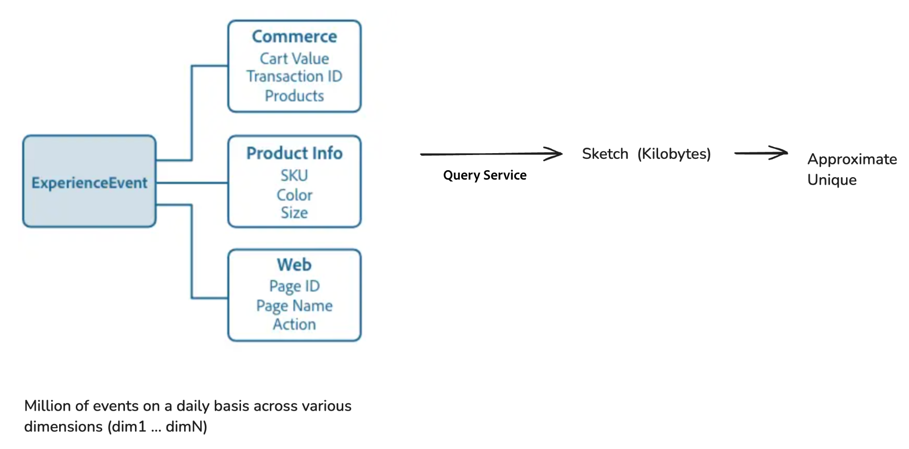

# 使用超多維度資料集進行高效率的大資料分析

>[!AVAILABILITY]
>
>此功能僅適用於已購買[Data Distiller SKU](../data-distiller/overview.md)的使用者。 如需詳細資訊，請聯絡您的Adobe代表。

瞭解如何在Adobe Experience Platform的Experience Query Service中使用超立方體，以提升效率執行進階資料分析。 本文介紹如何使用[[!DNL Apache Datasketches] 資料庫](https://datasketches.apache.org/)的進階函式，以遞增方式處理不同的計數和複雜的計算，而不需每次都重新處理歷史資料。

在大資料分析中，產生量度，例如相異計數、分位數、最常出現的專案、聯結和圖表分析，通常涉及非累加計數（其中結果不能簡單地從子群組彙總）。 傳統方法需要重新處理所有歷史資料，這可能需要耗費大量資源及時間。 使用草圖（即使用機率來表示大型資料集的簡潔摘要）和進階查詢服務功能，透過減少重新計算的需求來簡化此程式。

## 超立方體的主要功能 {#key-functions}

超立方體提供數種強大的功能，可提升資料分析的效率和彈性。

1. **計算唯一使用者或不同的查詢**：使用SQL功能產生與各種資料維度（例如產品檢視、網站造訪或商務活動）互動的不重複使用者計數，而不需重複重新分析原始資料。
2. **累加處理**：執行累加更新，以摺疊及合併跨維度和時間的資料點，而不需從頭開始重新計算所有資料。
3. **多維度分析**：超立方結構可啟用多維度篩選和重新排列資料，以建立代表維度組合的摘要列。 然後，這些摘要可用於以最少的計算開銷產生見解。

## 超立方體的使用案例 {#use-cases}

使用超立方體來有效地產生各種使用者互動的不同計數，而不需每次都完全重新計算資料。 以下是一些實用的使用案例：

- 分析在定義的時段內檢視特定產品的不重複訪客。
- 識別在指定期間內與多項產品互動的使用者，以強化交叉銷售分析。
- 區分隨著時間使用一種產品而不是另一種產品的使用者，以揭示偏好設定模式。
- 結合線上和離線互動資料，以取得指定期間使用者行為的完整檢視。
- 追蹤事件中不同活動的使用者移動，以最佳化版面配置和服務。

## 使用超立方體的優點

在這些情況下，您可以預先計算特定類別的基本資訊。 不過，當您跨多個維度和時段分析資料時，必須從原始資料重新計算所有內容，或使用查詢服務超立方體。 超立方體藉由有效率地組織資料來簡化流程，如此可讓您在不重新處理的情況下彈性篩選和多維度分析。 他們使用進階功能來快速且準確地估計結果，提供主要優點，例如改善處理效率、擴充能力以及適用於複雜分析任務的適應性。

### 查詢處理的資料大小效率

Query Service可以將數百萬或數十億個資料點（例如使用者ID）壓縮成稱為草圖的精簡形式。 此草圖已大幅減少查詢處理的資料大小，可維持擴充性，並讓您更容易、更快速地操作。 無論原始資料的大小有多大，草圖的大小都會維持在較小狀態，因此分析大型資料會更方便管理且更有效率。

下圖說明如何將Commerce、產品資訊和網頁維度ExperienceEvents處理為草圖，然後使用草圖來近似不重複計數。



### 合併草圖，讓資料分析更快速輕鬆

為了避免重新計算並提高處理速度，您可以合併不同類別或群組中的草圖。 Query Service也藉由將您的資料組織到超立方體來簡化設計，其中每一列會與草繪欄一起成為其分割區（維度的集合）的摘要。 Hyper-Cube的每一列都包含維度組合，但沒有任何原始資料。 執行查詢時，請指定您要用來建立加總量度的維度欄，並合併這些列的草圖。


### 成本效益 {#cost-effectiveness}

客戶資料通常規模龐大，但您不必使用累加處理來重新處理歷史資料。 草圖非常小，可以更快速、即時的結果，同時節省運算資源和成本。 此資料轉換可讓互動式查詢更具可行性和效率。

## 函式概述

本節概述每個函式如何透過有效使用草圖和超立方體來最佳化資料處理並增強分析能力。 其中會詳細說明其用途、範例語法、引數和預期輸出。

### 使用HLL草圖建立唯一的計數預估

`hll_build_agg`是建立HLL (HyperLogLog)草圖的彙總函式。 此函式是簡潔的機率方法，用於估計群組資料集中欄或運算式內的唯一值數量。

#### 函式定義

```sql
hll_build_agg(column [, lgConfigK])
```

**使用狀況：**

下列範例示範如何在查詢中建構函式。

```sql
SELECT
   [dim1, dim2 ... ,] hll_build_agg(coalesce(col1, col2, col3)) AS sketch_col
FROM fact_sketch_table
  [GROUP BY dimension1, dimension2 ...]
```

#### 參數

| 參數 | 說明 |
|---------------------------|---------------------------------------|
| `column` | 要在其上建立草繪的欄或欄名稱。 |
| `lgConfigK` | *Int* （選用） K的對數基底2，其中K是HLL Sketch的儲存貯體或插槽數。 最小值： 4。 最大值： 12。 預設值： 12。 |

#### 匯出

| 輸出欄 | 說明 |
|---------------------------|---------------------------------------|
| `sketch_res` | 包含字串化HLL草繪的字串型別欄。 |

#### SQL範例

下列範例會在`customer_id`欄上建置彙總草繪：

```sql
SELECT
  country,
  hll_build_agg(customer_id, 10) AS sketch
FROM
  EXPLODE(
    ARRAY<STRUCT<country STRING, customer_id STRING, invoice_id STRING>>[
      ('UA', 'customer_id_1', 'invoice_id_11'),
      ('CZ', 'customer_id_2', 'invoice_id_22'),
      ('CZ', 'customer_id_2', 'invoice_id_23'),
      ('BR', 'customer_id_3', 'invoice_id_31'),
      ('UA', 'customer_id_2', 'invoice_id_24')
    ])
GROUP BY country;
```

**SQL範例輸出：**

| 國家/地區 | Sketch |
|---------|------------------------------------------------------------|
| UA | AgEHBAMAAgCR9mUEulKKCQAAAAAAAAAAAAAAAAAAAAA== |
| CZ | AgEHBAMAAAQC6UoaaaaaaaaaaaaaaaaaaaaaaaaaaaaaaaaaaaaaaaaaaaA== |
| BR | AgEHBAMAAAQCcmH0HAAAAAAAAAAAAAAAAAAAAAAAAAAAAAAAA== |

### 使用HLL草圖估算不同計數

`hll_estimate`是純量函式，可提供資料集每一列內不重複計數的預估值。 與彙總函式不同，`hll_estimate`以列為單位操作，用於估計個別列內草繪的相異計數。

>[!NOTE]
>
>此函式無法當作彙總函式使用。 若要彙總計數，請使用`sketch_count`。

#### 函式定義

```sql
hll_estimate(sketch_col)
```

**使用狀況：**

下列範例示範如何在查詢中建構函式。

```sql
SELECT
   [col1, col2 ... ,] hll_estimate(sketch_column) AS estimate
FROM fact_sketch_table
```

#### 參數

| 參數 | 說明 |
|---------------------------|---------------------------------------|
| `sketch_column` | 包含字串HLL草繪的欄。 它會估計每一列中草繪的相異計數。 |

#### 匯出

| 輸出欄 | 說明 |
|---------------------------|---------------------------------------|
| `estimate` | 型別為double的欄，提供草繪的預估，四捨五入到兩位小數。 |

#### SQL範例

下列範例在HLL草圖上使用`hll_estimate`函式，依國家估計客戶的不同計數：

```sql
SELECT
  country,
  hll_estimate(hll_build_agg(customer_id, 10)) AS distinct_customers_by_country
FROM
  (
    SELECT
      country,
      hll_build_agg(customer_id, 10) AS sketch
    FROM 
      EXPLODE(
        ARRAY<STRUCT<country STRING, customer_id STRING, invoice_id STRING>>[
          ('UA', 'customer_id_1', 'invoice_id_11'),
          ('CZ', 'customer_id_2', 'invoice_id_22'),
          ('CZ', 'customer_id_2', 'invoice_id_23'),
          ('BR', 'customer_id_3', 'invoice_id_31'),
          ('UA', 'customer_id_2', 'invoice_id_24')
        ])
    GROUP BY country
  );
```

**SQL範例輸出：**

| 國家/地區 | distinct_customers_by_country |
|---------|-------------------------------|
| UA | 2.00 |
| CZ | 1.00 |
| BR | 1.00 |

### 將多個HLL草圖與`hll_merge_agg`合併

`hll_merge_agg`是一個彙總函式，它合併一個群組中的多個HLL草圖，產生新的草圖作為輸出。 它允許組合跨分割區或維度的草圖，增強資料分析的靈活性。

#### 函式定義

```sql
hll_merge_agg(sketch_col [, allowDifferentLgConfigK])
```

**使用狀況：**

下列範例示範如何在查詢中建構函式。

```sql
SELECT
   [dim1, dim2 ... ,] hll_merge_agg(sketch_column.sketch) AS estimate
FROM fact_sketch_table
  [GROUP BY dimension1, dimension2 ...]
```

#### 參數

| 參數 | 說明 |
|---------------------------|---------------------------------------|
| `sketch_column` | 包含字串HLL草繪的欄。 |
| `allowDifferentLgConfigK` | *布林值* （選擇性）如果設為true，允許合併具有不同值`lgConfigK`的草圖。 預設值為false。 如果值為false且草圖有不同的`lgConfigK`值，則會擲回例外狀況。 |

>[!NOTE]
>
>如果`allowDifferentLgConfigK`設定為false，則合併具有不同值`lgConfigK`的草圖會產生`UnsupportedOperationException`。

#### 匯出

| 輸出欄 | 說明 |
|----------------|-------------------------------------------------|
| `sketch_res` | HLL草繪型別的欄，其中包含已串連合併的HLL草繪。 |

#### SQL範例

下列範例合併`customer_id`欄上的多個HLL草圖：

```sql
SELECT
   hll_merge_agg(hll_sketch) AS uniq_customers_with_invoice
FROM
  (
    SELECT
      country,
      hll_build_agg(customer_id) AS hll_sketch
    FROM
      EXPLODE(
        ARRAY<STRUCT<country STRING, customer_id STRING, invoice_id STRING>>[
          ('UA', 'customer_id_1', 'invoice_id_11'),
          ('BR', 'customer_id_3', 'invoice_id_31'),
          ('CZ', 'customer_id_2', 'invoice_id_22'),
          ('CZ', 'customer_id_2', 'invoice_id_23'),
          ('BR', 'customer_id_3', 'invoice_id_31'),
          ('UA', 'customer_id_2', 'invoice_id_24')
        ])
    GROUP BY country
    UNION
    SELECT
      country,
      hll_build_agg(customer_id) AS hll_sketch
    FROM
      EXPLODE(
        ARRAY<STRUCT<country STRING, customer_id STRING, invoice_id STRING>>[
          ('UA', 'customer_id_1', 'invoice_id_21'),
          ('MX', 'customer_id_3', 'invoice_id_31'),
          ('MX', 'customer_id_2', 'invoice_id_21')
        ])
    GROUP BY country
  )
GROUP BY customer_id;
```

**SQL範例輸出：**

| 國家/地區 | hll_merge_agg(sketch， true) |
|---------|--------------------------------------------|
| UA | AgEHDAMAAwiR9mUEulKKCQAAAAAAAAAAAAAA== |
| CZ | AgEHDAMAAQi6Uoaaaaaaaaaaaaaaaaa== |
| BR | AgEHDAMAAQicmH0HAAAAAAAAAAAAAAAAAAAA== |
| MX | AgEHFQMAAgiGL/kNdAAAAAAAAAAAAAAAAAAAA== |

### 使用`hll_merge_count_agg`估計基數

`hll_merge_count_agg`是一個彙總函式，可從一欄內的一或多個草圖估計基數（唯一元素數目）。 它會針對群組內遇到的所有草繪傳回單一預估。 此函式用於彙總草圖，不能用作逐列轉換。 若是列式預估，請使用`sketch_estimate`。

#### 函式定義

```sql
hll_merge_count_agg(sketch_col [, allowDifferentLgConfigK])
```

**使用狀況：**

下列範例示範如何在查詢中建構函式。

```sql
SELECT
   [dim1, dim2 ... ,] hll_merge_count_agg(sketch_column) AS estimate
FROM fact_sketch_table
  [GROUP BY dimension1, dimension2 ...]
```

#### 參數

| 參數 | 說明 |
|-------------------------|----------------------------------------------|
| `sketch_column` | 包含字串HLL草繪的欄。 |
| `allowDifferentLgConfigK` | *布林值* （選擇性）預設值為false。 若設為true，則允許合併具有不同值`lgConfigK`的草圖。 否則，會擲回`UnsupportedOperationException`。 |

#### 匯出

| 輸出欄 | 說明 |
|---------------|----------------------------------------------------------|
| `estimate` | 型別為「雙精度」的欄，提供草繪的預估。 |

#### SQL範例

下列範例會使用`hll_merge_count_agg`函式來預估具有商業發票的不重複客戶數目：

```sql
SELECT
   hll_merge_count_agg(hll_sketch) AS uniq_customers_with_invoice
FROM
  (
    SELECT
      country,
      hll_build_agg(customer_id) AS hll_sketch
    FROM
      EXPLODE(
        ARRAY<STRUCT<country STRING, customer_id STRING, invoice_id STRING>>[
          ('UA', 'customer_id_1', 'invoice_id_11'),
          ('BR', 'customer_id_3', 'invoice_id_31'),
          ('CZ', 'customer_id_2', 'invoice_id_22'),
          ('CZ', 'customer_id_2', 'invoice_id_23'),
          ('BR', 'customer_id_3', 'invoice_id_31'),
          ('UA', 'customer_id_2', 'invoice_id_24')
        ])
    GROUP BY country
    UNION
    SELECT
      country,
      hll_build_agg(customer_id) AS hll_sketch
    FROM
      EXPLODE(
        ARRAY<STRUCT<country STRING, customer_id STRING, invoice_id STRING>>[
          ('UA', 'customer_id_1', 'invoice_id_21'),
          ('MX', 'customer_id_3', 'invoice_id_31'),
          ('MX', 'customer_id_2', 'invoice_id_21')
        ])
    GROUP BY country
  )
GROUP BY customer_id;
```

**SQL範例輸出：**

| 國家/地區 | hll_merge_count_agg(sketch， true) |
|---------|----------------------------------|
| UA | 2.0 |
| CZ | 1.0 |
| BR | 1.0 |
| MX | 2.0 |

## 限制

目前，草圖一旦建立便無法更新。 未來的更新將引進更新草繪的功能。 透過此功能，您可以更有效地處理遺漏的執行和延遲送達的資料。

## 後續步驟

閱讀本檔案後，您現在瞭解如何使用超立方體及相關草圖功能，針對複雜的多維度分析執行有效的資料處理，而無需重新處理歷史資料。 此方法可節省時間、降低成本，並提供即時、互動式查詢所需的彈性，使其成為Adobe Experience Platform中大資料分析的寶貴工具。

接下來，探索其他重要概念，例如[增量載入](../key-concepts/incremental-load.md)和[資料重複資料刪除](../key-concepts/deduplication.md)，以更深入地瞭解如何針對您的特定資料需求有效使用這些功能。


