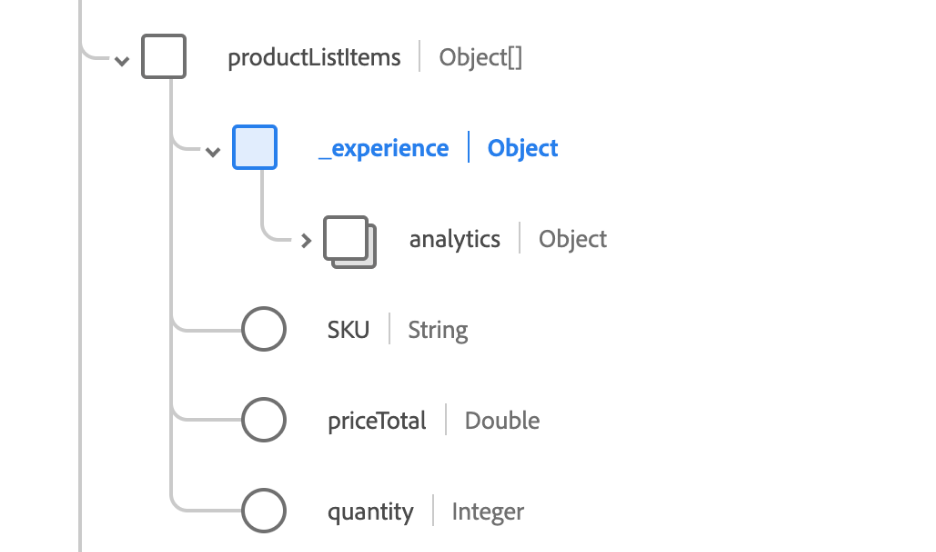

# 查詢服務中的SQL語法

Adobe Experience Platform查詢服務能夠針對以下專案使用標準ANSI SQL `SELECT` 陳述式和其他有限命令。 本文介紹支援的SQL語法 [!DNL Query Service].

## 選取查詢 {#select-queries}

下列語法會定義 `SELECT` 支援的查詢 [!DNL Query Service]：

```sql
[ WITH with_query [, ...] ]
SELECT [ ALL | DISTINCT [( expression [, ...] ) ] ]
    [ * | expression [ [ AS ] output_name ] [, ...] ]
    [ FROM from_item [, ...] ]
    [ SNAPSHOT { SINCE start_snapshot_id | AS OF end_snapshot_id | BETWEEN start_snapshot_id AND end_snapshot_id } ]
    [ WHERE condition ]
    [ GROUP BY grouping_element [, ...] ]
    [ HAVING condition [, ...] ]
    [ WINDOW window_name AS ( window_definition ) [, ...] ]
    [ { UNION | INTERSECT | EXCEPT | MINUS } [ ALL | DISTINCT ] select ]
    [ ORDER BY expression [ ASC | DESC | USING operator ] [ NULLS { FIRST | LAST } ] [, ...] ]
    [ LIMIT { count | ALL } ]
    [ OFFSET start ]
```

位置 `from_item` 可以是下列其中一個選項：

```sql
table_name [ * ] [ [ AS ] alias [ ( column_alias [, ...] ) ] ]
```

```sql
[ LATERAL ] ( select ) [ AS ] alias [ ( column_alias [, ...] ) ]
```

```sql
with_query_name [ [ AS ] alias [ ( column_alias [, ...] ) ] ]
```

```sql
from_item [ NATURAL ] join_type from_item [ ON join_condition | USING ( join_column [, ...] ) ]
```

和 `grouping_element` 可以是下列其中一個選項：

```sql
( )
```

```sql
expression
```

```sql
( expression [, ...] )
```

```sql
ROLLUP ( { expression | ( expression [, ...] ) } [, ...] )
```

```sql
CUBE ( { expression | ( expression [, ...] ) } [, ...] )
```

```sql
GROUPING SETS ( grouping_element [, ...] )
```

和 `with_query` 為：

```sql
 with_query_name [ ( column_name [, ...] ) ] AS ( select | values )
```

下列小節提供您可在查詢中使用的其他條款的詳細資訊，前提是這些條款遵循上述格式。

### SNAPSHOT子句

此子句可用於根據快照ID逐步讀取資料表上的資料。 快照ID是以長型別數字表示的查核點標籤，每次將資料寫入資料湖表格時都會套用至該數字。 此 `SNAPSHOT` 子句會將其自身附加到它旁邊的表格關係上。

```sql
    [ SNAPSHOT { SINCE start_snapshot_id | AS OF end_snapshot_id | BETWEEN start_snapshot_id AND end_snapshot_id } ]
```

#### 範例

```sql
SELECT * FROM Customers SNAPSHOT SINCE 123;

SELECT * FROM Customers SNAPSHOT AS OF 345;

SELECT * FROM Customers SNAPSHOT BETWEEN 123 AND 345;

SELECT * FROM Customers SNAPSHOT BETWEEN HEAD AND 123;

SELECT * FROM Customers SNAPSHOT BETWEEN 345 AND TAIL;

SELECT * FROM (SELECT id FROM CUSTOMERS BETWEEN 123 AND 345) C 

SELECT * FROM Customers SNAPSHOT SINCE 123 INNER JOIN Inventory AS OF 789 ON Customers.id = Inventory.id;
```

請注意 `SNAPSHOT` 子句與表格或表格別名搭配使用，但不適用於子查詢或檢視的頂端。 A `SNAPSHOT` 子句在任何地方都可使用 `SELECT` 可套用表格上的查詢。

此外，您可以使用 `HEAD` 和 `TAIL` 作為快照子句的特殊位移值。 使用 `HEAD` 是指第一個快照之前的位移，而 `TAIL` 是指最後一個快照之後的位移。

>[!NOTE]
>
>如果您正在查詢兩個快照ID且啟動快照已過期，則可能會發生下列兩種情況，視選用的備援行為旗標(`resolve_fallback_snapshot_on_failure`)已設定：
>
>- 如果設定了選擇性備援行為旗標，查詢服務將會選擇最早可用的快照，將其設定為開始快照，並傳回最早可用快照與指定結束快照之間的資料。 此資料為 **包含** 最早的可用快照集。
>
>- 如果未設定選用的後援行為標幟，將會傳回錯誤。

### WHERE子句

根據預設，符合專案是由 `WHERE` 子句 `SELECT` 查詢區分大小寫。 如果您希望比對不區分大小寫，則可以使用關鍵字 `ILIKE` 而非 `LIKE`.

```sql
    [ WHERE condition { LIKE | ILIKE | NOT LIKE | NOT ILIKE } pattern ]
```

下表說明LIKE和ILIKE子句的邏輯：

| 子句 | 運算子 |
| ------ | -------- |
| `WHERE condition LIKE pattern` | `~~` |
| `WHERE condition NOT LIKE pattern` | `!~~` |
| `WHERE condition ILIKE pattern` | `~~*` |
| `WHERE condition NOT ILIKE pattern` | `!~~*` |

**範例**

```sql
SELECT * FROM Customers
WHERE CustomerName ILIKE 'a%';
```

此查詢會傳回名稱以「A」或「a」開頭的客戶。

### 加入

A `SELECT` 使用聯結的查詢的語法如下：

```sql
SELECT statement
FROM statement
[JOIN | INNER JOIN | LEFT JOIN | LEFT OUTER JOIN | RIGHT JOIN | RIGHT OUTER JOIN | FULL JOIN | FULL OUTER JOIN]
ON join condition
```

### UNION、INTERSECT和EXCEPT

此 `UNION`， `INTERSECT`、和 `EXCEPT` 子句是用來組合或排除兩個或多個表格中類似的資料列：

```sql
SELECT statement 1
[UNION | UNION ALL | UNION DISTINCT | INTERSECT | EXCEPT | MINUS]
SELECT statement 2
```

### 建立表格為選取 {#create-table-as-select}

下列語法會定義 `CREATE TABLE AS SELECT` (CTAS)查詢：

```sql
CREATE TABLE table_name [ WITH (schema='target_schema_title', rowvalidation='false', label='PROFILE') ] AS (select_query)
```

| 參數 | 說明 |
| ----- | ----- |
| `schema` | XDM結構描述的標題。 只有在您想要將現有XDM結構描述用於CTAS查詢建立的新資料集時，才使用此子句。 |
| `rowvalidation` | （選擇性）指定使用者是否想要針對針對新建立的資料集擷取的每個新批次進行列層級驗證。 預設值為 `true`。 |
| `label` | 當您使用CTAS查詢建立資料集時，請將此標籤與的值搭配使用 `profile` 將您的資料集標示為已針對設定檔啟用。 這表示您的資料集在建立後會自動標示為設定檔。 如需使用的詳細資訊，請參閱衍生屬性延伸模組檔案 `label`. |
| `select_query` | A `SELECT` 陳述式。 的語法 `SELECT` 查詢可在以下網址找到： [選取查詢區段](#select-queries). |

**範例**

```sql
CREATE TABLE Chairs AS (SELECT color, count(*) AS no_of_chairs FROM Inventory i WHERE i.type=="chair" GROUP BY i.color)

CREATE TABLE Chairs WITH (schema='target schema title', label='PROFILE') AS (SELECT color, count(*) AS no_of_chairs FROM Inventory i WHERE i.type=="chair" GROUP BY i.color)

CREATE TABLE Chairs AS (SELECT color FROM Inventory SNAPSHOT SINCE 123)
```

>[!NOTE]
>
>此 `SELECT` 陳述式必須有彙總函式的別名，例如 `COUNT`， `SUM`， `MIN`、等等。 此外， `SELECT` 陳述式可以有括弧()或不括弧()提供。 您可以提供 `SNAPSHOT` 子句將增量增量讀入目標資料表。

## 插入到

此 `INSERT INTO` 命令定義如下：

```sql
INSERT INTO table_name select_query
```

| 參數 | 說明 |
| ----- | ----- |
| `table_name` | 您要插入查詢的資料表名稱。 |
| `select_query` | A `SELECT` 陳述式。 的語法 `SELECT` 查詢可在以下網址找到： [選取查詢區段](#select-queries). |

**範例**

>[!NOTE]
>
>以下是精心設計的範例，僅供指導之用。

```sql
INSERT INTO Customers SELECT SupplierName, City, Country FROM OnlineCustomers;

INSERT INTO Customers AS (SELECT * from OnlineCustomers SNAPSHOT AS OF 345)
```

>[!INFO]
> 
> 此 `SELECT` 陳述式 **不得** 括在括弧()中。 此外，結果的結構描述 `SELECT` 陳述式必須符合 `INSERT INTO` 陳述式。 您可以提供 `SNAPSHOT` 子句將增量增量讀入目標資料表。

在根層級找不到實際XDM結構描述中的大部分欄位，且SQL不允許使用點標籤法。 若要使用巢狀欄位達到逼真的結果，您必須對應 `INSERT INTO` 路徑。

至 `INSERT INTO` 巢狀路徑，請使用下列語法：

```sql
INSERT INTO [dataset]
SELECT struct([source field1] as [target field in schema],
[source field2] as [target field in schema],
[source field3] as [target field in schema]) [tenant name]
FROM [dataset]
```

**範例**

```sql
INSERT INTO Customers SELECT struct(SupplierName as Supplier, City as SupplierCity, Country as SupplierCountry) _Adobe FROM OnlineCustomers;
```

## 放置表格

此 `DROP TABLE` 指令會卸除現有的表格，並從檔案系統中刪除與表格關聯的目錄（如果它不是外部表格）。 如果資料表不存在，則會發生例外狀況。

```sql
DROP TABLE [IF EXISTS] [db_name.]table_name
```

| 參數 | 說明 |
| ------ | ------ |
| `IF EXISTS` | 若指定此專案，則不會擲回例外狀況（若表格有） **非** 存在。 |

## 建立資料庫

此 `CREATE DATABASE` 命令會建立Azure Data Lake Storage (ADLS)資料庫。

```sql
CREATE DATABASE [IF NOT EXISTS] db_name
```

## 卸除資料庫

此 `DROP DATABASE` 命令會從執行處理刪除資料庫。

```sql
DROP DATABASE [IF EXISTS] db_name
```

| 參數 | 說明 |
| ------ | ------ |
| `IF EXISTS` | 如果指定此專案，資料庫就不會擲回例外狀況 **非** 存在。 |

## 刪除結構描述

此 `DROP SCHEMA` 命令會捨棄現有的結構描述。

```sql
DROP SCHEMA [IF EXISTS] db_name.schema_name [ RESTRICT | CASCADE]
```

| 參數 | 說明 |
| ------ | ------ |
| `IF EXISTS` | 如果指定此專案，則結構描述不會擲回例外狀況 **非** 存在。 |
| `RESTRICT` | 模式的預設值。 如果指定，則只有在指定時，才會捨棄此結構描述 **不會** 包含任何表格。 |
| `CASCADE` | 如果指定，會捨棄綱要，並一併捨棄綱要中出現的所有表格。 |

## 建立檢視

下列語法會定義 `CREATE VIEW` 查詢資料集。 此資料集可以是ADLS或加速存放區資料集。

```sql
CREATE VIEW view_name AS select_query
```

| 參數 | 說明 |
| ------ | ------ |
| `view_name` | 要建立的檢視名稱。 |
| `select_query` | A `SELECT` 陳述式。 的語法 `SELECT` 查詢可在以下網址找到： [選取查詢區段](#select-queries). |

**範例**

```sql
CREATE VIEW V1 AS SELECT color, type FROM Inventory

CREATE OR REPLACE VIEW V1 AS SELECT model, version FROM Inventory
```

下列語法會定義 `CREATE VIEW` 在資料庫和結構描述的內容中建立檢視的查詢。

**範例**

```sql
CREATE VIEW db_name.schema_name.view_name AS select_query
CREATE OR REPLACE VIEW db_name.schema_name.view_name AS select_query
```

| 參數 | 說明 |
| ------ | ------ |
| `db_name` | 資料庫的名稱。 |
| `schema_name` | 結構描述的名稱。 |
| `view_name` | 要建立之檢視的名稱。 |
| `select_query` | A `SELECT` 陳述式。 的語法 `SELECT` 查詢可在以下網址找到： [選取查詢區段](#select-queries). |

**範例**

```sql
CREATE VIEW <dbV1 AS SELECT color, type FROM Inventory;

CREATE OR REPLACE VIEW V1 AS SELECT model, version FROM Inventory;
```

## 顯示檢視

下列查詢顯示檢視清單。

```sql
SHOW VIEWS;
```

```console
 Db Name  | Schema Name | Name  | Id       |  Dataset Dependencies | Views Dependencies | TYPE
----------------------------------------------------------------------------------------------
 qsaccel  | profile_agg | view1 | view_id1 | dwh_dataset1          |                    | DWH
          |             | view2 | view_id2 | adls_dataset          | adls_views         | ADLS
(2 rows)
```

## 放置檢視

下列語法會定義 `DROP VIEW` 查詢：

```sql
DROP VIEW [IF EXISTS] view_name
```

| 參數 | 說明 |
| ------ | ------ |
| `IF EXISTS` | 如果指定此專案，則檢視不會擲回例外狀況 **非** 存在。 |
| `view_name` | 要刪除的檢視名稱。 |

**範例**

```sql
DROP VIEW v1
DROP VIEW IF EXISTS v1
```

## 匿名區塊

匿名區塊包含兩個區段：可執行檔和例外狀況處理區段。 在匿名區塊中，可執行區段是必要的。 不過，「例外狀況處理」區段是選擇性的。

下列範例說明如何建立區塊，其中有一或多個要一起執行的陳述式：

```sql
$$BEGIN
  statementList
[EXCEPTION exceptionHandler]
$$END

exceptionHandler:
      WHEN OTHER
      THEN statementList

statementList:
    : (statement (';')) +
```

以下是使用匿名區塊的範例。

```sql
$$BEGIN
   SET @v_snapshot_from = select parent_id  from (select history_meta('email_tracking_experience_event_dataset') ) tab where is_current;
   SET @v_snapshot_to = select snapshot_id from (select history_meta('email_tracking_experience_event_dataset') ) tab where is_current;
   SET @v_log_id = select now();
   CREATE TABLE tracking_email_id_incrementally
     AS SELECT _id AS id FROM email_tracking_experience_event_dataset SNAPSHOT BETWEEN @v_snapshot_from AND @v_snapshot_to;

EXCEPTION
  WHEN OTHER THEN
    DROP TABLE IF EXISTS tracking_email_id_incrementally;
    SELECT 'ERROR';
$$END;
```

### 自動切換為JSON {#auto-to-json}

查詢服務支援選擇性工作階段層級設定，以便從互動式SELECT查詢傳回頂層複雜欄位做為JSON字串。 此 `auto_to_json` 設定可讓複雜欄位中的資料以JSON傳回，然後使用標準程式庫剖析為JSON物件。

設定功能標幟 `auto_to_json` 設為true，然後再執行包含複雜欄位的SELECT查詢。

```sql
set auto_to_json=true; 
```

#### 設定之前 `auto_to_json` 標幟

下表提供在查詢結果之前 `auto_to_json` 設定已套用。 在這兩種情況下都使用同一個SELECT查詢（如下所示）來定位具有複雜欄位的表格。

```sql
SELECT * FROM TABLE_WITH_COMPLEX_FIELDS LIMIT 2;
```

結果如下：

```console
                _id                |                                _experience                                 | application  |                   commerce                   | dataSource |                               device                               |                       endUserIDs                       |                                                                                                environment                                                                                                |                     identityMap                     |                              placeContext                               |   receivedTimestamp   |       timestamp       | userActivityRegion |                                         web                                          | _adcstageforpqs
-----------------------------------+----------------------------------------------------------------------------+--------------+----------------------------------------------+------------+--------------------------------------------------------------------+--------------------------------------------------------+-----------------------------------------------------------------------------------------------------------------------------------------------------------------------------------------------------------+-----------------------------------------------------+-------------------------------------------------------------------------+-----------------------+-----------------------+--------------------+--------------------------------------------------------------------------------------+-----------------
 31892EE15DE00000-401D52664FF48A52 | ("("("(1,1)","(1,1)")","(-209479095,4085488201,-2105158467,2189808829)")") | (background) | (NULL,"(USD,NULL)",NULL,NULL,NULL,NULL,NULL) | (475341)   | (32,768,1024,205202,https://ns.adobe.com/xdm/external/deviceatlas) | ("("(31892EE080007B35-E6CE00000000000,"(AAID)",t)")")  | ("(en-US,f,f,t,1.6,"Mozilla/5.0 (iPhone; U; CPU iPhone OS 4_1 like Mac OS X; ja-jp) AppleWebKit/532.9 (KHTML, like Gecko) Version/4.0.5 Mobile/8B117 Safari/6531.22.7",490,1125)",xo.net,64.3.235.13)     | [AAID -> "{(31892EE080007B35-E6CE00000000000,t)}"]  | ("("(34.01,-84.0)",lawrenceville,US,524,30043,ga)",600)                 | 2022-09-02 19:47:14.0 | 2022-09-02 19:47:14.0 | (UT1)              | ("(f,Search Results,"(1.0)")","(http://www.google.com/search?ie=UTF-8&q=,internal)") |
 31892EE15DE00000-401B92664FF48AE8 | ("("("(1,1)","(1,1)")","(-209479095,4085488201,-2105158467,2189808829)")") | (background) | (NULL,"(USD,NULL)",NULL,NULL,NULL,NULL,NULL) | (475341)   | (32,768,1024,205202,https://ns.adobe.com/xdm/external/deviceatlas) | ("("(31892EE100007BF3-215FE00000000001,"(AAID)",t)")") | ("(en-US,f,f,t,1.5,"Mozilla/5.0 (iPhone; U; CPU iPhone OS 4_1 like Mac OS X; ja-jp) AppleWebKit/532.9 (KHTML, like Gecko) Version/4.0.5 Mobile/8B117 Safari/6531.22.7",768,556)",ntt.net,219.165.108.145) | [AAID -> "{(31892EE100007BF3-215FE00000000001,t)}"] | ("("(34.989999999999995,138.42)",shizuoka,JP,392005,420-0812,22)",-240) | 2022-09-02 19:47:14.0 | 2022-09-02 19:47:14.0 | (UT1)              | ("(f,Home - JJEsquire,"(1.0)")","(NULL,typed_bookmarked)")                           |
(2 rows)  
```

#### 在設定 `auto_to_json` 標幟

下表說明結果中的差異， `auto_to_json` 設定在產生的資料集上。 兩種情況下都使用了相同的SELECT查詢。

```console
                _id                |   receivedTimestamp   |       timestamp       |                                                                                                                   _experience                                                                                                                   |           application            |             commerce             |    dataSource    |                                                                  device                                                                   |                                                   endUserIDs                                                   |                                                                                                                                                                                           environment                                                                                                                                                                                            |                             identityMap                              |                                                                                            placeContext                                                                                            |      userActivityRegion      |                                                                                     web                                                                                      | _adcstageforpqs
-----------------------------------+-----------------------+-----------------------+-------------------------------------------------------------------------------------------------------------------------------------------------------------------------------------------------------------------------------------------------+----------------------------------+----------------------------------+------------------+-------------------------------------------------------------------------------------------------------------------------------------------+----------------------------------------------------------------------------------------------------------------+--------------------------------------------------------------------------------------------------------------------------------------------------------------------------------------------------------------------------------------------------------------------------------------------------------------------------------------------------------------------------------------------------+----------------------------------------------------------------------+----------------------------------------------------------------------------------------------------------------------------------------------------------------------------------------------------+------------------------------+------------------------------------------------------------------------------------------------------------------------------------------------------------------------------+-----------------
 31892EE15DE00000-401D52664FF48A52 | 2022-09-02 19:47:14.0 | 2022-09-02 19:47:14.0 | {"analytics":{"customDimensions":{"eVars":{"eVar1":"1","eVar2":"1"},"props":{"prop1":"1","prop2":"1"}},"environment":{"browserID":-209479095,"browserIDStr":"4085488201","operatingSystemID":-2105158467,"operatingSystemIDStr":"2189808829"}}} | {"userPerspective":"background"} | {"order":{"currencyCode":"USD"}} | {"_id":"475341"} | {"colorDepth":32,"screenHeight":768,"screenWidth":1024,"typeID":"205202","typeIDService":"https://ns.adobe.com/xdm/external/deviceatlas"} | {"_experience":{"aaid":{"id":"31892EE080007B35-E6CE00000000000","namespace":{"code":"AAID"},"primary":true}}}  | {"browserDetails":{"acceptLanguage":"en-US","cookiesEnabled":false,"javaEnabled":false,"javaScriptEnabled":true,"javaScriptVersion":"1.6","userAgent":"Mozilla/5.0 (iPhone; U; CPU iPhone OS 4_1 like Mac OS X; ja-jp) AppleWebKit/532.9 (KHTML, like Gecko) Version/4.0.5 Mobile/8B117 Safari/6531.22.7","viewportHeight":490,"viewportWidth":1125},"domain":"xo.net","ipV4":"64.3.235.13"}     | {"AAID":[{"id":"31892EE080007B35-E6CE00000000000","primary":true}]}  | {"geo":{"_schema":{"latitude":34.01,"longitude":-84.0},"city":"lawrenceville","countryCode":"US","dmaID":524,"postalCode":"30043","stateProvince":"ga"},"localTimezoneOffset":600}                 | {"dataCenterLocation":"UT1"} | {"webPageDetails":{"isHomePage":false,"name":"Search Results","pageViews":{"value":1.0}},"webReferrer":{"URL":"http://www.google.com/search?ie=UTF-8&q=","type":"internal"}} |
 31892EE15DE00000-401B92664FF48AE8 | 2022-09-02 19:47:14.0 | 2022-09-02 19:47:14.0 | {"analytics":{"customDimensions":{"eVars":{"eVar1":"1","eVar2":"1"},"props":{"prop1":"1","prop2":"1"}},"environment":{"browserID":-209479095,"browserIDStr":"4085488201","operatingSystemID":-2105158467,"operatingSystemIDStr":"2189808829"}}} | {"userPerspective":"background"} | {"order":{"currencyCode":"USD"}} | {"_id":"475341"} | {"colorDepth":32,"screenHeight":768,"screenWidth":1024,"typeID":"205202","typeIDService":"https://ns.adobe.com/xdm/external/deviceatlas"} | {"_experience":{"aaid":{"id":"31892EE100007BF3-215FE00000000001","namespace":{"code":"AAID"},"primary":true}}} | {"browserDetails":{"acceptLanguage":"en-US","cookiesEnabled":false,"javaEnabled":false,"javaScriptEnabled":true,"javaScriptVersion":"1.5","userAgent":"Mozilla/5.0 (iPhone; U; CPU iPhone OS 4_1 like Mac OS X; ja-jp) AppleWebKit/532.9 (KHTML, like Gecko) Version/4.0.5 Mobile/8B117 Safari/6531.22.7","viewportHeight":768,"viewportWidth":556},"domain":"ntt.net","ipV4":"219.165.108.145"} | {"AAID":[{"id":"31892EE100007BF3-215FE00000000001","primary":true}]} | {"geo":{"_schema":{"latitude":34.989999999999995,"longitude":138.42},"city":"shizuoka","countryCode":"JP","dmaID":392005,"postalCode":"420-0812","stateProvince":"22"},"localTimezoneOffset":-240} | {"dataCenterLocation":"UT1"} | {"webPageDetails":{"isHomePage":false,"name":"Home - JJEsquire","pageViews":{"value":1.0}},"webReferrer":{"type":"typed_bookmarked"}}                                        |
(2 rows)
```

### 解決失敗時的遞補快照 {#resolve-fallback-snapshot-on-failure}

此 `resolve_fallback_snapshot_on_failure` 選項可用來解決快照ID過期的問題。 快照中繼資料會在兩天後到期，而過期的快照可能會使指令碼的邏輯失效。 使用匿名區塊時，可能會發生問題。

設定 `resolve_fallback_snapshot_on_failure` 選項設為true時，會以先前的快照ID覆寫快照。

```sql
SET resolve_fallback_snapshot_on_failure=true;
```

下列程式碼行會覆寫 `@from_snapshot_id` 包含最早可用的 `snapshot_id` 來自中繼資料。

```sql
$$ BEGIN
    SET resolve_fallback_snapshot_on_failure=true;
    SET @from_snapshot_id = SELECT coalesce(last_snapshot_id, 'HEAD') FROM checkpoint_log a JOIN
                            (SELECT MAX(process_timestamp)process_timestamp FROM checkpoint_log
                                WHERE process_name = 'DIM_TABLE_ABC' AND process_status = 'SUCCESSFUL' )b
                                on a.process_timestamp=b.process_timestamp;
    SET @to_snapshot_id = SELECT snapshot_id FROM (SELECT history_meta('DIM_TABLE_ABC')) WHERE  is_current = true;
    SET @last_updated_timestamp= SELECT CURRENT_TIMESTAMP;
    INSERT INTO DIM_TABLE_ABC_Incremental
     SELECT  *  FROM DIM_TABLE_ABC SNAPSHOT BETWEEN @from_snapshot_id AND @to_snapshot_id WHERE NOT EXISTS (SELECT _id FROM DIM_TABLE_ABC_Incremental a WHERE _id=a._id);

Insert Into
   checkpoint_log
   SELECT
       'DIM_TABLE_ABC' process_name,
       'SUCCESSFUL' process_status,
      cast( @to_snapshot_id AS string) last_snapshot_id,
      cast( @last_updated_timestamp AS TIMESTAMP) process_timestamp;
EXCEPTION
  WHEN OTHER THEN
    SELECT 'ERROR';
END
$$;
```


## 資料資產組織

隨著資料資產的成長，在Adobe Experience Platform資料湖中以邏輯方式組織這些資料資產非常重要。 Query Service可擴充SQL建構，讓您在邏輯上將資料資產分組在沙箱中。 這種組織方法允許在結構描述之間共用資料資產，而不需要實際移動它們。

下列使用標準SQL語法的SQL建構可供您以邏輯方式組織資料。

```SQL
CREATE DATABASE dg1;
CREATE SCHEMA dg1.schema1;
CREATE table t1 ...;
CREATE view v1 ...;
ALTER TABLE t1 ADD PRIMARY KEY (c1) NOT ENFORCED;
ALTER TABLE t2 ADD FOREIGN KEY (c1) REFERENCES t1(c1) NOT ENFORCED;
```

請參閱以下指南： [資料資產的邏輯組織](../best-practices/organize-data-assets.md) 以取得查詢服務最佳實務的詳細說明。

## 表格已存在

此 `table_exists` SQL命令用於確認系統中目前是否有資料表。 該命令會傳回布林值： `true` 如果表格 **會** 存在，並且 `false` 如果表格包含 **非** 存在。

在執行陳述式之前，先驗證資料表是否存在， `table_exists` 功能可簡化編寫匿名區塊以同時涵蓋 `CREATE` 和 `INSERT INTO` 使用案例。

下列語法會定義 `table_exists` 命令：

```SQL
$$
BEGIN

#Set mytableexist to true if the table already exists.
SET @mytableexist = SELECT table_exists('target_table_name');

#Create the table if it does not already exist (this is a one time operation).
CREATE TABLE IF NOT EXISTS target_table_name AS
  SELECT *
  FROM   profile_dim_date limit 10;

#Insert data only if the table already exists. Check if @mytableexist = 'true'
 INSERT INTO target_table_name           (
                     select *
                     from   profile_dim_date
                     WHERE  @mytableexist = 'true' limit 20
              ) ;
EXCEPTION
WHEN other THEN SELECT 'ERROR';

END $$; 
```

## 內嵌 {#inline}

此 `inline` 函式會分隔結構陣列的元素，並將值產生到表格中。 它只能放在 `SELECT` 清單或 `LATERAL VIEW`.

此 `inline` 函式 **無法** 放在有其他產生器函式的選取清單中。

依預設，產生的欄會命名為「col1」、「col2」等。 如果運算式為 `NULL` 然後不會產生任何列。

>[!TIP]
>
>可使用重新命名欄名稱 `RENAME` 命令。

**範例**

```sql
> SELECT inline(array(struct(1, 'a'), struct(2, 'b'))), 'Spark SQL';
```

此範例傳回以下內容：

```text
1  a Spark SQL
2  b Spark SQL
```

第二個範例進一步示範 `inline` 函式。 此範例的資料模型如下圖所示。



**範例**

```sql
select inline(productListItems) from source_dataset limit 10;
```

值取自 `source_dataset` 用於填入目標表格。

| SKU | _體驗 | 數量 | priceTotal |
|---------------------|-----------------------------------|----------|--------------|
| product-id-1 | (&quot;(&quot;(&quot;(A，pass，B，NULL)&quot;)&quot;)&quot;) | 5 | 10.5 |
| product-id-5 | (&quot;(&quot;(&quot;(A， pass， B，NULL)&quot;)&quot;)&quot;) |          |              |
| product-id-2 | (「(」(「(AF， C， D，NULL)」)「)」) | 6 | 40 |
| product-id-4 | (「(」(「(BM， pass， NA，NULL)」)」)」) | 3 | 12 |

## [!DNL Spark] SQL命令

以下小節涵蓋Query Service支援的Spark SQL命令。

### 設定

此 `SET` command會設定屬性，並傳回現有屬性的值或列出所有現有屬性。 如果提供現有屬性索引鍵的值，則會覆寫舊值。

```sql
SET property_key = property_value
```

| 參數 | 說明 |
| ------ | ------ |
| `property_key` | 您要列出或變更的屬性名稱。 |
| `property_value` | 您希望屬性設定為的值。 |

若要傳回任何設定的值，請使用 `SET [property key]` 沒有 `property_value`.

## [!DNL PostgreSQL] 命令

以下各小節涵蓋 [!DNL PostgreSQL] 查詢服務支援的命令。

### 分析表格 {#analyze-table}

此 `ANALYZE TABLE` 指令會執行命名表格的分佈分析和統計計算。 使用 `ANALYZE TABLE` 視資料集是否儲存在 [加速存放區](#compute-statistics-accelerated-store) 或 [資料湖](#compute-statistics-data-lake). 如需其使用方式的詳細資訊，請參閱其各自的章節。

#### 加速存放區上的計算統計資料 {#compute-statistics-accelerated-store}

此 `ANALYZE TABLE` 命令計算加速存放區上表格的統計資料。 統計資料是在加速存放區上特定資料表的已執行CTAS或ITAS查詢上計算的。

**範例**

```sql
ANALYZE TABLE <original_table_name>
```

以下是使用「 」後可用的統計計算清單 `ANALYZE TABLE` 命令：-

| 計算的值 | 說明 |
|---|---|
| `field` | 表格中資料行的名稱。 |
| `data-type` | 每一欄的可接受資料型別。 |
| `count` | 此欄位包含非Null值的列數。 |
| `distinct-count` | 此欄位的不重複或相異值數目。 |
| `missing` | 此欄位具有Null值的列數。 |
| `max` | 分析表格中的最大值。 |
| `min` | 分析表格的最小值。 |
| `mean` | 分析表格的平均值。 |
| `stdev` | 分析表格的標準差。 |

#### 資料湖上的計算統計資料 {#compute-statistics-data-lake}

您現在可以在以下位置計算欄層級統計資料： [!DNL Azure Data Lake Storage] (ADLS)資料集與 `COMPUTE STATISTICS` SQL命令。 計算整個資料集、資料集子集、所有欄或欄子集上的欄統計資料。

`COMPUTE STATISTICS` 擴充 `ANALYZE TABLE` 命令。 然而， `COMPUTE STATISTICS`， `FILTERCONTEXT`、和 `FOR COLUMNS` 加速存放區資料表不支援命令。 這些擴充功能適用於 `ANALYZE TABLE` 目前只有ADLS表格支援命令。

**範例**

```sql
ANALYZE TABLE tableName FILTERCONTEXT (timestamp >= to_timestamp('2023-04-01 00:00:00') and timestamp <= to_timestamp('2023-04-05 00:00:00')) COMPUTE STATISTICS  FOR COLUMNS (commerce, id, timestamp);
```

此 `FILTER CONTEXT` command會根據提供的篩選條件，計算資料集子集的統計資料。 此 `FOR COLUMNS` 命令會鎖定特定欄位進行分析。

>[!NOTE]
>
>此 `Statistics ID` 和產生的統計資料只適用於每個階段作業，而且無法在不同的PSQL階段作業間存取。<br><br>限制:<ul><li>陣列或對應資料型別不支援產生統計資料</li><li>計算的統計資料為 **非** 跨工作階段持續存在。</li></ul><br><br>選項:<br><ul><li>`skip_stats_for_complex_datatypes`</li></ul><br>依預設，標幟會設為true。 因此，在不支援的資料型別上請求統計資料時，它不會出錯但會無訊息地略過具有不支援的資料型別的欄位。<br>若要在要求不支援資料型別的統計資料時啟用錯誤通知，請使用： `SET skip_stats_for_complex_datatypes = false`.

主控台輸出會顯示如下。

```console
|     Statistics ID      | 
| ---------------------- |
| adc_geometric_stats_1  |
(1 row)
```

然後，您可以參考 `Statistics ID`. 以下範例陳述式可讓您在搭配使用時完整檢視輸出 `Statistics ID` 或別名。 若要深入瞭解此功能，請參閱 [別名檔案](../essential-concepts/dataset-statistics.md#alias-name).

```sql
-- This statement gets the statistics generated for `alias adc_geometric_stats_1`.
SELECT * FROM adc_geometric_stats_1;
```

使用 `SHOW STATISTICS` 命令來顯示工作階段中產生之所有暫時統計資料的中繼資料。 這個指令可以協助您縮小統計分析的範圍。

```sql
SHOW STATISTICS;
```

SHOW STATISTICS的範例輸出如下所示。

```console
      statsId         |   tableName   | columnSet |         filterContext       |      timestamp
----------------------+---------------+-----------+-----------------------------+--------------------
adc_geometric_stats_1 | adc_geometric |   (age)   |                             | 25/06/2023 09:22:26
demo_table_stats_1    |  demo_table   |    (*)    |       ((age > 25))          | 25/06/2023 12:50:26
age_stats             | castedtitanic |   (age)   | ((age > 25) AND (age < 40)) | 25/06/2023 09:22:26
```

請參閱 [資料集統計資料檔案](../essential-concepts/dataset-statistics.md) 以取得詳細資訊。

#### 表格範例 {#tablesample}

Adobe Experience Platform查詢服務提供範例資料集，作為其近似查詢處理功能的一部分。
若不需要資料集彙總作業的精確答案，最好使用資料集範例。 此功能可讓您透過發出近似查詢以傳回近似答案，對大型資料集執行更有效的探索查詢。

範例資料集是以現有的均勻隨機樣本建立的 [!DNL Azure Data Lake Storage] (ADLS)資料集，僅使用原始資料集的記錄百分比。 資料集範例功能可擴充 `ANALYZE TABLE` 命令與 `TABLESAMPLE` 和 `SAMPLERATE` SQL命令。

在以下範例中，第一行示範如何計算表格的5%樣本。 第二行示範如何從表格內資料的篩選檢視中計算5%樣本。

**範例**

```sql {line-numbers="true"}
ANALYZE TABLE tableName TABLESAMPLE SAMPLERATE 5;
ANALYZE TABLE tableName FILTERCONTEXT (timestamp >= to_timestamp('2023-01-01')) TABLESAMPLE SAMPLERATE 5:
```

請參閱 [資料集範例檔案](../essential-concepts/dataset-samples.md) 以取得詳細資訊。

### 開始

此 `BEGIN` 指令，或是 `BEGIN WORK` 或 `BEGIN TRANSACTION` 命令，啟動交易區塊。 在開始命令之後輸入的任何陳述式都會在單一交易中執行，直到給出明確的COMMIT或ROLLBACK命令為止。 這個指令與 `START TRANSACTION`.

```sql
BEGIN
BEGIN WORK
BEGIN TRANSACTION
```

### 關閉

此 `CLOSE` 指令會釋放與開啟游標相關的資源。 游標關閉後，不允許對其執行後續操作。 游標不再需要時，應該將其關閉。

```sql
CLOSE name
CLOSE ALL
```

如果 `CLOSE name` 已使用， `name` 代表需要關閉的開啟游標名稱。 如果 `CLOSE ALL` 會使用，所有開啟的游標都會關閉。

### 解除配置

此 `DEALLOCATE` 命令可讓您解除配置先前準備的SQL敘述句。 如果您未明確解除配置準備好的陳述式，會在工作階段結束時解除配置。 有關準備陳述式的更多資訊，請參閱 [PREPARE指令](#prepare) 區段。

```sql
DEALLOCATE name
DEALLOCATE ALL
```

如果 `DEALLOCATE name` 已使用， `name` 代表需要取消配置的準備陳述式名稱。 如果 `DEALLOCATE ALL` 會使用，所有準備好的陳述式都會被取消配置。

### 宣告

此 `DECLARE` 命令可讓使用者建立游標，該游標可用來從較大的查詢中擷取少量列。 建立游標後，會使用從游標中擷取列 `FETCH`.

```sql
DECLARE name CURSOR FOR query
```

| 參數 | 說明 |
| ------ | ------ |
| `name` | 要建立的游標名稱。 |
| `query` | A `SELECT` 或 `VALUES` 命令提供游標要傳回的列。 |

### 執行

此 `EXECUTE` 命令用來執行先前準備的陳述式。 由於準備的陳述式只存在於工作階段期間，因此準備的陳述式必須由 `PREPARE` 陳述式在目前工作階段中較早執行。 有關使用已準備陳述式的更多資訊，請參閱 [`PREPARE` 命令](#prepare) 區段。

如果 `PREPARE` 建立陳述式的陳述式指定了某些引數，必須將一組相容的引數傳遞至 `EXECUTE` 陳述式。 如果未傳入這些引數，則會發生錯誤。

```sql
EXECUTE name [ ( parameter ) ]
```

| 參數 | 說明 |
| ------ | ------ |
| `name` | 要執行的準備陳述式名稱。 |
| `parameter` | 準備陳述式的引數實際值。 這必須是運算式，產生的值與此引數的資料型別相容，如建立準備陳述式時所決定。  如果準備的陳述式有多個引數，它們會以逗號分隔。 |

### 說明

此 `EXPLAIN` 命令會顯示所提供陳述式的執行計畫。 執行計畫會顯示如何掃描陳述式所參考的資料表。  如果參照了多個表格，它會顯示使用哪些聯結演演算法來組合每個輸入表格中所需的列。

```sql
EXPLAIN statement
```

使用 `FORMAT` 關鍵字與 `EXPLAIN` 定義回應格式的命令。

```sql
EXPLAIN FORMAT { TEXT | JSON } statement
```

| 參數 | 說明 |
| ------ | ------ |
| `FORMAT` | 使用 `FORMAT` 指令來指定輸出格式。 可用的選項包括 `TEXT` 或 `JSON`. 非文字輸出包含與文字輸出格式相同的資訊，但程式更容易剖析。 此引數預設為 `TEXT`. |
| `statement` | 任何 `SELECT`， `INSERT`， `UPDATE`， `DELETE`， `VALUES`， `EXECUTE`， `DECLARE`， `CREATE TABLE AS`，或 `CREATE MATERIALIZED VIEW AS` 陳述式，您要檢視其執行計畫。 |

>[!IMPORTANT]
>
>任何輸出 `SELECT` 使用執行時，可能會傳回的陳述式會被捨棄 `EXPLAIN` 關鍵字。 陳述式的其他副作用如常發生。

**範例**

下列範例顯示具有單一資料表的簡單查詢計畫 `integer` 欄和10000列：

```sql
EXPLAIN SELECT * FROM foo;
```

```console
                       QUERY PLAN
---------------------------------------------------------
 Seq Scan on foo (dataSetId = "6307eb92f90c501e072f8457", dataSetName = "foo") [0,1000000242,6973776840203d3d,6e616c58206c6153,6c6c6f430a3d4d20,74696d674c746365]
(1 row)
```

### 擷取

此 `FETCH` 指令使用先前建立的游標來擷取列。

```sql
FETCH num_of_rows [ IN | FROM ] cursor_name
```

| 參數 | 說明 |
| ------ | ------ |
| `num_of_rows` | 要擷取的列數。 |
| `cursor_name` | 您要擷取資訊的游標名稱。 |

### 準備 {#prepare}

此 `PREPARE` 命令可讓您建立準備好的陳述式。 準備的陳述式是伺服器端物件，可用來將類似的SQL陳述式範本化。

準備的陳述式可以使用引數，這些引數是在執行時替代到陳述式中的值。 使用準備好的陳述式時，引數是以$1、$2等由位置參照。

您可以選擇指定引數資料型別的清單。 如果未列出引數的資料型別，則可以從內容推斷型別。

```sql
PREPARE name [ ( data_type [, ...] ) ] AS SELECT
```

| 參數 | 說明 |
| ------ | ------ |
| `name` | 準備陳述式的名稱。 |
| `data_type` | 準備陳述式引數的資料型別。 如果未列出引數的資料型別，則可以從內容推斷型別。 如果您需要新增多個資料型別，可以逗號分隔清單的形式新增。 |

### 回覆

此 `ROLLBACK` command會取消目前的交易，並捨棄該交易所做的所有更新。

```sql
ROLLBACK
ROLLBACK WORK
```

### 選取到

此 `SELECT INTO` 命令會建立新表格，並以查詢運算的資料填入。 資料不會傳回給使用者端，因為這是一般的情形 `SELECT` 命令。 新表格的欄具有名稱及資料型別，這些名稱及資料型別與 `SELECT` 命令。

```sql
[ WITH [ RECURSIVE ] with_query [, ...] ]
SELECT [ ALL | DISTINCT [ ON ( expression [, ...] ) ] ]
    * | expression [ [ AS ] output_name ] [, ...]
    INTO [ TEMPORARY | TEMP | UNLOGGED ] [ TABLE ] new_table
    [ FROM from_item [, ...] ]
    [ WHERE condition ]
    [ GROUP BY expression [, ...] ]
    [ HAVING condition [, ...] ]
    [ WINDOW window_name AS ( window_definition ) [, ...] ]
    [ { UNION | INTERSECT | EXCEPT } [ ALL | DISTINCT ] select ]
    [ ORDER BY expression [ ASC | DESC | USING operator ] [ NULLS { FIRST | LAST } ] [, ...] ]
    [ LIMIT { count | ALL } ]
    [ OFFSET start [ ROW | ROWS ] ]
    [ FETCH { FIRST | NEXT } [ count ] { ROW | ROWS } ONLY ]
    [ FOR { UPDATE | SHARE } [ OF table_name [, ...] ] [ NOWAIT ] [...] ]
```

有關標準SELECT查詢引數的詳細資訊，請參閱 [選取查詢區段](#select-queries). 本節將僅列出專屬於 `SELECT INTO` 命令。

| 參數 | 說明 |
| ------ | ------ |
| `TEMPORARY` 或 `TEMP` | 選用引數。 如果已指定，則建立的表格將會是暫存表格。 |
| `UNLOGGED` | 選用引數。 如果已指定，則建立為的表格將會是未記錄的表格。 有關未記錄表格的詳細資訊，請參閱 [[!DNL PostgreSQL] 檔案](https://www.postgresql.org/docs/current/sql-createtable.html). |
| `new_table` | 要建立的表格名稱。 |

**範例**

下列查詢會建立新表格 `films_recent` 僅包含表格中的最近專案 `films`：

```sql
SELECT * INTO films_recent FROM films WHERE date_prod >= '2002-01-01';
```

### 顯示

此 `SHOW` command會顯示執行階段引數的目前設定。 這些變數可使用進行設定 `SET` 陳述式，透過編輯 `postgresql.conf` 組態檔，透過 `PGOPTIONS` 環境變數（使用libpq或libpq型應用程式時），或透過命令列旗標啟動Postgres伺服器時。

```sql
SHOW name
SHOW ALL
```

| 參數 | 說明 |
| ------ | ------ |
| `name` | 您想要瞭解的執行階段引數名稱。 執行階段引數的可能值包括下列值：<br>`SERVER_VERSION`：此引數顯示伺服器的版本號碼。<br>`SERVER_ENCODING`：此引數顯示伺服器端的字元集編碼。<br>`LC_COLLATE`：此引數顯示定序（文字順序）的資料庫地區設定設定。<br>`LC_CTYPE`：此引數顯示資料庫中用於字元分類的區域設定。<br>`IS_SUPERUSER`：此引數顯示目前角色是否具有超級使用者許可權。 |
| `ALL` | 顯示所有組態引數的值及其說明。 |

**範例**

下列查詢顯示引數的目前設定 `DateStyle`.

```sql
SHOW DateStyle;
```

```console
 DateStyle
-----------
 ISO, MDY
(1 row)
```

### 複製

此 `COPY` 命令會複製任何 `SELECT` 查詢到指定的位置。 使用者必須擁有此位置的存取權，才能順利執行此命令。

```sql
COPY query
    TO '%scratch_space%/folder_location'
    [  WITH FORMAT 'format_name']
```

| 參數 | 說明 |
| ------ | ------ |
| `query` | 您要複製的查詢。 |
| `format_name` | 您要複製查詢的格式。 此 `format_name` 可以是其中一項 `parquet`， `csv`，或 `json`. 預設值為 `parquet`. |

>[!NOTE]
>
>完整的輸出路徑將會是 `adl://<ADLS_URI>/users/<USER_ID>/acp_foundation_queryService/folder_location/<QUERY_ID>`

### 變更表格 {#alter-table}

此 `ALTER TABLE` command可讓您新增或刪除主索引鍵或外部索引鍵限制，以及新增欄至表格。

#### 新增或卸除限制

下列SQL查詢顯示新增或卸除限制至表格的範例。 主索引鍵和外部索引鍵條件約束可使用逗號分隔值新增到多個欄中。 您可以傳遞兩個或多個欄名稱值來建立複合索引鍵，如以下範例所示。

**定義主要或複合索引鍵**

```sql
ALTER TABLE table_name ADD CONSTRAINT PRIMARY KEY ( column_name ) NAMESPACE namespace

ALTER TABLE table_name ADD CONSTRAINT PRIMARY KEY ( column_name1, column_name2 ) NAMESPACE namespace
```

**根據一或多個索引鍵定義表格之間的關係**

```sql
ALTER TABLE table_name ADD CONSTRAINT FOREIGN KEY ( column_name ) REFERENCES referenced_table_name ( primary_column_name )

ALTER TABLE table_name ADD CONSTRAINT FOREIGN KEY ( column_name1, column_name2 ) REFERENCES referenced_table_name ( primary_column_name1, primary_column_name2 )
```

**定義身分資料行**

```sql
ALTER TABLE table_name ADD CONSTRAINT PRIMARY IDENTITY ( column_name ) NAMESPACE namespace

ALTER TABLE table_name ADD CONSTRAINT IDENTITY ( column_name ) NAMESPACE namespace
```

**卸除限制/關係/身分**

```sql
ALTER TABLE table_name DROP CONSTRAINT PRIMARY KEY ( column_name )

ALTER TABLE table_name DROP CONSTRAINT PRIMARY KEY ( column_name1, column_name2 )

ALTER TABLE table_name DROP CONSTRAINT FOREIGN KEY ( column_name )

ALTER TABLE table_name DROP CONSTRAINT FOREIGN KEY ( column_name1, column_name2 )

ALTER TABLE table_name DROP CONSTRAINT PRIMARY IDENTITY ( column_name )

ALTER TABLE table_name DROP CONSTRAINT IDENTITY ( column_name )
```

| 參數 | 說明 |
| ------ | ------ |
| `table_name` | 您正在編輯的表格名稱。 |
| `column_name` | 要新增限制之資料行的名稱。 |
| `referenced_table_name` | 由外部索引鍵參考的資料表名稱。 |
| `primary_column_name` | 外部索引鍵所參考的資料行名稱。 |


>[!NOTE]
>
>資料表結構描述應該是唯一的，而且不會在多個資料表之間共用。 此外，名稱空間是主索引鍵、主身分和身分限制的必要專案。

#### 新增或刪除主要和次要身分

此 `ALTER TABLE` 命令可讓您直接透過SQL新增或刪除主要與次要識別表格資料行的限制。

下列範例透過新增限制來新增主要身分和次要身分。

```sql
ALTER TABLE t1 ADD CONSTRAINT PRIMARY IDENTITY (id) NAMESPACE 'IDFA';
ALTER TABLE t1 ADD CONSTRAINT IDENTITY(id) NAMESPACE 'IDFA';
```

也可以透過捨棄限制來移除身分，如下面的範例所示。

```sql
ALTER TABLE t1 DROP CONSTRAINT PRIMARY IDENTITY (c1) ;
ALTER TABLE t1 DROP CONSTRAINT IDENTITY (c1) ;
```

檢視檔案： [在臨時資料集中設定身分](../data-governance/ad-hoc-schema-identities.md) 以取得更多詳細資訊。

#### 新增欄

下列SQL查詢顯示新增資料行至表格的範例。

```sql
ALTER TABLE table_name ADD COLUMN column_name data_type

ALTER TABLE table_name ADD COLUMN column_name_1 data_type1, column_name_2 data_type2 
```

##### 支援的資料型別

下表列出將資料行新增至表格時所接受的資料型別，其中包含 [!DNL Postgres SQL]、 XDM和 [!DNL Accelerated Database Recovery] (ADR)。

| — | PSQL使用者端 | XDM | ADR | 說明 |
|---|---|---|---|---|
| 1 | `bigint` | `int8` | `bigint` | 一種數值資料型別，用來儲存大整數，範圍從 — 9,223,372,036,854,775,807到9,223,372,036,854,775,807 （以8位元組為單位）。 |
| 2 | `integer` | `int4` | `integer` | 一種數值資料型別，用來儲存4個位元組（介於 — 2,147,483,648到2,147,483,647）的整數。 |
| 3 | `smallint` | `int2` | `smallint` | 一種數值資料型別，用來儲存2個位元組範圍內的整數，範圍從–32,768到215-1 32,767。 |
| 4 | `tinyint` | `int1` | `tinyint` | 一種數值資料型別，用來儲存0到255的整數（以1位元組為單位）。 |
| 5 | `varchar(len)` | `string` | `varchar(len)` | 大小可變的字元資料型別。 `varchar` 當欄資料專案的大小有很大差異時，最適合使用。 |
| 6 | `double` | `float8` | `double precision` | `FLOAT8` 和 `FLOAT` 是有效的同義字 `DOUBLE PRECISION`. `double precision` 是浮點資料型別。 浮點值會儲存在8位元組中。 |
| 7 | `double precision` | `float8` | `double precision` | `FLOAT8` 是有效的同義字 `double precision`.`double precision` 是浮點資料型別。 浮點值會儲存在8位元組中。 |
| 8 | `date` | `date` | `date` | 此 `date` 資料型別是4位元組儲存的行事曆日期值，沒有任何時間戳記資訊。 有效日期的範圍為01-01-0001到12-31-9999。 |
| 9 | `datetime` | `datetime` | `datetime` | 一種資料型別，用來儲存以行事曆日期與時間表示的即時。 `datetime` 包含下列的限定詞：年、月、日、小時、秒和分數。 A `datetime` 宣告可包含這些時間單位中在順序中聯結的任何子集，或甚至僅包含單一時間單位。 |
| 10 | `char(len)` | `string` | `char(len)` | 此 `char(len)` 關鍵字用於表示專案是固定長度的字元。 |

#### 新增結構描述

下列SQL查詢顯示將表格新增至資料庫/綱要的範例。

```sql
ALTER TABLE table_name ADD SCHEMA database_name.schema_name
```

>[!NOTE]
>
> 無法將ADLS表格和檢視新增到DWH資料庫/結構描述。


#### 移除結構描述

下列SQL查詢顯示從資料庫/綱要移除表格的範例。

```sql
ALTER TABLE table_name REMOVE SCHEMA database_name.schema_name
```

>[!NOTE]
>
> 無法從實際連結的DWH資料庫/結構描述中移除DWH表格和檢視。


**參數**

| 參數 | 說明 |
| ------ | ------ |
| `table_name` | 您正在編輯的表格名稱。 |
| `column_name` | 您要新增的欄名稱。 |
| `data_type` | 您要新增之欄的資料型別。 支援的資料型別包括：bigint、char、string、date、datetime、double、double precision、integer、smallint、tinyint、varchar。 |

### 顯示主索引鍵

此 `SHOW PRIMARY KEYS` command會列出指定資料庫的所有主鍵限制。

```sql
SHOW PRIMARY KEYS
```

```console
    tableName | columnName    | datatype | namespace
------------------+----------------------+----------+-----------
 table_name_1 | column_name1  | text     | "ECID"
 table_name_2 | column_name2  | text     | "AAID"
```

### 顯示外部索引鍵

此 `SHOW FOREIGN KEYS` command會列出指定資料庫的所有外部索引鍵限制。

```sql
SHOW FOREIGN KEYS
```

```console
    tableName   |     columnName      | datatype | referencedTableName | referencedColumnName | namespace 
------------------+---------------------+----------+---------------------+----------------------+-----------
 table_name_1   | column_name1        | text     | table_name_3        | column_name3         |  "ECID"
 table_name_2   | column_name2        | text     | table_name_4        | column_name4         |  "AAID"
```


### 顯示資料群組

此 `SHOW DATAGROUPS` 命令會傳回所有關聯資料庫的表格。 對於每個資料庫，表格都包含綱要、群組型別、子型別、子名稱和子ID。

```sql
SHOW DATAGROUPS
```

```console
   Database   |      Schema       | GroupType |      ChildType       |                     ChildName                       |               ChildId
  -------------+-------------------+-----------+----------------------+----------------------------------------------------+--------------------------------------
   adls_db     | adls_scheema      | ADLS      | Data Lake Table      | adls_table1                                        | 6149ff6e45cfa318a76ba6d3
   adls_db     | adls_scheema      | ADLS      | Data Warehouse Table | _table_demo1                                       | 22df56cf-0790-4034-bd54-d26d55ca6b21
   adls_db     | adls_scheema      | ADLS      | View                 | adls_view1                                         | c2e7ddac-d41c-40c5-a7dd-acd41c80c5e9
   adls_db     | adls_scheema      | ADLS      | View                 | adls_view4                                         | b280c564-df7e-405f-80c5-64df7ea05fc3
```


### 顯示表格的資料群組

此 `SHOW DATAGROUPS FOR` &#39;table_name&#39;命令會傳回包含引數作為其子系的所有關聯資料庫的表格。 對於每個資料庫，表格都包含綱要、群組型別、子型別、子名稱和子ID。

```sql
SHOW DATAGROUPS FOR 'table_name'
```

**參數**

- `table_name`：要尋找關聯資料庫的表格名稱。

```console
   Database   |      Schema       | GroupType |      ChildType       |                     ChildName                      |               ChildId
  -------------+-------------------+-----------+----------------------+----------------------------------------------------+--------------------------------------
   dwh_db_demo | schema2           | QSACCEL   | Data Warehouse Table | _table_demo2                                       | d270f704-0a65-4f0f-b3e6-cb535eb0c8ce
   dwh_db_demo | schema1           | QSACCEL   | Data Warehouse Table | _table_demo2                                       | d270f704-0a65-4f0f-b3e6-cb535eb0c8ce
   qsaccel     | profile_aggs      | QSACCEL   | Data Warehouse Table | _table_demo2                                       | d270f704-0a65-4f0f-b3e6-cb535eb0c8ce
```
