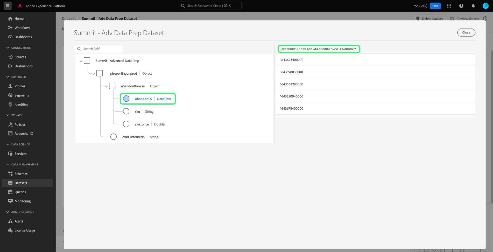

# [!DNL Query Service] 疑難排解指南

本檔案提供查詢服務常見問題的解答，並提供使用查詢服務時常見錯誤代碼的清單。 如需Adobe Experience Platform中其他服務的相關問題和疑難排解，請參閱 [Experience Platform疑難排解指南](../landing/troubleshooting.md).

下列常見問題解答清單分為下列類別：

- [一般](#general)
- [匯出資料](#exporting-data)
- [協力廠商工具](#third-party-tools)
- [PostgreSQL API錯誤](#postgresql-api-errors)
- [REST API錯誤](#rest-api-errors)

## 一般查詢服務問題 {#general}

本節包含關於效能、限制和程式的資訊。

### 我可以關閉查詢服務編輯器中的自動完成功能嗎？

+++回答否。 編輯器目前不支援關閉自動完成功能。
+++

### 在查詢中輸入內容時，為何查詢編輯器有時會變慢？

+++答案一個潛在原因是自動完成功能。 此功能會處理某些中繼資料命令，有時候會在查詢編輯期間拖慢編輯器的速度。
+++

### 我可以將Postman用於查詢服務API嗎？

+++回答是，您可以使用Postman（免費的協力廠商應用程式），以視覺化方式呈現所有AdobeAPI服務，並與之互動。 觀看 [Postman設定指南](https://video.tv.adobe.com/v/28832) 如需在Adobe Developer Console中設定專案及取得與Postman搭配使用之所有必要憑證的逐步指示。 請參閱 [啟動、執行和共用Postman集合的指引](https://learning.postman.com/docs/running-collections/intro-to-collection-runs/).
+++

### 查詢透過UI傳回的列數上限是否有限制？

+++答案是，除非在外部指定明確限制，否則Query Service在內部應用50,000行的限制。 請參閱 [互動式查詢執行](./best-practices/writing-queries.md#interactive-query-execution) 以取得更多詳細資訊。
+++

### 查詢產生的輸出是否有資料大小限制？

+++回答否。 資料大小沒有限制，但互動式工作階段的查詢逾時限制為10分鐘。 如果查詢以批次CTAS執行，則10分鐘逾時不適用。 請參閱 [互動式查詢執行](./best-practices/writing-queries.md#interactive-query-execution) 以取得更多詳細資訊。
+++

### 如何略過SELECT查詢輸出行數的限制？

+++答案要繞過輸出行限制，請在查詢中應用「LIMIT 0」。 例如：

```sql
SELECT * FROM customers LIMIT 0;
```

+++

### 如何在10分鐘內阻止查詢超時？

+++回答如果查詢超時，建議使用以下一個或多個解決方案。

- [將查詢轉換為CTAS查詢](./sql/syntax.md#create-table-as-select) 並排程執行。 您也可以執行排程 [透過UI](./ui/user-guide.md#scheduled-queries) 或 [API](./api/scheduled-queries.md#create).
- 通過應用其他 [篩選條件](https://spark.apache.org/docs/latest/api/sql/index.html#filter).
- [執行EXPLAIN命令](./sql/syntax.md#explain) 以收集更多詳細資訊。
- 檢閱資料集內資料的統計資料。
- 將查詢轉換為簡化的表單，然後使用 [準備報表](./sql/prepared-statements.md).
+++

### 如果同時運行多個查詢，是否會對查詢服務效能有任何問題或影響？

+++回答否。 查詢服務具有自動擴展功能，可確保併發查詢不會對服務的效能產生任何明顯的影響。
+++

### 如何從階層式資料集尋找欄名稱？

+++答案下列步驟說明如何透過UI顯示資料集的表格檢視，包括平面化表單中所有巢狀欄位和欄。

- 登入Experience Platform後，請選取 **[!UICONTROL 資料集]** 在UI的左側導覽器中，導覽至 [!UICONTROL 資料集] 控制面板。
- 資料集 [!UICONTROL 瀏覽] 標籤。 您可以使用搜尋列來調整可用選項。 從顯示的清單中選取資料集。


- 此 [!UICONTROL 資料集活動] 畫面。 選擇 **[!UICONTROL 預覽資料集]** 開啟XDM結構對話方塊，以及所選資料集中平面化資料的表格檢視。 如需詳細資訊，請參閱 [預覽資料集檔案](../catalog/datasets/user-guide.md#preview-a-dataset)


- 從架構中選取任何欄位，以在平面化欄中顯示其內容。 欄的名稱會顯示在頁面右側的其內容上方。 您應複製此名稱以用於查詢此資料集。



如需的完整指引，請參閱本檔案 [如何使用巢狀資料結構](./best-practices/nested-data-structures.md) 使用查詢編輯器或協力廠商用戶端。
+++

### 如何加速對包含陣列的資料集的查詢？

+++答案若要改善包含陣列之資料集的查詢效能，您應 [分解陣列](https://spark.apache.org/docs/latest/api/sql/index.html#explode) as a [CTAS查詢](./sql/syntax.md#create-table-as-select) 在執行階段上，接著進一步探索，以尋找改善其處理時間的機會。
+++

### 為什麼只對少量列執行數小時後，我的CTAS查詢仍會處理？

+++回答如果查詢對非常小的資料集花費了很長時間，請聯繫客戶支援。

處理期間查詢卡住的原因可能有許多。 要確定確切原因，需要逐個進行深入分析。 [聯絡Adobe客戶支援](#customer-support) 這個過程。
+++

### 如何聯絡Adobe客戶支援？ {#customer-support}

+++回答
[Adobe客戶支援電話號碼的完整清單](https://helpx.adobe.com/ca/contact/phone.html) 可在「Adobe」說明頁面上使用。 或者，您也可以完成下列步驟，線上找到說明：

- 導覽至 [https://www.adobe.com/](https://www.adobe.com/) 在網頁瀏覽器中。
- 在頂端導覽列的右側，選取 **[!UICONTROL 登入]**.


- 使用您在Adobe授權中註冊的Adobe ID和密碼。
- 選擇 **[!UICONTROL 說明與支援]** 的上界。


下拉式橫幅會顯示包含 [!UICONTROL 說明與支援] 區段。 選擇 **[!UICONTROL 聯繫我們]** 要開啟「Adobe客戶服務虛擬助理」，請選擇 **[!UICONTROL 企業支援]** 為大型組織提供專屬協助。
+++

### 如何實作連續的作業系列，而如果先前的作業未成功完成則不執行後續作業？

+++答案匿名塊功能允許您連結一個或多個按順序執行的SQL陳述式。 它們也允許例外處理選項。

請參閱 [匿名塊文檔](./best-practices/anonymous-block.md) 以取得更多詳細資訊。
+++

### 如何在Query Service中實作自訂歸因？

+++答案實作自訂歸因有兩種方式：

1. 使用現有 [Adobe定義的函式](./sql/adobe-defined-functions.md) 以識別是否符合使用案例需求。
1. 如果先前的建議不符合您的使用案例，您應使用 [窗口函式](./sql/adobe-defined-functions.md#window-functions). 視窗函式會查看序列中的所有事件。 它們也可讓您檢閱歷史資料，並可用於任何組合。
+++

### 我可以將查詢模板化，以便輕鬆地重新使用它們嗎？

+++回答是，您可以通過使用預準備語句來模板查詢。 預準備的語句可以優化效能，並避免重複重新解析查詢。 請參閱 [準備聲明文檔](./sql/prepared-statements.md) 以取得更多詳細資訊。
+++

### 如何擷取查詢的錯誤記錄？ {#error-logs}

+++答若要擷取特定查詢的錯誤記錄，您必須先使用查詢服務API來擷取查詢記錄詳細資料。 HTTP回應包含調查查詢錯誤所需的查詢ID。

使用GET命令檢索多個查詢。 如需如何呼叫API的資訊，請參閱 [範例API呼叫檔案](./api/queries.md#sample-api-calls).

從回應中，識別您要調查的查詢，並使用其提出其他GET要求 `id` 值。 如需完整指示，請參閱 [依ID檔案擷取查詢](./api/queries.md#retrieve-a-query-by-id).

成功的回應會傳回HTTP狀態200，並包含 `errors` 陣列。 回應已縮短，以簡化。

```json
{
    "isInsertInto": false,
    "request": {
                "dbName": "prod:all",
                "sql": "SELECT *\nFROM\n  accounts\nLIMIT 10\n"
            },
    "clientId": "8c2455819a624534bb665c43c3759877",
    "state": "SUCCESS",
    "rowCount": 0,
    "errors": [{
      'code': '58000', 
      'message': 'Batch query execution gets : [failed reason ErrorCode: 58000 Batch query execution gets : [Analysis error encountered. Reason: [sessionId: f055dc73-1fbd-4c9c-8645-efa609da0a7b Function [varchar] not defined.]]]', 
      'errorType': 'USER_ERROR'
      }],
    "isCTAS": false,
    "version": 1,
    "id": "343388b0-e0dd-4227-a75b-7fc945ef408a",
}
```

此 [查詢服務API參考檔案](https://www.adobe.io/experience-platform-apis/references/query-service/) 提供有關所有可用端點的詳細資訊。
+++

### 「驗證架構時出錯」是什麼意思？

+++應答「驗證架構時出錯」消息表示系統無法在架構內找到欄位。 您應閱讀最佳實務檔案 [在Query Service中組織資料資產](./best-practices/organize-data-assets.md) 後面 [將表建立為選擇文檔](./sql/syntax.md#create-table-as-select).

以下示例演示了CTAS語法和結構資料類型的使用：

```sql
CREATE TABLE table_name WITH (SCHEMA='schema_name')

AS SELECT '1' as _id,

 STRUCT

  ('2021-02-17T15:39:29.0Z' AS taskActualCompletionDate,

    '2020-09-09T21:21:16.0Z' AS taskActualStartDate,

    'Consulting' AS taskdescription,

    '5f6527c10011e09b89666c52d9a8c564' AS taskguide,

    'Stakeholder Consulting Engagement' AS taskname, 

    '2020-09-09T15:00:00.0Z' AS taskPlannedStartDate,

    '2021-02-15T11:00:00.0Z' AS taskPlannedCompletionDate

  ) AS _workfront ;
```

+++

### 如何快速處理每天進入系統的新資料？

+++回答 [`SNAPSHOT`](./sql/syntax.md#snapshot-clause) 子句可用於根據快照ID增量讀取表上的資料。 這非常適合搭配 [增量負載](./best-practices/incremental-load.md) 設計模式，僅處理自上次載入執行後建立或修改的資料集中的資訊。 因此，可提高處理效率，並可與串流和批次資料處理搭配使用。
+++

### 為何「設定檔UI」中顯示的數字與從設定檔匯出資料集計算的數字有所差異？

+++答案自上次快照起，配置檔案控制面板中顯示的數字是準確的。 配置檔案導出表中生成的數字完全取決於導出查詢。 因此，查詢符合特定區段資格的設定檔數目，是造成此差異的常見原因。

>[!NOTE]
>
>查詢包含歷史資料，而UI只顯示目前的設定檔資料。

+++

### 為什麼我的查詢傳回空白子集，我該做什麼？

+++答案最可能的原因是您的查詢範圍太窄。 您應系統地移除 `WHERE` 子句，直到您開始看到某些資料。

您也可以使用下列小型查詢來確認資料集包含資料：

```sql
SELECT count(1) FROM myTableName
```

+++

### 我可以取樣資料嗎？

+++答案此功能目前正在進行中。 詳情將在 [發行說明](../release-notes/latest/latest.md) 功能準備好發行後，透過Platform UI對話方塊執行和操作。
+++

### 查詢服務支援哪些協助程式功能？

+++應答查詢服務提供了幾個內置的SQL幫助程式函式以擴展SQL功能。 請參閱檔案，以取得 [查詢服務支援的SQL函式](./sql/spark-sql-functions.md).
+++

### 都是原生的 [!DNL Spark SQL] 函式受支援，或用戶僅限於包裝函式 [!DNL Spark SQL] Adobe提供的功能？

+++回答：尚未，並非所有開放原始碼 [!DNL Spark SQL] 已對資料湖資料進行測試。 測試並確認後，就會將其新增至支援清單。 請參閱 [支援的清單 [!DNL Spark SQL] 函式](./sql/spark-sql-functions.md) 來檢查特定函式。
+++

### 用戶可以定義其自己的用戶定義函式(UDF)，這些函式可以跨其他查詢使用嗎？

+++答基於資料安全性考量，不允許自訂UDF定義。
+++

### 如果排程的查詢失敗，怎麼辦？

+++回答首先，檢查日誌以了解錯誤的詳細資訊。 常見問題集一節 [在記錄中尋找錯誤](#error-logs) 提供了有關如何執行此操作的詳細資訊。

您也應查閱本檔案，以取得如何執行的指引 [UI中的排程查詢](./ui/user-guide.md#scheduled-queries) 和 [API](./api/scheduled-queries.md).

以下是使用 [!DNL Query Editor]. 它們不適用於 [!DNL Query Service] API:<br/>您只能將排程新增至已建立、儲存及執行的查詢。<br/>您 **不能** 將計畫添加到參數化查詢。<br/>排程查詢 **不能** 包含匿名塊。<br/>您只能排程 **one** 使用UI查詢範本。 如果您想要將其他排程新增至查詢範本，則需使用API。 如果已使用API新增排程，則您將無法使用UI新增其他排程。
+++

### 「達到工作階段限制」錯誤代表什麼意思？

+++回答「已達工作階段上限」表示已達到貴組織允許的查詢服務工作階段數上限。 請連線貴組織的Adobe Experience Platform管理員。
+++

### 查詢記錄如何處理與已刪除資料集相關的查詢？

+++答查詢服務不會刪除查詢歷史記錄。 這表示任何參考已刪除資料集的查詢都會因此傳回「無有效資料集」。
+++

### 如何只取得查詢的中繼資料？

+++答案您可以執行傳回零列的查詢，以只取得回應中的中繼資料。 此示例查詢僅返回指定表的元資料。

```sql
SELECT * FROM <table> WHERE 1=0
```

+++

### 如何快速迭代CTAS（以選擇方式建立表格）查詢，而不對其進行實體化？

+++答案您可以建立臨時表，以便快速迭代並實驗查詢，然後將查詢實現實化以供使用。 您也可以使用臨時表格來驗證查詢是否可行。

例如，您可以建立臨時表格：

```sql
CREATE temp TABLE temp_dataset AS
SELECT *
FROM actual_dataset
WHERE 1 = 0;
```

然後，您可以使用臨時表格，如下所示：

```sql
INSERT INTO temp_dataset
SELECT a._company AS _company,
a._id AS _id,
a.timestamp AS timestamp
FROM actual_dataset a
WHERE timestamp >= TO_TIMESTAMP('2021-01-21 12:00:00')
AND timestamp < TO_TIMESTAMP('2021-01-21 13:00:00')
LIMIT 100;
```

+++

### 如何將時區變更為UTC時間戳記，以及從UTC時間戳記變更為？

+++回答Adobe Experience Platform會以UTC（協調通用時間）時間戳記格式保存資料。 UTC格式的範例為 `2021-12-22T19:52:05Z`

查詢服務支援內置的SQL函式，可將指定的時間戳轉換為UTC格式或從UTC格式轉換。 兩者 `to_utc_timestamp()` 和 `from_utc_timestamp()` 方法會採用兩個參數：時間戳記和時區。

| 參數 | 說明 |
|-----------|---------------|
| 時間戳記 | 時間戳記可以以UTC格式或簡單格式寫入 `{year-month-day}` 格式。 若未提供時間，預設值為指定日的上午的午夜。 |
| 時區 | 時區會寫入 `{continent/city})` 格式。 它必須是中可辨識的時區代碼之一，如 [公共域TZ資料庫](https://data.iana.org/time-zones/tz-link.html#tzdb). |

#### 轉換為UTC時間戳記

此 `to_utc_timestamp()` 方法解釋給定參數並轉換它 **至您當地時區的時間戳記** 格式。 例如，韓國首爾的時區是UTC/GMT +9小時。 方法提供僅限日期的時間戳記，會使用凌晨的午夜預設值。 時間戳記和時區會從該地區的時間轉換為UTC格式，再轉換為您當地地區的UTC時間戳記。

```SQL
SELECT to_utc_timestamp('2021-08-31', 'Asia/Seoul');
```

查詢會以使用者的當地時間傳回時間戳記。 在這種情況下，首爾將提前9小時在前一天下午3點。

```
2021-08-30 15:00:00
```

另一個範例是，如果指定的時間戳記是 `2021-07-14 12:40:00.0` 針對 `Asia/Seoul` 時區，傳回的UTC時間戳記會是 `2021-07-14 03:40:00.0`

查詢服務UI中提供的主控台輸出是較人類看得懂的格式：

```
8/30/2021, 3:00 PM
```

#### 從UTC時間戳記轉換

此 `from_utc_timestamp()` 方法解釋給定參數 **從您當地時區的時間戳記** 並以UTC格式提供所需區域的等效時間戳記。 在下列範例中，小時是使用者當地時區的下午2:40。 以變數傳遞的首爾時區比當地時區提前九小時。

```SQL
SELECT from_utc_timestamp('2021-08-31 14:40:00.0', 'Asia/Seoul');
```

查詢會針對以參數傳遞的時區，傳回UTC格式的時間戳記。 結果會比執行查詢的時區提前九小時。

```
8/31/2021, 11:40 PM
```

### 如何篩選我的時間序列資料？

+++答案查詢時間序列資料時，您應盡可能使用時間戳記篩選器，以進行更準確的分析。

>[!NOTE]
>
> 日期字串 **必須** 格式 `yyyy-mm-ddTHH24:MM:SS`.

以下是使用時間戳記篩選的範例：

```sql
SELECT a._company  AS _company,
       a._id       AS _id,
       a.timestamp AS timestamp
FROM   dataset a
WHERE  timestamp >= To_timestamp('2021-01-21 12:00:00')
       AND timestamp < To_timestamp('2021-01-21 13:00:00')
```

+++

### 如何正確使用 `CAST` 運算子來轉換SQL查詢中的時間戳？

+++使用 `CAST` 運算子來轉換時間戳記，您需要同時包含日期 **和** 時間。

例如，遺失時間元件（如下所示）將導致錯誤：

```sql
SELECT * FROM ABC
WHERE timestamp = CAST('07-29-2021' AS timestamp)
```

正確使用 `CAST` 運算子如下所示：

```sql
SELECT * FROM ABC
WHERE timestamp = CAST('07-29-2021 00:00:00' AS timestamp)
```

+++

### 我是否應使用萬用字元（例如*），從資料集中取得所有列？

+++答案您無法使用萬用字元(*)從您的列取得所有資料，因為Query Service應視為 **欄位式存放** 而不是傳統的基於行的儲存系統。
+++

### 我該使用 `NOT IN` ?

+++回答 `NOT IN` 運算子通常用於檢索在其他表或SQL陳述式中找不到的行。 如果要比較的列接受，此運算子可能會降低效能，並可能傳回未預期的結果 `NOT NULL`，或者您有大量記錄。

而非使用 `NOT IN`，您可以使用 `NOT EXISTS` 或 `LEFT OUTER JOIN`.

例如，如果您已建立下清單格：

```sql
CREATE TABLE T1 (ID INT)
CREATE TABLE T2 (ID INT)
INSERT INTO T1 VALUES (1)
INSERT INTO T1 VALUES (2)
INSERT INTO T1 VALUES (3)
INSERT INTO T2 VALUES (1)
INSERT INTO T2 VALUES (2)
```

如果您使用 `NOT EXISTS` 運算子，您可以使用 `NOT IN` 運算元，方法如下：

```sql
SELECT ID FROM T1
WHERE NOT EXISTS
(SELECT ID FROM T2 WHERE T1.ID = T2.ID)
```

或者，如果您使用 `LEFT OUTER JOIN` 運算子，您可以使用 `NOT IN` 運算元，方法如下：

```sql
SELECT T1.ID FROM T1
LEFT OUTER JOIN T2 ON T1.ID = T2.ID
WHERE T2.ID IS NULL
```

+++

### 我可以使用CTAS查詢建立資料集，其雙底線名稱可像UI中顯示的名稱一樣？ 例如: `test_table_001`.

+++答案否，這是套用至所有Adobe服務（包括查詢服務）的跨Experience Platform故意限制。 架構名稱和資料集名稱可以使用兩個底線的名稱，但資料集的表格名稱只能包含單一底線。
+++

## 匯出資料 {#exporting-data}

本節提供有關匯出資料和限制的資訊。

### 是否有辦法在查詢處理後從「查詢服務」中擷取資料，並將結果儲存為CSV檔案？ {#export-csv}

+++回答是。 資料可從Query Service中擷取，也可選擇透過SQL命令將結果儲存為CSV格式。

使用PSQL客戶端時，有兩種方法可保存查詢結果。 您可以使用 `COPY TO` 命令或使用以下格式建立語句：

```sql
SELECT column1, column2 
FROM <table_name>  
\g <table_name>.out
```

[關於使用 `COPY TO` 命令](./sql/syntax.md#copy) 可在SQL語法參考檔案中找到。
+++

### 我可以透過CTAS查詢擷取已內嵌的最終資料集內容（假設這些資料量較大，例如TB）嗎？

+++回答否。 目前沒有可用於擷取擷取擷取資料的功能。
+++

### Analytics資料連接器為何沒有傳回資料？

+++答案此問題的一個常見原因是無時間篩選器地查詢時間序列資料。 例如：

```sql
SELECT * FROM prod_table LIMIT 1;
```

應寫為：

```sql
SELECT * FROM prod_table
WHERE
timestamp >= to_timestamp('2022-07-22')
and timestamp < to_timestamp('2022-07-23');
```

+++

## 協力廠商工具 {#third-party-tools}

本節包括有關使用第三方工具(如PSQL和Power BI)的資訊。

### 我可以將Query Service連線至協力廠商工具嗎？

+++回答是，您可以將多個第三方案頭客戶端連接到查詢服務。 請參閱 [有關可用客戶端以及如何將它們連接到查詢服務的完整詳細資訊](./clients/overview.md).
+++

### 是否可以連線一次Query Service以便與協力廠商工具一起持續使用？

+++回答是，第三方案頭客戶端可以通過一次性設定非即將到期的憑據連接到查詢服務。 授權的使用者可產生未到期的憑證，並以自動下載至其本機電腦的JSON檔案接收。 完整 [關於如何建立和下載未到期的憑據的指南](./ui/credentials.md#non-expiring-credentials) 可在檔案中找到。
+++

### 我的未到期憑證為何無法運作？

+++回答非到期憑證的值是 `technicalAccountID` 和 `credential` 取自設定JSON檔案。 密碼值採用以下形式： `{{technicalAccountId}:{credential}}`.
如需如何取得的詳細資訊，請參閱本檔案 [使用憑證連線至外部用戶端](./ui/credentials.md#using-credentials-to-connect-to-external-clients).
+++

### 我可以連接到Query Service編輯器的第三方SQL編輯器是什麼？

+++回答任何第三方SQL編輯器，即PSQL或 [!DNL Postgres] 客戶端相容可連接到查詢服務編輯器。 請參閱 [將客戶端連接到查詢服務](./clients/overview.md) 以取得可用指示的清單。
+++

### 我可以將Power BI工具連接到Query Service嗎？

+++答案是，您可以將Power BI連接到Query Service。 請參閱 [將Power BI案頭應用程式連接到Query Service的說明](./clients/power-bi.md).
+++

### 控制面板連線至查詢服務後，為何需花很長的時間才能載入？

+++答當系統連接到查詢服務時，它連接到互動式或批處理引擎。 這可能會導致載入時間較長，以反映已處理的資料。

若要改善控制面板的回應時間，您應將Business Intelligence(BI)伺服器實作為查詢服務與BI工具之間的快取層。 一般而言，大部分的BI工具都提供額外的伺服器服務。

新增快取伺服器層的目的，是快取查詢服務中的資料，並將資料用於控制面板，以加速回應。 這是可能的，因為每天都會在BI伺服器中快取執行的查詢結果。 然後，快取伺服器會為具有相同查詢的任何使用者提供這些結果，以減少延遲。 請參閱您使用的公用程式或協力廠商工具的檔案，以了解此設定的相關說明。
+++

### 是否可使用pgAdmin連線工具存取Query Service?

+++答案否，不支援pgAdmin連接。 A [可用的第三方客戶端清單以及如何將它們連接到查詢服務的說明](./clients/overview.md) 可在檔案中找到。
+++

## PostgreSQL API錯誤 {#postgresql-api-errors}

下表提供了PSQL錯誤代碼及其可能的原因。

| 錯誤代碼 | 連接狀態 | 說明 | 可能的原因 |
|------------|---------------------------|-------------|----------------|
| **08P01** | 不適用 | 不支援的消息類型 | 不支援的消息類型 |
| **28P01** | 啟動 — 驗證 | 密碼無效 | 驗證令牌無效 |
| **28000** | 啟動 — 驗證 | 授權類型無效 | 授權類型無效。 必須 `AuthenticationCleartextPassword`. |
| **42P12** | 啟動 — 驗證 | 未找到表 | 未找到要使用的表 |
| **42601** | 查詢 | 語法錯誤 | 命令或語法錯誤無效 |
| **42P01** | 查詢 | 未找到表 | 未找到查詢中指定的表 |
| **42P07** | 查詢 | 表存在 | 具有相同名稱的表已存在(CREATE TABLE) |
| **53400** | 查詢 | LIMIT超過最大值 | 用戶指定的LIMIT子句大於100,000 |
| **53400** | 查詢 | 語句超時 | 提交的即時陳述最多需要10分鐘 |
| **58000** | 查詢 | 系統錯誤 | 內部系統故障 |
| **0A000** | 查詢/命令 | 不支援 | 不支援查詢/命令中的功能 |
| **42501** | 拖放表查詢 | 刪除未由查詢服務建立的表 | 正在刪除的表不是由查詢服務使用 `CREATE TABLE` 語句 |
| **42501** | 拖放表查詢 | 未由已驗證的用戶建立的表 | 被刪除的表不是當前登錄的用戶建立的 |
| **42P01** | 拖放表查詢 | 未找到表 | 未找到查詢中指定的表 |
| **42P12** | 拖放表查詢 | 未找到 `dbName`:請檢查 `dbName` | 在當前資料庫中未找到任何表 |

### 在表格上使用history_meta()方法時，為何收到58000錯誤碼？

+++回答 `history_meta()` 方法可用於從資料集存取快照。 以前，如果您要對Azure資料湖儲存(ADLS)中的空資料集執行查詢，會收到58000錯誤碼，指出資料集不存在。 以下顯示舊系統錯誤的示例。

```shell
ErrorCode: 58000 Internal System Error [Invalid table your_table_name. historyMeta can be used on datalake tables only.]
```

發生此錯誤是因為沒有查詢的返回值。 此行為現已修正，現在會傳回下列訊息：

```text
Query complete in {timeframe}. 0 rows returned. 
```

+++

## REST API錯誤 {#rest-api-errors}

下表提供HTTP錯誤碼及其可能的原因。

| HTTP狀態代碼 | 說明 | 可能的原因 |
|------------------|-----------------------|----------------------------|
| 400 | 錯誤請求 | 格式錯誤或非法查詢 |
| 401 | 驗證失敗 | 驗證令牌無效 |
| 500 | 內部伺服器錯誤 | 內部系統故障 |
