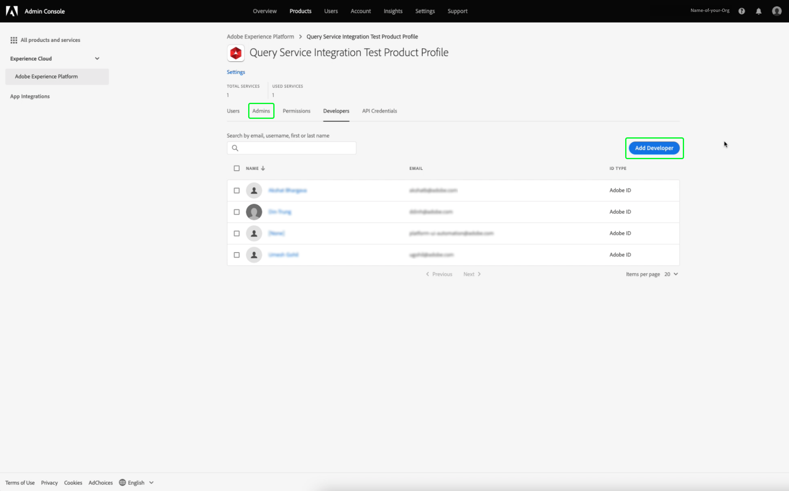

# 認證指南

Adobe Experience Platform查詢服務可讓您與外部用戶端連線。 您可以使用到期憑證或非到期憑證來連線至這些外部用戶端。

## 即將到期的憑據

您可以使用到期憑證來快速設定與外部用戶端的連線。


**[!UICONTROL 即將到期的憑據]**&#x200B;部分提供以下資訊：

- **[!UICONTROL 主機]**:您要連接的主機的名稱。若要連線至查詢服務，這會包含您目前使用的IMS組織名稱。
- **[!UICONTROL 埠]**:要連接的主機的埠號。
- **[!UICONTROL 資料庫]**:要連接的資料庫的名稱。
- **[!UICONTROL 使用者名稱]**:用於連接到查詢服務的用戶名。
- **[!UICONTROL 密碼]**:用於連接到Query Service的密碼。
- **[!UICONTROL PSQL命令]**:一個命令，它自動插入了所有相關資訊，以便您使用命令行上的PSQL連接到查詢服務。
- **[!UICONTROL 過期]**:即將到期的憑證的到期日。憑證產生後24小時過期。

## 未到期的憑據

您可以使用非到期憑證來設定與外部用戶端的更永久連線。

您必須先為您的組織設定&#x200B;**沙箱**&#x200B;和&#x200B;**管理查詢服務整合**&#x200B;權限，才能建立未到期的憑證。

登入[Adobe Admin Console](https://adminconsole.adobe.com/)並從頂端導覽列選取相關組織。

在[!UICONTROL 概述]的[!UICONTROL 產品和服務]區段中，選取&#x200B;**Adobe Experience Platform**。


此時會顯示「Adobe Experience Platform詳細資料」頁面。 接下來，建立新的配置檔案。 選擇&#x200B;[!UICONTROL **新建配置檔案**]。


將顯示配置檔案建立對話框。 輸入新配置檔案的描述性名稱，然後選擇&#x200B;[!UICONTROL **Save**]。 此時將顯示新配置檔案的[!UICONTROL 設定]頁。 從可用選項中選擇&#x200B;[!UICONTROL **Permissions**]&#x200B;頁簽。

### 啟用查詢服務權限

若要確保為您的組織啟用正確的查詢服務權限，請從清單中尋找並選取&#x200B;[!UICONTROL **查詢服務**]&#x200B;類別。


此時將顯示「查詢服務」的[!UICONTROL 編輯權限]工作區。 為&#x200B;[!UICONTROL **管理查詢**]&#x200B;和&#x200B;[!UICONTROL **管理查詢服務整合**]&#x200B;選擇加號(**+**)表徵圖，將它們添加到[!UICONTROL 包含的權限項]列中。 接下來，選擇&#x200B;[!UICONTROL **Save**]&#x200B;以確認更改。


這會將您返回「設定>權限」標籤。

### 啟用沙箱權限

若要確保為您的組織選取正確的沙箱，請從清單中尋找並選取&#x200B;[!UICONTROL **沙箱**]&#x200B;類別。


「沙箱」工作區隨即出現。 從[!UICONTROL 可用權限項目]中，找到相關沙箱，在此影像中，它是生產沙箱。 選取加號(**+**)圖示，將其新增至[!UICONTROL 包含的權限項目]。 接下來，選擇&#x200B;[!UICONTROL **Save**]&#x200B;以確認更改。


這會將您返回「設定>權限」標籤。

若要讓使用者存取非即將到期的帳戶功能，還需要另外三個步驟。

- 新增新使用者以將新建立的權限授予。 選擇&#x200B;[!UICONTROL **Users**]&#x200B;頁簽，然後選擇&#x200B;[!UICONTROL **Add User**]。


將出現「建立用戶」對話框。 輸入新用戶的名稱和電子郵件，然後選擇&#x200B;[!UICONTROL **Save**]。

- 然後，必須將使用者新增為管理員，才能允許為任何作用中的產品設定檔建立帳戶。 將新建立的使用者新增為管理員。 選擇「[!UICONTROL **管理員**]」頁簽，然後選擇「[!UICONTROL **添加管理員**]」。


將顯示「添加管理」對話框。 將新管理員的詳細資訊輸入到文本欄位中，然後選擇&#x200B;[!UICONTROL **Save**]。

- 之後，必須將使用者新增為開發人員，才能建立整合。 選擇&#x200B;**Developers**&#x200B;標籤，後跟&#x200B;**Add Developer**。



將顯示「添加開發人員」對話框。 將新開發人員的詳細資訊輸入到文本欄位中，然後選擇&#x200B;**Save**。

若要進一步了解如何指派權限，請參閱[存取控制](../../access-control/home.md)上的檔案。

所有必要權限現在都會在「Adobe開發人員控制台」中設定，供使用者使用即將到期的憑證功能。

要建立一組非到期憑據，請在「查詢憑據」工作區中選擇「**[!UICONTROL 生成憑據]**」。


出現「Generate credentials modal（生成憑據模式）」。 若要建立非到期憑證，您必須提供下列詳細資料：

- **[!UICONTROL 名稱]**:您正在生成的憑據的名稱。
- **[!UICONTROL 說明]**:（選用）您要產生的憑證說明。
- **[!UICONTROL 指派給]**:將分配給憑據的用戶。此值應為建立憑證之使用者的電子郵件地址。
- **[!UICONTROL 密碼]** （選用）您憑證的選用密碼。如果未設定密碼，Adobe將自動為您生成密碼。

提供所有所需詳細資訊後，請選擇&#x200B;**[!UICONTROL 生成憑據]**&#x200B;以生成憑據。


>[!IMPORTANT]
>
>選擇&#x200B;**[!UICONTROL 生成憑據]**&#x200B;按鈕後，配置JSON檔案將下載到本地電腦。 由於Adobe **不**&#x200B;記錄生成的憑據，因此您&#x200B;**必須**&#x200B;安全地儲存下載的檔案並保留憑據的記錄。
>
>此外，如果90天內未使用憑證，則會剪下憑證。

設定JSON檔案包含技術帳戶名稱、技術帳戶ID和憑證等資訊。 以下列格式提供。

```json
{"technicalAccountName":"9F0A21EE-B8F3-4165-9871-846D3C8BC49E@TECHACCT.ADOBE.COM","credential":"3d184fa9e0b94f33a7781905c05203ee","technicalAccountId":"4F2611B8613AA3670A495E55"}
```

現在您已儲存產生的憑證，請選取&#x200B;**[!UICONTROL Close]**。 您現在可以看到所有未到期憑證的清單。


您可以編輯或刪除未到期的憑證。 要編輯未到期的憑據，請選擇鉛筆表徵圖()。 要刪除未到期的憑據，請選擇刪除表徵圖()。

編輯未到期的憑證時，會出現強制回應視窗。 您可以提供下列詳細資料以進行更新：

- **[!UICONTROL 名稱]**:您正在生成的憑據的名稱。
- **[!UICONTROL 說明]**:（選用）您要產生的憑證說明。
- **[!UICONTROL 指派給]**:將分配給憑據的用戶。此值應為建立憑證之使用者的電子郵件地址。


提供所有必要的詳細資訊後，請選擇&#x200B;**[!UICONTROL 更新帳戶]**&#x200B;以完成憑據的更新。

## 使用憑據連接到外部客戶端

您可以使用即將到期或未到期的憑據來連接外部客戶端，如Aqua Data Studio、Looker或Power BI。

下表包含參數清單及其說明，通常是連線至外部用戶端所需的。

>[!NOTE]
>
>使用非過期憑據連接到主機時，仍需使用[!UICONTROL EXPINING CREDENTIALS]部分中列出的除密碼之外的所有參數。

| 參數 | 說明 |
|---|---|
| **伺服器/主機** | 要連接的伺服器/主機的名稱。 此值的形式為`server.adobe.io`，可在&#x200B;**[!UICONTROL Host]**&#x200B;下找到。 |
| **埠** | 要連接的伺服器/主機的埠。 此值可在&#x200B;**[!UICONTROL Port]**&#x200B;下找到。 埠的範例值為`80`。 |
| **資料庫** | 您要連接的資料庫。 可在&#x200B;**[!UICONTROL Database]**&#x200B;下找到此值。 資料庫的範例值為`prod:all`。 |
| **使用者名稱** | 連接到外部客戶端的用戶的用戶名。 其形式為`@AdobeOrg`之前的英數字串。 此值位於&#x200B;**[!UICONTROL Username]**&#x200B;下。 |
| **密碼** | 連接到外部客戶端的用戶的密碼。 <ul><li>如果您使用即將到期的憑證，可在即將到期的憑證區段的&#x200B;**[!UICONTROL Password]**&#x200B;下找到。</li><li>如果您使用的是非過期的憑證，此值由technicalAccountID的引數和從設定JSON檔案取得的憑證組成。 密碼值採用以下形式：`{technicalAccountId}:{credential}`。</li></ul> |

## 後續步驟

現在您已了解過期和未過期的憑證如何運作，您可以使用這些憑證連線至外部用戶端。 有關外部客戶端的詳細資訊，請參閱[將客戶端連接到查詢服務指南](../clients/overview.md)。
