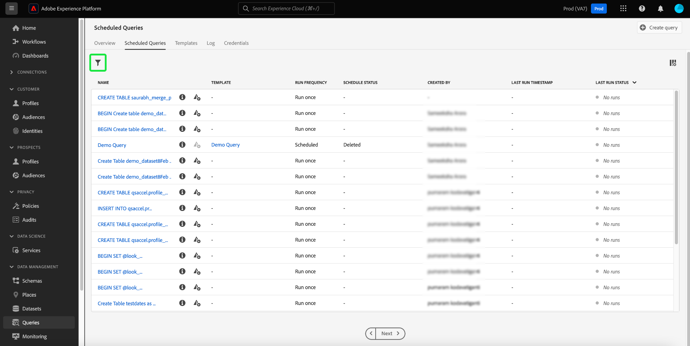
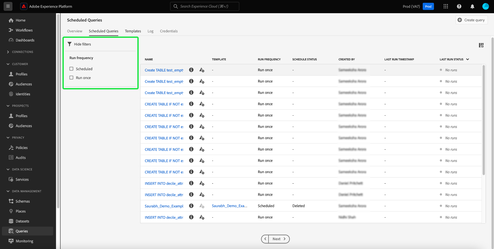
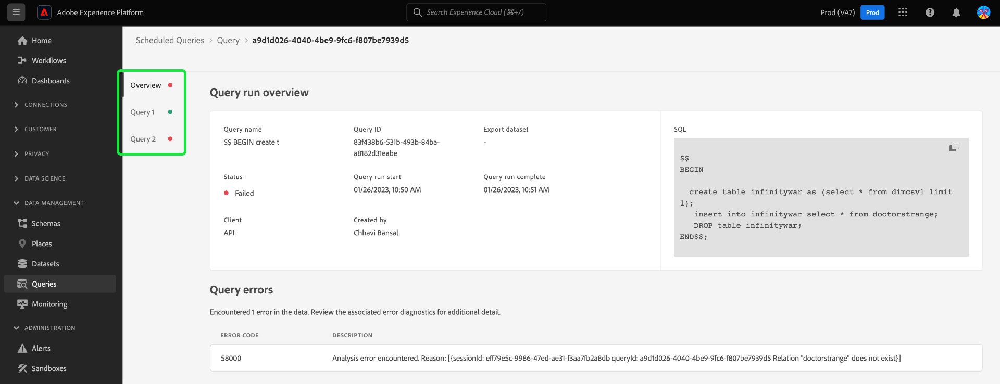

# 監視已排程查詢

Adobe Experience Platform透過UI改善所有查詢作業的狀態可見性。 從 [!UICONTROL 排定的查詢] 索引標籤中，您現在可以找到有關查詢執行的重要資訊，包括狀態、排程詳細資訊，以及失敗時的錯誤訊息/代碼。 您還可以透過UI訂閱基於查詢狀態的查詢警示，以進行任何查詢，透過 [!UICONTROL 排定的查詢] 標籤。

## [!UICONTROL 排定的查詢]

此 [!UICONTROL 排定的查詢] 索引標籤會提供所有已排程的CTAS和ITAS查詢的概觀。 您可以找到所有已排程查詢的執行詳細資料，以及任何失敗查詢的錯誤代碼和訊息。

若要導覽至 [!UICONTROL 排定的查詢] 索引標籤，選取 **[!UICONTROL 查詢]** 從左側導覽列，後面接著 **[!UICONTROL 排定的查詢]**

下表說明每個可用的欄。

>[!NOTE]
>
>警示訂閱圖示包含在未命名欄的每一列中。 請參閱 [警示訂閱](#alert-subscription) 區段以取得詳細資訊。

| 欄 | 說明 |
|---|---|
| **[!UICONTROL 名稱]** | 名稱欄位是範本名稱或SQL查詢的前幾個字元。 任何透過UI使用查詢編輯器建立的查詢都會在開始時命名。 如果查詢是透過API建立的，則其名稱會變成用來建立查詢的初始SQL的片段。 若要檢視與查詢相關聯的所有執行清單，請從以下專案選取專案： [!UICONTROL 名稱] 欄。 如需詳細資訊，請參閱 [查詢執行排程詳細資料](#query-runs) 區段。 |
| **[!UICONTROL 範本]** | 查詢的範本名稱。 選取範本名稱以導覽至「查詢編輯器」。 為方便起見，查詢範本會顯示在查詢編輯器中。 如果沒有範本名稱，資料列會以連字型大小標籤，且無法重新導向至查詢編輯器以檢視查詢。 |
| **[!UICONTROL SQL]** | SQL查詢的片段。 |
| **[!UICONTROL 執行頻率]** | 設定查詢執行的步調。 可用的值包括 `Run once` 和 `Scheduled`. 可以根據查詢的執行頻率來篩選查詢。 |
| **[!UICONTROL 建立者]** | 建立查詢的使用者名稱。 |
| **[!UICONTROL 已建立]** | 建立查詢時的時間戳記，以UTC格式表示。 |
| **[!UICONTROL 上次執行時間戳記]** | 執行查詢時的最新時間戳記。 此欄著重顯示查詢是否已根據其目前排程執行。 |
| **[!UICONTROL 上次執行狀態]** | 最近查詢執行的狀態。 狀態值為： `Success`， `Failed`， `In progress`、和 `No runs`. |
| **[!UICONTROL 排程狀態]** | 排定查詢的目前狀態。 有五個可能的值， [!UICONTROL 正在註冊]， [!UICONTROL 作用中]， [!UICONTROL 非使用中]， [!UICONTROL 已刪除]和連字型大小。 <ul><li>連字型大小表示排定的查詢是單次、非循環的查詢。</li><li>此 [!UICONTROL 正在註冊] 狀態表示系統仍在處理建立查詢的新排程。 請注意，您無法在註冊時停用或刪除排定的查詢。</li><li>此 [!UICONTROL 作用中] 狀態表示排定的查詢具有 **尚未通過** 其完成日期和時間。</li><li>此 [!UICONTROL 非使用中] 狀態表示排定的查詢具有 **已通過** 其完成日期和時間。</li><li>此 [!UICONTROL 已刪除] 狀態表示已刪除查詢排程。</li></ul> |

>[!TIP]
>
>如果您導覽至「查詢編輯器」，可以選取 **[!UICONTROL 查詢]** 以返回 [!UICONTROL 範本] 標籤。

## 自訂排程查詢的表格設定 {#customize-table}

您可以調整 [!UICONTROL 排定的查詢] 定位以符合您的需求。 若要開啟 [!UICONTROL 自訂表格] 設定對話方塊並編輯可用的欄，選取設定圖示()。

>[!NOTE]
>
>此 [!UICONTROL 已建立] 依照預設，會隱藏參考排程建立日期的欄。

切換相關的核取方塊以移除或新增表格欄。 接下來，選取 **[!UICONTROL 套用]** 以確認您的選擇。

>[!NOTE]
>
>透過UI建立的任何查詢都會在建立過程中成為具名範本。 範本名稱顯示在範本欄中。 如果查詢是透過API建立的，則範本欄為空白。

## 使用內嵌動作管理排程查詢 {#inline-actions}

此 [!UICONTROL 排定的查詢] 「檢視」提供各種內嵌動作，讓您從一個位置管理所有已排程的查詢。 每列都會以省略符號指出內嵌動作。 選取您要管理的排程查詢省略符號，以在快顯功能表中檢視可用選項。 可用的選項包括 [[!UICONTROL 停用排程]](#disable) 或 [!UICONTROL 啟用排程]， [[!UICONTROL 刪除排程]](#delete)、和 [[!UICONTROL 訂閱]](#alert-subscription) 以查詢警示。

### 停用或啟用排定的查詢 {#disable}

若要停用排定的查詢，請選取您要管理的排定查詢的省略符號，然後選取「 」 **[!UICONTROL 停用排程]** 從躍現式選單中的選項。 畫面會顯示一個對話方塊，確認您的動作。 選取 **[!UICONTROL 停用]** 以確認您的設定。

停用排定的查詢後，您就可以透過相同的程式啟用排程。 選取省略符號，然後選取「 」 **[!UICONTROL 啟用排程]** 可用選項中的。

### 刪除排定的查詢 {#delete}

若要刪除排定的查詢，請選取您要管理的排定查詢的省略符號，然後選取「 」 **[!UICONTROL 刪除排程]** 從躍現式選單中的選項。 畫面會顯示一個對話方塊，確認您的動作。 選取 **[!UICONTROL 刪除]** 以確認您的設定。

刪除排定的查詢後，它會 **非** 已從排程查詢清單中移除。 省略符號提供的內嵌動作會遭到移除，並以灰色的「新增警報」圖示取代。 您無法訂閱已刪除排程的警示。 該列保留在UI中，以提供排程查詢過程中所執行的執行的資訊。

如果您要為該查詢範本排定執行，請從適當的資料列選取範本名稱，以切換作業選項至「查詢編輯器」，然後遵循下列步驟 [新增排程至查詢的指示](./query-schedules.md#create-schedule) 如檔案所述。

### 訂閱警示 {#alert-subscription}

若要訂閱排程查詢執行的警示，請選取您要管理的排程查詢的省略符號，然後選取 **[!UICONTROL 訂閱]** 從躍現式選單中的選項。

此 [!UICONTROL 警報] 對話方塊開啟。 此 [!UICONTROL 警報] 對話方塊會讓您訂閱UI通知和電子郵件警示。 警示是以查詢的狀態為基礎。 有三個可用選項： `start`， `success`、和 `failure`. 勾選適當的一或多個方塊並選取 **[!UICONTROL 儲存]** 以訂閱。 您可以訂閱警示，只要他們沒有 [!UICONTROL 上次執行時間戳記] 值。

請參閱 [警示訂閱API檔案](../api/alert-subscriptions.md) 以取得詳細資訊。

### 檢視查詢詳細資料 {#query-details}

選取資訊圖示()，以檢視查詢的詳細資料面板。 詳細資訊面板包含查詢的所有相關資訊，超出已排程查詢表格中所包含的事實範圍。 其他資訊包括查詢ID、上次修改日期、查詢的SQL、排程ID和目前設定的排程。

## 篩選查詢 {#filter}

您可以根據執行頻率來篩選查詢。 從 [!UICONTROL 排定的查詢] 索引標籤中，選取篩選器圖示()以開啟篩選器側欄。

若要根據查詢的執行頻率來篩選查詢清單，請選取 **[!UICONTROL 已排程]** 或 **[!UICONTROL 執行一次]** 篩選核取方塊。

>[!NOTE]
>
>任何已執行但未排程的查詢都符合條件 [!UICONTROL 執行一次].

啟用篩選條件後，請選取 **[!UICONTROL 隱藏篩選器]** 以關閉篩選面板。

## 查詢執行排程詳細資料 {#query-runs}

若要開啟「排程詳細資料」頁面，請從下列位置選取查詢名稱： [!UICONTROL 排定的查詢] 標籤。 此檢視提供排定查詢執行的所有執行清單。 提供的資訊包括開始和結束時間、狀態和使用的資料集。

此資訊會以五欄表格提供。 每一列代表查詢執行。

| 資料行名稱 | 說明 |
|---|---|
| **[!UICONTROL 查詢執行ID]** | 每日執行的查詢執行識別碼。 選取 **[!UICONTROL 查詢執行ID]** 導覽至 [!UICONTROL 查詢執行總覽]. |
| **[!UICONTROL 查詢執行開始]** | 執行查詢時的時間戳記。 時間戳記採用UTC格式。 |
| **[!UICONTROL 查詢執行完成]** | 查詢完成時的時間戳記。 時間戳記採用UTC格式。 |
| **[!UICONTROL 狀態]** | 最近查詢執行的狀態。 三個狀態值包括： `successful` `failed` 或 `in progress`. |
| **[!UICONTROL 資料集]** | 執行中涉及的資料集。 |

欲檢視正在排程的查詢詳細資料，請參閱 [!UICONTROL 屬性] 面板。 此面板包括初始查詢ID、使用者端型別、範本名稱、查詢SQL和排程的步調。

選取查詢執行ID以切換作業選項至「執行詳細資料」頁面，並檢視查詢資訊。

## 查詢執行總覽 {#query-run-overview}

此 [!UICONTROL 查詢執行總覽] 提供此排程查詢個別執行的相關資訊，以及執行狀態的更詳細劃分。 此頁面也包含使用者端資訊，以及可能導致查詢失敗的任何錯誤的詳細資訊。

若查詢失敗，查詢狀態區段會提供錯誤代碼和錯誤訊息。

您可以從此檢視將查詢SQL複製到剪貼簿。 若要複製查詢，請選取SQL程式碼片段右上角的復製圖示。 會出現快顯訊息，確認已復製程式碼。

### 使用匿名區塊執行查詢的詳細資料 {#anonymous-block-queries}

使用匿名區塊來組成其SQL陳述式的查詢會分隔成其個別的子查詢。 子查詢的劃分可讓您個別檢查每個查詢區塊的執行詳細資訊。

>[!NOTE]
>
>使用DROP命令的匿名區塊的執行詳細資料 **非** 將作為單獨的子查詢報告。 CTAS查詢、ITAS查詢和用作匿名區塊子查詢的COPY陳述式有個別的執行詳細資訊。 目前不支援DROP命令的執行詳細資料。

匿名區塊會使用 `$$` 查詢前的字首。 若要進一步瞭解查詢服務中的匿名區塊，請參閱 [匿名區塊檔案](../essential-concepts/anonymous-block.md).

匿名區塊子查詢的執行狀態左側有標籤。 選取索引標籤以顯示執行詳細資料。

如果匿名區塊查詢失敗，您可以透過此UI找到該特定區塊的錯誤代碼。

選取 **[!UICONTROL 查詢]** 以返回排程詳細資訊畫面，或 **[!UICONTROL 排定的查詢]** 以返回 [!UICONTROL 排定的查詢] 標籤。

<!-- Details required to complete this section below:
### Run details for queries with parameterized queries {#parameterized-queries}

Queries that use parameterized values to make up the SQL statement are ... 
-->
