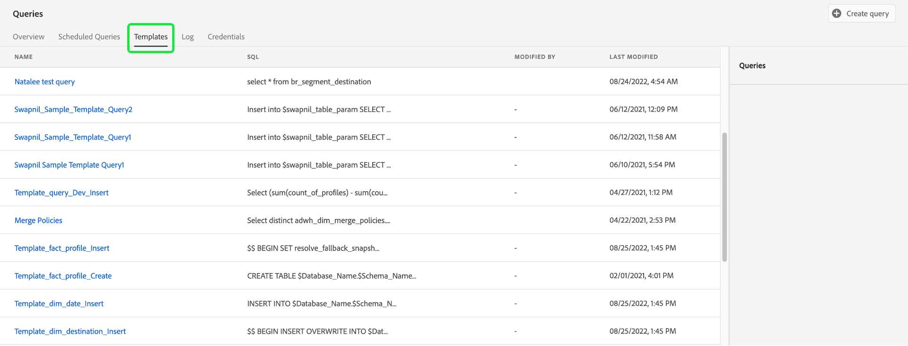

# [!DNL Query Service] UI指南

Adobe Experience Platform [!DNL Query Service] 提供使用者介面，可用於寫入和執行查詢、檢視以前執行的查詢，以及存取由您組織內的使用者儲存的查詢。 若要在中存取UI [Adobe Experience Platform](https://platform.adobe.com)，選取 **[!UICONTROL 查詢]** 左側導覽列中。

## [!DNL Query Editor]

此 [!DNL Query Editor] 可讓您在不使用外部使用者端的情況下寫入和執行查詢。 選取 **[!UICONTROL 建立查詢]** 以開啟 [!DNL Query Editor] 和建立新查詢。 您也可以存取 [!DNL Query Editor] 從中選擇一個查詢 **[!UICONTROL 記錄]** 或 **[!UICONTROL 範本]** 索引標籤。 選取先前執行或儲存的查詢將會開啟 [!DNL Query Editor] 和顯示所選查詢的SQL。

[!DNL Query Editor] 提供編輯空間，讓您開始輸入查詢。 當您輸入時，編輯器會自動完成表格中的SQL保留字、表格和欄位名稱。 完成查詢撰寫後，選取 **播放** 按鈕以執行查詢。 此 **[!UICONTROL 主控台]** 編輯器下方的索引標籤會顯示以下內容 [!DNL Query Service] 目前正在執行，以指出何時已傳回查詢。 此 **[!UICONTROL 結果]** 索引標籤，在Console旁邊，顯示查詢結果。 請參閱 [查詢編輯器指南](./user-guide.md) 有關使用的詳細資訊 [!DNL Query Editor].

![放大後的檢視 [!DNL Query Editor].](../images/ui/overview/query-editor.png)

## 排定的查詢 {#scheduled-queries}

已儲存為範本的查詢可排程為定期執行。 排程查詢時，您可以選擇執行頻率、開始和結束日期、已排程查詢執行在一週中的哪一天，以及要將查詢匯出到的資料集。 查詢排程是使用查詢編輯器設定的。

若要瞭解如何透過UI排程查詢，請參閱 [排程查詢指南](./user-guide.md#scheduled-queries). 若要瞭解如何使用API新增排程，請參閱 [排程查詢端點指南](../api/scheduled-queries.md).

排定查詢後，它會出現在上的已排定查詢清單中 [!UICONTROL 排定的查詢] 標籤。 從清單中選取排程的查詢，即可找到有關查詢、執行、建立者和時間安排的完整詳細資訊。

| 欄 | 說明 |
| --- | --- |
| **[!UICONTROL 名稱]** | 名稱欄位可以是範本名稱或SQL查詢的前幾個字元。 使用查詢編輯器透過UI建立的任何查詢最初都會命名。 如果查詢是透過API建立的，則查詢的名稱是用於建立查詢的初始SQL的片段。 |
| **[!UICONTROL 範本]** | 查詢的範本名稱。 選取範本名稱以導覽至「查詢編輯器」。 為方便起見，查詢範本會顯示在查詢編輯器中。 如果沒有範本名稱，資料列會標示一個連字型大小，且無法重新導向至「查詢編輯器」來檢視查詢。 |
| **[!UICONTROL SQL]** | SQL查詢的片段。 |
| **[!UICONTROL 執行頻率]** | 這是設定查詢執行的步調。 可用的值包括 `Run once` 和 `Scheduled`. 可以根據查詢的執行頻率來篩選查詢。 |
| **[!UICONTROL 建立者]** | 建立查詢的使用者名稱。 |
| **[!UICONTROL 已建立]** | 建立查詢時的時間戳記（UTC格式）。 |
| **[!UICONTROL 上次執行時間戳記]** | 執行查詢時的最新時間戳記。 此欄會根據查詢目前的排程來反白顯示查詢是否已執行。 |
| **[!UICONTROL 上次執行狀態]** | 最近查詢執行的狀態。 三個狀態值包括： `successful` `failed` 或 `in progress`. |

請參閱檔案，深入瞭解如何 [透過查詢服務UI監視查詢](./monitor-queries.md).

## 範本 {#browse}

此 **[!UICONTROL 範本]** 索引標籤會顯示由您組織中的使用者儲存的查詢。 將這些視為查詢專案會很有用，因為此處儲存的查詢可能仍在建構中。 查詢顯示於 **[!UICONTROL 範本]** 索引標籤也會顯示為執行查詢，在 **[!UICONTROL 記錄]** 標籤（如果先前已執行） [!DNL Query Service].

| 欄 | 說明 |
| --- | --- |
| **[!UICONTROL 名稱]** | 名稱欄位可以是使用者建立的查詢名稱，也可以是SQL查詢的前幾個字元。 使用查詢編輯器透過UI建立的任何查詢最初都會命名。 如果查詢是透過API建立的，則查詢的名稱是用於建立查詢的初始SQL的片段。 您可以選取查詢名稱，以在 [!DNL Query Editor]. 您也可以使用搜尋列來搜尋 [!UICONTROL 名稱] 查詢的。 搜尋區分大小寫。 |
| **[!UICONTROL SQL]** | SQL查詢的前幾個字元。 將滑鼠指標暫留在程式碼上會顯示完整查詢。 |
| **[!UICONTROL 修改者]** | 上次修改查詢的使用者。 貴組織中有權存取的任何使用者 [!DNL Query Service] 可以修改查詢。 |
| **[!UICONTROL 上次修改日期]** | 上次修改查詢的日期和時間，以瀏覽器的時區表示。 |

請參閱 [查詢範本](./query-templates.md) 檔案，以取得有關Platform UI中範本的詳細資訊。

## 記錄檔 {#log}

此 **[!UICONTROL 記錄]** tab提供先前已執行的查詢清單。 依預設，記錄會以反向時間順序列出查詢。

| 欄 | 說明 |
| --- | --- |
| **[!UICONTROL 名稱]** | 查詢名稱，由SQL查詢的前幾個字元組成。 選取範本名稱以開啟 [!UICONTROL 查詢記錄檔詳細資料] 檢視該回合。 您可以使用搜尋列來搜尋查詢的名稱。 搜尋區分大小寫。 |
| **[!UICONTROL 開始時間]** | 執行查詢的時間。 |
| **[!UICONTROL 完成時間]** | 查詢執行完成的時間。 |
| **[!UICONTROL 狀態]** | 查詢的目前狀態。 |
| **[!UICONTROL 資料集]** | 查詢使用的輸入資料集。 選取資料集，前往輸入資料集詳細資訊畫面。 |
| **[!UICONTROL 用戶端]** | 用於查詢的使用者端。 |
| **[!UICONTROL 建立者]** | 建立查詢的人員的名稱。 |

>!![Note]
選取鉛筆圖示()以導覽至「 」(Query Log)欄中的 [!DNL Query Editor]. 已預先填入查詢，以方便編輯。

請參閱 [查詢記錄檔案](./query-logs.md) 有關查詢事件自動產生的記錄檔的詳細資訊。

## 認證

此 **[!UICONTROL 認證]** 索引標籤會同時顯示您即將到期和未到期的認證。 如需有關如何使用這些認證與外部使用者端連線的詳細資訊，請參閱 [認證指南](../clients/overview.md).

## 後續步驟

現在您已熟悉 [!DNL Query Service] 使用者介面於 [!DNL Platform]，您可以存取 [!DNL Query Editor] 開始建立自己的查詢專案，與組織中的其他使用者共用。 有關在中編寫和執行查詢的詳細資訊 [!DNL Query Editor]，請參閱 [[!DNL Query Editor] 使用手冊](./user-guide.md).
