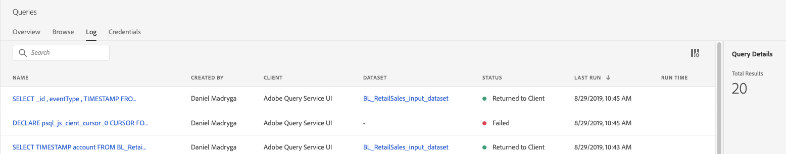
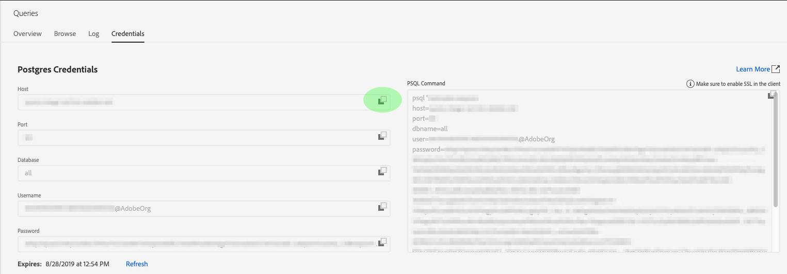

# 查詢服務指南

Adobe Experience Platform Query Service提供使用者介面，可用來寫入和執行查詢、檢視先前執行的查詢，以及存取IMS組織內的使用者儲存的查詢。 若要在 [Adobe Experience Platform中存取UI][platform-ui]，請在左側導 **覽中選取「查詢** 」。

## 查詢編輯器

使用查詢編輯器，您無需使用外部客戶端即可編寫和執行查詢。 按一下 **建立查詢** ，開啟查詢編輯器並建立新查詢。 您也可以從「記錄」或「瀏覽」標籤中選擇查詢，以 *存取* 「查 ** 詢編輯器」。 選擇以前執行或保存的查詢將開啟查詢編輯器並顯示所選查詢的SQL。

查詢編輯器提供編輯空間，您可以在其中開始鍵入查詢。 在鍵入時，編輯器會自動完成表內的SQL保留字、表和欄位名。 完成查詢寫入後，按一下 **播放** ，運行查詢。 編輯 *器下方的* 「控制台」頁籤顯示查詢服務當前正在執行的操作，指示查詢何時返回。 「控 *制台* 」旁的「結果」標籤會顯示查詢結果。 有關使用 [查詢編輯器的詳細資訊][query-editor] ，請參閱查詢編輯器指南。

## 瀏覽

「瀏 *覽* 」(Browse)頁籤顯示由組織中的用戶保存的查詢。 將這些視為查詢項目非常有用，因為此處保存的查詢可能仍在構建中。 如果查詢服 *務先前已執行過* ,「瀏覽」頁籤上顯示的查詢也會在「日誌 ** 」頁籤中顯示為運行查詢。

| 欄目 | 說明 |
| --- | --- |
| 名稱 | 用戶建立的查詢名稱。 您可以按一下名稱，在查詢編輯器中開啟查詢。 您也可以使用搜尋列來搜尋查詢的名稱。 搜尋會區分大小寫。 |
| SQL | SQL查詢的前幾個字元。 將滑鼠暫留在程式碼上時，會顯示完整查詢。 |
| 修改者 | 上次修改查詢的用戶。 您組織中擁有查詢服務存取權的任何使用者都可以修改查詢。 |
| 上次修改日期 | 瀏覽器時區中查詢上次修改的日期和時間。 |

## 記錄檔

「日 *志* 」頁籤提供以前已執行的查詢清單。 預設情況下，日誌會以逆時代順序列出查詢。

| 欄目 | 說明 |
| --- | --- |
| 名稱 | 查詢名稱，由SQL查詢的前幾個字元組成。 按一下名稱可開啟查詢編輯器，允許您編輯查詢。 您可以使用搜尋列來搜尋查詢的名稱。 搜尋會區分大小寫。 |
| 建立者 | 建立查詢的人員的名稱。 |
| 用戶端 | 用於查詢的客戶端。 |
| 資料集 | 查詢使用的輸入資料集。 按一下資料集，前往輸入資料集詳細資料畫面。 |
| 狀態 | 查詢的當前狀態。 |
| 上次執行 | 上次運行查詢時。 您可以按一下此欄上的箭頭，依遞增或遞減順序來排序清單。 |
| 執行時間 | 運行查詢所花費的時間。 |

## 認證

「認 *證* 」標籤會顯示您的Postgres憑證。 按一下任 **何欄位旁的** 「複製」圖示，將其內容儲存在鍵盤緩衝區中。 有關如何使用這些憑證與外部用戶端連接的詳細資訊，請閱讀「與用戶 [端連接」指南][connect-clients]。

## 後續步驟

現在您已熟悉Platform上的Query Service使用者介面，可以存取Query Editor，開始建立您自己的查詢專案，以便與您組織中的其他使用者共用。 有關在查詢編輯器中編寫和運行查詢的詳細資訊，請參閱查 [詢編輯器使用手冊][query-editor]。

[platform-ui]: https://platform.adobe.com
[query-editor]: user-guide.md
[connect-clients]: ../clients/overview.md
