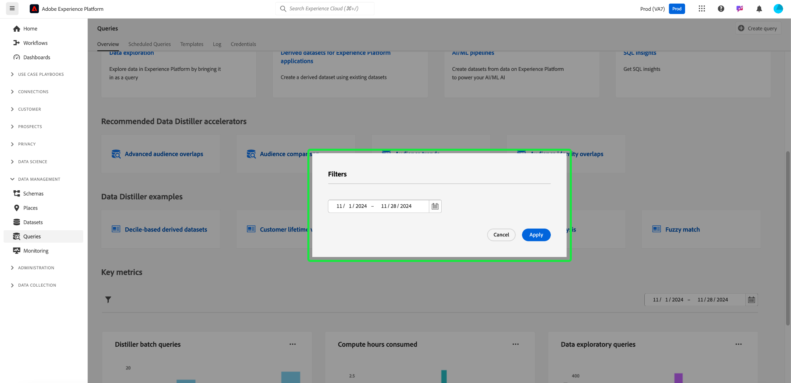
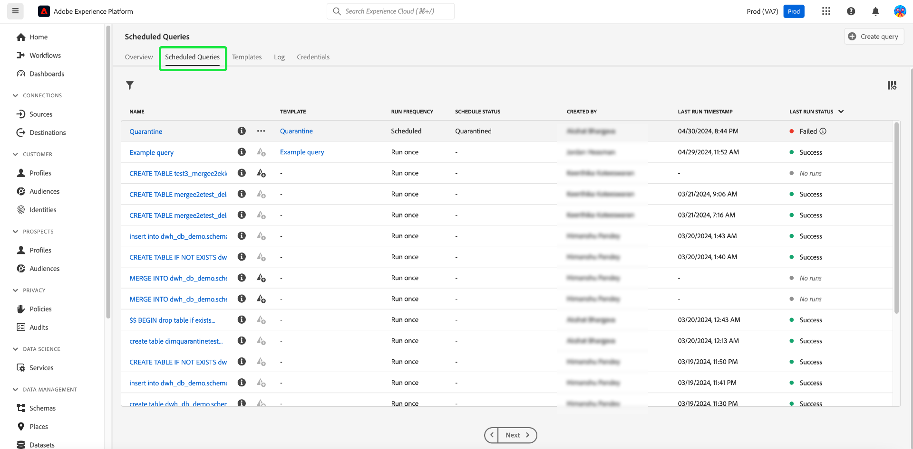

# 查詢服務UI指南

Adobe Experience Platform查詢服務提供使用者介面，可用於寫入和執行查詢、檢視以前執行的查詢，以及存取由您組織內的使用者儲存的查詢。 若要存取[Adobe Experience Platform](https://platform.adobe.com)內的UI，請在左側導覽中選取「**[!UICONTROL Queries]**」。 [!UICONTROL Queries] [!UICONTROL Overview]出現。

![包含查詢和[概觀]索引標籤的[查詢服務]工作區。](../images/ui/overview/queries-overview.png)

## 概觀 {#overview}

[!UICONTROL Overview]標籤提供簡化的進入點，以便使用查詢和資料Distiller範本。 在這裡，您可以存取編寫查詢、探索資料集和分析受眾資料所需的所有功能，以確保您的資料分析和受眾深入解析有順暢的工作流程。 使用本概述瞭解您可以使用Data Distiller達成的目標，並探索有關查詢服務使用情形的關鍵量度。

### 主要面板 {#main-panels}

[!UICONTROL Overview]頁面包含數個主要區段，可協助您開始使用：

1. 選取&#x200B;**[!UICONTROL Create query]**&#x200B;以快速導覽至查詢編輯器以寫入及執行新查詢。
2. 選取&#x200B;**[!UICONTROL Learn more]**&#x200B;以檢視如何&#x200B;**[!UICONTROL Write queries]**&#x200B;的詳細檔案。
3. 在&#x200B;**[!UICONTROL Get started]**&#x200B;區段中選取「**[!UICONTROL Discover Data Distiller]**」以開啟Data Distiller概觀，並瞭解可用的功能。

![含有[建立查詢]、[瞭解更多]和[開始使用]的查詢服務工作區已反白顯示。](../images/ui/overview/main-panels.png)

### 資料蒸餾器功能 {#data-distiller-capabilities}

[!UICONTROL Data Distiller capabilities]區段提供更進階資料Distiller功能的檔案連結：

- **[[!UICONTROL Data exploration]](../use-cases/data-exploration.md)**：瞭解如何使用SQL來探索、疑難排解及驗證批次擷取的資料。
- **[[!UICONTROL Derived datasets for Experience Platform applications]](../data-distiller/derived-datasets/overview.md)**：瞭解如何建立衍生的資料集，以支援複雜而多樣的使用案例，讓您的資料公用程式發揮最大效用。
- **[[!UICONTROL AI/ML pipelines]](../data-distiller/ml-feature-pipelines/overview.md)**：瞭解您偏好的機器學習工具背後的重要概念，以及如何建立可支援行銷使用案例的自訂模型。 本系列指南說明建置功能管道的必要步驟，這些管道會準備來自Experience Platform的資料，以饋送您機器學習環境中的自訂模型。
- **[[!UICONTROL SQL insights]](../data-distiller/sql-insights/overview.md)**：瞭解使用Data Distiller從SQL開發見解儀表板的主要功能和必要步驟。

### 推薦的資料蒸餾器加速器 {#recommended-accelerators}

選取快速連結，以導覽至相關的Data Distiller控制面板[!UICONTROL Templates]。 每個加速器都提供強大的工具和視覺效果，協助您分析受眾資料、最佳化細分及增強鎖定目標策略。

- **[[!UICONTROL Advanced audience overlaps]](../../dashboards/sql-insights-query-pro-mode/templates/overlaps.md)**：您可以從此儀表板分析多個受眾區段之間的受眾交集，以發掘有價值的深入分析並最佳化細分策略。 您也可以匯出您的見解以用於進一步的離線分析或報告用途。
- **[[!UICONTROL Audience comparison]](../../dashboards/sql-insights-query-pro-mode/templates/comparison.md)**：您可以從此儀表板並排比較和對比關鍵對象量度，以詳細分析兩個對象群組。 這些見解可協助您瞭解對象規模、成長情況和其他關鍵績效指標，讓您透過資料導向式決策，來調整細分和最佳化目標定位策略。
- **[[!UICONTROL Audience trends]](../../dashboards/sql-insights-query-pro-mode/templates/trends.md)**：使用[!UICONTROL Audience trends]儀表板，透過關鍵量度（例如對象成長、身分計數和單一身分設定檔），以視覺效果呈現您的對象如何隨時間演變。 追蹤趨勢，以發掘對受眾行為的寶貴深入分析，讓您能夠調整細分、增強參與度，並最佳化鎖定目標策略，以提升行銷活動效率。
追蹤一段時間內的對象量度，以監控對象人數、身分成長和整體參與度的變化。
- **[[!UICONTROL Audience identity overlaps]](../../dashboards/sql-insights-query-pro-mode/templates/identity-overlaps.md)**：使用「對象身分重疊」儀表板來分析所選對象中的身分重疊。 視覺效果和表格資料可提供深入分析，以最佳化身分拼接、減少備援並改善細分。 這些見解有助於更有效地鎖定目標、增強個人化並簡化客戶互動。

### 資料蒸餾器範例 {#data-distiller-examples}

選取卡片以開啟檔案指南和範例，協助您充份運用Data Distiller：

- **[[!UICONTROL Decile-based derived datasets]](../use-cases/deciles-use-case.md)**：瞭解如何在Adobe Experience Platform中建立以十等分為基礎的衍生資料集，以用於細分和建立對象。 使用航空公司忠誠度情境時，包含方案設計、十等分計算以及用於排名和彙總資料的查詢範例。
- **[[!UICONTROL Customer lifetime value]](../use-cases/customer-lifetime-value.md)**：瞭解如何使用Real-Time CDP和自訂儀表板追蹤及視覺化客戶期限值。 運用這些見解來制定吸引新客戶、保留現有客戶及最大化利潤的策略。
- **[[!UICONTROL Propensity score]](../use-cases/propensity-score.md)**：瞭解如何使用機器學習預測模型來決定傾向分數。 本指南涵蓋傳送資料以進行訓練、使用SQL套用經過訓練的模型，以及預測客戶購買的可能性。
- **[[!UICONTROL Consent analysis]](../../dashboards/insights-use-cases/consent-analysis.md)**：瞭解如何使用Real-Time CDP、查詢服務和資料Distiller來分析和追蹤客戶同意。 本指南涵蓋建立同意儀表板、調整分段、追蹤趨勢及確保法規遵循，協助您建立信任並提供個人化體驗。
- **[[!UICONTROL Fuzzy match]](../use-cases/fuzzy-match.md)**：瞭解如何對您的Experience Platform資料執行「模糊」比對，以尋找近似比對並分析跨資料集的字串相似度。 請依照本指南操作，以節省時間並使您的資料更易於存取。 此範例示範如何比對兩個旅行社資料集之間的飯店房間屬性，顯示如何有效比對、比較及調解大型複雜資料集，以達致一致性和準確性。

### 關鍵量度 {#key-metrics}

關鍵量度區段會顯示可協助您監視查詢服務使用情形之重要資料的視覺效果。 對於每個圖表，您可以選取右上方的省略符號(`...`)，然後選取[!UICONTROL View more]以檢視結果製表形式，或是將資料下載為CSV檔案以在試算表中檢視。 如需詳細資訊，請參閱[檢視更多指南](../../dashboards/sql-insights-query-pro-mode/view-more.md)。

#### 設定日期篩選 {#set-date-filter}

若要對這些視覺效果套用全域日期篩選，請選取篩選圖示()並調整&#x200B;**[!UICONTROL Filters]**&#x200B;對話方塊中的日期範圍。 套用此篩選器以針對特定時間範圍量身打造顯示的量度，並提高分析的相關性。

#### [!UICONTROL Distiller batch queries] {#distiller-batch-queries}

[!UICONTROL Distiller batch queries]圖表提供按日劃分的查詢活動，強調已處理的CTA和ITAS （互動式和已排程）查詢數目。 圖表會反白顯示模式，例如特定日互動式查詢的尖峰以及排程查詢的罕見使用。 使用這些見解來透過識別尖峰活動期間、修訂排程策略和平衡查詢執行來最佳化效能，以改善工作流程效率和資源使用率。

#### [!UICONTROL Compute hours consumed] {#compute-hours-consumed}

[!UICONTROL Compute hours consumed]圖表提供用於處理查詢服務操作的計算時數的每日視覺效果。 使用這些計算時數趨勢來監控資源消耗、識別高需求期間，並最佳化查詢執行以確保有效的資源配置和效能。

#### [!UICONTROL Data exploratory queries]

[!UICONTROL Data exploratory queries]圖表顯示每天隨選處理的SELECT查詢數目。 此視覺效果會強調查詢活動趨勢（例如特定日期的使用量尖峰），以協助您瞭解資料探索何時最活躍。 使用這些見解來監控查詢使用模式、平衡工作負載，以及最佳化探索資料分析的資源分配。 此分析可確保更有效率地使用「查詢服務」，並改善高需求期間的計畫。

## 查詢編輯器

使用查詢編輯器來寫入和執行查詢，而不使用外部使用者端。 選取&#x200B;**[!UICONTROL Create Query]**&#x200B;以開啟查詢編輯器並建立新查詢。 您也可以從&#x200B;**[!UICONTROL Log]**&#x200B;或&#x200B;**[!UICONTROL Templates]**&#x200B;索引標籤中選取查詢，以存取查詢編輯器。 如果您選取先前執行或儲存的查詢，查詢編輯器會開啟並顯示您所選查詢的SQL。

當您在「查詢編輯器」中輸入時，編輯器會自動完成SQL保留字、表格和表格內的欄位名稱。 當您完成查詢的撰寫時，請選取播放圖示()以執行查詢。 編輯器下方的&#x200B;**[!UICONTROL Console]**&#x200B;標籤顯示查詢服務目前正在執行的動作，並指出查詢何時已傳回。 **[!UICONTROL Result]**&#x200B;旁的[!UICONTROL Console]索引標籤會顯示查詢結果。 請參閱[查詢編輯器指南](./user-guide.md)，以取得有關使用查詢編輯器的詳細資訊。

### 關於結果標籤 {#results-tab}

[!UICONTROL Result]索引標籤會在執行後顯示您查詢的表格輸出。 使用此標籤來檢閱結果、驗證輸出，以及直接在介面中採取後續動作。 從這個檢視，您可以：

- 以CSV、XLSX或JSON格式下載結果以供離線分析。 檢視[下載查詢結果](./user-guide.md#download-query-results)。
- 以全熒幕檢視結果，以可調整大小的格線版面配置檢查大型表格或寬資料集。 以全熒幕檢視[結果](./user-guide.md#view-results)。
- 以CSV格式將結果複製到剪貼簿，以快速貼入試算表應用程式。 檢視[複製結果](./user-guide.md#copy-results)。

這些功能的設計可支援順暢的資料驗證、報告和共用工作流程，而且完全無須離開查詢編輯器。

### 參數化查詢 {#parameterized-queries}

Query Editor支援引數化查詢，可讓您將變數插入到SQL陳述式中，並在執行階段動態指派值。 此功能有助於簡化可重複使用的查詢，並改善工作流程的彈性。

您可以在寫入查詢時定義引數，然後在執行查詢之前透過[!UICONTROL Query parameters]索引標籤指派值。 引數化查詢對於排程查詢或跨組織共用的查詢範本特別有用。

若要瞭解如何定義和使用引數，請參閱查詢編輯器中的[引數化查詢](./parameterized-queries.md)。

## 排定的查詢 {#scheduled-queries}

已儲存為範本的查詢可以排程為定期執行。 排程查詢時，您可以選擇執行頻率、開始和結束日期、排程查詢執行在一週中的哪一天，以及要將查詢匯出到的資料集。 查詢排程是使用查詢編輯器設定的。

若要瞭解如何透過UI排程查詢，請參閱[排程查詢指南](./user-guide.md#scheduled-queries)。 若要瞭解如何使用API新增排程，請參閱[排程查詢端點指南](../api/scheduled-queries.md)。

一旦排定查詢，它就會出現在[!UICONTROL Scheduled Queries]索引標籤上的排定查詢清單中。 從清單中選取排程的查詢，即可找到有關查詢、執行、建立者和時間的完整詳細資訊。

| 欄 | 說明 |
| --- | --- |
| **[!UICONTROL Name]** | 名稱欄位是範本名稱或SQL查詢的前幾個字元。 任何透過UI使用查詢編輯器建立的查詢都會在開始時命名。 如果查詢是透過API建立的，則查詢的名稱是用來建立查詢的初始SQL的片段。 |
| **[!UICONTROL Template]** | 查詢的範本名稱。 選取範本名稱以導覽至「查詢編輯器」。 為方便起見，查詢範本會顯示在查詢編輯器中。 如果沒有範本名稱，資料列會以連字型大小標籤，且無法重新導向至查詢編輯器以檢視查詢。 |
| **[!UICONTROL SQL]** | SQL查詢的片段。 |
| **[!UICONTROL Run frequency]** | 此欄指出您的查詢設定為執行的步調。 可用的值為`Run once`和`Scheduled`。 可以根據查詢的執行頻率來篩選查詢。 |
| **[!UICONTROL Created by]** | 建立查詢的使用者名稱。 |
| **[!UICONTROL Created]** | 建立查詢時的時間戳記，以UTC格式表示。 |
| **[!UICONTROL Last run timestamp]** | 執行查詢時的最新時間戳記。 此欄著重顯示查詢是否已根據其目前排程執行。 |
| **[!UICONTROL Last run status]** | 最近查詢執行的狀態。 三個狀態值為： `successful` `failed`或`in progress`。 |

請參閱檔案，以取得如何透過Query Service UI[監視](./monitor-queries.md)查詢的詳細資訊。

## 範本 {#browse}

**[!UICONTROL Templates]**&#x200B;索引標籤顯示貴組織使用者儲存的查詢。 將這些視為查詢專案會很有用，因為此處儲存的查詢可能仍在建構中。 顯示在&#x200B;**[!UICONTROL Templates]**&#x200B;索引標籤上的查詢，如果先前已由查詢服務執行，也會在&#x200B;**[!UICONTROL Log]**&#x200B;索引標籤中顯示為執行查詢。

![已放大顯示數個已儲存查詢的[查詢儀表板範本]索引標籤。](../images/ui/overview/templates.png)

| 欄 | 說明 |
| --- | --- |
| **[!UICONTROL Name]** | 名稱欄位是由使用者建立的查詢名稱，或是SQL查詢的前幾個字元。 任何透過UI使用查詢編輯器建立的查詢都會在開始時命名。 如果查詢是透過API建立的，則查詢的名稱是用來建立查詢的初始SQL的片段。 您可以選取查詢名稱，以在「查詢編輯器」中開啟查詢。 您也可以使用搜尋列來搜尋查詢的[!UICONTROL Name]。 搜尋會區分大小寫。 |
| **[!UICONTROL SQL]** | sql查詢的前幾個字元。 將游標暫留在程式碼上會顯示完整查詢。 |
| **[!UICONTROL Modified by]** | 上次修改查詢的使用者。 貴組織中有權存取Query Service的任何使用者都可以修改查詢。 |
| **[!UICONTROL Last modified]** | 上次修改查詢的日期和時間，以瀏覽器的時區表示。 |

請參閱[查詢範本](./query-templates.md)檔案，以取得有關Experience Platform UI中範本的詳細資訊。

## 記錄檔 {#log}

**[!UICONTROL Log]**&#x200B;索引標籤提供先前已執行的查詢清單。 依預設，記錄會以反向時間順序列出查詢。

![在[查詢]儀表板記錄檔索引標籤中放大顯示，以反向時間順序顯示查詢清單。](../images/ui/overview/log.png)

| 欄 | 說明 |
| --- | --- |
| **[!UICONTROL Name]** | 查詢名稱，由SQL查詢的前幾個字元組成。 選取範本名稱以開啟該回合的[!UICONTROL Query log details]檢視。 您可以使用搜尋列來搜尋查詢的名稱。 搜尋會區分大小寫。 |
| **[!UICONTROL Start time]** | 執行查詢的時間。 |
| **[!UICONTROL Complete time]** | 查詢執行完成的時間。 |
| **[!UICONTROL Status]** | 查詢的目前狀態。 |
| **[!UICONTROL Dataset]** | 查詢使用的輸入資料集。 選取資料集，前往輸入資料集詳細資訊畫面。 |
| **[!UICONTROL Client]** | 用於查詢的使用者端。 |
| **[!UICONTROL Created by]** | 建立查詢的人員的名稱。 |

>[!NOTE]
>
>選取鉛筆圖示()從查詢記錄檔的任一列瀏覽至查詢編輯器。 已預先填入查詢，以方便編輯。

請參閱[查詢記錄檔案](./query-logs.md)，以取得關於查詢事件自動產生的記錄檔的詳細資訊。

## 認證

**[!UICONTROL Credentials]**&#x200B;索引標籤會顯示您即將到期和未到期的認證。 如需有關如何使用這些認證與外部使用者端連線的詳細資訊，請參閱[認證指南](../clients/overview.md)。

![顯示[認證]索引標籤的查詢儀表板。](../images/ui/overview/credentials.png)

## 管理 {#admin}

使用&#x200B;**[!UICONTROL Admin]**&#x200B;標籤可監視和管理整個組織的同時查詢編輯器工作階段。 此功能供管理員使用，不是寫入或執行查詢的必要功能。

從&#x200B;**[!UICONTROL Admin]**&#x200B;索引標籤，管理員可以檢視沙箱間的作用中工作階段並結束閒置工作階段以釋放共用容量。 此動作不會中斷正在執行的查詢。 請參閱[管理查詢服務工作階段指南](session-management.md)，以取得詳細指示和許可權需求。

## 後續步驟

現在您已經熟悉[!DNL Experience Platform]上的查詢服務使用者介面，您可以存取查詢編輯器以開始建立您自己的查詢專案，與組織中的其他使用者共用。 如需有關在查詢編輯器中編寫和執行查詢的詳細資訊，請參閱[查詢編輯器使用手冊](./user-guide.md)。
