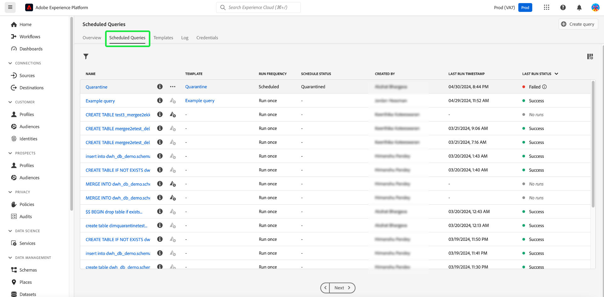

# [!DNL Query Service] UI指南

Adobe Experience Platform [!DNL Query Service] 提供可用來寫入及執行查詢、檢視先前執行的查詢，以及存取由您IMS組織內的使用者儲存的查詢的使用者介面。 若要在中存取UI [Adobe Experience Platform](https://platform.adobe.com)，選取 **[!UICONTROL 查詢]** 的下一頁。

## [!DNL Query Editor]

此 [!DNL Query Editor] 使您能夠編寫和執行查詢，而無需使用外部客戶端。 選擇 **[!UICONTROL 建立查詢]** 開啟 [!DNL Query Editor] 和建立新查詢。 您也可以存取 [!DNL Query Editor] 從 **[!UICONTROL 記錄檔]** 或 **[!UICONTROL 範本]** 標籤。 選取先前執行或儲存的查詢，將會開啟 [!DNL Query Editor] 和顯示所選查詢的SQL。

[!DNL Query Editor] 提供編輯空間，您可以在其中開始鍵入查詢。 鍵入時，編輯器會自動完成表內的SQL保留字、表和欄位名稱。 完成對查詢的寫入後，請選擇 **播放** 按鈕來運行查詢。 此 **[!UICONTROL 主控台]** 標籤顯示 [!DNL Query Service] 當前正在執行，表示查詢已傳回的時間。 此 **[!UICONTROL 結果]** 標籤中，顯示查詢結果。 請參閱 [查詢編輯器指南](./user-guide.md) ，以了解有關使用 [!DNL Query Editor].

![放大 [!DNL Query Editor].](../images/ui/overview/query-editor.png)

## 排程查詢 {#scheduled-queries}

已儲存為範本的查詢可排程定期執行。 排程查詢時，您可以選擇執行頻率、開始和結束日期、排程查詢執行的一週中某天，以及要匯出查詢的資料集。 查詢排程是使用查詢編輯器設定。

若要了解如何透過UI排程查詢，請參閱 [排程查詢指南](./user-guide.md#scheduled-queries). 若要了解如何使用API新增排程，請參閱 [排程查詢端點指南](../api/scheduled-queries.md).

排程查詢後，該查詢會顯示在 [!UICONTROL 排程查詢] 標籤。 從清單中選取排程查詢，即可找到查詢、執行、建立和計時的完整詳細資訊。

| 欄 | 說明 |
| --- | --- |
| **[!UICONTROL 名稱]** | 名稱欄位是模板名稱或SQL查詢的前幾個字元。 任何透過UI使用查詢編輯器建立的查詢，都會在開始時命名。 如果查詢是透過API建立，則查詢的名稱是用於建立查詢的初始SQL的片段。 |
| **[!UICONTROL 範本]** | 查詢的模板名稱。 選取範本名稱以導覽至「查詢編輯器」。 為方便起見，查詢模板將顯示在查詢編輯器中。 如果沒有範本名稱，則會以連字型大小標示列，且無法重新導向至查詢編輯器以檢視查詢。 |
| **[!UICONTROL SQL]** | SQL查詢的一段代碼。 |
| **[!UICONTROL 執行頻率]** | 這是設定查詢運行的順序。 可用值包括 `Run once` 和 `Scheduled`. 可以根據查詢的運行頻率來篩選查詢。 |
| **[!UICONTROL 建立者]** | 建立查詢的用戶的名稱。 |
| **[!UICONTROL 已建立]** | 查詢建立時的時間戳記，以UTC格式表示。 |
| **[!UICONTROL 上次運行時間戳]** | 查詢執行時的最新時間戳記。 此欄會強調顯示查詢是否已根據其目前排程執行。 |
| **[!UICONTROL 上次運行狀態]** | 最近的查詢執行的狀態。 三個狀態值為： `successful` `failed` 或 `in progress`. |

如需如何取得的詳細資訊，請參閱本檔案 [通過Query Service UI監視查詢](./monitor-queries.md).

## 範本 {#browse}

此 **[!UICONTROL 範本]** 索引標籤會顯示組織中的使用者儲存的查詢。 將這些項目視為查詢項目非常有用，因為此處保存的查詢可能仍在建構中。 查詢 **[!UICONTROL 範本]** 索引標籤也會在中顯示為執行查詢 **[!UICONTROL 記錄檔]** 標籤 [!DNL Query Service].

| 欄 | 說明 |
| --- | --- |
| **[!UICONTROL 名稱]** | 名稱欄位是用戶建立的查詢名稱或SQL查詢的前幾個字元。 任何透過UI使用查詢編輯器建立的查詢，都會在開始時命名。 如果查詢是透過API建立，則查詢的名稱是用於建立查詢的初始SQL的片段。 您可以選取查詢名稱，以在 [!DNL Query Editor]. 您也可以使用搜尋列來搜尋 [!UICONTROL 名稱] 的子句。 搜尋會區分大小寫。 |
| **[!UICONTROL SQL]** | SQL查詢的前幾個字元。 暫留在程式碼上會顯示完整查詢。 |
| **[!UICONTROL 修改者]** | 修改查詢的最後一個用戶。 貴組織中可存取 [!DNL Query Service] 可以修改查詢。 |
| **[!UICONTROL 上次修改日期]** | 瀏覽器時區中上次修改查詢的日期和時間。 |

## 記錄檔

此 **[!UICONTROL 記錄檔]** 索引標籤提供先前已執行的查詢清單。 依預設，記錄會以逆時間表列出查詢。

| 欄 | 說明 |
| --- | --- |
| **[!UICONTROL 名稱]** | 查詢名稱，由SQL查詢的前幾個字元組成。 選取名稱會開啟 [!DNL Query Editor]，可讓您編輯查詢。 您可以使用搜尋列來搜尋查詢的名稱。 搜尋會區分大小寫。 |
| **[!UICONTROL 建立者]** | 建立查詢的人員的名稱。 |
| **[!UICONTROL 用戶端]** | 用於查詢的客戶端。 |
| **[!UICONTROL 資料集]** | 查詢使用的輸入資料集。 選取要前往輸入資料集詳細資訊畫面的資料集。 |
| **[!UICONTROL 狀態]** | 查詢的當前狀態。 |
| **[!UICONTROL 上次執行]** | 上次運行查詢時。 您可以選取此欄上的箭頭，依遞增或遞減順序排序清單。 |
| **[!UICONTROL 執行時間]** | 運行查詢所花費的時間。 |

## 憑證

此 **[!UICONTROL 憑證]** 索引標籤會同時顯示您的即將到期和未到期的憑證。 有關如何使用這些憑據與外部客戶端連接的詳細資訊，請閱讀 [認證指南](../clients/overview.md).

## 後續步驟

現在你已經熟悉了 [!DNL Query Service] 使用者介面 [!DNL Platform]，您可以 [!DNL Query Editor] 以開始建立您自己的查詢專案，以便與組織中的其他使用者共用。 有關在中編寫和運行查詢的詳細資訊 [!DNL Query Editor]，請參閱 [[!DNL Query Editor] 使用手冊](./user-guide.md).