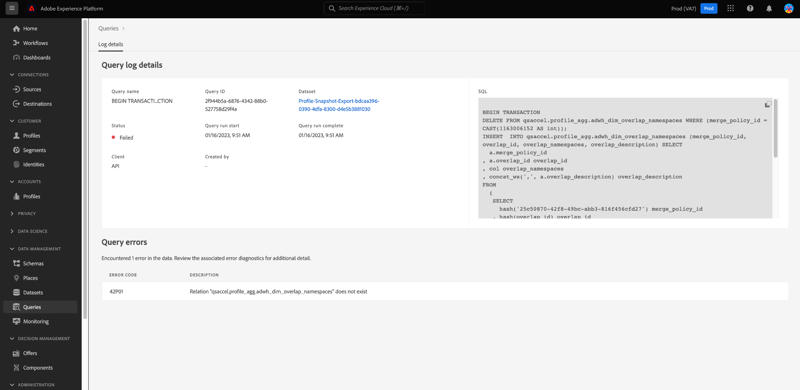

# 查詢日誌

>[!IMPORTANT]
>
>某些查詢日誌功能當前處於有限的版本中，並且不適用於所有客戶。 您的UI在沒有編輯表徵圖的情況下可能會略有不同。 此外，選擇查詢名稱的過程可以導航到查詢編輯器，而不是 [!UICONTROL 查詢日誌詳細資訊] 的子菜單。

Adobe Experience Platform維護通過API和UI發生的所有查詢事件的日誌。 此資訊可在查詢服務UI中 [!UICONTROL 日誌] 頁籤。

日誌檔案由任何查詢事件自動生成，並包含包括使用的SQL、查詢狀態、查詢花費的時間和上次運行時間在內的資訊。 您可以將查詢日誌資料用作排除低效或問題查詢的強大工具。 更全面的日誌資訊作為審核日誌功能的一部分而保留，可在 [審核日誌文檔](../../landing/governance-privacy-security/audit-logs/overview.md)。

## 檢查查詢日誌

要檢查查詢日誌，請選擇 [!UICONTROL 查詢] 導航到查詢服務工作區並選擇 [!UICONTROL 日誌] 的子菜單。

## 自定義和搜索 {#customize-and-search}

查詢服務日誌以可自定義的表格格式顯示。 要自定義表列，請選擇設定表徵圖()。 A [!UICONTROL 自定義表] 對話框，其中可取消選擇每列。

您還可以通過在搜索欄位中鍵入模板名稱來搜索與特定查詢模板相關的日誌。

A [日誌表各列的說明](./overview.md#log) 可在「查詢服務」概述的「日誌」部分找到。

## 發現日誌資料

每行表示與查詢模板關聯的查詢運行的日誌資料。 從表中選擇任何行，以用該運行的日誌資料填充右側欄。

在日誌詳細資訊面板中，可以選擇新的輸出資料集，並查看或複製運行中使用的完整SQL查詢。

>[!IMPORTANT]
>
>某些查詢日誌功能當前處於有限的版本中，並且不適用於所有客戶。

也可以從 [!UICONTROL 名稱] 欄，直接導航至 [!UICONTROL 查詢日誌詳細資訊] 的子菜單。

>[!NOTE]
>
>如果查詢是使用API建立的，且初始化期間未提供模板名稱，則會顯示SQL查詢的前幾十個字元。

每行的模板名稱或SQL代碼段旁邊有一個鉛筆表徵圖()。 然後，在編輯器中預填充查詢以進行編輯。

## 後續步驟

通過閱讀此文檔，您現在可以更好地瞭解查詢日誌在查詢服務UI中的訪問和使用方式。

查看 [UI概述](./overview.md)，或 [查詢服務API指南](../api/getting-started.md) 瞭解有關查詢服務功能的詳細資訊。

查看 [監視查詢文檔](./monitor-queries.md) 瞭解查詢服務如何提高計畫查詢運行的可見性。
