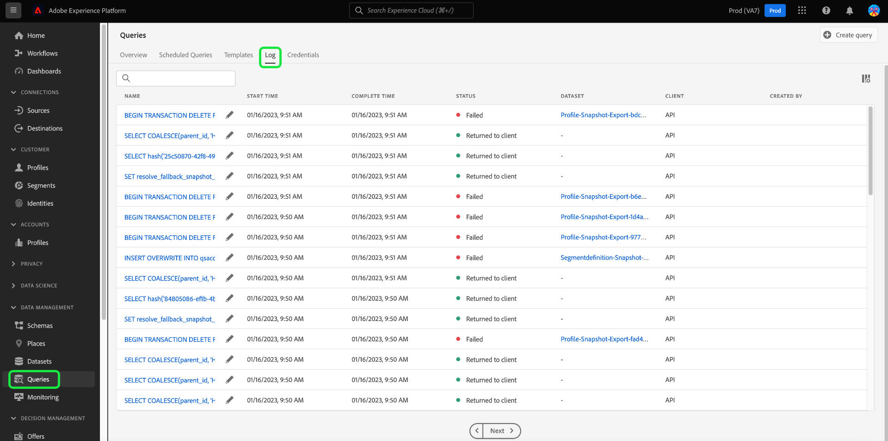

# 查詢記錄

Adobe Experience Platform會維護透過API和UI發生的所有查詢事件的記錄。 此資訊可在[!UICONTROL 記錄檔]索引標籤的查詢服務UI中使用。

記錄檔是由任何查詢事件自動產生，並包含所使用SQL、查詢狀態、所需時間以及上次執行時間等資訊。 您可以使用查詢記錄檔資料當作強大的工具，來疑難排解低效或問題查詢。 更完整的記錄資訊會保留在稽核記錄功能中，可在[稽核記錄檔案](../../landing/governance-privacy-security/audit-logs/overview.md)中找到。

## 檢查查詢記錄 {#check-query-logs}

若要檢查查詢記錄，請選取[!UICONTROL 查詢]以瀏覽至查詢服務工作區，並從可用選項中選取[!UICONTROL 記錄]。

>[!NOTE]
>
>預設會排除系統查詢和控制面板查詢。 請參閱[篩選器](#filter-logs)區段，瞭解如何根據您的設定調整顯示的記錄檔。

## 自訂和搜尋 {#customize-and-search}

查詢服務記錄以可自訂的表格格式顯示。 若要自訂表格欄，請選取設定圖示()在熒幕右側。 會出現[!UICONTROL 自訂表格]對話方塊，其中可取消選取每個資料行。

您也可以在搜尋欄位中輸入範本名稱，以搜尋與特定查詢範本相關的記錄。

每個記錄資料表資料行](./overview.md#log)的[描述可在查詢服務概觀的[記錄]區段中找到。

## 探索記錄檔資料

每一列代表與查詢範本相關之查詢回合的記錄資料。 從表格中選取任何列，以該回合的記錄資料填入右側邊欄。

在記錄詳細資訊面板中，您可以執行各種動作。 您可以以CTAS身分執行查詢，這會建立新的輸出資料集，請參閱或複製執行中使用的完整SQL查詢，或刪除查詢。

>[!NOTE]
>
>[!UICONTROL 以CTAS]執行的選項僅適用於SELECT查詢。

您也可以從[!UICONTROL 名稱]資料行選取查詢範本名稱，以直接導覽至[!UICONTROL 查詢記錄詳細資料]檢視。

>[!NOTE]
>
>如果查詢是使用API建立的，且在初始化期間未提供範本名稱，則會改為顯示SQL查詢的前幾十個字元。

## 編輯記錄 {#edit-logs}

每一列的範本名稱或SQL程式碼片段旁邊是鉛筆圖示()可用來導覽至查詢編輯器。 然後會在編輯器中預先填入查詢以進行編輯。

## 篩選記錄 {#filter-logs}

您可以根據各種設定來篩選查詢記錄清單。 選取篩選圖示()以開啟左側邊欄中的一組篩選選項。

將顯示可用篩選器清單。

下表提供每個篩選的說明。

| 篩選器 | 說明 |
| ------ | ----------- |
| [!UICONTROL 排除儀表板查詢] | 此核取方塊預設為啟用，並排除用於產生深入分析的查詢所產生的記錄。 這些查詢是系統產生的，模糊了使用者產生的記錄，這些記錄是監視、管理和疑難排解所必需的。 若要檢視系統產生的記錄，請取消選取核取方塊。 |
| [!UICONTROL 排除系統查詢] | 此核取方塊預設為啟用，並排除系統產生的記錄。 系統產生的查詢通常包括背景工作或維護操作，可能與使用者監控、管理或疑難排解目的無關。 如果您需要檢查系統產生的記錄，請取消選取此核取方塊以將其包含在記錄檢視中。 |
| [!UICONTROL 開始日期] | 若要篩選在特定期間建立的查詢記錄，請在[!UICONTROL 開始日期]區段中設定[!UICONTROL 開始]和[!UICONTROL 結束]日期。 |
| [!UICONTROL 完成日期] | 若要篩選在特定期間內完成的查詢記錄，請在[!UICONTROL 完成日期]區段中設定[!UICONTROL 開始]和[!UICONTROL 結束]日期。 |
| [!UICONTROL 狀態] | 若要根據查詢的[!UICONTROL 狀態]篩選記錄檔，請選取適當的選項按鈕。 可用的選項包括[!UICONTROL 已提交]、[!UICONTROL 進行中]、[!UICONTROL 成功]和[!UICONTROL 失敗]。 您一次只能根據一個狀態條件篩選記錄。 |
| [!UICONTROL 使用者端] | 若要根據使用的查詢使用者端篩選記錄檔，請在任意文字欄位中輸入下列其中一個接受的值： `API`、`Adobe Query Service UI`或`QsAccel`。 |
| [!UICONTROL 我的查詢] | 使用[!UICONTROL 我的查詢]切換功能來篩選由您執行的查詢記錄。 |
| [!UICONTROL 查詢記錄檔識別碼] | 若要根據查詢的唯一記錄ID進行篩選，請在任意文字欄位中輸入記錄ID。 此資訊可在[!UICONTROL 記錄檔詳細資料]中找到。 |

任何套用的篩選器都會顯示在篩選的記錄結果上方。

![查詢工作區的[記錄]索引標籤，反白顯示套用的篩選器清單。](../images/ui/query-log/applied-log-filters.png)

## 後續步驟

閱讀本檔案後，您現在能更清楚瞭解在查詢服務UI中如何存取及使用查詢記錄。

請參閱[UI總覽](./overview.md)或[查詢服務API指南](../api/getting-started.md)，以進一步瞭解查詢服務功能。

請參閱[監視查詢檔案](./monitor-queries.md)，瞭解查詢服務如何改善已排程查詢執行的可見度。
