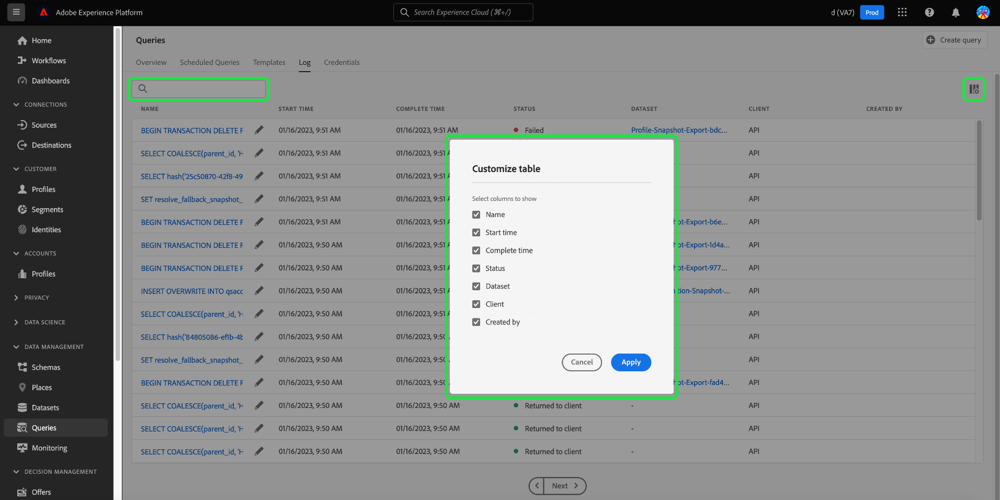

# 查詢記錄

>[!IMPORTANT]
>
>某些查詢記錄功能目前為有限版本，並非所有客戶都可使用。 如果沒有編輯圖示，您的UI可能會以稍微不同的方式顯示。 此外，選擇查詢名稱的過程可能會瀏覽到查詢編輯器，而不是 [!UICONTROL 查詢記錄檔詳細資料] 檢視。

Adobe Experience Platform會維護透過API和UI發生的所有查詢事件的記錄。 此資訊可在查詢服務UI中使用，網址為 [!UICONTROL 記錄檔] 標籤。

記錄檔由任何查詢事件自動產生，並包含所使用SQL、查詢狀態、所需時間以及上次執行時間等資訊。 您可以使用查詢記錄檔資料當作疑難排解低效或問題查詢的強大工具。 稽核記錄功能會保留更完整的記錄資訊，您可在以下連結中找到： [稽核記錄檔案](../../landing/governance-privacy-security/audit-logs/overview.md).

## 檢查查詢記錄

若要檢查查詢記錄，請選取 [!UICONTROL 查詢] 導覽至「查詢服務」工作區，然後選取 [!UICONTROL 記錄] 從可用選項中選取。

## 自訂和搜尋 {#customize-and-search}

查詢服務記錄以可自訂的表格格式顯示。 若要自訂表格欄，請選取設定圖示()。 A [!UICONTROL 自訂表格] 會出現對話方塊，其中可取消選取每個欄。

您也可以在搜尋欄位中輸入範本名稱，以搜尋與特定查詢範本相關的記錄。

A [每個log table資料欄的說明](./overview.md#log) 您可在查詢服務概觀的「記錄」區段中找到。

## 探索記錄檔資料

每一列代表與查詢範本相關之查詢回合的記錄資料。 從表格中選取任何列，以該回合的記錄資料填入右側邊欄。

在記錄詳細資訊面板中，您可以選取新的輸出資料集，並檢視或複製執行中使用的完整SQL查詢。

>[!IMPORTANT]
>
>某些查詢記錄功能目前為有限版本，並非所有客戶都可使用。

您也可以從以下專案選取查詢範本名稱： [!UICONTROL 名稱] 欄直接導覽至 [!UICONTROL 查詢記錄檔詳細資料] 檢視。

>[!NOTE]
>
>如果查詢是使用API建立的，且在初始化期間未提供範本名稱，則會改為顯示SQL查詢的前幾十個字元。

每一列的範本名稱或SQL程式碼片段旁邊，是一個鉛筆圖示()以導覽至「查詢編輯器」。 然後會在編輯器中預先填入查詢以進行編輯。

## 後續步驟

閱讀本檔案後，您現在已能更清楚瞭解如何在Query Service UI中存取及使用查詢記錄。

請參閱 [UI總覽](./overview.md)，或 [查詢服務API指南](../api/getting-started.md) 以進一步瞭解查詢服務功能。

請參閱 [監視查詢檔案](./monitor-queries.md) 以瞭解查詢服務如何改善已排程查詢執行的可見度。
