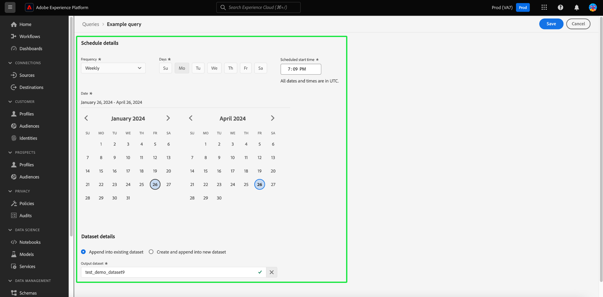

# 查詢排程

您可以透過建立查詢排程來自動執行查詢。 排程查詢會在自訂步調上執行，以根據頻率、日期和時間管理您的資料。 如有需要，您也可以為結果選擇輸出資料集。 已儲存為範本的查詢可以從「查詢編輯器」進行排程。

>[!IMPORTANT]
>
>您只能將排程新增至已建立、儲存及執行的查詢。

任何排定的查詢都會新增到 [!UICONTROL 排定的查詢] 標籤。 您可以從該工作區透過UI監視所有已排程查詢工作的狀態。 在 [!UICONTROL 排定的查詢] 索引標籤可讓您找到有關查詢執行的重要資訊，並訂閱警示。 可用的資訊包括狀態、排程詳細資料，以及執行失敗時的錯誤訊息/代碼。 請參閱 [監視排定的查詢檔案](./monitor-queries.md) 以取得詳細資訊。

此工作流程涵蓋查詢服務UI中的排程程式。 若要瞭解如何使用API新增排程，請參閱 [排程查詢端點指南](../api/scheduled-queries.md).

## 建立查詢排程 {#create-schedule}

若要排程查詢，請從下列任一選項中選取查詢範本： [!UICONTROL 範本] 標籤或 [!UICONTROL 範本] 的欄 [!UICONTROL 排定的查詢] 標籤。 選取範本名稱可將您導覽至查詢編輯器。

如果您從「查詢編輯器」存取已儲存的查詢，則可以建立查詢的排程，或從詳細資訊面板檢視查詢的排程。

>[!TIP]
>
>選取 **[!UICONTROL 檢視排程]** 若要瀏覽至「排程」工作區，並快速檢視任何排定的查詢執行。

![具有的查詢編輯器 [!UICONTROL 檢視排程] 和 [!UICONTROL 新增排程] 反白顯示。](../images/ui/query-schedules/view-add-schedule.png)

選取 **[!UICONTROL 新增排程]** 導覽至 [排程詳細資訊頁面](#schedule-details).

或者，選取 **[!UICONTROL 時程表]** 索引標籤在查詢名稱下方。

排程工作區隨即顯示。 選取 **[!UICONTROL 新增排程]** 以建立排程。

### 編輯排程詳細資料 {#schedule-details}

便會顯示「排程詳細資訊」頁面。 您可以在此頁面選擇排定查詢的頻率、開始和結束日期、排定查詢在一週中的哪一天執行，以及要將查詢匯出到哪個資料集。

您可以選擇下列選項 **[!UICONTROL 頻率]**：

- **[!UICONTROL 每小時]**：排程查詢將在您選取的日期範圍內每小時執行一次。
- **[!UICONTROL 每日]**：排定的查詢將在您選取的時間和日期期間每X天執行一次。 請注意，所選的時間為 **UTC**，而不是您的當地時區。
- **[!UICONTROL 每週]**：選取的查詢將在您選取的一週、時間和日期時段執行。 請注意，所選的時間為 **UTC**，而不是您的當地時區。
- **[!UICONTROL 每月]**：選取的查詢將在您選取的日期、時間和日期期間每個月執行。 請注意，所選的時間為 **UTC**，而不是您的當地時區。
- **[!UICONTROL 每年]**：選取的查詢將每年在您選取的日期、月、時間和日期期間執行。 請注意，所選的時間為 **UTC**，而不是您的當地時區。

對於輸出資料集，您可以選擇使用附加至現有資料集或建立並附加至新資料集。 第二個選項表示如果您是第一次執行查詢並建立資料集，任何後續執行都會將資料插入該資料集。

>[!IMPORTANT]
>
> 由於您使用現有資料集或建立新資料集，因此您需要 **非** 需要包含 `INSERT INTO` 或 `CREATE TABLE AS SELECT` 做為查詢的一部分，因為資料集已設定。 包括 `INSERT INTO` 或 `CREATE TABLE AS SELECT` 作為您排程查詢的一部分，將導致錯誤。

如果您無權存取引數化查詢，請繼續前往 [刪除或停用排程](#delete-schedule) 區段。

### 為排程的引數化查詢設定引數 {#set-parameters}

>[!IMPORTANT]
>
>引數化查詢UI功能目前可在 **僅限限量發行** 而且並非所有客戶都可使用。

如果您要為引數化查詢建立排定的查詢，現在必須設定這些查詢執行的引數值。

確認所有這些詳細資料後，請選取 **[!UICONTROL 儲存]** 以建立排程。 您會回到顯示新建立之排程詳細資訊的排程工作區，包括排程ID、排程本身以及排程的輸出資料集。 您可以使用排程ID來查詢排程查詢本身執行的詳細資訊。 若要進一步瞭解，請閱讀 [已排程查詢執行端點指南](../api/runs-scheduled-queries.md).

## 檢視排定的查詢執行 {#scheduled-query-runs}

若要檢視查詢範本排定的執行清單，請導覽至 [!UICONTROL 排定的查詢] 標籤並從可用清單中選取範本名稱。

該排定查詢的查詢執行清單隨即顯示。

請參閱 [monitor scheduled queried guide](./monitor-queries.md#inline-actions) 有關如何透過UI監視所有查詢作業狀態的完整資訊。

## 刪除或停用排程 {#delete-schedule}

您可以從特定查詢的排程工作區或 [!UICONTROL 排定的查詢] 列出所有已排程查詢的工作區。

若要存取 [!UICONTROL 時程表] 的標籤中，您必須從以下任一位置選取查詢範本的名稱： [!UICONTROL 範本] 標籤或 [!UICONTROL 排定的查詢] 標籤。 這會導覽至該查詢的查詢編輯器。 從查詢編輯器中選取 **[!UICONTROL 時程表]** 以存取排程工作區。

從可用排程的列選取排程。 您可以使用切換來停用或啟用排定的查詢。

>[!IMPORTANT]
>
>您必須先停用排程，才能刪除查詢的排程。

選取 **[!UICONTROL 刪除排程]** 刪除已停用的排程。

或者， [!UICONTROL 排定的查詢] 索引標籤提供每個排程查詢的內嵌動作集合。 可用的內嵌動作包括 [!UICONTROL 停用排程] 或 [!UICONTROL 啟用排程]， [!UICONTROL 刪除排程]、和 [!UICONTROL 訂閱] 以警示排定的查詢。 如需有關如何透過排程查詢索引標籤刪除或停用排程查詢的完整指示，請參閱 [monitor scheduled queried guide](./monitor-queries.md#inline-actions).
