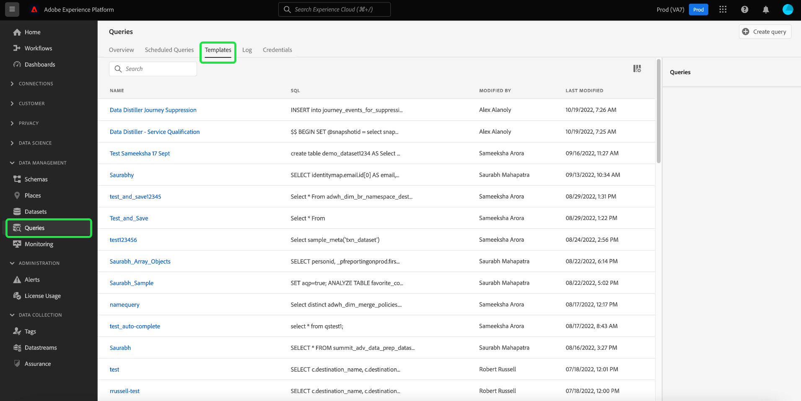

# 查詢模板

Adobe Experience Platform查詢服務允許您以查詢模板的形式保存和重用SQL代碼。 模板通過避免重複通常執行的任務而節省了工作量。 您可以在組織內共用模板，並輕鬆更改查詢值，而無需訪問或瞭解基礎SQL。

此文檔提供在查詢服務中建立查詢模板所需的資訊。

## 先決條件

您必須 [!UICONTROL 管理查詢] 已啟用訪問查詢編輯器並查看平台UI中的查詢儀表板的權限。 權限通過Adobe啟用 [Admin Console](https://adminconsole.adobe.com/)。 如果您沒有啟用此權限的管理員權限，請與組織的管理員聯繫。 請參閱的訪問控制文檔 [有關通過Admin Console添加權限的完整說明](../../access-control/home.md)。

## 建立查詢模板

您可以通過兩種方法建立查詢模板，方法是向查詢服務API發出POST請求 `query-templates` 終結點，或通過「查詢編輯器」編寫、命名和保存查詢。

### 使用查詢編輯器建立查詢並將其另存為模板

有關如何使用查詢編輯器來 [寫](./user-guide.md#query-authoring) 和 [保存查詢](./user-guide.md#saving-queries)。 命名並保存查詢後，可以將其作為查詢模板從 [!UICONTROL 模板] 頁籤。

## 瀏覽查詢模板 {#browse}

從平台UI的「查詢」工作區中，選擇 **[!UICONTROL 模板]** 顯示可用已保存查詢的清單。

要查找相關模板資訊，請從可用清單中選擇任何查詢模板以開啟詳細資訊面板。

在「詳細資訊」面板中，您可以執行四個單獨的操作：

* 選擇 **[!UICONTROL 輸出資料集]** 編輯所選模板的輸出資料集。
* 選擇 **[!UICONTROL 查看計畫]** 導航至 [!UICONTROL 計畫] 頁籤。 此視圖包含與查詢關聯的任何計畫資訊。
* 選擇 **[!UICONTROL 刪除查詢]** 的子菜單。
* 選擇模板名稱以導航到查詢編輯器，在該編輯器中預填充了SQL以供編輯。

### 使用查詢服務API建立模板

請參閱文檔以瞭解 [如何建立查詢模板](../api/query-templates.md#create-a-query-template) 使用查詢服務API。 新建立的查詢模板的詳細資訊包含在響應正文中。

>[!NOTE]
>
>使用API建立的模板也可在「平台UI查詢服務模板」頁籤中看到。

## 後續步驟

通過閱讀此文檔，您現在對如何在查詢服務中建立查詢模板有了更深入的瞭解。 查看 [UI概述](./overview.md)，或 [查詢服務API指南](../api/getting-started.md) 瞭解有關查詢服務功能的詳細資訊。

查看 [計畫查詢終結點指南](../api/scheduled-queries.md) 瞭解如何使用API調度查詢，或 [查詢編輯器指南](./user-guide.md#scheduled-queries) 的子菜單。
