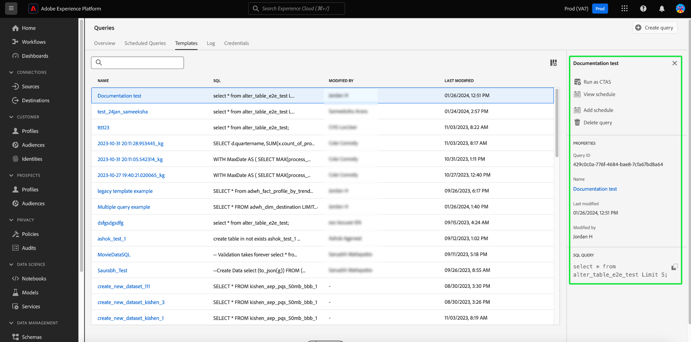

# 查詢範本

Adobe Experience Platform查詢服務可讓您以查詢範本的形式儲存和重複使用SQL程式碼。 範本可避免重複執行常見的工作，以節省工作量。 您可以在組織內共用範本並輕鬆變更查詢值，而不需要存取或瞭解底層SQL。

本檔案提供在「查詢服務」中建立查詢範本所需的資訊。

## 先決條件

您必須啟用[!UICONTROL 管理查詢]許可權，才能在Experience Platform UI中存取查詢編輯器並檢視查詢儀表板。 許可權是透過Adobe [Admin Console](https://adminconsole.adobe.com/)啟用。 如果您沒有啟用此許可權的管理員許可權，請聯絡貴組織的管理員。 請參閱存取控制檔案以取得[透過Admin Console新增許可權的完整指示](../../access-control/home.md)。

## 建立查詢範本

您可以透過兩種方法建立查詢範本，方法是向查詢服務API `query-templates`端點發出POST請求，或是透過查詢編輯器寫入、命名和儲存查詢。

### 使用查詢編輯器來編寫查詢並將其另存為範本

請參閱檔案，瞭解如何使用查詢編輯器[寫入](./user-guide.md#query-authoring)和[儲存查詢](./user-guide.md#saving-queries)的說明。 當您命名並儲存查詢後，即可從[!UICONTROL 範本]索引標籤將其當做查詢範本重複使用。

>[!TIP]
>
>當您在「查詢編輯器」中儲存查詢時，會彈出一則確認訊息，通知您操作成功。 此快顯訊息包含連結，提供導覽至查詢排程工作區的便利方式。 請參閱[排程查詢檔案](./query-schedules.md)以瞭解如何以自訂步調執行查詢。

## 瀏覽查詢範本 {#browse}

從Experience Platform UI的查詢工作區中，選取&#x200B;**[!UICONTROL 範本]**&#x200B;以顯示可用的已儲存查詢清單。

![已反白顯示[範本]索引標籤的查詢工作區。](../images/ui/query-templates/query-templates.png)

若要尋找相關範本資訊，請從可用清單中選取任何查詢範本，以開啟詳細資訊面板。

您可以從詳細資訊面板執行下列動作：

* 選取&#x200B;**[!UICONTROL 以CTAS身分執行]**&#x200B;以從現有資料表選取資料來建立新資料表。 此選項僅在您有SELECT查詢時可用。
* 選取&#x200B;**[!UICONTROL 新增排程]**&#x200B;以開始編輯查詢範本的排程。
* 選取「**[!UICONTROL 檢視排程]**」以瀏覽至[查詢編輯器]的[!UICONTROL 排程]標籤。 此檢視包含與查詢相關聯的任何排程資訊。
* 選取&#x200B;**[!UICONTROL 刪除查詢]**&#x200B;以刪除範本。
* 選取範本名稱，以導覽至「查詢編輯器」，其中會預先填入SQL以供編輯。

### 使用查詢服務API建立範本

請參閱檔案，以瞭解[如何使用查詢服務API建立查詢範本](../api/query-templates.md#create-a-query-template)的說明。 新建立的查詢範本的詳細資料包含在回應本文中。

>[!NOTE]
>
>使用API建立的範本也可顯示在Experience Platform UI查詢服務範本索引標籤中。

## 後續步驟

閱讀本檔案後，您現在已能更加瞭解如何在查詢服務中建立查詢範本。 請參閱[UI總覽](./overview.md)或[查詢服務API指南](../api/getting-started.md)，以進一步瞭解查詢服務功能。

請參閱[排程查詢端點指南](../api/scheduled-queries.md)，瞭解如何使用API或UI的[查詢編輯器指南](./user-guide.md#scheduled-queries)排程查詢。
