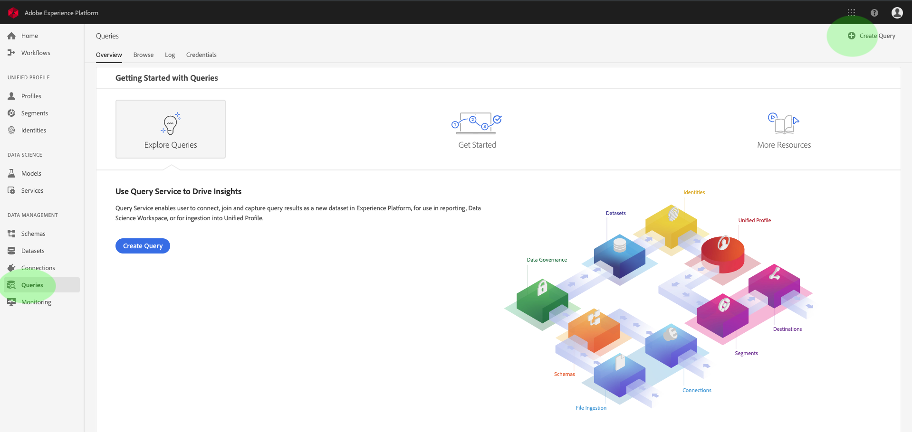
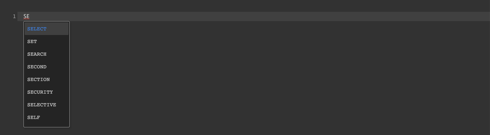

# [!DNL Query Editor] UI指南

[!DNL Query Editor] 是Adobe Experience Platform提供的互動式工 [!DNL Query Service]具，可讓您在使用者介面中編寫、驗證及執行客戶體驗資 [!DNL Experience Platform] 料查詢。[!DNL Query Editor] 支援開發分析和資料探索的查詢，並可讓您執行互動式查詢以用於開發，以及非互動式查詢以填入資料集 [!DNL Experience Platform]。

有關[!DNL Query Service]的概念和功能的詳細資訊，請參閱[查詢服務概述][query-service-overview]。 若要進一步瞭解如何導覽[!DNL Platform]上的查詢服務使用者介面，請參閱[查詢服務UI概觀][query-service-ui]。

## 快速入門

[!DNL Query Editor] 通過連接提供靈活的查詢執行 [!DNL Query Service]，並且查詢僅在此連接處於活動狀態時運行。

### 連接到[!DNL Query Service]

[!DNL Query Editor] 初始化並連線至開啟時需 [!DNL Query Service] 要數秒的時間。Console會告訴您連線的時間，如下所示。 如果嘗試在編輯器連接之前運行查詢，則會延遲執行，直到連接完成。

### 如何從[!DNL Query Editor]運行查詢

從[!DNL Query Editor]執行的查詢會以互動方式執行。 這表示如果您關閉瀏覽器或離開瀏覽器，查詢會被取消。 對於通過查詢輸出生成資料集而進行的查詢，也是如此。

## 使用[!DNL Query Editor]進行查詢編寫

使用[!DNL Query Editor]，您可以編寫、執行和儲存客戶體驗資料的查詢。 在[!DNL Query Editor]中執行的所有查詢或已保存的查詢都可用於您組織中具有[!DNL Query Service]訪問權限的所有用戶。

### 存取 [!DNL Query Editor]

在[!DNL Experience Platform] UI中，按一下左側導覽功能表中的&#x200B;**[!UICONTROL Queries]**&#x200B;以開啟[!DNL Query Service]工作區。 接著，按一下畫面右上方的&#x200B;**[!UICONTROL Create Query]**，開始編寫查詢。 此連結可從[!DNL Query Service]工作區中的任意頁面使用。

### 編寫查詢

[!UICONTROL Query Editor] 可讓撰寫查詢變得盡可能簡單。下面的螢幕擷取顯示編輯器在UI中的顯示方式，並反白顯示&#x200B;**播放**&#x200B;按鈕和SQL項目欄位。

為了將開發時間減至最少，建議您開發查詢時對傳回的列有限制。 例如 `SELECT fields FROM table WHERE conditions LIMIT number_of_rows`。在驗證查詢是否生成了預期的輸出後，請刪除限制並運行具有`CREATE TABLE tablename AS SELECT`的查詢，以生成包含輸出的資料集。

### 在[!DNL Query Editor]中編寫工具

- **自動語法反白顯示：** 讓讀取和組織SQL變得更輕鬆。

- **SQL關鍵字自動完成：開** 始鍵入查詢，然後使用箭頭鍵導航到所需的詞語，然後按 **Enter**。

- **表和欄位自動完成：** 開始鍵入要從的表名，然 `SELECT` 後使用箭頭鍵導航到要查找的表，然後按 **Enter**。選取表格後，自動完成會識別該表格中的欄位。

### 錯誤檢測

[!DNL Query Editor] 在編寫查詢時自動驗證查詢，提供通用SQL驗證和特定執行驗證。如果查詢下方出現紅色下划線（如下圖所示），則表示查詢內有錯誤。

檢測到錯誤時，可以通過將滑鼠懸停在SQL代碼上來查看特定錯誤消息。

### 查詢詳細資訊

在[!DNL Query Editor]中查看查詢時，**[!UICONTROL Query Details]**&#x200B;面板提供了管理選定查詢的工具。

此面板允許您直接從UI生成輸出資料集、刪除或命名顯示的查詢，並在&#x200B;**[!UICONTROL SQL Query]**&#x200B;頁籤上以易於複製的格式查看SQL代碼。 此面板還顯示有用的中繼資料，例如上次修改查詢的時間以及修改者（如果適用）。 要生成資料集，請按一下&#x200B;**[!UICONTROL Output Dataset]**。 出現&#x200B;**[!UICONTROL Output Dataset]**&#x200B;對話框。 輸入名稱和說明，然後按一下&#x200B;**[!UICONTROL Run Query]**。 新資料集顯示在[!DNL Platform]上[!DNL Query Service]用戶介面的&#x200B;**[!UICONTROL Datasets]**&#x200B;頁籤中。

### 保存查詢

[!DNL Query Editor] 提供保存函式，允許您保存查詢並稍後處理。要保存查詢，請按一下[!DNL Query Editor]右上角的&#x200B;**[!UICONTROL Save]**。 在保存查詢之前，必須使用&#x200B;**[!UICONTROL Query Details]**&#x200B;面板為查詢提供名稱。

### 如何尋找先前的查詢

從[!DNL Query Editor]執行的所有查詢都將捕獲到日誌表中。 您可以使用&#x200B;**[!UICONTROL Log]**&#x200B;標籤中的搜尋功能來尋找查詢執行。 保存的查詢列在&#x200B;**[!UICONTROL Browse]**&#x200B;頁籤中。

如需詳細資訊，請參閱[查詢服務UI概觀][query-service-ui]。

>[!NOTE]
>
>日誌不保存未執行的查詢。 要使查詢在[!DNL Query Service]中可用，必須在[!DNL Query Editor]中運行或保存該查詢。

## 使用查詢編輯器執行查詢

要在[!DNL Query Editor]中運行查詢，可以在編輯器中輸入SQL或從&#x200B;**[!UICONTROL Log]**&#x200B;或&#x200B;**[!UICONTROL Browse]**&#x200B;頁籤載入以前的查詢，然後按一下&#x200B;**播放**。 查詢執行狀態顯示在下面的&#x200B;**[!UICONTROL Console]**&#x200B;頁籤中，輸出資料顯示在&#x200B;**[!UICONTROL Results]**&#x200B;頁籤中。

### 控制台

控制台提供有關[!DNL Query Service]的狀態和操作的資訊。 控制台顯示到[!DNL Query Service]的連接狀態、正在執行的查詢操作以及這些查詢產生的任何錯誤消息。

>[!NOTE]
>
>控制台僅顯示因執行查詢而導致的錯誤。 在執行查詢之前，不會顯示查詢驗證錯誤。

### 查詢結果

查詢完成後，結果將顯示在&#x200B;**[!UICONTROL Console]**&#x200B;頁籤旁的&#x200B;**[!UICONTROL Results]**&#x200B;頁籤中。 此視圖顯示查詢的表格式輸出，最多顯示100行。 此視圖允許您驗證查詢是否生成了預期輸出。 若要使用查詢產生資料集，請移除傳回的列限制，然後使用`CREATE TABLE tablename AS SELECT`執行查詢，以產生含有輸出的資料集。 有關如何從[!DNL Query Editor]中的查詢結果生成資料集的說明，請參見[生成資料集教程][query-service-create-datasets]。

## 使用[!DNL Query Service]教學課程影片執行查詢

以下視頻介紹如何在Adobe Experience Platform介面和PSQL客戶端中運行查詢。 此外，還演示了在XDM對象中使用單個屬性、使用Adobe定義函式以及使用CREATE TABLE AS SELECT(CTAS)。

>[!VIDEO](https://video.tv.adobe.com/v/29796?quality=12&learn=on)

## 後續步驟

現在，您已知道[!DNL Query Editor]中有哪些功能可用，以及如何導覽應用程式，您可以直接在[!DNL Platform]中開始編寫您自己的查詢。 有關對[!DNL Data Lake]中的資料集運行SQL查詢的詳細資訊，請參見[運行查詢][query-service-running-queries]的指南。

[query-service-overview]: ../home.md
[query-service-ui]: overview.md
[query-service-running-queries]: ../best-practices/writing-queries.md
[query-service-create-datasets]: ./create-datasets.md
