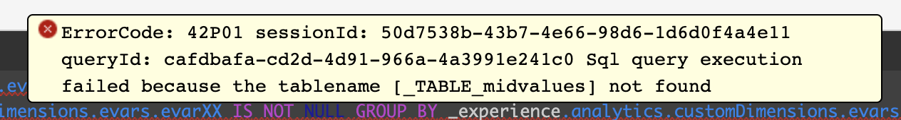
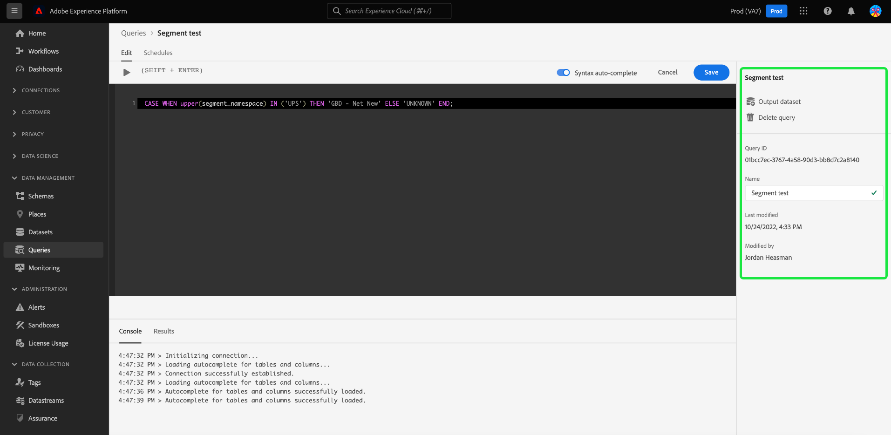

# [!DNL Query Editor] UI指南

[!DNL Query Editor] 是Adobe Experience Platform提供的互動式工具 [!DNL Query Service]，可讓您針對內的客戶體驗資料寫入、驗證及執行查詢 [!DNL Experience Platform] 使用者介面。 [!DNL Query Editor] 支援開發查詢以進行分析和資料探索，並可讓您執行互動式查詢以進行開發，以及非互動式查詢來填入以下位置的資料集： [!DNL Experience Platform].

有關概念和功能的詳細資訊 [!DNL Query Service]，請參閱 [查詢服務總覽](../home.md). 若要進一步瞭解如何導覽查詢服務使用者介面，請前往 [!DNL Platform]，請參閱 [查詢服務UI總覽](./overview.md).

## 快速入門 {#getting-started}

[!DNL Query Editor] 透過連線至 [!DNL Query Service]和查詢只會在此連線作用中時執行。

### 正在連線到 [!DNL Query Service] {#connecting-to-query-service}

[!DNL Query Editor] 需要幾秒鐘的時間來初始化並連線到 [!DNL Query Service] 開啟時。 主控台會告訴您何時連線，如下所示。 如果您嘗試在編輯器連線之前執行查詢，則會延遲執行，直到連線完成。

### 如何執行查詢 [!DNL Query Editor] {#run-a-query}

查詢執行自 [!DNL Query Editor] 以互動方式執行，這表示如果您關閉瀏覽器或離開瀏覽器，則會取消查詢。 從查詢輸出產生資料集的查詢也是如此。

## 查詢製作，使用 [!DNL Query Editor] {#query-authoring}

使用 [!DNL Query Editor]，您可以編寫、執行和儲存客戶體驗資料的查詢。 所有已執行或儲存的查詢 [!DNL Query Editor] 可供貴組織內所有可存取許可權的使用者使用 [!DNL Query Service].

### 存取 [!DNL Query Editor] {#accessing-query-editor}

在 [!DNL Experience Platform] UI，選取 **[!UICONTROL 查詢]** 在左側導覽功能表中開啟 [!DNL Query Service] 工作區。 接下來，若要開始寫入查詢，請選取 **[!UICONTROL 建立查詢]** 在熒幕的右上方。 此連結可從以下連結的任何頁面取得： [!DNL Query Service] 工作區。

### 增強型查詢編輯器切換 {#enhanced-editor-toggle}

>[!CONTEXTUALHELP]
>id="platform_queryService_queryEditor_enhancedEditorToggle"
>title="增強的編輯器切換"
>abstract="在舊版和增強版的查詢編輯器之間切換。雖然增強版提供更好的可存取性和多主題支援，但預設是啟用舊版本。若要深入了解關於這些變更的資訊，請參閱本文件。"

UI切換可讓您在舊版和增強版的查詢編輯器之間切換。 雖然增強版提供更好的可存取性和多主題支援，但預設是啟用舊版本。啟用增強型版本以存取查詢編輯器設定。

啟用切換開關會將編輯器切換為淺色主題，並改善語法的清晰度。 在納入自動完成切換的「查詢編輯器」輸入欄位上方也會出現設定圖示。 從設定圖示，您可以啟用深色佈景主題或停用/啟用自動完成。

>[!TIP]
>
>使用增強型查詢編輯器，您可以 [!UICONTROL 停用語法自動完成] 編寫查詢時不會失去進度。 通常，如果您在編輯時停用自動完成功能，則所有對查詢的變更都會遺失。

若要啟用深色或淺色佈景主題，請選取設定圖示()後按出現的下拉式選單中的選項。

### 正在寫入查詢 {#writing-queries}

[!UICONTROL 查詢編輯器] 已妥善整理，以便儘可能輕鬆編寫查詢。 以下熒幕擷圖顯示編輯器在UI中的顯示方式，其中包含SQL輸入欄位和 **播放** 反白顯示。

若要將開發時間縮到最短，建議您使用傳回列的限制來開發查詢。 例如 `SELECT fields FROM table WHERE conditions LIMIT number_of_rows`。確認查詢產生預期的輸出後，請移除限制並使用執行查詢 `CREATE TABLE tablename AS SELECT` 以使用輸出產生資料集。

### 寫入工具 [!DNL Query Editor] {#writing-tools}

- **自動語法反白顯示：** 讓閱讀及組織SQL更容易。

- **SQL關鍵字自動完成：** 開始輸入查詢，然後使用方向鍵導覽至所需辭彙，然後按下 **輸入**.

- **表格和欄位自動完成：** 開始輸入您想要的表格名稱 `SELECT` 從，然後使用方向鍵導覽至您要尋找的表格，然後按下 **輸入**. 選取表格後，自動完成會辨識該表格中的欄位。

### 自動完成UI設定切換 {#auto-complete}

此 [!DNL Query Editor] 當您撰寫查詢時，會自動建議可能的SQL關鍵字以及資料表或資料行詳細資訊。 自動完成功能預設為啟用，並可透過選取 [!UICONTROL 語法自動完成] 切換至「查詢編輯器」的右上角。

自動完成組態設定是每個使用者設定的，並記得該使用者連續登入的時間。

停用此功能會停止處理數個中繼資料命令，並提供通常有利於作者編輯查詢之速度的建議。

當您使用切換來啟用自動完成功能時，在短暫的暫停之後，即可使用建議的表格和欄名稱以及SQL關鍵字。 控制檯中「查詢編輯器」下方的成功訊息表示功能處於活動狀態。

如果停用自動完成功能，則需重新整理頁面才能讓功能生效。 當您停用「 」時，會顯示包含三個選項的確認對話方塊 [!UICONTROL 語法自動完成] 切換：

- [!UICONTROL 取消]
- [!UICONTROL 儲存變更並重新整理]
- [!UICONTROL 重新整理而不儲存變更]

>[!IMPORTANT]
>
>如果您在停用此功能時正在撰寫或編輯查詢，則必須在重新整理頁面之前儲存對查詢所做的任何變更，否則您的所有進度都將遺失。

若要停用自動完成功能，請選取適當的確認選項。

### 錯誤偵測 {#error-detection}

[!DNL Query Editor] 會在您撰寫查詢時自動驗證查詢，提供一般SQL驗證和特定執行驗證。 如果查詢下方出現紅色底線（如下圖所示），則表示查詢中有錯誤。

偵測到錯誤時，您可以暫留在SQL程式碼上，檢視特定的錯誤訊息。

### 查詢詳細資料 {#query-details}

若要在「查詢編輯器」中檢視查詢，請從以下位置選取任何已儲存的範本： [!UICONTROL 範本] 標籤。 查詢詳細資訊面板提供管理所選查詢的更多資訊和工具。

此面板可讓您直接從UI產生輸出資料集、刪除或命名顯示的查詢，以及新增排程至查詢。

此面板也會顯示有用的中繼資料，例如上次修改查詢的時間及修改者（如適用）。 若要產生資料集，請選取 **[!UICONTROL 輸出資料集]**. 此 **[!UICONTROL 輸出資料集]** 對話方塊隨即顯示。 輸入名稱和說明，然後選取 **[!UICONTROL 執行查詢]**. 新資料集會顯示在 **[!UICONTROL 資料集]** 標籤上的 [!DNL Query Service] 使用者介面於 [!DNL Platform].

### 排定的查詢 {#scheduled-queries}

已儲存為範本的查詢可以從「查詢編輯器」進行排程。 排程查詢可讓您以自訂步調自動執行查詢。 您可以根據頻率、日期和時間排程查詢，並視需要為您的結果選擇輸出資料集。 您也可以透過UI停用或刪除查詢排程。

排程是在查詢編輯器中設定。 使用查詢編輯器時，您只能將排程新增至已建立、儲存和執行的查詢。 同樣的限制不適用於 [!DNL Query Service] API：

請參閱查詢排程檔案，以瞭解如何 [在UI中建立查詢排程](./query-schedules.md). 或者，若要瞭解如何使用API新增排程，請參閱 [排程查詢端點指南](../api/scheduled-queries.md).

任何排定的查詢都會新增到 [!UICONTROL 排定的查詢] 標籤。 您可以從該工作區透過UI監視所有已排程查詢工作的狀態。 在 [!UICONTROL 排定的查詢] 索引標籤中，您可以找到有關查詢執行及訂閱警報的重要資訊。 可用的資訊包括狀態、排程詳細資料，以及執行失敗時的錯誤訊息/代碼。 請參閱 [監視排定的查詢檔案](./monitor-queries.md) 以取得詳細資訊。

### 正在儲存查詢 {#saving-queries}

此 [!DNL Query Editor] 提供儲存功能，可讓您儲存查詢並稍後處理。 若要儲存查詢，請選取 **[!UICONTROL 儲存]** 在的右上角 [!DNL Query Editor]. 在儲存查詢之前，必須使用 **[!UICONTROL 查詢詳細資料]** 面板。

>[!NOTE]
>
>使用查詢編輯器命名並儲存在中的查詢，可在查詢控制面板中作為範本使用 [!UICONTROL 範本] 標籤。 請參閱 [範本檔案](./query-templates.md) 以取得詳細資訊。

### 如何尋找先前的查詢 {#previous-queries}

所有查詢的執行來源： [!DNL Query Editor] 會在「記錄」表格中擷取。 您可以使用中的搜尋功能 **[!UICONTROL 記錄]** 索引標籤以尋找查詢執行。 已儲存的查詢會列在 **[!UICONTROL 範本]** 標籤。

如果已排程查詢，則 [!UICONTROL 排定的查詢] 索引標籤透過UI改善這些查詢作業的可見度。 請參閱 [查詢監視檔案](./monitor-queries.md) 以取得詳細資訊。

>[!NOTE]
>
>記錄檔不會儲存未執行的查詢。 為了讓查詢可用於 [!DNL Query Service]，它必須執行或儲存在 [!DNL Query Editor].

## 使用查詢編輯器執行查詢 {#executing-queries}

若要在中執行查詢 [!DNL Query Editor]，您可以在編輯器中輸入SQL，或從以下位置載入先前的查詢： **[!UICONTROL 記錄]** 或 **[!UICONTROL 範本]** 標籤，然後選取 **播放**. 查詢執行的狀態會顯示在 **[!UICONTROL 主控台]** 標籤，而輸出資料則顯示在 **[!UICONTROL 結果]** 標籤。

### 主控台 {#console}

主控台會提供有關下列專案的狀態和作業資訊 [!DNL Query Service]. 主控台顯示連線至 [!DNL Query Service]、正在執行的查詢操作，以及因這些查詢產生的任何錯誤訊息。

>[!NOTE]
>
>主控台只會顯示因執行查詢而產生的錯誤。 它不會顯示查詢執行前發生的查詢驗證錯誤。

### 查詢結果 {#query-results}

查詢完成後，結果會顯示在 **[!UICONTROL 結果]** 標籤，在 **[!UICONTROL 主控台]** 標籤。 此檢視顯示查詢的表格輸出，最多可顯示100列。 此檢視可讓您驗證您的查詢是否產生預期的輸出。 若要使用您的查詢產生資料集，請移除傳回列的限制，並使用執行查詢 `CREATE TABLE tablename AS SELECT` 以使用輸出產生資料集。 請參閱 [產生資料集教學課程](./create-datasets.md) 有關如何從中的查詢結果產生資料集的指示 [!DNL Query Editor].

## 透過以下方式執行查詢 [!DNL Query Service] 教學課程影片 {#query-tutorial-video}

以下影片說明如何在Adobe Experience Platform介面和PSQL使用者端中執行查詢。 此影片也會示範如何在XDM物件中使用個別屬性、Adobe定義的函式，以及如何使用CREATE TABLE AS SELECT (CTAS)查詢。

>[!VIDEO](https://video.tv.adobe.com/v/29796?quality=12&learn=on)

## 後續步驟

現在您知道中有哪些功能可用了 [!DNL Query Editor] 以及如何導覽應用程式，您可以開始直接在中編寫您自己的查詢 [!DNL Platform]. 如需對中的資料集執行SQL查詢的詳細資訊 [!DNL Data Lake]，請參閱以下指南： [正在執行查詢](../best-practices/writing-queries.md).
