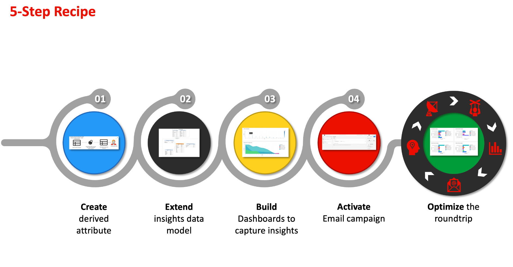

# 追蹤資料訊號以產生您的客戶期限值

您可以使用Real-time Customer Data Platform追蹤客戶期限值(CLV)，並使用使用者定義的儀表板將該量度視覺化。 透過使用Data Distiller和使用者定義儀表板，您可以測量客戶在整個關係中對您公司的價值。 瞭解CLV可以協助您制定企業策略，以爭取新客戶，同時保留現有客戶，並維持利潤率。

下列資訊圖表說明產生高效能資料以改善行銷活動的資料收集、操控、分析和操作的週期。

此端對端使用案例示範如何擷取及修改資料訊號，以計算衍生自客戶期限值的屬性。 這些衍生屬性然後可套用至您的Real-Time CDP設定檔資料，並可用於使用者定義的儀表板，以建立用於深入分析的控制面板。 透過Data Distiller，您可以擴充Real-Time CDP見解資料模型，並使用CLV衍生的屬性和儀表板見解來建立新區段，並將其啟用至所需的目的地。 然後，這些區段可用於建立高效能受眾，以支援您的下一個行銷活動。

本指南旨在透過測量推動CLV的關鍵接觸點上的資料訊號，並在您的環境中實作類似的使用案例，協助您更好地瞭解您的客戶體驗。 下圖會概述整個程式。

## 快速入門 {#getting-started}

本指南需要您實際瞭解Adobe Experience Platform的下列元件：

* [查詢服務](../home.md)：提供使用者介面和RESTful API，您可在其中使用SQL查詢來分析和擴充資料。
* [細分服務](../../segmentation/home.md)：可讓您建立區段，並從即時客戶設定檔資料產生對象。

## 先決條件

本指南要求您具備 [資料Distiller](../data-distiller/overview.md) SKU作為套件方案的一部分。 如果您不確定您是否擁有此服務，請洽詢您的Adobe服務代表。

## 建立衍生屬性 {#create-derived-attribute}

建立CLV的第一步是從使用者動作擷取的資料訊號建立衍生屬性。 此特定使用案例記錄於有關航空公司忠誠度方案的獨立檔案中。 請參閱指南以瞭解如何 [使用查詢服務來建立以十等分為基礎的衍生屬性，以便與您的設定檔資料搭配使用](./deciles-use-case.md). 說明下列步驟的檔案提供完整範例和說明：

* 建立結構描述以允許十等分分組。
* 使用查詢服務來建立十進位。
* 產生十等分的資料集。
* 啟用結構描述以用於Real-Time Customer Profile。
* 建立身分名稱空間並將其標示為主要識別碼。
* 建立查詢以計算回顧期間內的十分位數。

## 擴充見解資料模型和排程更新 {#extend-data-model-and-set-refresh-schedule}

接下來，您必須建立自訂資料模型或擴充現有的Adobe Real-Time CDP資料模型，以與您的CLV報告深入分析互動。 請參閱檔案以瞭解如何 [透過Query Service建立報告見解資料模型，以搭配加速商店資料和使用者定義的儀表板使用](../data-distiller/query-accelerated-store/reporting-insights-data-model.md#build-a-reporting-insights-data-model). 本教學課程涵蓋下列步驟：

* 使用Data Distiller建立報告深入分析的模型。
* 建立表格、關係及填入資料。
* 查詢報表分析資料模型。
* 使用Real-Time CDP見解資料模型擴充您的資料模型。
* 建立維度表格以擴充您的報表見解模型。
* 查詢您的擴充式加速存放區報告見解資料模型

請參閱Real-time Customer Data Platform Insights資料模型檔案以瞭解如何 [自訂SQL查詢範本，為您的行銷和關鍵績效指標(KPI)使用案例建立Real-Time CDP報表](../../dashboards/cdp-insights-data-model.md).

請務必設定排程，以定期重新整理您的自訂資料模型。 這可確保資料會視需要傳回作為您擷取管道的一部分，並填入您的使用者定義儀表板。 請參閱 [排程查詢指南](../ui/query-schedules.md#create-schedule) 以瞭解如何設定排程。

## 建立儀表板以擷取深入分析 {#build-a-custom-dashboard}

現在您已建立自訂資料模型，您可以利用自訂查詢和使用者定義儀表板將資料視覺化。 如需操作方法的完整指引，請參閱使用者定義控制面板概觀 [建立自訂儀表板](../../dashboards/user-defined-dashboards.md). UI指南包含下列專案的詳細資訊：

* 如何建立Widget。
* 如何使用Widget撰寫器。

以下提供使用十等分儲存貯體的自訂CLV Widget範例。

## 建立和啟用區段以建立高效能對象 {#create-and-activate-segments}

下一步是建立區段，並從您的即時客戶設定檔資料產生對象。 請參閱區段產生器UI指南以瞭解如何 [在Platform中建立及啟用區段](../../segmentation/ui/segment-builder.md). 本指南提供幾個小節，說明如何：

* 使用屬性、事件和現有對象的組合作為建置組塊，以建立區段定義。
* 使用規則產生器畫布和容器可控制區段規則的執行順序。
* 檢視潛在對象的預估值，讓您視需要調整區段定義。
* 啟用已排程區段的所有區段定義。
* 啟用串流區段的指定區段定義。

另外，也有 [區段產生器影片教學課程](https://experienceleague.adobe.com/docs/platform-learn/tutorials/segments/create-segments.html) 以取得詳細資訊。

## 為電子郵件行銷活動啟用區段 {#activate-segment-for-campaign}

建立區段後，您就可以將其啟動至目的地。 Platform支援各種電子郵件服務提供者(ESP)，可讓您管理電子郵件行銷活動，例如傳送促銷電子郵件行銷活動。

檢查 [電子郵件行銷目的地概觀](https://experienceleague.adobe.com/docs/experience-platform/destinations/catalog/email-marketing/overview.html?lang=en#connect-destination) 以取得您要將資料匯出至的支援目的地清單(例如 [oracleEloqua](https://experienceleague.adobe.com/docs/experience-platform/destinations/catalog/email-marketing/oracle-eloqua-api.html?lang=en) 頁面)。

## 檢視從行銷活動傳回的分析資料 {#post-campaign-data-analysis}

來源中的資料現在可以是 [逐步處理](../essential-concepts/incremental-load.md) 在加速的資料存放區中，作為排程的資料模型重新整理的一部分。 客戶的任何回應事件都可在發生時或批次匯入Adobe Experience Platform。 您的資料模型可能會重新整理一次，或一天重新整理多次，視您的設定或來源聯結器而定。 請參閱 [批次擷取API概觀](../../ingestion/batch-ingestion/api-overview.md) 或 [串流擷取概觀](../../ingestion/streaming-ingestion/overview.md) 以取得詳細資訊。

更新資料模型後，您的自訂儀表板Widget會提供有意義的訊號，讓您測量並視覺化客戶期限值。

為您的自訂分析提供各種視覺效果選項。

這些見解進而可協助您為後續行銷活動開發業務策略。

## 後續步驟

閱讀本檔案後，您應能更瞭解如何使用Real-time Customer Data Platform追蹤及視覺化客戶期限值(CLV)量度。 若要進一步瞭解查詢服務和Experience Platform所提供的許多業務使用案例，建議您閱讀下列檔案：

* [已放棄的瀏覽使用案例的端對端範例，可示範Query Service的多功能性和優點。](./abandoned-browse.md)
* [如何使用查詢服務和機器學習來判斷並篩選真正線上網站訪客流量的機器人活動](./bot-filtering.md)
* [如何在您的Platform資料上執行比對，該資料會透過大致比對您選擇的字串來合併來自多個資料集的結果。](./fuzzy-match.md)

<!-- "Data signals are actions taken by consumers while online that offer clues about intent that can be acted upon. This includes anything from visiting a website to filling out a change of address or clicking an ad."  -->

<!-- "Customer touchpoints are your brand's points of customer contact, from start to finish." -->
