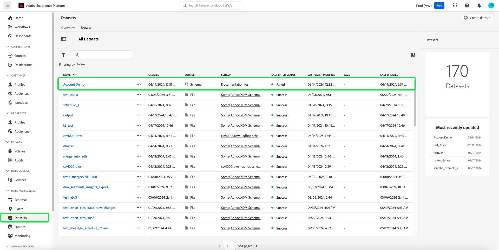

# Explore, troubleshoot, and verify batch ingestion with SQL

This document explains how to verify and validate records in ingested batches with SQL. This document teaches you how to:

- Access dataset batch metadata
- Troubleshoot and ensure data integrity by querying batches

>[!NOTE]
>
>Some screenshots in this guide are taken from [!DNL DBVisualizer]. To learn how to [connect Query Service with DBVisualizer](../clients/dbvisulaizer.md) or other [third-party BI tools](../clients/overview.md), see the linked documentation.

## 先決條件

To help your understanding of the concepts discussed in this document, you should have knowledge of the following topics:

- **Data ingestion**: See the [data ingestion overview](../../ingestion/home.md) to learn the basics of how data is ingested into the Experience Platform, including the different methods and processes involved.
- **Batch ingestion**: See the [batch ingestion API overview](../../ingestion/batch-ingestion/overview.md) to learn the basic concepts of batch ingestion. Specifically, what a &quot;batch&quot; is and how it functions within Experience Platform&#39;s data ingestion process.
- **System metadata in datasets**: See the [Catalog Service overview](../../catalog/home.md) to learn how system metadata fields are used to track and query ingested data.
- **Experience Data Model (XDM)**: See the [schemas UI overview](../../xdm/ui/overview.md) and the [&#39;basics of schema composition&#39;](../../xdm/schema/composition.md) to learn about XDM schemas and how they represent and validate the structure and format of data ingested into Experience Platform.

## Access dataset batch metadata {#access-dataset-batch-metadata}

To ensure that system columns (metadata columns) are included in the query results, use the SQL command `set drop_system_columns=false` in your Query Editor. This configures the behavior of your SQL query session. This input must be repeated if you start a new session.

Next, to view the system fields of the dataset, execute a SELECT all statement to display the results from the dataset, for example `select * from movie_data`. The results include two new columns on the right-hand side `_acp_system_metadata` and `_ACP_BATCHID`. The metadata columns `_acp_system_metadata` and `_ACP_BATCHID` help identify the logical and physical partitions of ingested data.


When data is ingested into Experience Platform, it is assigned a logical partition based on the incoming data. 此邏輯分割由`_acp_system_metadata.acp_sourceBatchId`表示。 此ID可協助您在處理和儲存資料批次之前，依邏輯將其分組和識別。

在處理資料並擷取到資料湖後，會指派給它以`_ACP_BATCHID`表示的實體分割。 此ID反映所擷取資料所在的資料湖中的實際儲存分割區。

### 使用SQL來瞭解邏輯和實體分割區 {#understand-partitions}

若要瞭解資料在擷取後如何分組和分配，請使用下列查詢來計算每個邏輯分割區(`_acp_system_metadata.acp_sourceBatchId`)的不同實體分割區(`_ACP_BATCHID`)數目。

```SQL
SELECT  _acp_system_metadata, COUNT(DISTINCT _ACP_BATCHID) FROM movie_data
GROUP BY _acp_system_metadata
```

此查詢的結果如下圖所示。


這些結果顯示輸入批次的數量並不一定與輸出批次的數量相符，因為系統決定了批次和在Data Lake中儲存資料的最有效方式。

在此範例中，假設您已將CSV檔案擷取至Experience Platform，並建立名為`drug_checkout_data`的資料集。

`drug_checkout_data`檔案是包含35,000筆記錄的深度巢狀集合。 使用SQL陳述式`SELECT * FROM drug_orders;`來預覽JSON型`drug_orders`資料集中的第一組記錄。

下圖顯示檔案及其記錄的預覽。


### 使用SQL產生批次擷取程式的深入分析 {#sql-insights-on-batch-ingestion}

使用下列SQL陳述式，深入分析資料擷取程式如何將輸入記錄分組並處理為批次。

```sql
SELECT _acp_system_metadata,
       Count(DISTINCT _acp_batchid) AS numoutputbatches,
       Count(_acp_batchid)          AS recordcount
FROM   drug_orders
GROUP  BY _acp_system_metadata 
```

查詢結果如下圖所示。


此結果說明資料擷取程式的效率和行為。 雖然已建立三個輸入批次（每個都包含2000、24000和9000筆記錄），但合併記錄並去除重複資料時，只剩下一個唯一批次。

>[!NOTE]
>
>資料集中可見的所有記錄都是已成功擷取的記錄。 成功的批次擷取並不意味著從來源輸入傳送的所有記錄都存在。 您必須檢查資料擷取失敗，以尋找未擷取的批次/記錄。

## 使用SQL驗證批次 {#validate-a-batch-with-SQL}

接下來，驗證並驗證已使用SQL擷取到資料集中的記錄。

>[!TIP]
>
>若要擷取與該批次ID相關聯的批次ID和查詢記錄，您必須先在Experience Platform中建立批次。 如果您想自行測試此程式，可將CSV資料內嵌至Experience Platform。 閱讀如何使用AI產生的建議](../../ingestion/tutorials/map-csv/recommendations.md)將CSV檔案[對應到現有XDM結構描述的指南。

擷取批次後，您必須針對您擷取資料的資料集，導覽至[!UICONTROL Datasets activity tab]。

在Experience Platform UI中，選取左側導覽中的&#x200B;**[!UICONTROL Datasets]**&#x200B;以開啟[!UICONTROL Datasets]儀表板。 接下來，從[!UICONTROL Browse]索引標籤中選取資料集名稱，以存取[!UICONTROL Dataset activity]畫面。



[!UICONTROL Dataset activity]檢視出現。 此檢視包含您所選資料集的詳細資料。 其中包含以表格格式顯示的任何擷取批次。

從可用批次清單中選取批次，然後從右側的詳細資訊面板複製[!UICONTROL Batch ID]。


接下來，使用以下查詢來擷取該批次中包含在資料集中的所有記錄：

```sql
SELECT * FROM movie_data
WHERE  _acp_batchid='01H00BKCTCADYRFACAAKJTVQ8P' 
LIMIT 1;
```

`_ACP_BATCHID`關鍵字用於篩選[!UICONTROL Batch ID]。

>[!TIP]
>
>如果您想要限制顯示的列數，則`LIMIT`子句會很有幫助，但更需要篩選條件。

當您在查詢編輯器中執行此查詢時，結果將被截斷為100列。 查詢編輯器專為快速預覽和調查而設計。 若要擷取最多50,000列，您可以使用第三方工具，例如DBVisualizer或DBeaver。

## 後續步驟 {#next-steps}

閱讀本檔案後，您已瞭解在資料擷取程式中，驗證及驗證擷取批次中記錄的基本知識。 您也深入瞭解了存取資料集批次中繼資料、瞭解邏輯和實體分割區，以及使用SQL命令查詢特定批次。 這些知識可協助您確保資料完整性，並最佳化Experience Platform上的資料儲存空間。

接下來，您應該練習資料擷取，以套用所學的概念。 使用提供的範例檔案或您自己的資料將範例資料集擷取到Experience Platform。 如果您尚未這麼做，請閱讀教學課程，瞭解如何[將資料內嵌至Adobe Experience Platform](../../ingestion/tutorials/ingest-batch-data.md)。

或者，您可以學習如何[使用各種案頭使用者端應用程式連線及驗證查詢服務](../clients/overview.md)，以增強您的資料分析功能。
