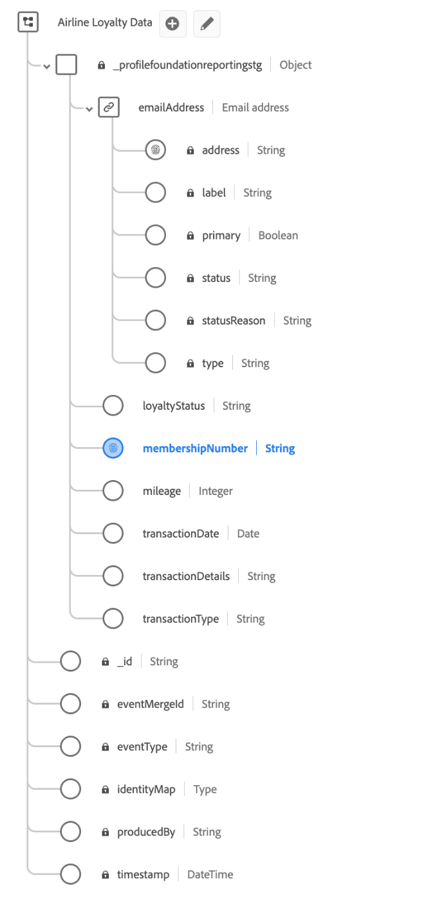

# 基於Decile的派生屬性用例

派生的屬性便於分析資料湖中的資料的複雜使用案例，這些資料可以與其他下游平台服務一起使用或發佈到您的即時客戶配置檔案資料中。

此示例用例演示了如何建立基於十位數的派生屬性，以便與Real-Time Customer Profile資料一起使用。 以航空公司忠誠度方案為例，本指南通知您如何建立使用分類文檔來分段和基於排序屬性建立受眾的資料集。

說明了以下關鍵概念：

* 為分檔分段建立架構。
* 分類標籤建立。
* 建立複雜派生屬性。
* 在回望期間計算十位數。
* 一個示例查詢，用於演示聚合、排名和添加唯一標識，以允許基於這些十位儲存段生成受眾。

## 快速入門

本指南要求對 [查詢服務中的查詢執行](../best-practices/writing-queries.md) 及Adobe Experience Platform的下列組成部分：

* [即時客戶概要資訊概述](../../profile/home.md):基於來自多個源的聚合資料提供統一、即時的用戶配置檔案。
* [架構組合的基礎](../../xdm/schema/composition.md):介紹經驗資料模型(XDM)架構以及構建架構的構成塊、原則和最佳做法。
* [如何為即時客戶配置檔案啟用方案](../../profile/tutorials/add-profile-data.md):本教程概述了向Real-Time Customer Profile添加資料所需的步驟。
* [如何定義自定義資料類型](../../xdm/api/data-types.md):資料類型用作類或架構欄位組中的參考型別欄位，並允許一致使用可包含在架構中任何位置的多欄位結構。

## 目標

本文檔中給出的示例使用dicel構建派生屬性，以從航空公司忠誠度架構中對資料進行排名。 派生屬性允許您通過根據所選類別的前「n」%來標識受眾，從而最大限度地提高資料的效用。

## 構建基於十位數的派生屬性

要根據特定維和相應度量定義十檔案的排名，必須設計一個方案以允許十檔案分段。

本指南使用航空公司忠誠度資料集來演示如何使用查詢服務根據在不同回望期間飛行的里程來構建資料。

## 使用查詢服務建立檔案

使用查詢服務，可以建立包含分類文檔的資料集，然後對這些資料集進行分段，以基於屬性排名建立訪問群體。 只要定義了類別並且度量可用，以下示例中顯示的概念就可以用於建立其他十位數儲存段資料集。

航空公司會員資料示例使用 [XDM ExperienceEvents類](../../xdm/classes/experienceevent.md)。 每個事件都是里程的業務交易記錄記錄，包括貸記或借記，以及「活頁」、「常客」、「銀」或「金」的會員忠誠度狀態。 主標識欄位為 `membershipNumber`。

### 示例資料集

此示例的初始航空公司忠誠度資料集是「航空公司忠誠度資料」，並具有以下架構。 請注意，架構的主標識為 `_profilefoundationreportingstg.membershipNumber`。



**示例資料**

下表顯示了包含在 `_profilefoundationreportingstg` 用於此示例的對象。 它為使用decile儲存段建立複雜派生屬性提供了上下文。

>[!NOTE]
>
>簡單說，租戶ID `_profilefoundationreportingstg` 從列標題中的命名空間開始以及整個文檔中的後續提及中省略。

| `.membershipNumber` | `.emailAddress.address` | `.transactionDate` | `.transactionType` | `.transactionDetails` | `.mileage` | `.loyaltyStatus` |
|---|---|---|---|---|---|---|
| C435678623 | sfeldmark1vr@studiopress.com | 2022-01-01 | 狀態(_M) | 新成員 | 5000 | 活頁 |
| B789279247 | pgalton32n@barnesandnoble.com | 2022-02-01 | 獎勵(_M) | 甘迺迪機場 | 7500 | 銀 |
| B789279247 | pgalton32n@barnesandnoble.com | 2022-02-01 | 狀態(_M) | 甘迺迪機場 | 7500 | 銀 |
| B789279247 | pgalton32n@barnesandnoble.com | 2022-02-10 | 獎勵(_M) | FRA-JFK | 5000 | 銀 |
| A123487284 | rritson1zn@sciencedaily.com | 2022-01-07 | 狀態(_M) | 新信用卡 | 10000 | 活頁 |

{style="table-layout:auto"}

## 生成資料集

在上面看到的航空公司忠誠度資料中， `.mileage` 值包含成員為每次單獨飛行所飛行的英里數。 此資料用於為在整個生命週期中經過的回望次數和各種回望週期建立十位數。 為此，建立資料集，該資料集包含映射資料類型中每個回望週期的十檔案，和在下分配的每個回望週期的適當十檔案 `membershipNumber`。

建立「航空公司忠誠度Decile架構」，以使用查詢服務建立Decile資料集。


### 啟用即時客戶配置檔案的架構

正在將資料引入Experience Platform以供即時客戶配置檔案使用，必須符合 [為配置檔案啟用的體驗資料模型(XDM)架構](../../xdm/ui/resources/schemas.md)。 為了為配置檔案啟用架構，它必須實現XDM Individual Profile或XDM ExperienceEvent類。

[使用方案註冊表API啟用方案以在Real-Time Customer Profile中使用](../../xdm/tutorials/create-schema-api.md) 或 [架構編輯器用戶介面](../../xdm/tutorials/create-schema-ui.md)。  有關如何為配置檔案啟用架構的詳細說明，請參見其各自的文檔。

接下來，建立要重用於所有與檔案相關的欄位組的資料類型。 建立decile欄位組是每個沙箱一次性步驟。 它還可重用於所有與檔案相關的架構。

### 建立標識命名空間並將其標籤為主標識符 {#identity-namespace}

任何為與檔案一起使用而建立的架構都必須分配了主標識。 你可以 [在Adobe Experience Platform架構UI中定義標識欄位](../../xdm/ui/fields/identity.md#define-an-identity-field)，或通過 [架構註冊表API](../../xdm/api/descriptors.md#create)。

查詢服務還允許您直接通過SQL為臨時模式資料集欄位設定標識或主標識。 請參閱 [在臨時架構標識中設定輔助標識和主標識](../data-governance/ad-hoc-schema-identities.md) 的子菜單。

### 建立查詢，以計算回望期間的資料 {#create-a-query}

以下示例演示了用於計算回望時段上的十位數的SQL查詢。

可以使用UI中的查詢編輯器建立模板，或通過 [查詢服務API](../api/query-templates.md#create-a-query-template)。

```sql
CREATE TABLE AS airline_loyality_decile 
{  WITH summed_miles_1 AS (
        SELECT _profilefoundationreportingstg.membershipNumber AS membershipNumber,
            _profilefoundationreportingstg.loyaltyStatus AS loyaltyStatus,
            SUM(_profilefoundationreportingstg.mileage) AS totalMiles
        FROM airline_loyalty_data
        WHERE _profilefoundationreportingstg.transactionDate < (MAKE_DATE(YEAR(CURRENT_DATE), MONTH(CURRENT_DATE), 1) - MAKE_YM_INTERVAL(0, 0))
    GROUP BY 1,2
    ),
    summed_miles_3 AS (
        SELECT _profilefoundationreportingstg.membershipNumber AS membershipNumber,
            _profilefoundationreportingstg.loyaltyStatus AS loyaltyStatus,
            SUM(_profilefoundationreportingstg.mileage) AS totalMiles
        FROM airline_loyalty_data
        WHERE _profilefoundationreportingstg.transactionDate < (MAKE_DATE(YEAR(CURRENT_DATE), MONTH(CURRENT_DATE), 1) - MAKE_YM_INTERVAL(0, 1))
    GROUP BY 1,2
    ),
    summed_miles_6 AS (
        SELECT _profilefoundationreportingstg.membershipNumber AS membershipNumber,
            _profilefoundationreportingstg.loyaltyStatus AS loyaltyStatus,
            SUM(_profilefoundationreportingstg.mileage) AS totalMiles
        FROM airline_loyalty_data
        WHERE _profilefoundationreportingstg.transactionDate < (MAKE_DATE(YEAR(CURRENT_DATE), MONTH(CURRENT_DATE), 1) - MAKE_YM_INTERVAL(0, 4))
    GROUP BY 1,2
    ),
    rankings_1 AS (
        SELECT membershipNumber,
            loyaltyStatus,
            totalMiles,
            NTILE(10) OVER (PARTITION BY loyaltyStatus ORDER BY totalMiles DESC) AS decileBucket
        FROM summed_miles_1
    ),
    rankings_3 AS (
        SELECT membershipNumber,
            loyaltyStatus,
            totalMiles,
            NTILE(10) OVER (PARTITION BY loyaltyStatus ORDER BY totalMiles DESC) AS decileBucket
        FROM summed_miles_3
    ),
    rankings_6 AS (
        SELECT membershipNumber,
            loyaltyStatus,
            totalMiles,
            NTILE(10) OVER (PARTITION BY loyaltyStatus ORDER BY totalMiles DESC) AS decileBucket
        FROM summed_miles_6
    ),
    map_1 AS (
        SELECT membershipNumber,
            MAP_FROM_ARRAYS(COLLECT_LIST(loyaltyStatus), COLLECT_LIST(decileBucket)) AS decileMonth1
        FROM rankings_1
        GROUP BY membershipNumber
    ),
    map_3 AS (
        SELECT membershipNumber,
            MAP_FROM_ARRAYS(COLLECT_LIST(loyaltyStatus), COLLECT_LIST(decileBucket)) AS decileMonth3
        FROM rankings_3
        GROUP BY membershipNumber
    ),
    map_6 AS (
        SELECT membershipNumber,
            MAP_FROM_ARRAYS(COLLECT_LIST(loyaltyStatus), COLLECT_LIST(decileBucket)) AS decileMonth6
        FROM rankings_6
        GROUP BY membershipNumber
    ),
    all_memberships AS (
        SELECT DISTINCT _profilefoundationreportingstg.membershipNumber AS membershipNumber FROM airline_loyalty_data
    )
    SELECT STRUCT(
            all_memberships.membershipNumber AS membershipNumber,
            STRUCT(
                    map_1.decileMonth1 AS decileMonth1,
                    map_3.decileMonth3 AS decileMonth3,
                    map_6.decileMonth6 AS decileMonth6
            ) AS decilesMileage
        ) AS _profilefoundationreportingstg
    FROM all_memberships
        LEFT JOIN map_1 ON  (all_memberships.membershipNumber = map_1.membershipNumber)
        LEFT JOIN map_3 ON  (all_memberships.membershipNumber = map_3.membershipNumber)
        LEFT JOIN map_6 ON  (all_memberships.membershipNumber = map_6.membershipNumber)
    }
```

### 查詢審閱

下面將更詳細地檢查示例查詢的各個部分。

#### 回望期

十位資料類型包含1、3、6、9、12和生命期回望的儲存桶。 查詢使用1、3和6個月的回望期，因此每個節都將包含一些「重複」查詢，以便為每個回望期建立臨時表。

>[!NOTE]
>
>如果源資料沒有可用於確定回望週期的列，則所有十級類排名都將在 `decileMonthAll`。

#### 彙總

使用公用表表達式(CTE)在建立十位數時段之前將里程聚合在一起。 這提供了特定回望期的總英里數。 CTE暫時存在，並且僅在較大查詢的範圍內可用。

```sql
summed_miles_1 AS (
    SELECT _profilefoundationreportingstg.membershipNumber AS membershipNumber,
           _profilefoundationreportingstg.loyaltyStatus AS loyaltyStatus,
           SUM(_profilefoundationreportingstg.mileage) AS totalMiles
    FROM airline_loyalty_data
    WHERE _profilefoundationreportingstg.transactionDate < (MAKE_DATE(YEAR(CURRENT_DATE), MONTH(CURRENT_DATE), 1) - MAKE_YM_INTERVAL(0, 0))
    GROUP BY 1,2
)
```

塊在模板中重複兩次(`summed_miles_3` 和 `summed_miles_6`)，以生成其他回望時段的資料。

注意查詢的標識、維和度量列(`membershipNumber`。 `loyaltyStatus` 和 `totalMiles` )。

#### 排名

Deciles允許您執行分類分段。 要建立排名編號， `NTILE` 函式與的參數一起使用 `10` 按 `loyaltyStatus` 的子菜單。 這將產生從1到10的排名。 設定 `ORDER BY` 子句 `WINDOW` 至 `DESC` 以確保 `1` 是給 **最大** 維中的度量。

```sql
rankings_1 AS (
    SELECT membershipNumber,
           loyaltyStatus,
           totalMiles,
           NTILE(10) OVER (PARTITION BY loyaltyStatus ORDER BY totalMiles DESC) AS decileBucket
    FROM summed_miles_1
)
```

#### 映射聚合

對於多個回望時段，您需要使用 `MAP_FROM_ARRAYS` 和 `COLLECT_LIST` 的子菜單。 在示例代碼段中， `MAP_FROM_ARRAYS` 使用一對鍵建立映射(`loyaltyStatus`)和值(`decileBucket`)陣列。 `COLLECT_LIST` 返回在指定列中包含所有值的陣列。

```sql
map_1 AS (
    SELECT membershipNumber,
           MAP_FROM_ARRAYS(COLLECT_LIST(loyaltyStatus), COLLECT_LIST(decileBucket)) AS decileMonth1
    FROM rankings_1
    GROUP BY membershipNumber
)
```

>[!NOTE]
>
>如果僅在生存期期間需要分級排序，則不需要映射聚合。

#### 唯一標識

唯一標識清單(`membershipNumber`)是建立所有成員身份的唯一清單所必需的。

```sql
all_memberships AS (
    SELECT DISTINCT _profilefoundationreportingstg.membershipNumber AS membershipNumber FROM airline_loyalty_data
)
```

>[!NOTE]
>
>如果僅在生存期期間需要分級排序，則可以省略此步驟並通過 `membershipNumber` 可以在最後一步中完成。

#### 將所有臨時資料拼接在一起

最後一步是將所有臨時資料縫合成與場組中十字的結構相同的形式。

```sql
SELECT STRUCT(
           all_memberships.membershipNumber AS membershipNumber,
           STRUCT(
                map_1.decileMonth1 AS decileMonth1,
                map_3.decileMonth3 AS decileMonth3,
                map_6.decileMonth6 AS decileMonth6
           ) AS decilesMileage
       ) AS _profilefoundationreportingstg
FROM all_memberships
    LEFT JOIN map_1 ON  (all_memberships.membershipNumber = map_1.membershipNumber)
    LEFT JOIN map_3 ON  (all_memberships.membershipNumber = map_3.membershipNumber)
    LEFT JOIN map_6 ON  (all_memberships.membershipNumber = map_6.membershipNumber)
```

如果只有生存期資料可用，則查詢將顯示如下：

```sql
SELECT STRUCT(
           rankings.membershipNumber AS membershipNumber,
           STRUCT(
                MAP_FROM_ARRAYS(COLLECT_LIST(loyaltyStatus), COLLECT_LIST(decileBucket)) AS decileMonthAll
           ) AS decilesMileage
       ) AS _profilefoundationreportingstg
FROM rankings
GROUP BY rankings.membershipNumber
```

由於使用了十位數，因此在查詢結果中保證了排名數和百分位數之間的相關性。 每個級別等於10%，因此根據前30%的受眾來識別受眾只需將1、2和3級作為目標。

### 運行查詢模板

運行查詢以填充decile資料集。 您還可以將查詢另存為模板，並將其安排為在節奏下運行。 當另存為模板時，還可更新查詢以使用引用的建立和插入陣列 `table_exists` 的子菜單。 有關如何使用 `table_exists`的 [SQL語法指南](../sql/syntax.md#table-exists)。

## 後續步驟

上面提供的示例用例突出說明了使「即時客戶配置檔案」中的decile屬性可用的步驟。 這允許分段服務通過用戶介面或REST風格的API能夠基於這些分檔儲存段生成受眾。 查看 [分段服務概述](../../segmentation/home.md) 有關如何建立、評估和訪問段的資訊。
