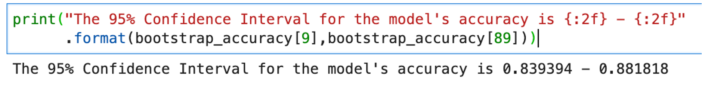

# 使用機器學習產生的預測性模型來判斷傾向分數

使用查詢服務，您可以善用機器學習平台上建立的預測模型（例如傾向分數）來分析Experience Platform資料。

本指南說明如何使用查詢服務將資料傳送至您的機器學習平台，以便在運算型筆記本中訓練模型。 訓練好的模型可套用至使用SQL的資料，以預測客戶每次造訪的購買傾向。

## 快速入門

此程式的一部分需要您訓練機器學習模型，本檔案假設您具備一個或多個機器學習環境的工作知識。

此範例使用 [!DNL Jupyter Notebook] 作為開發環境。 雖然有許多可用選項， [!DNL Jupyter Notebook] 建議使用，因為這是開放原始碼Web應用程式，運算需求低。 它可以 [從官方網站下載](https://jupyter.org/).

如果您尚未這麼做，請依照以下步驟操作 [connect [!DNL Jupyter Notebook] 使用Adobe Experience Platform查詢服務](../clients/jupyter-notebook.md) 再繼續閱讀本指南。

此範例中使用的程式庫包括：

```console
python=3.6.7
psycopg2
sklearn
pandas
matplotlib
numpy
tqdm
```

## 從Platform將分析表格匯入 [!DNL Jupyter Notebook] {#import-analytics-tables}

若要產生傾向分數模型，必須將Platform中儲存之分析資料的投影匯入 [!DNL Jupyter Notebook]. 從 [!DNL Python] 3 [!DNL Jupyter Notebook] 下列命令已連線至查詢服務，並從虛擬服裝商店Luma匯入客戶行為資料集。 當平台資料以Experience Data Model (XDM)格式儲存時，必須產生符合結構描述結構的範例JSON物件。 請參閱檔案以瞭解如何操作的說明 [產生範例JSON物件](../../xdm/ui/sample.md).

![此 [!DNL Jupyter Notebook] 反白數個指令的圖示板。](../images/use-cases/jupyter-commands.png)

輸出會顯示表格化檢視中Luma行為資料集的所有欄 [!DNL Jupyter Notebook] 儀表板。

![Luma在中匯入的客戶行為資料集的清單化輸出 [!DNL Jupyter Notebook].](../images/use-cases/behavioural-dataset-results.png)

## 為機器學習準備資料 {#prepare-data-for-machine-learning}

必須識別目標欄才能訓練機器學習模型。 由於此使用案例的目標是購買傾向，因此 `analytic_action` 從Luma結果中選擇欄作為目標欄。 值 `productPurchase` 是客戶購買的指標。 此 `purchase_value` 和 `purchase_num` 欄也會被移除，因為它們與產品購買動作直接相關。

執行這些動作的指令如下：

```python
#define the target label for prediction
df['target'] = (df['analytic_action'] == 'productPurchase').astype(int)
#remove columns that are dependent on the label
df.drop(['analytic_action','purchase_value'],axis=1,inplace=True)
```

接下來，必須將Luma資料集中的資料轉換為適當的表示方式。 需要兩個步驟：

1. 將代表數字的欄轉換為數值欄。 若要這麼做，請明確轉換 `dataframe`.
1. 也將分類欄轉換為數值欄。

```python
#convert columns that represent numbers
num_cols = ['purchase_num', 'value_cart', 'value_lifetime']
df[num_cols] = df[num_cols].apply(pd.to_numeric, errors='coerce')
```

稱為「 」的技術 *一個熱編碼* 用於轉換分類資料變數，以便與機器和深度學習演演算法搭配使用。 這進而可改善預測及模型的分類準確度。 使用 `Sklearn` 程式庫，以個別欄表示每個類別值。

```python
from sklearn.preprocessing import OneHotEncoder

#get the categorical columns
cat_columns = list(set(df.columns) - set(num_cols + ['target']))

#get the dataframe with categorical columns only
df_cat = df.loc[:,cat_columns]

#initialize sklearn's OneHotEncoder
enc = OneHotEncoder(handle_unknown='ignore')

#fit the data into the encoder
enc.fit(df_cat)

#define OneHotEncoder's columns names
ohc_columns = [[c+'='+c_ for c_ in cat] for c,cat in zip(cat_columns,enc.categories_)]
ohc_columns = [item for sublist in ohc_columns for item in sublist]

#finalize the data input to the ML models
X = pd.DataFrame( np.concatenate((enc.transform(df_cat).toarray(),df[num_cols]),axis=1),
                 columns =  ohc_columns + num_cols)

#define target column
y = df['target']
```

定義為下列專案的資料 `X` 會以表格形式顯示，如下所示：

![X在中的清單化輸出 [!DNL Jupyter Notebook].](../images/use-cases/x-output-table.png)


現在機器學習的必要資料已可供使用，它可符合中預先設定的機器學習模型 [!DNL Python]的 `sklearn` 資料庫。 [!DNL Logistics Regression] 用於訓練傾向性模型，並可讓您檢視測試資料的準確性。 在此案例中，約為85%。

此 [!DNL Logistic Regression] 用於估計機器學習演演算法效能的演演算法和訓練測試分割方法，會匯入下列程式碼區塊中：

```python
from sklearn.linear_model import LogisticRegression
from sklearn.model_selection import train_test_split

X_train, X_test, y_train, y_test = train_test_split(
    X, y, test_size=0.33, random_state=42)

clf = LogisticRegression(max_iter=2000, random_state=0).fit(X_train, y_train)

print("Test data accuracy: {}".format(clf.score(X_test, y_test)))
```

測試資料的正確性為0.8518518518518519。

透過使用物流回歸，您可以視覺化購買的原因，並依傾向性的重要性排序（以遞減順序排列）來決定傾向性。 第一個欄位表示導致採購行為的較高原因。 後一欄會指出不會導致購買行為的因素。

將結果視覺化為兩個長條圖的程式碼如下：

```python
from matplotlib import pyplot as plt

#get feature importance as a sorted list of columns
feature_importance = np.argsort(-clf.coef_[0])
top_10_features_purchase_names = X.columns[feature_importance[:10]]
top_10_features_purchase_values = clf.coef_[0][feature_importance[:10]]
top_10_features_not_purchase_names = X.columns[feature_importance[-10:]]
top_10_features_not_purchase_values = clf.coef_[0][feature_importance[-10:]]

#plot the figures
fig, (ax1, ax2) = plt.subplots(1, 2,figsize=(10,5))

ax1.bar(np.arange(10),top_10_features_purchase_values)
ax1.set_xticks(np.arange(10))
ax1.set_xticklabels(top_10_features_purchase_names,rotation = 90)
ax1.set_ylim([np.min(clf.coef_[0])-0.1,np.max(clf.coef_[0])+0.1])
ax1.set_title("Top 10 features to define \n a propensity to purchase")

ax2.bar(np.arange(10),top_10_features_not_purchase_values, color='#E15750')
ax2.set_xticks(np.arange(10))
ax2.set_xticklabels(top_10_features_not_purchase_names,rotation = 90)
ax2.set_ylim([np.min(clf.coef_[0])-0.1,np.max(clf.coef_[0])+0.1])
ax2.set_title("Top 10 features to define \n a propensity to NOT purchase")

plt.show()
```

結果的垂直長條圖視覺效果如下所示：


可以從長條圖上分辨出數個模式。 作為補助的管道銷售點(POS)和通話主題是決定購買行為的最重要因素。 雖然投訴和發票等通話主題是定義非購買行為的重要角色。 這些是可量化的可操作深入分析，行銷人員可運用這些深入分析進行行銷活動，以解決這些客戶的購買傾向。

## 使用查詢服務來套用經過訓練的模型 {#use-query-service-to-apply-trained-model}

建立經過訓練的模型後，必須將其套用至Experience Platform中保留的資料。 若要這麼做，機器學習管道的邏輯必須轉換為SQL。 此轉變的兩個主要元件如下：

- 首先，SQL必須取代 [!DNL Logistics Regression] 用於取得預測標籤機率的模組。 物流回歸建立的模型產生回歸模型 `y = wX + c`  其中權重 `w` 和截距 `c` 是模型的輸出。 SQL功能可用來將權重相乘以獲得機率。

- 其次，工程程式達成於 [!DNL Python] 具有一個熱編碼也必須合併到SQL中。 例如，在原始資料庫中，我們有 `geo_county` 欄以儲存縣/市，但此欄會轉換為 `geo_county=Bexar`， `geo_county=Dallas`， `geo_county=DeKalb`. 下列SQL陳述式會執行相同的轉換，其中 `w1`， `w2`、和 `w3` 可用從模型中學習的權重替代。 [!DNL Python]：

```sql
SELECT  CASE WHEN geo_state = 'Bexar' THEN FLOAT(w1) ELSE 0 END AS f1,
        CASE WHEN geo_state = 'Dallas' THEN FLOAT(w2) ELSE 0 END AS f2,
        CASE WHEN geo_state = 'Bexar' THEN FLOAT(w3) ELSE 0 END AS f3,
```

若是數值功能，您可以直接用權重乘以資料行，如下面的SQL陳述式所示。

```sql
SELECT FLOAT(purchase_num) * FLOAT(w4) AS f4,
```

取得數字後，可將其移轉到sigmoid函式，其中物流回歸演演算法產生最終預測。 在以下陳述中， `intercept` 是回歸中的截距。
        

```sql
SELECT CASE WHEN 1 / (1 + EXP(- (f1 + f2 + f3 + f4 + FLOAT(intercept)))) > 0.5 THEN 1 ELSE 0 END AS Prediction;
```
 
### 端對端範例

如果您有兩個欄(`c1` 和 `c2`)，如果 `c1` 有兩個類別： [!DNL Logistic Regression] 使用下列函式訓練演演算法：
 

```python
y = 0.1 * "c1=category 1"+ 0.2 * "c1=category 2" +0.3 * c2+0.4
```
 
SQL中的對等項如下：

```sql
SELECT
  CASE WHEN 1 / (1 + EXP(- (f1 + f2 + f3 + FLOAT(0.4)))) > 0.5 THEN 1 ELSE 0 END AS Prediction
FROM
  (
    SELECT
      CASE WHEN c1 = 'Cateogry 1' THEN FLOAT(0.1) ELSE 0 END AS f1,
      CASE WHEN c1 = 'Cateogry 2' THEN FLOAT(0.2) ELSE 0 END AS f2,
      FLOAT(c2) * FLOAT(0.3) AS f3
    FROM TABLE
  )
```
 
此 [!DNL Python] 自動化翻譯程式的程式碼如下：

```python
def generate_lr_inference_sql(ohc_columns, num_cols, clf, db):
    features_sql = []
    category_sql_text = "case when {col} = '{val}' then float({coef}) else 0 end as f{name}"
    numerical_sql_text = "float({col}) * float({coef}) as f{name}"
    for i, (column, coef) in enumerate(zip(ohc_columns+num_cols, clf.coef_[0])):
        if i < len(ohc_columns):
            col,val = column.split('=')
            val = val.replace("'","%''%")
            sql = category_sql_text.format(col=col,val=val,coef=coef,name=i+1)
        else:
            sql = numerical_sql_text.format(col=column,coef=coef,name=i+1)
        features_sql.append(sql)
    features_sum = '+'.join(['f{}'.format(i) for i in range(1,len(features_sql)+1)])
    final_sql = '''
    select case when 1/(1 + EXP(-({features} + float({intercept})))) > 0.5 then 1 else 0 end as Prediction
    from
        (select {cols}
        from {db})
    '''.format(features=features_sum,cols=",".join(features_sql),intercept=clf.intercept_[0],db=db)
    return final_sql
```

使用SQL來推斷資料庫時，輸出如下：

```python
sql = generate_lr_inference_sql(ohc_columns, num_cols, clf, "fdu_luma_raw")
cur.execute(sql)    
samples = [r for r in cur]
colnames = [desc[0] for desc in cur.description]
pd.DataFrame(samples,columns=colnames)
```

以表格化的結果會顯示每個客戶工作階段的購買傾向 `0` 表示沒有購買和的傾向 `1` 表示已證實的購買傾向。


## 使用抽樣資料：啟動程式 {#working-on-sampled-data}

如果您的本機電腦無法儲存資料以進行模型訓練，資料大小太大時，您可以取樣本，而不是從Query Service取完整資料。 若要知道從查詢服務取樣需要多少資料，您可以套用稱為啟動載入的技術。 就此而言，啟動程式意味著使用不同樣本多次訓練模型，並檢查不同樣本之間模型精度的差異。 若要調整上述傾向性模型範例，請先將整個機器學習工作流程封裝成函式。 程式碼如下：

```python
def end_to_end_pipeline(df):
    
    #define the target label for prediction
    df['target'] = (df['analytic_action'] == 'productPurchase').astype(int)
    #remove columns that are dependent on the label
    df.drop(['analytic_action','purchase_value'],axis=1,inplace=True)
    
    num_cols = ['purchase_num','value_cart','value_lifetime']
    df[num_cols] = df[num_cols].apply(pd.to_numeric, errors='coerce')
    
    #get the categorical columns
    cat_columns = list(set(df.columns) - set(num_cols + ['target']))

    #get the dataframe with categorical columns only
    df_cat = df.loc[:,cat_columns]

    #initialize sklearn's One Hot Encoder
    enc = OneHotEncoder(handle_unknown='ignore')

    #fit the data into the encoder
    enc.fit(df_cat)

    #define one hot encoder's columns names
    ohc_columns = [[c+'='+c_ for c_ in cat] for c,cat in zip(cat_columns,enc.categories_)]
    ohc_columns = [item for sublist in ohc_columns for item in sublist]

    #finalize the data input to the ML models
    X = pd.DataFrame( np.concatenate((enc.transform(df_cat).toarray(),df[num_cols]),axis=1),
                     columns =  ohc_columns + num_cols)

    #define target column
    y = df['target']
    
    X_train, X_test, y_train, y_test = train_test_split(
    X, y, test_size=0.33, random_state=42)

    clf = LogisticRegression(max_iter=2000,random_state=0).fit(X_train, y_train)

    return clf.score(X_test, y_test)
```

此函式接著可以在回圈中執行多次，例如10次。 與前一個程式碼的不同之處在於，範例現在並非取自整個表格，而僅取自列的範例。 例如，下列範常式式碼僅需1000列。 可以儲存每個反複專案的精確度。

```python
from tqdm import tqdm

bootstrap_accuracy = []
for i in tqdm(range(100)):
    
    #sample data from QS
    cur.execute('''SELECT *
    FROM fdu_luma_raw
    ORDER BY random()
    LIMIT 1000
    ''')    
    samples = [r for r in cur]
    colnames = [desc[0] for desc in cur.description]
    df_samples = pd.DataFrame(samples,columns=colnames)
    df_samples.fillna(0,inplace=True)
    
    #train the propensity model with sampled data and output its accuracy
    bootstrap_accuracy.append(end_to_end_pipeline(df_samples))
    
bootstrap_accuracy = np.sort(bootstrap_accuracy)
```

然後會排序啟動載入模型的精確度。 之後，模型精確度的第10和第90個數量位數會變成指定樣本大小下模型精確度的95%信賴區間。



上圖指出，如果您只用1000列來訓練模型，可預期精確度會下降約84%至88%。 您可以調整 `LIMIT` 查詢服務中的子句會根據您的需求來查詢以確保模型的效能。
