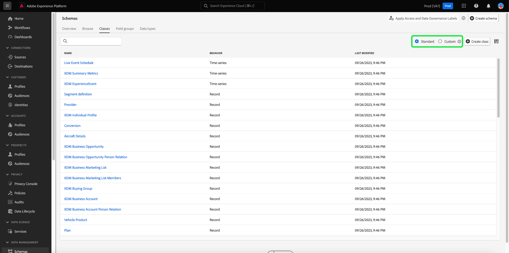

# Adobe Experience Platform 發行說明

**發行日期：2023 年 9 月 28 日**

Adobe Experience Platform中的新功能：

- [計算屬性](#computed-attributes)

 Experience Platform 現有功能的更新：

- [警報](#alerts)
- [儀表板](#dashboards)
- [資料集合](#data-collection)
- [資料控管](#data-governance)
- [資料檢疫](#hygiene)
- [目的地](#destinations)
- [體驗資料模式 (XDM)](#xdm)
- [身分識別服務](#identity-service)
- [查詢服務](#query-service)
- [Segmentation Service](#segmentation)
- [來源](#sources)

## 計算屬性 {#computed-attributes}

計算屬性可讓您透過直覺式UI輕鬆將事件資料摘要為設定檔屬性，以強化行為型細分、個人化和啟用。 透過此功能，您可以自助建立計算屬性、管理這些屬性，並用於區段、Real-Time CDP目的地或Adobe Journey Optimizer。 此外，計算屬性可簡化細分和歷程工作流程，協助您順暢地提供相關體驗。 若要深入瞭解計算屬性，請參閱 [計算屬性概述](../../profile/computed-attributes/overview.md).

## 警報 {#alerts}

Experience Platform可讓您訂閱各種Platform活動的事件型警報。 您可以透過以下方式訂閱不同的警報規則： [!UICONTROL 警報] 索引標籤顯示，並可選擇在UI本身或透過電子郵件通知接收警報訊息。

**新功能或更新功能**

| 功能 | 說明 |
| --- | --- |
| 警示歷史記錄標籤 | 警示 [!UICONTROL 歷史記錄] 索引標籤現在將包含所有事件，包括延遲、開始、成功和失敗。 閱讀 [警報UI檔案](../../observability/alerts/ui.md) 以取得有關「歷史記錄」標籤的詳細資訊。 |

{style="table-layout:auto"}

若要進一步瞭解警示，請閱讀 [[!DNL Observability Insights] 概述](../../observability/home.md).

## 儀表板 {#dashboards}

Adobe Experience Platform提供多個 [!DNL dashboards] 您可以透過它檢視有關您組織資料的重要資訊，如每日快照期間所擷取。

| 功能 | 說明 |
| --- | --- |
| [授權使用情況儀表板改善](../../dashboards/guides/license-usage.md) | 透過改善的關於您組織授權使用的報告和關鍵量度視覺化，維護對您的授權協定的控制。 這些改善功能可針對您購買的所有Experience Platform產品，提供比授權使用量度更高的精細度。 |

{style="table-layout:auto"}

若要深入瞭解授權使用儀表板，請參閱 [授權使用情況儀表板總覽](../../dashboards/guides/destinations.md).

## 資料收集 {#data-collection}

Adobe Experience Platform 提供了一套技術，讓您可收集用戶端客戶體驗資料並將其傳送到 Adobe Experience Platform Edge Network，在其中可擴充、轉換資料並將其分送至 Adobe 或非 Adobe 目的地。

**新功能或更新功能**

| 類型 | 功能 | 說明 |
| --- | --- | --- |
| 資料流 | 裝置查詢支援 | 設定資料流時，您現在可以選取要收集的裝置查詢資訊層級。 裝置查詢資訊包括裝置、硬體、作業系統以及用來與頁面互動的瀏覽器的相關資料。    裝置查詢資訊無法與使用者代理程式和使用者端提示一起收集。 選擇收集裝置資訊將會停用收集使用者代理程式和使用者端提示，反之亦然。 所有裝置查詢資訊都儲存在 `xdm:device` 欄位群組。 從以下檔案瞭解更多資訊： [設定資料串流](../../datastreams/configure.md#geolocation-device-lookup). |
| 擴充功能 | [!DNL TikTok] 網站事件API擴充功能 | 此 [[!DNL TikTok] 網頁事件API](https://exchange.adobe.com/apps/ec/109834/tiktok-web-events-api) 擴充功能可讓您善用Adobe Experience Platform Edge Network中擷取的資料，並將其傳送至 [!DNL TikTok] 以伺服器端事件的形式使用 [!DNL TikTok] 網頁事件API。 |

{style="table-layout:auto"}

若要進一步瞭解資料彙集，請參閱 [資料收集概觀](../../tags/home.md).

## 資料治理 {#data-governance}

Adobe Experience Platform 資料治理是一系列的策略和技術，用於管理客戶資料並確保符合適用於資料使用方式的法規、限制和政策。它在 Experience Platform 的不同階層都發揮關鍵作用，包括編目、資料譜系、資料使用標籤、資料存取政策以及對行銷動作資料的存取控制。

**新功能**

| 功能 | 說明 |
| --- | --- |
| 適用於協力廠商資料的新合作夥伴生態系統標籤 | 提供適用於協力廠商擴充和潛在客戶的新資料使用標籤。 請參閱 [合作夥伴生態系統標籤檔案](../../data-governance/labels/reference.md#partner) 以取得詳細資訊。 |

{style="table-layout:auto"}

若要了解有關資料治理的詳細資訊，請閱讀[資料治理概觀](../../data-governance/home.md)。

## 資料檢疫 {#hygiene}

Experience Platform提供一套資料檢疫功能，可讓您透過程式化刪除消費者記錄和資料集，以管理儲存的資料。 使用 [!UICONTROL 資料生命週期] 在UI中或透過呼叫資料衛生API，您能夠有效地管理您的資料存放區。 使用這些功能可確保資訊如預期使用、在不正確的資料需要修正時更新，並在組織原則認為必要時刪除。

**新功能**

| 功能 | 說明 |
| --- | --- |
| [!BADGE Beta]{type=Informative} | 透過Adobe Experience Platform中的進階資料生命週期管理功能，跨所有資料存放區管理您的資料生命週期，以符合客戶承諾和授權協定：自動化資料集到期日和記錄刪除。 有了自動化資料集有效期，您可以刪除整個資料集，並設定要刪除資料集的日期和時間。 記錄刪除可讓您透過定位個別消費者設定檔的主要身分，來刪除個別消費者設定檔。 您可以透過UI或透過CSV/JSON檔案上傳個別提供主要身分。 請參閱 [記錄刪除檔案](../../hygiene/ui/record-delete.md) 以取得詳細資訊 |
| 資料集有效期 | 藉由自動化資料集到期功能，將您的資料減至最少，並控制您的授權協定。 刪除整個資料集並設定要刪除資料集的日期和時間，以減少資料量。 請參閱 [資料集有效期限檔案](../../hygiene/ui/dataset-expiration.md) 以取得詳細資訊。 |

{style="table-layout:auto"}

如需平台資料衛生功能的詳細資訊，請參閱 [資料衛生概觀](../../hygiene/home.md).

## 目的地 {#destinations}

[!DNL Destinations] 是預先建立的和目標平台的整合，可讓來自 Adobe Experience Platform 的資料順暢啟動。您可使用目的地啟用已知和未知的資料，以進行跨通路行銷活動、電子郵件行銷活動、設定目標的廣告活動和其他諸多使用案例。

**新目的地或更新的目的地** {#new-updated-destinations}

| 目的地 | 全新或更新 | 說明 |
| ----------- |----------------|----------- |
| [[!DNL LiveRamp - Distribution]](../../destinations/catalog/advertising/liveramp-distribution.md) | 新增 | 啟用先前上線的對象 [!DNL LiveRamp] 在行動裝置、網頁、顯示器和連線電視媒體中，提供高階發佈商的服務。   將受眾上線至您的後 [!DNL LiveRamp] 帳戶透過 [LiveRamp — 入門](../../destinations/catalog/advertising/liveramp-onboarding.md) 連線，使用新的 [[!DNL LiveRamp - Distribution]](../../destinations/catalog/advertising/liveramp-distribution.md) 連線以啟動下游目的地的對象。 |
| [[!DNL HubSpot]](../../destinations/catalog/crm/hubspot.md) | 新增 | [[!DNL HubSpot]](https://www.hubspot.com) 是一種CRM平台，其中包含您連線行銷、銷售、內容管理及客戶服務所需的所有軟體、整合和資源。 它可讓您在一個CRM平台上連線您的資料、團隊和客戶。 |
| [[!DNL Microsoft Dynamics 365]](../../destinations/catalog/crm/microsoft-dynamics-365.md) | 已更新 | 新增的支援 [!DNL Dynamics 365] 自訂欄位的自訂欄位字首，這些字首並非是在中的預設解決方案中建立 [!DNL Dynamics 365]. 新的輸入欄位， **[!UICONTROL 自訂前置詞]**，已新增至 [填寫目的地詳細資料](#destination-details) 步驟。 |
| [[!DNL Experience Cloud Audiences]](../../destinations/catalog/adobe/experience-cloud-audiences.md) | 已更新 | Experience Cloud Audiences目的地現在可普遍使用。 使用此目的地可啟用從Real-Time CDP到Audience Manager和Adobe Analytics的受眾。 您需要Audience Manager授權才能將受眾傳送至Adobe Analytics。 |

{style="table-layout:auto"}

<!-- 

Add these to release notes as they go out

| [[!DNL Qualtrics]] | New | Use the aggregation of multiple sources of operational data in Adobe Experience Platform as an input in Qualtrics Experience ID to better understand your customers and enable targeted outreach to close the gap when it comes to understanding intent, emotion and experience drivers. | 

-->

**新功能或更新的功能** {#destinations-new-updated-functionality}

| 功能 | 說明 |
| ----------- | ----------- |
| Real-Time CDP中的資料匯出 | 此 [資料集匯出](../../destinations/ui/export-datasets.md) 功能現已正式推出。 另請參閱 [您可以根據Experience Platform應用程式匯出哪些資料集](../../destinations/ui/export-datasets.md#datasets-to-export) 您已購買，並檢視 [匯出資料集的護欄](/help/destinations/guardrails.md#dataset-exports). |
| （測試版）支援匯出陣列型別物件 | 將原始值（字串、int或布林值）的陣列匯出為平面結構描述檔案，以匯出至雲端儲存空間目的地。 進一步瞭解 [檔案](../../destinations/ui/export-arrays-calculated-fields.md). |
| Destination SDK中的動態下拉式清單選擇器 | 透過Destination SDK建立目的地時，您現在可以使用 [動態下拉式清單選擇器](../../destinations/destination-sdk/functionality/destination-configuration/customer-data-fields.md#dynamic-dropdown-selectors) 將擷取自API的值填入下拉式選擇器的欄位中。 |

**修正和增強功能** {#destinations-fixes-and-enhancements}

- 利用 [監視透明度](../../dataflows/ui/monitor-destinations.md#dataflow-runs-for-streaming-destinations) 現在適用於企業目的地([HTTP API](../../destinations/catalog/streaming/http-destination.md)， [Amazon Kinesis](../../destinations/catalog/cloud-storage/amazon-kinesis.md) 和 [Azure事件中樞](../../destinations/catalog/cloud-storage/azure-event-hubs.md))執行層級，以監視中的啟用量度和狀態 [資料流詳細資料檢視](../../dataflows/ui/monitor-destinations.md#dataflow-run-details-page)，並透過錯誤碼和疑難排解訊息取得其他資訊。
- 當您更新對應至 [Google Ad Manager](../../destinations/catalog/advertising/google-ad-manager.md)， [Google Display &amp; Video 360](../../destinations/catalog/advertising/google-dv360.md)和其他使用的目的地 [對象更新範本](../../destinations/destination-sdk/metadata-api/update-audience-template.md)，這些名稱變更現在會反映在目標的下游位置。

如需有關目的地的詳細一般資訊，請參閱[目的地概觀](../../destinations/home.md)。

## 體驗資料模式 (XDM) {#xdm}

XDM 是一種開放原始碼的規格，可為帶到 Adobe Experience Platform 中的資料提供通用結構和定義 (結構描述)。若遵守 XDM 標準，即可將所有客戶體驗資料合併到一個常用表述中，以更快速、更整合的方式傳遞分析。您可以從客戶行為中獲得有價值的分析，透過區段定義客戶對象，並使用客戶屬性實現個人化的目的。

**新功能**

| 功能 | 說明 |
| --- | --- |
| 結構描述編輯器中新增的快速動作 | 結構編輯器已在畫布中新增快速動作。 您現在可以直接從編輯器中複製JSON結構或刪除結構。 {width="100" zoomable="yes"} |
| 依自訂或標準建立者篩選XDM資源 | 可用的結構描述、欄位群組、資料型別和類別的清單現在會根據其建立方法來預先篩選。 這可讓您根據資源是自訂建立還是由Adobe建立來篩選資源。 {width="100" zoomable="yes"}   請參閱 [建立和編輯資原始檔](../../xdm/ui/resources/classes.md#filter.md) 以取得詳細資訊。 |

**更新的功能**

| 功能 | 說明 |
| --- | --- |
| 已更新結構描述建立工作流程 | 已實作新的結構描述建立工作流程，以簡化程式。   {width="100" zoomable="yes"}   請參閱 [結構描述建立檔案](../../xdm/ui/resources/schemas.md#create) 以取得詳細資訊。 |

**新的 XDM 元件**

| 元件類型 | 名稱 | 說明 |
| --- | --- | --- |
| 資料類型 | [[!UICONTROL 傳回]](https://github.com/adobe/xdm/pull/1773/files) | RMA （退貨授權）簽發。 |
| 資料類型 | [[!UICONTROL 傳回專案]](https://github.com/adobe/xdm/pull/1773/files) | RMA （退貨授權）中退回的料號資訊。 |

{style="table-layout:auto"}

**已更新的 XDM 元件**

| 元件類型 | 名稱 | 更新說明 |
| --- | --- | --- |
| 擴充功能 | [!UICONTROL AJO 實體欄位] | 此 [[!UICONTROL 多變體的標幟]](https://github.com/adobe/xdm/pull/1774/files) 已新增至 [!UICONTROL ajo實體欄位] 以識別變體是否為多變體。 |
| 資料類型 | [!UICONTROL 產品清單項目] | [[!UICONTROL 傳回專案]](https://github.com/adobe/xdm/pull/1773/files) 新增以包含退貨授權資訊。 |
| 資料類型 | 訂購 | [[!UICONTROL 傳回資訊]](https://github.com/adobe/xdm/pull/1773/files) 新增以包含RMA （退貨授權）。 |

{style="table-layout:auto"}

如需有關 Platform 中 XDM 的詳細資訊，請參閱 [XDM 系統概觀](../../xdm/home.md)。

## 身分識別服務 {#identity-service}

Adobe Experience Platform 身分識別服務透過跨裝置和系統橋接身分，為您提供客戶及其行為的全方位檢視，讓您可即時實現有影響力的個人數位體驗。

**新功能或更新功能**

| 功能 | 說明 |
| --- | --- |
| Identity Service UI增強功能 | 在Experience Platform UI中使用改良的自訂名稱空間建立工具，以便更妥善地管理您的自訂名稱空間及其對應的身分型別。 增強的Identity Service UI提供您以下功能： <ul><li>關聯式體驗：視覺提示、清晰度，以及身分名稱空間和身分型別的關聯式。</li><li>準確性：處理錯誤的能力更強，不再有重複的身分名稱。</li><li>可發現性：從產品內對話方塊存取檔案。</li></ul> 如需詳細資訊，請閱讀以下指南： [建立自訂名稱空間](../../identity-service/namespaces.md#create-namespaces). |
| 身分識別圖譜限制的變更 | 身分圖表限制已從150個身分變更為50個身分。 將新身分擷取到完整圖表時，會刪除根據擷取時間戳記和身分型別的最舊身分。 Cookie身分型別會優先刪除。 Adobe如果您的生產沙箱包含： <ul><li>個人識別碼 (例如 CRM ID) 設定為 cookie/裝置身分識別類型的自訂命名空間。</li><li>cookie/裝置識別碼被設定為跨裝置身分識別類型的自訂命名空間。</li></ul> Adobe 工程部門將手動處理這些要求。如需詳細資訊，請閱讀 [Identity Service資料的護欄](../../identity-service/guardrails.md) 及指南 [資料管理授權權益最佳實務](../../landing/license-usage-and-guardrails/data-management-best-practices.md). |

{style="table-layout:auto"}

若要進一步瞭解Identity Service，請參閱 [Identity Service總覽](../../identity-service/home.md).

## 查詢服務 {#query-service}

查詢服務可讓您使用標準的 SQL 查詢 Adobe Experience Platform 中的資料[!DNL Data Lake]。您可以從以下位置加入任何資料集： [!DNL Data Lake] 並將查詢結果擷取為新資料集，以用於報表、資料科學工作區或內嵌到即時客戶個人檔案中。

**更新的功能**

| 功能 | 說明 |
| --- | --- |
| 記錄篩選UI更新 | 改善的查詢記錄篩選可改善使用者產生的記錄的可見性，以便監控、管理和疑難排解。 您可以根據各種設定來篩選查詢記錄清單。   {width="100" zoomable="yes"}    請參閱 [查詢記錄檔案](../../query-service/ui/query-logs.md#filter-logs) 以取得詳細資訊。 |
| 多個查詢編輯器UI更新 | 您現在可以在查詢編輯器中執行多個循序查詢，或寫入多個查詢並按順序執行所有查詢。 若要增加查詢執行的彈性，您可以反白選取的查詢，並選取要獨立於其他查詢執行的特定查詢。 請參閱 [查詢編輯器UI指南](../../query-service/ui/user-guide.md#execute-multiple-sequential-queries) 以取得詳細資訊。 |

{style="table-layout:auto"}

如需有關查詢服務的詳細資訊，請參閱[查詢服務概觀](../../query-service/home.md)。

## Segmentation Service {#segmentation}

[!DNL Segmentation Service] 可讓您將儲存在和個人 (例如客戶、潛在客戶、使用者或組織) 相關的 [!DNL Experience Platform] 中的資料分段為不同的對象。您可以透過區段定義或來自 [!DNL Real-Time Customer Profile] 資料的其他來源建立對象。這些對象會在 [!DNL Platform] 上集中設定及維護，並可透過任何 Adobe 解決方案輕鬆存取。

**新功能或更新功能**

| 功能 | 說明 |
| ------- | ----------- |
| 可自訂欄 | 您現在可以使用可重新調整大小的欄來自訂對象入口網站的版面。 如需有關此功能的詳細資訊，請參閱 [分段UI指南](../../segmentation/ui/overview.md#customize). |
| 更新頻率劃分 | 您現在可以檢視組織中對象更新頻率的劃分。 如需有關此功能的詳細資訊，請參閱 [分段UI指南](../../segmentation/ui/overview.md#browse). |

若要深入瞭解來源，請參閱 [來源概觀](../../sources/home.md).

若要深入瞭解分段服務，請參閱 [Segmentation Service概述](../../segmentation/home.md).

## 來源 {#sources}

Experience Platform 可提供 RESTful API 和互動式 UI，可讓您輕鬆為各種資料提供者設定來源連線。這些來源連線可讓您進行驗證並連線到外部儲存系統和 CRM 服務、設定擷取執行的時間並管理資料擷取輸送量。

**新功能或更新功能**

| 功能 | 說明 |
| --- | --- |
| 的新引數 `offset` 自助式來源中的分頁（批次SDK） | 您現在可以指定 `endConditionName` 和 `endConditionValue` 使用時用於您的來源 `offset` 分頁。 這些引數可讓您指定將在下一個HTTP請求中結束分頁回圈的條件。 如需詳細資訊，請閱讀 [自助來源分頁指南（批次SDK）](../../sources/sources-sdk/config/sourcespec.md#pagination). |

{style="table-layout:auto"}

若要深入瞭解來源，請參閱 [來源概觀](../../sources/home.md).
